---
lab:
  title: "Préparer des données dans Power\_BI Desktop"
  module: 2 - Get Data in Power BI
---

# Préparer des données dans Power BI Desktop

**La durée estimée pour effectuer ce tutoriel est de 45 minutes.**

Au cours de ce labo, vous lancez le développement d’une solution Power BI Desktop pour la société Adventure Works. Elle implique la connexion aux données sources, l’affichage de l’aperçu des données et l’utilisation de techniques d’aperçu des données pour comprendre les caractéristiques et la qualité des données sources.

Dans ce labo, vous allez découvrir comment :

- Ouvrir Power BI Desktop

- Définir les options de Power BI Desktop

- Se connecter à des données sources

- Obtenir un aperçu des données sources

- Utilisez des techniques d’aperçu des données pour mieux comprendre les données

## **Histoire du labo**

Ce labo est l’un des nombreux labos d’une série qui a été conçue comme une histoire complète allant de la préparation des données jusqu’à leur publication sous forme de rapports et de tableaux de bord. Vous pouvez effectuer ces labos dans l’ordre de votre choix. Toutefois, si vous comptez faire plusieurs labos, nous vous suggérons de suivre cet ordre :

1. **Préparer des données dans Power BI Desktop**

2. Charger des données dans Power BI Desktop

3. Concevoir un modèle de données dans Power BI

4. Créer des calculs DAX dans Power BI Desktop (partie 1)

5. Créer des calculs DAX dans Power BI Desktop (partie 2)

6. Concevoir un rapport dans Power BI Desktop, partie 1

7. Concevoir un rapport dans Power BI Desktop, partie 2

8. Analyser les données avec des visuels IA

9. Créer un tableau de bord Power BI

10. Appliquer la sécurité au niveau des lignes

## **Exercice 1 : Préparer les données**

Dans cet exercice, vous allez créer huit requêtes Power BI Desktop. Six requêtes vont récupérer des données dans SQL Server et deux dans des fichiers CSV.

### **Tâche 1 : Enregistrer le fichier Power BI Desktop**

Dans cette tâche, vous allez d’abord enregistrer le fichier Power BI Desktop.

1. Pour ouvrir Power BI Desktop, accédez à la barre des tâches et cliquez sur le raccourci Microsoft Power BI Desktop.

    

1. Pour fermer la fenêtre de démarrage, en haut à droite de cette fenêtre, sélectionnez **X**.

    

1. Pour enregistrer le fichier, sélectionnez l’onglet de ruban **Fichier** pour ouvrir le mode Backstage.

1. Sélectionnez **Enregistrer**.

    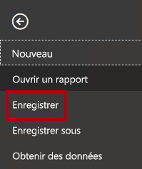

1. Dans la fenêtre **Enregistrer sous**, accédez au dossier **D:\PL300\MySolution**.

1. Dans la zone **Nom du fichier**, entrez **Sales Analysis**.

    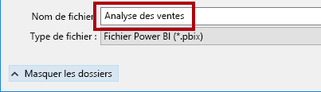

1. Cliquez sur **Enregistrer**.

    

    Conseil : Vous pouvez aussi enregistrer le fichier en cliquant sur l’icône **Enregistrer** située en haut à gauche.

    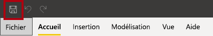

### **Tâche 2 : Définir les options de Power BI Desktop**

Dans cette tâche, vous allez définir les options de Power BI Desktop.

1. Dans Power BI Desktop, cliquez sur l’onglet **Fichier** dans le ruban pour ouvrir le mode Backstage.

1. Sur la gauche, sélectionnez **Options et paramètres**, puis sélectionnez **Options**.

    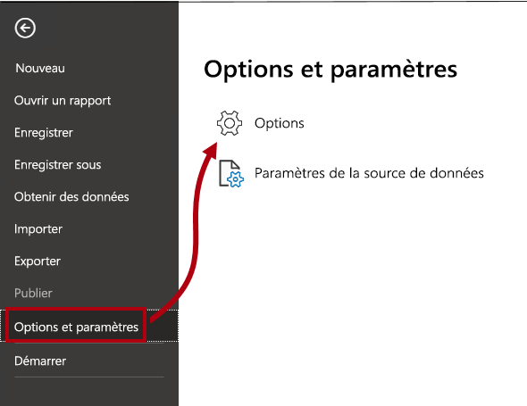

1. Dans la fenêtre **Options**, à gauche, dans le groupe **Fichier actif**, sélectionnez **Chargement des données**.

    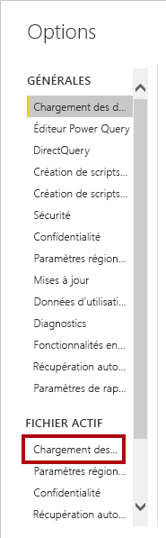

    Les paramètres de **Chargement des données** pour le fichier actif permettent de définir des options qui déterminent les comportements par défaut lors de la modélisation.

1. Dans le groupe **Relations**, désactivez les deux options activées.

    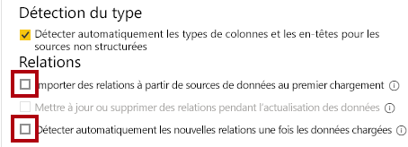

    Même si ces deux options peuvent être utiles lors du développement d’un modèle de données, elles ont été désactivées pour prendre en charge l’expérience du labo. Lorsque vous créerez des relations dans le labo **Charger des données dans Power BI Desktop**, vous découvrirez pourquoi vous les avez ajoutées.

1. Cliquez sur **OK**.

    

1. Enregistrez le fichier Power BI Desktop.

### **Tâche 3 : Obtenir des données de SQL Server**

Dans cette tâche, vous allez créer des requêtes basées sur des tables SQL Server.

1. Sous l’onglet **Accueil** du ruban, cliquez sur **SQL Server** dans le groupe **Données**.

    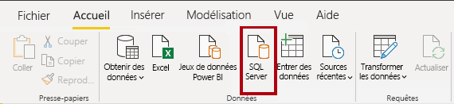

2. Dans la fenêtre **Base de données SQL Server**, dans la zone **Serveur**, entrez **localhost**.

    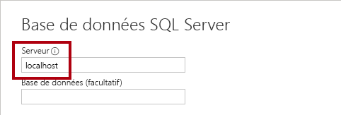

    Dans ce labo, vous allez vous connecter à la base de données SQL Server en utilisant **localhost**. Cette pratique n’est pas recommandée lors de la création de vos propres solutions. La raison en est que les sources de données de passerelle ne peuvent pas résoudre **localhost**.

3. Cliquez sur **OK**.

    

4. Si vous y êtes invité, dans la fenêtre **Base données SQL Server**, sélectionnez **Utiliser mes informations d’identification actuelles**. Ensuite, **connectez-vous**.

4. Dans la fenêtre **Navigateur**, à gauche, développez la base de données **AdventureWorksDW2020**.

    La base de données **AdventureWorksDW2020** est basée sur l’exemple de base de données **AdventureWorksDW2017**. Elle a été modifiée pour prendre en charge les objectifs d’apprentissage des labos du cours.

    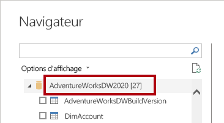

5. Sélectionnez, mais ne cochez pas, la table **DimEmployee**.

    

6. Notez qu’un aperçu des données de la table s’affiche dans le volet droit.

    Les données aperçues vous permettent de déterminer les colonnes et un échantillon de lignes.

7. Pour créer des requêtes, sélectionnez la case à cocher en regard des six tables suivantes :

    - DimEmployee

    - DimEmployeeSalesTerritory

    - DimProduct

    - DimReseller

    - DimSalesTerritory

    - FactResellerSales

8. Pour appliquer des transformations aux données des tables sélectionnées, cliquez sur **Transformer les données**.

    Vous n’allez pas transformer les données dans ce labo. Les objectifs de ce labo sont d’explorer et de profiler les données dans la fenêtre **Éditeur Power Query**.

    

### **Tâche 4 : Afficher un aperçu des requêtes SQL Server**

Dans cette tâche, vous allez afficher un aperçu des données des requêtes SQL Server. Vous allez d’abord découvrir des informations pertinentes sur les données. Vous allez aussi utiliser la qualité des colonnes, la distribution des colonnes et les outils de profilage de colonne pour comprendre les données et évaluer leur qualité.

1. Dans la fenêtre **Éditeur Power Query**, à gauche, notez la présence du volet **Requêtes**.

    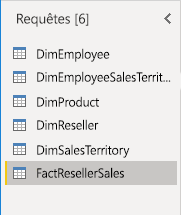

    Le volet **Requêtes** contient une requête pour chaque table cochée.

2. Sélectionnez la première requête **DimEmployee**.

    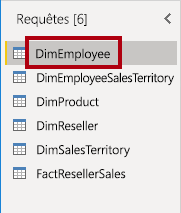

    La table **DimEmployee** dans la base de données SQL Server stocke une ligne pour chaque employé. Un sous-ensemble des lignes de cette table représente les commerciaux, qui sont pertinents pour le modèle que vous allez développer.

3. En bas à gauche, dans la barre d’état, notez les statistiques de la table : elle contient 33 colonnes et 296 lignes.

    

4. Dans le volet Aperçu des données, faites défiler horizontalement pour passer en revue toutes les colonnes.

5. Notez que les cinq dernières colonnes contiennent des liens **Table** ou **Valeur**.

    Ces cinq colonnes représentent les relations avec d’autres tables de la base de données. Elles peuvent être utilisées pour joindre des tables ensemble. Vous allez joindre des tables dans le labo **Charger des données dans Power BI Desktop**.

6. Pour évaluer la **qualité des colonnes**, cliquez sur l'onglet Affichage dans le ruban et activez l'option Qualité des colonnes dans le groupe **Aperçu des données**.

    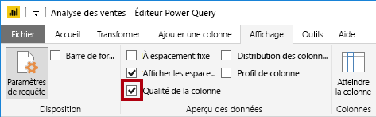

    La qualité de la colonne vous permet de déterminer facilement le pourcentage de valeurs valides, en erreur ou vides trouvées dans les colonnes.

7. Pour la colonne **Position** (sixième colonne à partir de la droite), remarquez que 94 % des lignes sont vides (null).

    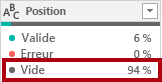

8. Pour évaluer la distribution des colonnes, cliquez sur l’onglet Affichage dans le ruban et activez l'option **Distribution des colonnes** dans le groupe **Aperçu des données**.

    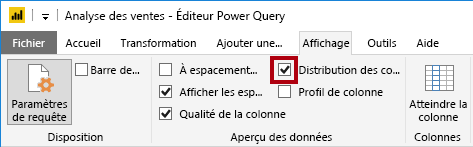

9. Examinez à nouveau la colonne **Position** et notez qu’il y a quatre valeurs distinctes et une valeur unique.

10. Passez en revue la distribution de la colonne pour la première colonne **EmployeeKey** : il y a 296 valeurs distinctes et 296 valeurs uniques.

    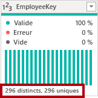

    Quand les nombres de valeurs distinctes et uniques sont identiques, cela signifie que la colonne contient des valeurs uniques. Lors de la modélisation, il est important que certaines tables de modèle contiennent des colonnes uniques. Ces colonnes uniques peuvent être utilisées pour créer des relations un-à-plusieurs. C’est ce que vous ferez dans le labo **Modéliser les données dans Power BI Desktop (partie 1)** .

11. Dans le volet **Requêtes**, sélectionnez la requête **DimEmployeeSalesTerritory**.

    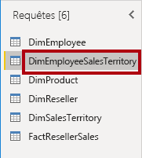

    La table **DimEmployeeSalesTerritory** stocke une ligne pour chaque employé et les régions du secteur de vente qu’il gère. La table prend en charge la relation de nombreuses régions à un même employé. Certains employés gèrent une, deux ou éventuellement davantage de régions. Lors de la modélisation de ces données, vous devrez définir une relation plusieurs-à-plusieurs.

12. Dans le volet **Requêtes**, sélectionnez la requête **DimProduct**.

    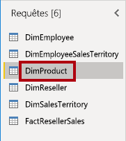

    La table **DimProduct** contient une ligne par produit vendu par l’entreprise.

13. Faites défiler horizontalement pour voir les dernières colonnes.

14. Notez la colonne **DimProductSubcategory**.

    Quand vous ajouterez des transformations à cette requête dans le labo **Charger des données dans Power BI Desktop**, vous utiliserez la colonne **DimProductSubcategory** pour joindre les tables.

15. Dans le volet **Requêtes**, sélectionnez la requête **DimReseller**.

    

    La table **DimReseller** contient une ligne par revendeur. Les revendeurs vendent, distribuent ou apportent de la valeur ajoutée aux produits Adventure Works.

16. Pour visualiser les valeurs des colonnes, sous l’onglet du ruban **Afficher**, à l’intérieur du groupe **Aperçu des données**, cochez **Profil de colonne**.

    

17. Sélectionnez l’en-tête de colonne **BusinessType**.

18. Notez qu’un nouveau volet s’ouvre sous le volet Aperçu des données.

19. Passez en revue les statistiques de colonne et la distribution des valeurs dans le volet aperçu des données.

20. Notez le problème de qualité des données : il existe deux étiquettes pour l’entrepôt (**Warehouse** et **Ware House**, cette dernière étant mal orthographiée).

    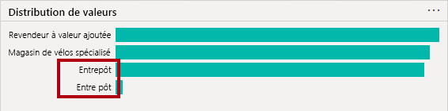

21. Placez le curseur sur la barre **Ware House** ; notez qu’il y a cinq lignes avec cette valeur.

    Vous appliquerez une transformation pour réétiqueter ces cinq lignes dans le labo **Charger des données dans Power BI Desktop**.

22. Dans le volet **Requêtes**, sélectionnez la requête **DimSalesTerritory**.

    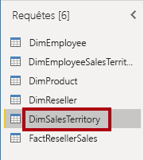

    La table **DimSalesTerritory** contient une ligne par région commerciale, y compris **Corporate HQ** (siège social de l’entreprise). Les régions sont affectées à un pays, et les pays sont affectés à des groupes. Dans le labo **Modéliser les données dans Power BI Desktop**, vous créerez une hiérarchie pour prendre en charge l’analyse au niveau de la région, du pays ou du groupe.

23. Dans le volet **Requêtes**, sélectionnez la requête **FactResellerSales**.

    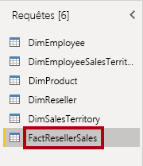

    La table **FactResellerSales** contient une ligne par ligne de commande client ; une commande client contient une ou plusieurs lignes.

24. Examinez la qualité de la colonne pour la colonne **TotalProductCost** ; notez que 8 % des lignes sont vides.

    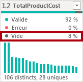

    Les valeurs manquantes de la colonne **TotalProductCost** sont un problème de qualité des données. Vous pourrez résoudre le problème dans le labo **Charger des données dans Power BI Desktop**, où vous appliquerez des transformations pour renseigner les valeurs manquantes en utilisant le coût standard du produit, qui est stocké dans la table **DimProduct** associée.

### **Tâche 5 : Obtenir des données d’un fichier CSV**

Dans cette tâche, vous allez créer une requête basée sur un fichier CSV.

1. Pour ajouter une nouvelle requête, dans la fenêtre **Éditeur Power Query**, sous l’onglet du ruban **Accueil**, dans le groupe **Nouvelle requête**, cliquez sur la flèche vers le bas **Nouvelle source**, puis sélectionnez **Texte/CSV**.

    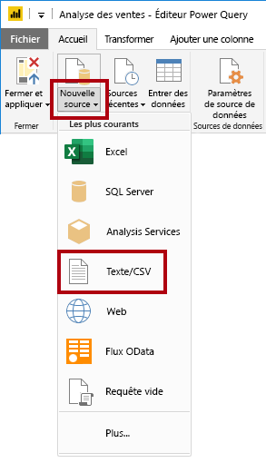

2. Dans la fenêtre **Ouvrir**, accédez au dossier **D:\PL300\Resources**, puis sélectionnez le fichier **ResellerSalesTargets.csv**.

3. Cliquez sur **Ouvrir**.

4. Dans la fenêtre **ResellerSalesTargets.csv**, examinez l’aperçu des données.

5. Cliquez sur **OK**.

    
 

6. Dans le volet **Requêtes**, notez l’ajout de la requête **ResellerSalesTargets**.

    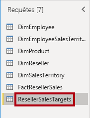

    Le fichier CSV **ResellerSalesTargets** contient une ligne par vendeur, par année. Chaque ligne enregistre 12 objectifs de ventes mensuels (exprimés en milliers). Notez que l’année fiscale de la société Adventure Works commence le 1er juillet.

7. Notez qu’aucune colonne ne contient de valeurs vides.

    Quand il n’y a pas d’objectif de ventes mensuel, un caractère de trait d’union est stocké à la place.

8. Passez en revue les icônes dans chaque en-tête de colonne, à gauche du nom de la colonne.

    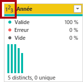

    Les icônes représentent le type de données de la colonne. **123** représente un nombre entier et **ABC** représente du texte.

    Dans le labo **Charger des données dans Power BI Desktop**, vous appliquerez de multiples transformations pour obtenir un résultat mis en forme différemment, composé de ces trois colonnes uniquement : **Date**, **EmployeeKey** et **TargetAmount**.

### **Tâche 6 : Obtenir des données supplémentaires d’un fichier CSV**

Dans cette tâche, vous allez créer une requête supplémentaire basée sur un autre fichier CSV.

1. Effectuez les étapes de la tâche précédente pour créer une requête basée sur le fichier **D:\PL300\Resources\ColorFormats.csv**.

    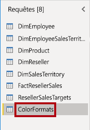

    Le fichier CSV **ColorFormats** contient une ligne par couleur de produit. Chaque ligne enregistre les codes hexadécimaux pour mettre en forme les couleurs d’arrière-plan et de police. Vous intégrerez ces données avec les données de requête **DimProduct** dans le labo **Charger des données dans Power BI Desktop**.

### **Tâche 7 : Terminer**

Dans cette tâche, vous terminez le labo.

1. Sous l’onglet du ruban **Afficher**, dans le groupe **Aperçu des données**, décochez les trois options d’aperçu des données précédemment activées dans ce labo :

    - Qualité de la colonne

    - Distribution des colonnes

    - Profil de colonne

    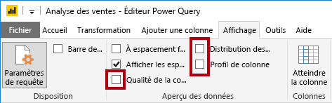

2. Pour enregistrer le fichier Power BI Desktop, dans la fenêtre **Éditeur Power Query**, dans la vu en mode Backstage **Fichier**, sélectionnez **Enregistrer**.

    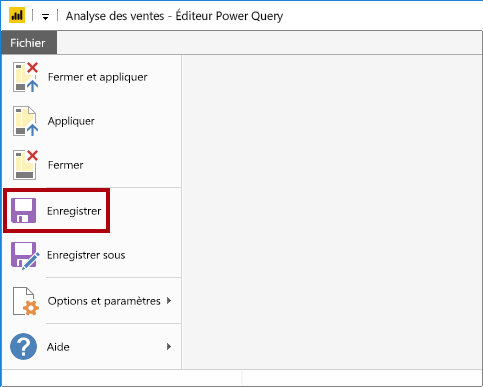

3. Quand vous êtes invité à appliquer les requêtes, cliquez sur **Appliquer plus tard**.

    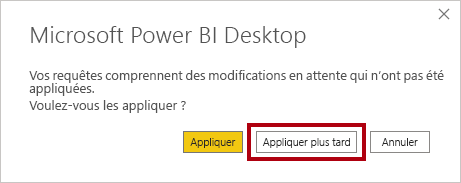

    L’application des requêtes va charger leurs données dans le modèle de données. Vous n’êtes pas prêt à faire cela, car de nombreuses transformations doivent d’abord être appliquées.

4. Si vous avez l’intention de démarrer le labo suivant, laissez Power BI Desktop ouvert.

    Dans le labo **Charger des données dans Power BI Desktop**, vous appliquerez différentes transformations aux requêtes, puis vous appliquerez les requêtes pour les charger dans le modèle de données.
