---
lab:
  title: Charger des données dans Power BI Desktop
  module: Module 3 - Clean, Transform, and Load Data in Power BI
ms.openlocfilehash: aced37b7bfdd2ccf94a9d3e7bdb8f8ff7013c125
ms.sourcegitcommit: 9ea1e7e21b9b3c718030c94b1693d153a2010ec7
ms.translationtype: HT
ms.contentlocale: fr-FR
ms.lasthandoff: 06/29/2022
ms.locfileid: "146650223"
---
# <a name="load-data-in-power-bi-desktop"></a>**Charger des données dans Power BI Desktop**

**La durée estimée pour effectuer ce tutoriel est de 45 minutes.**

Dans ce labo, vous allez commencer à appliquer des transformations à chacune des requêtes créées dans le labo précédent. Vous appliquerez ensuite les requêtes pour charger chacune d’elles sous forme de table dans le modèle de données.

Dans ce labo, vous allez découvrir comment :

- Appliquer différentes transformations

- Appliquer des requêtes pour les charger dans le modèle de données

### <a name="lab-story"></a>**Histoire du labo**

Ce labo est l’un des nombreux labos d’une série qui a été conçue comme une histoire complète allant de la préparation des données jusqu’à leur publication sous forme de rapports et de tableaux de bord. Vous pouvez effectuer ces labos dans l’ordre de votre choix. Toutefois, si vous comptez faire plusieurs labos, nous vous suggérons de suivre cet ordre :

1. Préparer des données dans Power BI Desktop

2. **Charger des données dans Power BI Desktop**

3. Modéliser les données dans Power BI Desktop


5. Créer des calculs DAX dans Power BI Desktop (partie 1)

6. Créer des calculs DAX dans Power BI Desktop (partie 2)

7. Concevoir un rapport dans Power BI Desktop, partie 1

8. Concevoir un rapport dans Power BI Desktop, partie 2

9. Créer un tableau de bord Power BI

10. Analyser les données dans Power BI Desktop

11. Appliquer la sécurité au niveau des lignes

## <a name="exercise-1-load-data"></a>**Exercice 1 : Charger des données**

Dans cet exercice, vous allez appliquer des transformations à chacune des requêtes créées dans le labo précédent.

### <a name="task-1-get-started"></a>**Tâche 1 : Démarrer**

Dans cette tâche, vous configurez l’environnement pour le labo.

*Important : Si vous venez d’effectuer le labo précédent (et que vous l’avez entièrement terminé), ignorez cette tâche et passez directement à la tâche suivante.*

1. Pour ouvrir Power BI Desktop, accédez à la barre des tâches et cliquez sur le raccourci Microsoft Power BI Desktop.

    

1. Pour fermer la fenêtre de démarrage, en haut à gauche de cette fenêtre, sélectionnez **X**.

    

1. Pour ouvrir le fichier Power BI Desktop de démarrage, sélectionnez l’onglet de ruban **Fichier** afin de passer en mode Backstage.

1. Sélectionnez **Ouvrir un rapport**.

    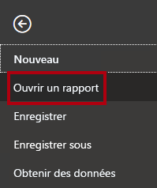

1. Cliquez sur **Parcourir les rapports**.

    

1. Dans la fenêtre **Ouvrir**, accédez au dossier **D:\PL300\Labs\02-load-data-with-power-query-in-power-bi-desktop\Starter**.

1. Sélectionnez le fichier **Sales Analysis** (Analyse des ventes).

1. Cliquez sur **Ouvrir**.

    

1. Fermez toutes les fenêtres d’information qui se sont éventuellement ouvertes.

1. Notez qu’un message d’avertissement jaune est affiché sous le ruban.

    *Le message vous avertit que les requêtes n’ont pas été appliquées pour se charger en tant que tables de modèle. Vous appliquerez les requêtes plus tard dans ce labo.*

1. Pour fermer le message d’avertissement, à droite du message d’avertissement jaune, cliquez sur **X**.

    

1. Pour créer une copie du fichier, sélectionnez l’onglet de ruban **Fichier** afin de passer en mode Backstage.

1. Sélectionnez **Enregistrer sous**.

    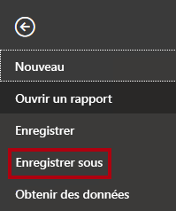

1. Si vous êtes invité à appliquer les modifications, cliquez sur **Appliquer ultérieurement**.

    

1. Dans la fenêtre **Enregistrer sous**, accédez au dossier **D:\PL300\MySolution**.

1. Cliquez sur **Enregistrer**.

    

1. Pour ouvrir la fenêtre **Éditeur Power Query**, sous l’onglet de ruban **Accueil**, dans le groupe **Requêtes**, sélectionnez l’icône **Transformer les données**.

    

### <a name="task-2-configure-the-salesperson-query"></a>**Tâche 2 : Configurer la requête Salesperson**

Dans cette tâche, vous allez configurer la requête **Salesperson**.

1. Dans la fenêtre **Éditeur Power Query**, dans le volet **Requêtes**, sélectionnez la requête **DimEmployee**.

    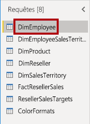

2. Pour renommer la requête, dans le volet **Paramètres de la requête** (situé à droite), dans la zone **Nom**, remplacez le texte par **Salesperson**, puis appuyez sur **Entrée**.

    *Le nom de la requête va déterminer le nom de la table du modèle. Il est recommandé de définir des noms concis mais néanmoins conviviaux.*

3. Dans le volet **Requêtes**, vérifiez que le nom de la requête a été mis à jour.

    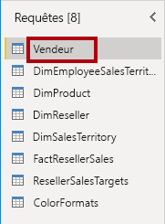

    *Vous allez maintenant filtrer les lignes de la requête pour récupérer seulement les employés qui sont des commerciaux.*

4. Pour trouver une colonne spécifique, sous l’onglet du ruban **Accueil**, dans le groupe **Gérer les colonnes**, cliquez sur la flèche vers le bas **Choisir des colonnes**, puis sélectionnez **Accéder à la colonne**.

    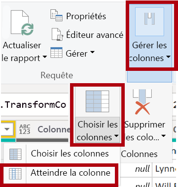

    *Conseil : Cette technique est pratique quand une requête contient de nombreuses colonnes. S’il n’y a pas beaucoup de colonnes, vous pouvez simplement faire défiler horizontalement pour localiser la colonne.*

5. Dans la fenêtre **Accéder à la colonne**, pour trier la liste par nom de colonne, cliquez sur le bouton de tri **AZ**, puis sélectionnez **Nom**.

    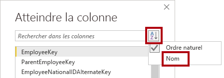

6. Sélectionnez la colonne **SalesPersonFlag**, puis cliquez sur **OK**.

7. Pour filtrer la requête, dans l’en-tête de colonne **SalesPersonFlag**, cliquez sur la flèche vers le bas, puis décochez **FAUX**.

    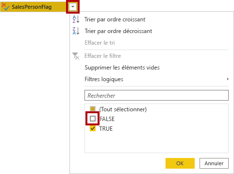

8. Cliquez sur **OK**.

    

9. Dans le volet **Paramètres de la requête**, dans la liste **Étapes appliquées**, notez l’ajout de l’étape **Lignes filtrées**.

    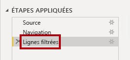

    *Chaque transformation que vous créez produit une logique d’étape supplémentaire. Il est possible de modifier ou de supprimer des étapes. Il est également possible de sélectionner une étape pour afficher un aperçu des résultats de la requête à cette étape de transformation.*

10. Pour supprimer des colonnes, sous l’onglet du ruban **Accueil**, dans le groupe **Gérer les colonnes**, cliquez sur l’icône **Choisir des colonnes**.

    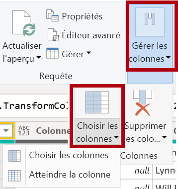

11. Dans la fenêtre **Choisir des colonnes**, pour décocher toutes les colonnes, décochez l’élément **(Sélectionner toutes les colonnes)**.

    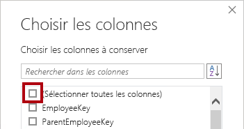

12. Pour inclure des colonnes, cochez les six colonnes suivantes :

    - EmployeeKey

    - EmployeeNationalIDAlternateKey

    - FirstName

    - LastName

    - Title

    - EmailAddress

13. Cliquez sur **OK**.

    

14. Dans la liste **Étapes appliquées**, notez l’ajout d’une autre étape de requête.

    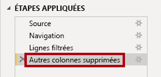

15. Pour créer une seule colonne avec le nom, sélectionnez d’abord l’en-tête de colonne **FirstName**.

16. Tout en appuyant sur la touche **Ctrl**, sélectionnez la colonne **LastName**.

    

17. Cliquez avec le bouton droit sur un des en-têtes de colonne puis, dans le menu contextuel, sélectionnez **Fusionner les colonnes**.

    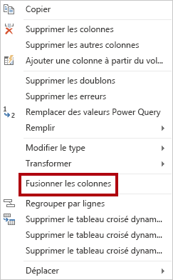

    *De nombreuses transformations courantes peuvent être appliquées en cliquant avec le bouton droit sur l’en-tête de colonne, puis en les sélectionnant dans le menu contextuel. Cependant, d’autres transformations sont disponibles dans le ruban.*

18. Dans la fenêtre **Fusionner les colonnes**, dans la liste déroulante **Séparateur**, sélectionnez **Espace**.

19. Dans la zone **Nom de la nouvelle colonne**, remplacez le texte par **Salesperson**.

    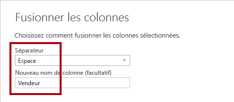

20. Cliquez sur **OK**.

    

21. Pour renommer la colonne **EmployeeNationalIDAlternateKey**, double-cliquez sur l’en-tête de colonne **EmployeeNationalIDAlternateKey**.

22. Remplacez le texte par **EmployeeID**, puis appuyez sur **Entrée**.

    *Important : Quand il vous est demandé de renommer des colonnes, il est important de les renommer exactement comme c’est décrit.*

23. Utilisez les étapes précédentes pour renommer la colonne **EmailAddress** en **UPN**.

    *UPN est un acronyme pour User Principal Name (Nom d’utilisateur principal).*

24. En bas à gauche, dans la barre d’état, vérifiez que la requête a bien 5 colonnes et 18 lignes.

    

    *Important : Il est important de ne pas continuer si votre requête ne produit pas le résultat correct, sinon il ne vous sera pas possible d’effectuer les labos ultérieurs. Si les colonnes ou les lignes de la requête ne correspondent pas, revenez aux étapes antérieures de cette tâche pour identifier et corriger le problème.*

### <a name="task-3-configure-the-salespersonregion-query"></a>**Tâche 3 : Configurer la requête SalespersonRegion**

Dans cette tâche, vous allez configurer la requête **SalespersonRegion**.

1. Dans le volet **Requêtes**, sélectionnez la requête **DimEmployeeSalesTerritory**.

    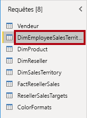

2. Dans le volet **Paramètres de la requête**, renommez la requête en **SalespersonRegion**.

3. Pour supprimer les deux dernières colonnes, sélectionnez d’abord l’en-tête de colonne **DimEmployee**.

4. Tout en appuyant sur la touche **Ctrl**, sélectionnez l’en-tête de colonne **DimSalesTerritory**.

5. Cliquez avec le bouton droit sur un des en-têtes de colonne puis, dans le menu contextuel, sélectionnez **Supprimer les colonnes**.

    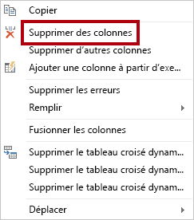

6. Dans la barre d’état, vérifiez que la requête a bien 2 colonnes et 39 lignes.

    

### <a name="task-4-configure-the-product-query"></a>**Tâche 4 : Configurer la requête Product**

Dans cette tâche, vous allez configurer la requête **Product**.

*Important : Des instructions détaillées ayant déjà été fournies, les étapes du labo vont désormais faire l’objet d’instructions plus concises. Si vous avez besoin d’instructions détaillées, vous pouvez vous reporter aux étapes des tâches antérieures.*

1. Sélectionnez la requête **DimProduct**.

    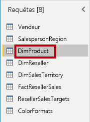

2. Renommez la requête en **Product**.

3. Recherchez la colonne **FinishedGoodsFlag**, puis filtrez la colonne pour récupérer les produits finis (c’est-à-dire dont la valeur est TRUE).

4. Supprimez toutes les colonnes, à l’exception des suivantes :

    - ProductKey

    - EnglishProductName

    - StandardCost

    - Color

    - DimProductSubcategory

5. Notez que la colonne **DimProductSubcategory** représente une table associée (elle contient des liens **Value**).

6. Dans l’en-tête de colonne **DimProductSubcategory**, à droite du nom de la colonne, cliquez sur le bouton Développer.

    

7. Pour décocher toutes les colonnes, décochez l’élément **(Sélectionner toutes les colonnes)**.

8. Cochez les colonnes **EnglishProductSubcategoryName** et **DimProductCategory**.

    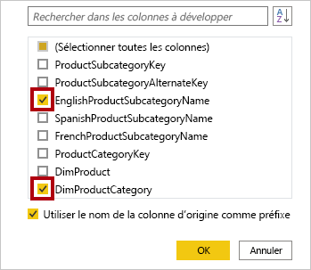

    *Ces deux colonnes étant sélectionnées, une transformation sera appliquée de façon à établir une jointure avec la table **DimProductSubcategory**, puis ces colonnes seront incluses. La colonne **DimProductCategory** est en fait une autre table associée dans la source de données.*

9. Décochez la case **Utiliser le nom de la colonne d’origine comme préfixe**.

    

    *Les noms des colonnes d’une requête doivent toujours être uniques. Si elle est cochée, cette case à cocher va préfixer chaque colonne du nom de colonne développé (dans ce cas **DimProductSubcategory**). Comme les colonnes sélectionnées n’entrent pas en conflit avec des colonnes dans la requête **Product**, l’option est désélectionnée.*

10. Cliquez sur **OK**.

    

11. Notez que la transformation a entraîné l’ajout de deux colonnes et que la colonne **DimProductSubcategory** a été supprimée.

12. Développez la colonne **DimProductCategory**, puis introduisez seulement la colonne **EnglishProductCategoryName**.

13. Renommez les quatre colonnes suivantes :

    - **EnglishProductName** en **Product**

    - **StandardCost** en **Standard Cost** (incluez un espace)

    - **EnglishProductSubcategoryName** en **Subcategory**

    - **EnglishProductCategoryName** en **Category**

14. Dans la barre d’état, vérifiez que la requête a bien 6 colonnes et 397 lignes.

    

### <a name="task-5-configure-the-reseller-query"></a>**Tâche 5 : Configurer la requête Reseller**

Dans cette tâche, vous allez configurer la requête **Reseller**.

1. Sélectionnez la requête **DimReseller**.

    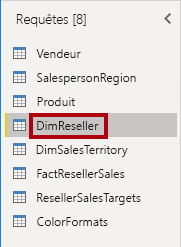

2. Renommez la requête en **Reseller**.

3. Supprimez toutes les colonnes, à l’exception des suivantes :

    - ResellerKey

    - BusinessType

    - ResellerName

    - DimGeography

4. Développez la colonne **DimGeography** pour inclure seulement les trois colonnes suivantes :

    - City

    - StateProvinceName

    - EnglishCountryRegionName

    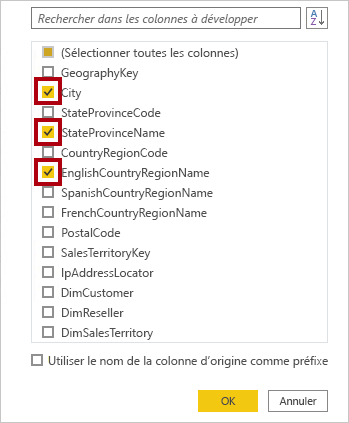

5. Dans l’en-tête de colonne **Business Type**, cliquez sur la flèche vers le bas, puis examinez les valeurs de colonne distinctes : vous constatez l’orthographe incorrecte de « Ware House ».

    

  

6. Cliquez avec le bouton droit sur l’en-tête de colonne **Business Type**, puis sélectionnez **Remplacer les valeurs**.

    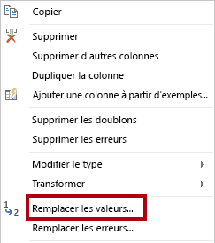

7. Dans la fenêtre **Remplacer les valeurs**, configurez les valeurs suivantes :

    - Dans la zone **Valeur à rechercher**, entrez **Ware House**

    - Dans la zone **Remplacer par**, entrez **Warehouse**

    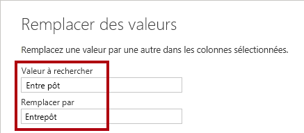

8. Cliquez sur **OK**.

    

9. Renommez les quatre colonnes suivantes :

    - **BusinessType** en **Business Type** (incluez un espace)

    - **ResellerName** en **Reseller**

    - **StateProvinceName** en **State-Province**

    - **EnglishCountryRegionName** en **Country-Region**

10. Dans la barre d’état, vérifiez que la requête a bien 6 colonnes et 701 lignes.

    

### <a name="task-6-configure-the-region-query"></a>**Tâche 6 : Configurer la requête Region**

Dans cette tâche, vous allez configurer la requête **Region**.

1. Sélectionnez la requête **DimSalesTerritory**.

    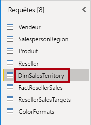

2. Renommez la requête en **Region**.

3. Appliquez un filtre à la colonne **SalesTerritoryAlternateKey** pour supprimer la valeur 0 (zéro).

    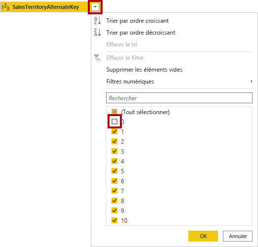

4. Supprimez toutes les colonnes, à l’exception des suivantes :

    - SalesTerritoryKey

    - SalesTerritoryRegion

    - SalesTerritoryCountry

    - SalesTerritoryGroup

5. Renommez les trois colonnes suivantes :

    - **SalesTerritoryRegion** en **Region**

    - **SalesTerritoryCountry** en **Country**

    - **SalesTerritoryGroup** en **Group**

6. Dans la barre d’état, vérifiez que la requête a bien 4 colonnes et 10 lignes.

    

### <a name="task-7-configure-the-sales-query"></a>**Tâche 7 : Configurer la requête Sales**

Dans cette tâche, vous allez configurer la requête **Sales**.

1. Sélectionnez la requête **FactResellerSales**.

    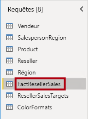

2. Renommez la requête en **Sales**.

3. Supprimez toutes les colonnes, à l’exception des suivantes :

    - SalesOrderNumber

    - OrderDate

    - ProductKey

    - ResellerKey

    - EmployeeKey

    - SalesTerritoryKey

    - OrderQuantity

    - UnitPrice

    - TotalProductCost

    - SalesAmount

    - DimProduct

    *Rappelez-vous : dans le labo **Préparer des données dans Power BI Desktop**, un petit pourcentage des lignes **FactResellerSales** ne contenait pas de valeurs pour **TotalProductCost**. La colonne **DimProduct** a été ajoutée de façon à récupérer la colonne de coût standard du produit et faciliter la correction du problème des valeurs manquantes.*

4. Développez la colonne **DimProduct**, décochez les colonnes, puis incluez la colonne **StandardCost**.

5. Pour créer une colonne personnalisée, sous l’onglet du ruban **Ajouter une colonne**, dans le groupe **Général**, cliquez sur **Colonne personnalisée**.

    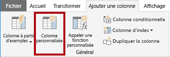

6. Dans la fenêtre **Colonne personnalisée**, dans la zone **Nom de la nouvelle colonne**, remplacez le texte par **Cost**.

    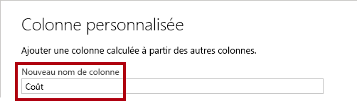

7. Dans la zone **Formule de colonne personnalisée**, entrez l’expression suivante (après le symbole Égal) :

8. Pour plus de commodité, vous pouvez copier l’expression à partir du fichier **D:\PL300\Labs\02-load-data-with-power-query-in-power-bi-desktop\Assets\Snippets.txt**.


   **Power Query**
   ```
   if [TotalProductCost] = null then [OrderQuantity] * [StandardCost] else [TotalProductCost]
   ```


*Cette expression teste si la valeur de **TotalProductCost** est manquante. Si c’est le cas, produisez une valeur en multipliant la valeur de **OrderQuantity** par la valeur de **StandardCost** ; sinon, elle utilise la valeur existante de **TotalProductCost**.*

9. Cliquez sur **OK**.

    

10. Supprimez les deux colonnes suivantes :

    - TotalProductCost

    - StandardCost

11. Renommez les trois colonnes suivantes :

    - **OrderQuantity** en **Quantity**

    - **UnitPrice** en **Unit Price** (incluez un espace)

    - **SalesAmount** en **Sales**

12. Pour modifier le type de données de la colonne, dans l’en-tête de la colonne **Quantity**, à gauche du nom de la colonne, cliquez sur l’icône **1.2**, puis sélectionnez **Nombre entier**.

    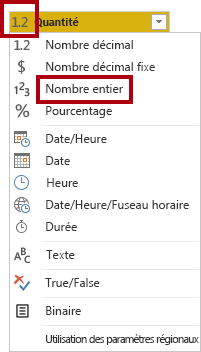

    *Il est important de configurer le type de données correct. Quand la colonne contient une valeur numérique, il est également important de choisir le type correct si vous prévoyez d’effectuer des calculs mathématiques.*

13. Modifiez les types de données des trois colonnes suivantes en **Nombre décimal fixe**.

    - Unit Price

    - Ventes

    - Coût

    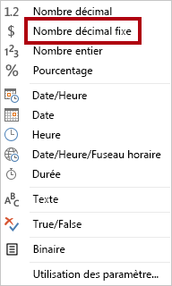

    *Le type de données Nombre décimal fixe stocke des valeurs avec une précision complète, ce qui nécessite un espace de stockage plus grand que pour un nombre décimal. Il est important d’utiliser le type Nombre décimal fixe pour les valeurs financières ou les taux (comme les taux de change).*

14. Dans la barre d’état, vérifiez que la requête a bien 10 colonnes et 999+ lignes.

    

    *Un maximum de 1 000 lignes seront chargées comme aperçu des données pour chaque requête.*

### <a name="task-8-configure-the-targets-query"></a>**Tâche 8 : Configurer la requête Targets**

Dans cette tâche, vous allez configurer la requête **Targets**.

1. Sélectionnez la requête **ResellerSalesTargets**.

    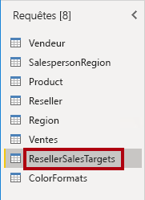

2. Renommez la requête en **Targets**.

3. Pour dépivoter les colonnes correspondant aux 12 mois (**M01**-**M12**), sélectionnez d’abord les en-têtes des colonnes **Year** et **EmployeeID**.

    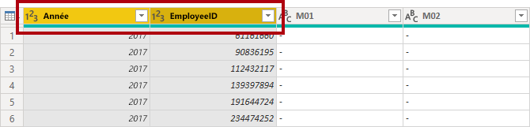

4. Cliquez avec le bouton droit sur un des en-têtes de colonne puis, dans le menu contextuel, sélectionnez **Dépivoter les autres colonnes**.

    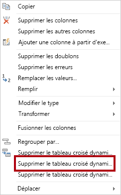

5. Notez que les noms de colonne apparaissent maintenant dans la colonne **Attribut** et que les valeurs apparaissent dans la colonne **Valeur**.

6. Appliquez un filtre à la colonne **Valeur** pour supprimer les valeurs « - » (trait d’union).

    *Vous vous souvenez peut-être que le caractère de trait d’union a été utilisé dans le fichier CSV source pour représenter le zéro (0).*

7. Renommez les deux colonnes suivantes :

    - **Attribut** en **MonthNumber** (il n’y a pas d’espace entre les deux mots, il sera supprimé plus tard)

    - **Valeur** en **Target**

    *Vous allez maintenant appliquer des transformations pour produire une colonne de date. La date sera dérivée des colonnes **Year** et **MonthNumber**. Vous allez créer la colonne en utilisant la fonctionnalité **Colonne à partir d’exemples**.*

8. Pour préparer les valeurs de la colonne **MonthNumber**, cliquez avec le bouton droit sur l’en-tête de colonne **MonthNumber**, puis sélectionnez **Remplacer les valeurs**.

    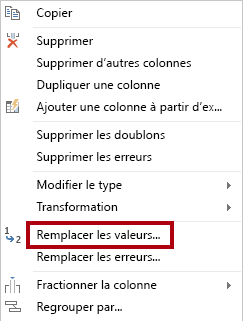

9. Dans la fenêtre **Remplacer les valeurs**, dans la zone **Valeur à rechercher**, entrez **M**.

    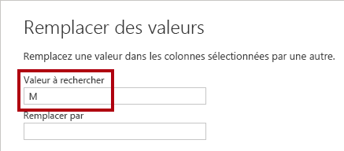

10. Cliquez sur **OK**.

11. Changez le type de données de la colonne **MonthNumber** en **Nombre entier**.

    

12. Sous l’onglet du ruban **Ajouter une colonne**, dans le groupe **Général**, cliquez sur l’icône **Colonne à partir d’exemples**.

    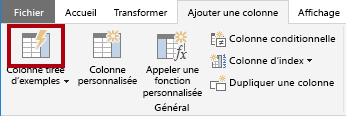

13. Notez que la première ligne est pour l’année **2017** et que le numéro du mois est **7**.

14. Dans la colonne **Colonne1**, dans la première cellule de la grille, entrez **7/1/2017**, puis appuyez sur **Entrée**.

    *La machine virtuelle utilise les paramètres régionaux États-Unis, donc cette date est en fait le 1er juillet 2017.*

15. Notez que les cellules de la grille sont mises à jour avec des valeurs prédites.

    *La fonctionnalité a prédit exactement que vous combinez des valeurs provenant des colonnes **Year** et **MonthNumber**.*

16. Notez également la formule présentée au-dessus de la grille de la requête.

    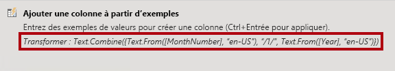

17. Pour renommer la nouvelle colonne, double-cliquez sur l’en-tête de colonne **Fusionné**.

18. Renommez la colonne en **TargetMonth**.

    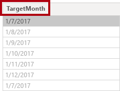

19. Pour ajouter la nouvelle colonne, sélectionnez **OK**.

    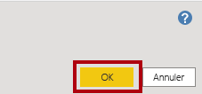

20. Supprimez les colonnes suivantes :

    - Year

    - MonthNumber

21. Modifiez les types de données des colonnes suivantes :

    - **Target** en Nombre décimal fixe

    - **TargetMonth** en Date

22. Pour multiplier les valeurs de **Targets** par 1000, sélectionnez l’en-tête de colonne **Target** puis, sous l’onglet du ruban **Transformer**, dans le groupe **Colonne Nombre**, cliquez sur **Standard**, puis sélectionnez **Multiplier**.

    *Rappelez-vous : les valeurs cibles ont été stockées sous forme de milliers.*

    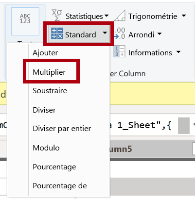

23. Dans la fenêtre **Multiplier**, dans la zone **Valeur**, entrez **1000**.

    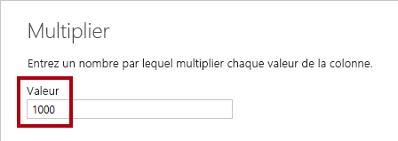

24. Cliquez sur **OK**.

    

25. Dans la barre d’état, vérifiez que la requête a bien 3 colonnes et 809 lignes.

    

### <a name="task-9-configure-the-colorformats-query"></a>**Tâche 9 : Configurer la requête ColorFormats**

Dans cette tâche, vous allez configurer la requête **ColorFormats**.

1. Sélectionnez la requête **ColorFormats**.

    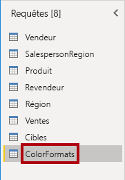

2. Notez que la première ligne contient les noms de colonne.

3. Sous l’onglet du ruban **Accueil**, dans le groupe **Transformer**, cliquez sur **Utiliser la première ligne pour les en-têtes**.

    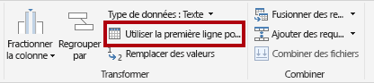

4. Dans la barre d’état, vérifiez que la requête a bien 3 colonnes et 10 lignes.

    

### <a name="task-10-update-the-product-query"></a>**Tâche 10 : Mettre à jour la requête Product**

Dans cette tâche, vous allez mettre à jour la requête **Product** en fusionnant la requête **ColorFormats**.

1. Sélectionnez la requête **Product**.

    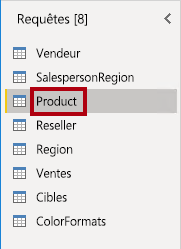

2. Pour fusionner la requête **ColorFormats**, sous l’onglet du ruban **Accueil**, cliquez sur la flèche vers le bas **Combiner**, puis sur **Fusionner des requêtes**.

    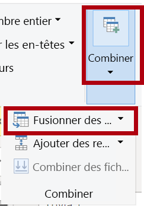

    *La fusion de requêtes permet d’intégrer des données, provenant dans le cas présent de différentes sources de données (SQL Server et un fichier CSV).*

3. Dans la fenêtre **Fusionner**, dans la grille de la requête **Product**, sélectionnez l’en-tête de colonne **Color**.

    

4. Sous la grille de la requête **Product**, dans la liste déroulante, sélectionnez la requête **ColorFormats**.

    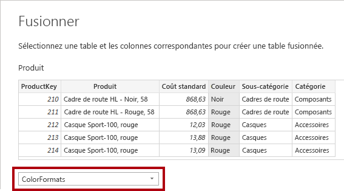

5. Dans la grille de la requête **ColorFormats**, sélectionnez l’en-tête de colonne **Color**.

6. Quand la fenêtre **Niveaux de confidentialité** s’ouvre, pour chacune des deux sources de données, dans la liste déroulante correspondante, sélectionnez **Organisationnel**.

    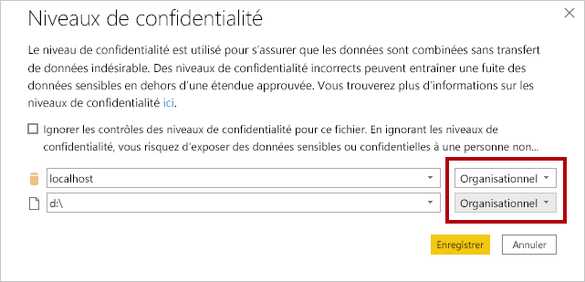

    *Des niveaux de confidentialité peuvent être configurés pour la source de données afin de déterminer si les données peuvent être partagées entre les sources. La définition de chaque source de données sur **Organisationnel** leur permet de partager des données si nécessaire. Notez que les sources de données privées ne peuvent jamais être partagées avec d’autres sources de données. Cela ne signifie pas que les données privées ne peuvent pas être partagées, mais que le moteur de Power Query ne peut pas partager des données entre les sources.*

7. Cliquez sur **Enregistrer**.

    

8. Dans la fenêtre **Fusion**, utilisez le **Type de jointure** par défaut : conservez la sélection externe gauche, puis cliquez sur **OK**.

    

9. Développez la colonne **ColorFormats** pour inclure les deux colonnes suivantes :

    - Background Color Format (Format de couleur d’arrière-plan)

    - Font Color Format (Format de couleur de police)

    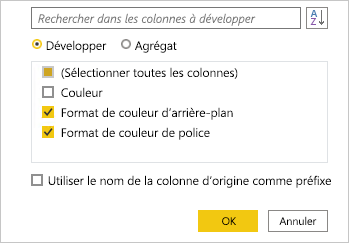

10. Dans la barre d’état, vérifiez que la requête a maintenant 8 colonnes et 397 lignes.

    

### <a name="task-11-update-the-colorformats-query"></a>**Tâche 11 : Mettre à jour la requête ColorFormats**

Dans cette tâche, vous allez mettre à jour **ColorFormats** de façon à désactiver son chargement.

1. Sélectionnez la requête **ColorFormats**.

    

2. Dans le volet **Paramètres de la requête**, cliquez sur le lien **Toutes les propriétés**.

    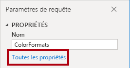

3. Dans la fenêtre **Propriétés de la requête**, décochez la case **Activer le chargement vers le rapport**.

    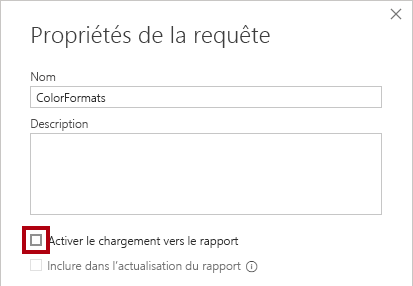

    Désactiver le chargement signifie qu’elle ne sera pas chargée en tant que table dans le modèle de données. La raison en est que la requête a été fusionnée avec la requête **Product**, dont le chargement dans le modèle de données est activé.

4. Cliquez sur **OK**.

    

### <a name="task-12-finish-up"></a>**Tâche 12 : Terminer**

Dans cette tâche, vous terminez le labo.

1. Vérifiez que vous avez huit requêtes, correctement nommées comme suit :

    - Salesperson

    - SalespersonRegion

    - Product

    - Reseller

    - Region

    - Sales

    - Targets

    - ColorFormats (qui ne sera pas chargée dans le modèle de données)

2. Pour charger le modèle de données, en mode Backstage **Fichier**, sélectionnez **Fermer et appliquer**.

    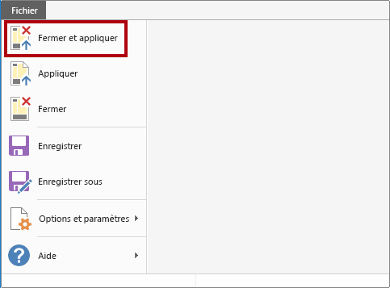

    *Toutes les requêtes dont le chargement est activé sont maintenant chargées dans le modèle de données.*

3. Dans le volet **Champs** (situé à droite), notez les sept tables chargées dans le modèle de données.

    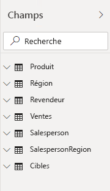

4. Enregistrez le fichier Power BI Desktop.

5. Si vous avez l’intention de démarrer le labo suivant, laissez Power BI Desktop ouvert.

    *Vous configurerez les tables et les relations du modèle de données dans le labo **Modéliser les données dans Power BI Desktop (partie 1)** .*
