---
lab:
  title: "Modéliser les données dans Power\_BI Desktop"
  module: Module 4 - Design a Data Model in Power BI
---

# **Modéliser les données dans Power BI Desktop**

**La durée estimée pour effectuer ce tutoriel est de 45 minutes.**

Dans ce labo, vous allez commencer à développer le modèle de données. Pour cela, vous créerez des relations entre les tables, puis configurerez des propriétés de table et de colonne pour améliorer la convivialité du modèle de données. Vous créerez également des hiérarchies et des mesures rapides.

Dans ce labo, vous allez découvrir comment :

- Créer des relations de modèle

- Configurer des propriétés de table et de colonne

- Créer des hiérarchies

### **Histoire du labo**

Ce labo est l’un des nombreux labos d’une série qui a été conçue comme une histoire complète allant de la préparation des données jusqu’à leur publication sous forme de rapports et de tableaux de bord. Vous pouvez effectuer ces labos dans l’ordre de votre choix. Toutefois, si vous comptez faire plusieurs labos, pour les dix premiers d’entre eux, nous vous suggérons de suivre cet ordre :

1. Préparer des données dans Power BI Desktop

2. Charger des données dans Power BI Desktop

3. **Modéliser les données dans Power BI Desktop**

5. Créer des calculs DAX dans Power BI Desktop (partie 1)

6. Créer des calculs DAX dans Power BI Desktop (partie 2)

7. Concevoir un rapport dans Power BI Desktop, partie 1

8. Concevoir un rapport dans Power BI Desktop, partie 2

9. Créer un tableau de bord Power BI

10. Analyser les données dans Power BI Desktop

11. Appliquer la sécurité au niveau des lignes

## **Exercice 1 : Créer des relations de modèle**

Dans cet exercice, vous allez créer des relations de modèle.

### **Tâche 1 : Démarrer**

Dans cette tâche, vous configurez l’environnement pour le labo.

*Important : Si vous venez d’effectuer le labo précédent (et que vous l’avez entièrement terminé), ignorez cette tâche et passez directement à la tâche suivante.*

1. Pour ouvrir Power BI Desktop, accédez à la barre des tâches et cliquez sur le raccourci Microsoft Power BI Desktop.

    

1. Pour fermer la fenêtre de démarrage, en haut à gauche de cette fenêtre, sélectionnez **X**.

    

1. Pour ouvrir le fichier Power BI Desktop de démarrage, sélectionnez l’onglet de ruban **Fichier** afin de passer en mode Backstage.

1. Sélectionnez **Ouvrir un rapport**.

    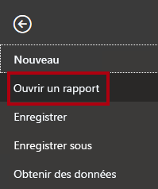

1. Cliquez sur **Parcourir les rapports**.

    

1. Dans la fenêtre **Ouvrir**, accédez au dossier **D:\PL300\Labs\03-configure-data-model-in-power-bi-desktop\Starter**.

1. Sélectionnez le fichier **Sales Analysis** (Analyse des ventes).

1. Cliquez sur **Ouvrir**.

    

1. Fermez toutes les fenêtres d’information qui se sont éventuellement ouvertes.

1. Pour créer une copie du fichier, sélectionnez l’onglet de ruban **Fichier** afin de passer en mode Backstage.

1. Sélectionnez **Enregistrer sous**.

    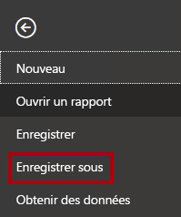

1. Si vous êtes invité à appliquer les modifications, cliquez sur **Appliquer**.

    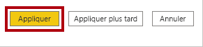

1. Dans la fenêtre **Enregistrer sous**, accédez au dossier **D:\PL300\MySolution**.

1. Cliquez sur **Enregistrer**.

    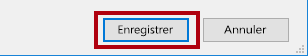

### **Tâche 2 : Créer des relations de modèle**

Dans cette tâche, vous allez créer des relations de modèle.

1. Dans Power BI Desktop, à gauche, cliquez sur l’icône de la vue **Modèle**.

    

2. Si vous ne voyez pas les sept tables, faites défiler horizontalement vers la droite, puis rapprochez les tables en les faisant glisser pour qu’elles soient toutes visibles en même temps.

    *Conseil : Vous pouvez également vous servir du contrôle de zoom situé en bas de la fenêtre.*

    *Dans la vue Modèle, il est possible de voir chacune des tables et leurs relations éventuelles (connecteurs entre les tables). Actuellement, il n’y a aucune relation, car dans le labo **Préparer des données dans Power BI Desktop**, vous aviez désactivé les options de relation de chargement des données.*

3. Pour revenir à la vue Rapport, à gauche, cliquez sur l’icône de la vue **Rapport**.

    

4. Pour voir tous les champs de la table, dans le volet **Champs**, cliquez avec le bouton droit sur une zone vide, puis sélectionnez **Développer tout**.

    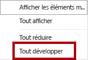

5. Pour créer un visuel de table, dans le volet **Champs**, à partir de la table **Product**, cochez le champ **Category**.

    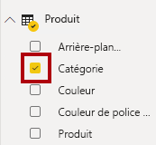

    *Les labos utilisent une notation abrégée pour référencer un champ. Voici le résultat : **Product \| Category**. Dans cet exemple, **Product** est le nom de la table et **Category** correspond au nom du champ.*

6. Pour ajouter une colonne à la table, dans le volet **Champs**, cochez le champ **Sales \| Sales**.

7. Notez que le visuel de table liste quatre catégories de produits et que la valeur des ventes est la même pour chaque catégorie et pour le total.

    

    *Le problème est dû au fait que la table est basée sur des champs de tables différentes. Chaque catégorie de produit est censée afficher les ventes de cette catégorie. Toutefois, étant donné qu’il n’existe pas de relation de modèle entre ces tables, la table **Sales** n’est pas filtrée. Vous allez maintenant ajouter une relation pour propager les filtres entre les tables.*

8. Sous l’onglet de ruban **Modélisation**, à partir du groupe **Relations**, cliquez sur **Gérer les relations**.

    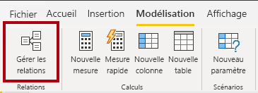

9. Dans la fenêtre **Gérer les relations**, notez qu’aucune relation n’est encore définie.

10. Pour créer une relation, cliquez sur **Nouveau**.

    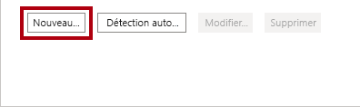

11. Dans la fenêtre **Créer une relation**, dans la première liste déroulante, sélectionnez la table **Product**.

    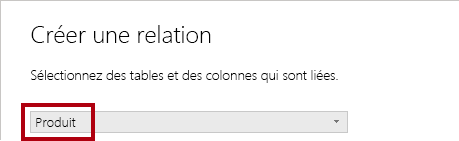

12. Dans la deuxième liste déroulante (sous la grille de la table **Product**), sélectionnez la table **Sales**.

    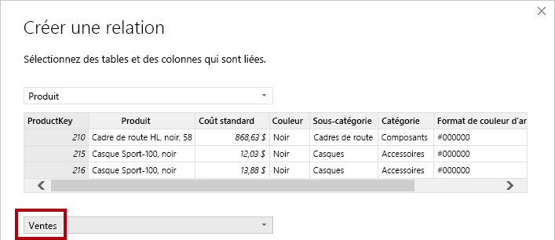

13. Notez que les colonnes **ProductKey** de chaque table sont sélectionnées automatiquement.

    *Les colonnes ont été automatiquement sélectionnées parce qu’elles ont le même nom et le même type de données.*

14. Dans la liste déroulante **Cardinalité**, notez que l’option **Un à plusieurs (1:*)** est sélectionnée.

    *La cardinalité est détectée automatiquement, car Power BI comprend que la colonne **ProductKey** de la table **Product** contient des valeurs uniques. La relation un-à-plusieurs est la cardinalité la plus courante, et toutes les relations que vous créez dans ce labo sont de ce type. Vous allez travailler avec une Cardinalité plusieurs à plusieurs dans la labo **Modéliser les données dans Power BI Desktop (partie 2)** .*

15. Dans la liste déroulante **Direction du filtre croisé**, notez que l’option **À sens unique** est sélectionnée.

    *La direction à sens unique signifie que les filtres sont propagés du côté « un » au côté « plusieurs ». Dans ce cas, les filtres appliqués à la table **Product** sont propagés à la table **Sales**, mais pas dans l’autre direction. Vous utiliserez des relations bidirectionnelles dans le labo **Modéliser les données dans Power BI Desktop (partie 2)** .*

16. Notez que l’option **Rendre cette relation active** est cochée.

    *Les relations actives propagent les filtres. Il est possible de marquer une relation comme inactive pour ne pas propager les filtres. Vous pouvez avoir des relations inactives si plusieurs chemins de relation existent entre les tables. Dans ce cas, les calculs de modèle peuvent utiliser des fonctions spéciales pour les activer. Vous utiliserez des relations inactives dans le labo **Modéliser les données dans Power BI Desktop (partie 2)** .*

17. Cliquez sur **OK**.

    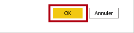

18. Dans la fenêtre **Gérer les relations**, notez que la nouvelle relation est listée, puis cliquez sur **Fermer**.

    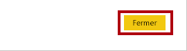

19. Dans le rapport, notez que le visuel de table a été mis à jour pour afficher des valeurs différentes pour chaque catégorie de produit.

    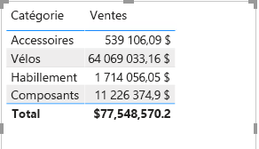

    *Les filtres appliqués à la table **Product** sont désormais propagés à la table **Sales**.*

20. Basculez vers l’affichage Modèle, puis notez qu’il existe maintenant un connecteur entre les deux tables (peu importe si les tables sont positionnées en regard de l’autre).

    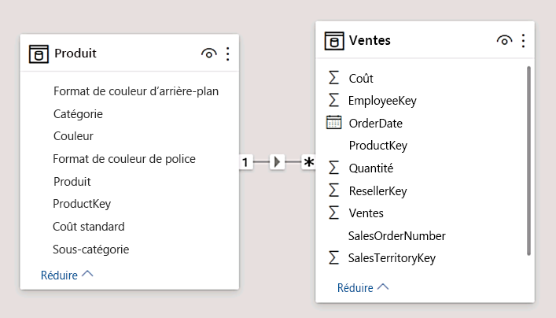

21. Dans le diagramme, notez que vous pouvez interpréter la cardinalité qui est représentée par les indicateurs **1** et *****.

    *La direction du filtre est représentée par la tête de flèche. Une ligne pleine représente une relation active tandis qu’une ligne en pointillés représente une relation inactive.*

22. Placez le curseur sur la relation pour mettre en surbrillance les colonnes associées.

    *Il existe un moyen plus simple de créer une relation. Dans le diagramme de modèle, vous pouvez faire glisser-déposer des colonnes pour créer une relation.*

23. Pour créer une relation en utilisant une technique différente, à partir de la table **Reseller**, faites glisser la colonne **ResellerKey** sur la colonne **ResellerKey** de la table **Sales**.

    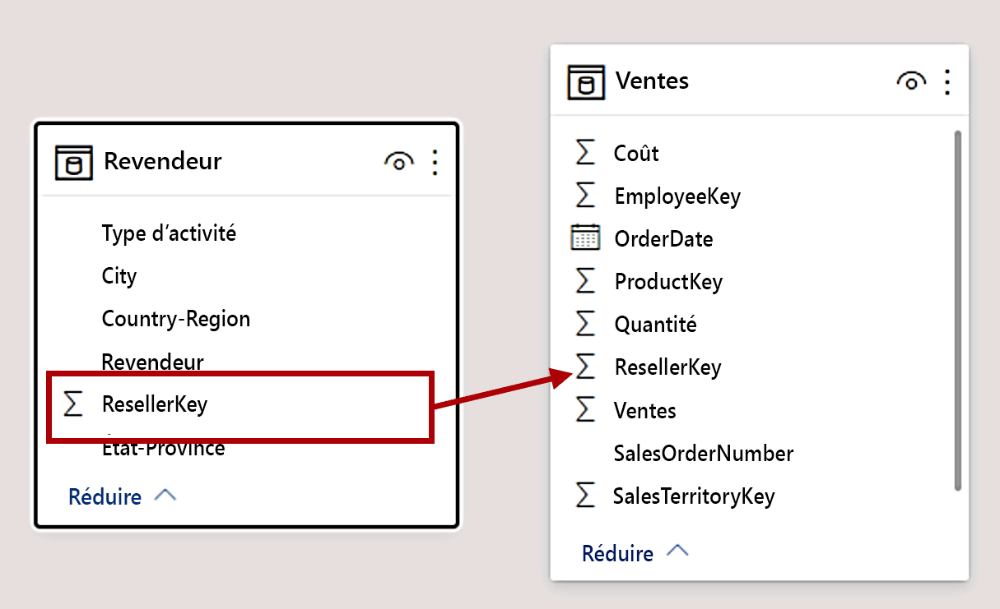

    *Conseil : Parfois, il est impossible de faire glisser une colonne. Dans ce cas, sélectionnez une autre colonne, puis resélectionnez la colonne que vous souhaitez faire glisser et réessayez. Assurez-vous que vous voyez la nouvelle relation ajoutée au diagramme.*

24. Créez la nouvelle technique pour créer les deux relations modèle suivantes :

    - **Region \| SalesTerritoryKey** vers **Sales \| SalesTerritoryKey**

    - **Salesperson \| EmployeeKey** vers **Sales \| EmployeeKey**

    *Dans ce labo, les tables **SalespersonRegion** et **Targets** restent déconnectées. Il existe une relation plusieurs-à-plusieurs entre les vendeurs et les régions, et vous utiliserez ce scénario avancé dans le labo **Modéliser les données dans Power BI Desktop (Partie 2)** .*

25. Dans le diagramme, organisez les tables de manière à ce que la table **Sales** soit placée au centre du diagramme et que les tables associées soient disposées autour d'elle. Placez les tables déconnectées sur le côté.

    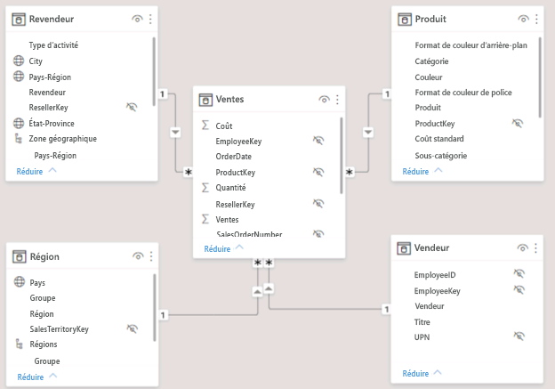

26. Enregistrez le fichier Power BI Desktop.

## **Exercice 2 : Configurer les tables**

Dans cet exercice, vous allez configurer toutes les tables. Pour cela, vous allez créer des hiérarchies et masquer, mettre en forme et catégoriser les colonnes.

### **Tâche 1 : Configurer la table Product**

Dans cette tâche, vous allez configurer la table **Product**.

1. Dans la vue Modèle, dans le volet **Champs**, si nécessaire, développez la table **Product**.

2. Pour créer une hiérarchie, dans le volet **Champs**, cliquez avec le bouton droit sur la colonne **Category**, puis sélectionnez **Créer une hiérarchie**.

    

3. Dans le volet **Propriétés** (à gauche du volet **Champs**), dans la zone **Nom**, remplacez le texte par **Products**.

    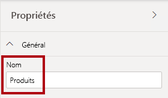

4. Pour ajouter le deuxième niveau à la hiérarchie, dans le volet **Propriétés**, dans la liste déroulante **Hiérarchie**, faites défiler vers le bas et sélectionnez **Subcategory**.

5. Pour ajouter le troisième niveau à la hiérarchie, dans la liste déroulante **Hiérarchie**, sélectionnez **Product**.

6. Pour terminer la conception de la hiérarchie, cliquez sur **Appliquer les changements de niveau**.

    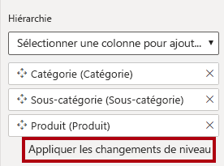

    *Conseil : N’oubliez pas de cliquer sur **Appliquer les modifications de niveau**. Il est courant d’oublier cette étape.*

7. Dans le volet **Champs**, notez la hiérarchie **Products**.

    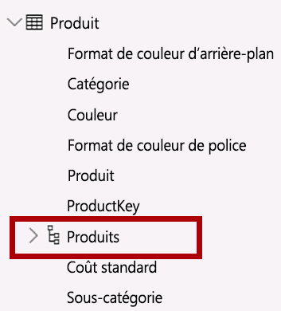

8. Pour faire apparaître les niveaux de hiérarchie, développez la hiérarchie **Products**.

    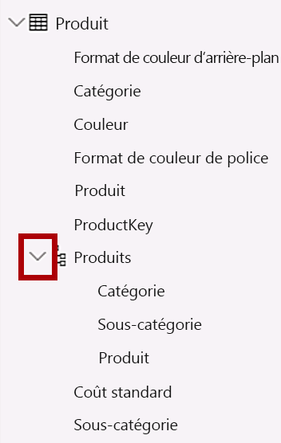

9. Pour organiser les colonnes dans un dossier d’affichage, dans le volet **Champs**, sélectionnez d’abord la colonne **Background Color Format**.

10. Tout en appuyant sur la touche **Ctrl**, sélectionnez la colonne **Font Color Format**.

11. Dans la zone **Dossier d’affichage** du volet **Propriétés**, entrez **Mise en forme**.

    

12. Dans le volet **Champs**, notez que les deux colonnes se trouvent désormais dans un dossier.

    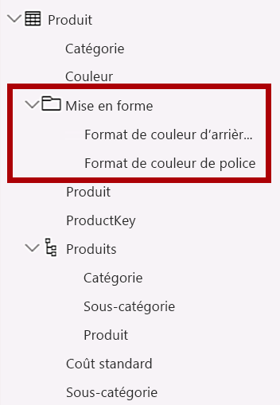

    *Les dossiers d’affichage sont un excellent moyen de désencombrer les tables, en particulier celles qui contiennent un grand nombre de champs.*

### **Tâche 2 : Configurer la table Region**

Dans cette tâche, vous allez configurer la table **Region**.

1. Dans la table **Region**, créez une hiérarchie nommée **Region** avec les trois niveaux suivants :

    - Group

    - Country

    - Région

    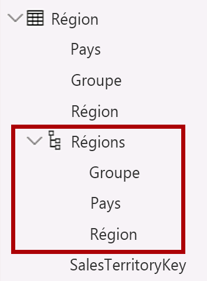

2. Sélectionnez la colonne **Country** (pas le niveau de hiérarchie **Country**).

3. Dans le volet **Propriétés**, développez la section **Avancé** (en bas du volet), puis dans la liste déroulante **Catégorie de données**, sélectionnez **Country/Region**.

    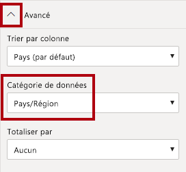

    *La catégorisation des données peut fournir des indications au concepteur de rapports. Dans ce cas, le fait de placer la colonne dans la catégorie Country/Region permet de fournir des informations plus précises à Power BI pour le rendu d’une visualisation de carte.*

### **Tâche 3 : Configurer la table Reseller**

Dans cette tâche, vous allez configurer la table **Reseller**.

1. Dans la table **Reseller**, créez une hiérarchie nommée **Resellers** avec les deux niveaux suivants :

    - Business Type

    - Reseller

    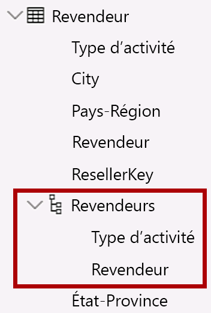

2. Créez une deuxième hiérarchie nommée **Geography** avec les quatre niveaux suivants :

    - Country-Region

    - État-Province

    - City

    - Reseller

    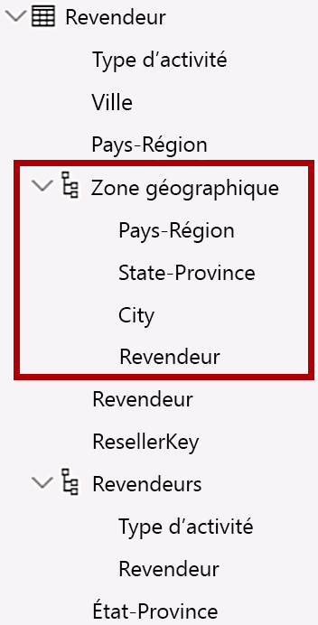

3. Catégorisez les trois colonnes suivantes :

    - **Country-Region** dans la catégorie **Pays/Région**

    - **State-Province** dans la catégorie **Département ou province**

    - **City** dans la catégorie **Ville**

### **Tâche 4 : Configurer la table Sales**

Dans cette tâche, vous allez configurer la table **Sales**.

1. Dans la table **Sales**, sélectionnez la colonne **Cost**.

2. Dans la zone **Description** du volet **Propriétés**, entrez : **Based on standard cost**

    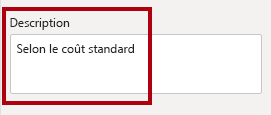

    *Les descriptions peuvent être appliquées aux tables, aux colonnes, aux hiérarchies ou aux mesures. Dans le volet **Champs**, le texte de la description apparaît dans une info-bulle quand un auteur de rapport place son curseur sur le champ.*

3. Sélectionnez la colonne **Quantity**.

4. Dans la section **Mise en forme** du volet **Propriétés**, faites passer la propriété **Séparateur de milliers** en position **Activé**.

    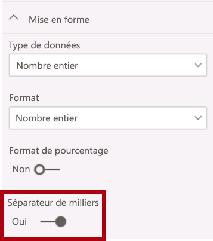

5. Sélectionnez la colonne **Unit Price**.

6. Dans la section **Mise en forme** du volet **Propriétés**, faites passer la propriété **Nombre de décimales** en position **2**.

7. Dans la liste déroulante **Totaliser par** du groupe **Avancé** (vous devrez peut-être faire défiler la page pour y accéder), sélectionnez **Moyenne**.

    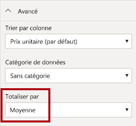

    *Par défaut, les colonnes numériques sont totalisées en additionnant les valeurs. Ce comportement par défaut ne convient pas à une colonne comme **Unit Price** qui représente un taux. Le fait de choisir une moyenne comme méthode de totalisation par défaut produit un résultat significatif.*

### **Tâche 5 : Mettre à jour en bloc les propriétés**

Dans cette tâche, vous allez mettre à jour plusieurs colonnes à l’aide une seule mise à jour en bloc. Vous suivrez cette approche pour masquer les colonnes et mettre en forme les valeurs des colonnes.

1. Dans le volet **Champs**, sélectionnez la colonne **Product \| ProductKey**.

2. Tout en appuyant sur la touche **Ctrl**, sélectionnez les 13 colonnes suivantes (couvrant plusieurs tables) :

    - Region \| SalesTerritoryKey

    - Reseller \| ResellerKey

    - Sales \| EmployeeKey
    
    - Sales \| ProductKey

    - Sales \| ResellerKey

    - Sales \| SalesOrderNumber

    - Sales \| SalesTerritoryKey

    - Salesperson \| EmployeeID

    - Salesperson \| EmployeeKey

    - Salesperson \| UPN

    - SalespersonRegion \| EmployeeKey

    - SalespersonRegion \| SalesTerritoryKey

    - Targets \| EmployeeID

3. Dans le volet **Propriétés**, faites passer la propriété **Est masqué** en poisition **Activé**.

    

    *Les colonnes ont été masquées, car elles sont utilisées par des relations ou sont utilisées dans la configuration de sécurité au niveau des lignes ou dans la logique de calcul.*

    *Vous définirez la sécurité au niveau des lignes dans le labo **Modéliser les données dans Power BI Desktop (partie 2)** , en utilisant la colonne **UPN**. Vous utiliserez le **SalesOrderNumber** pour un calcul dans le labo **Créer des calculs DAX dans Power BI Desktop (partie 1)** .*

4. Sélectionnez les trois colonnes suivantes (sélection multiple) :

    - Product \| Standard Cost

    - Sales \| Cost

    - Sales \| Sales

5. Dans la section **Mise en forme** du volet **Propriétés**, définissez la propriété **Nombre de décimales** avec la valeur **0** (zéro).

    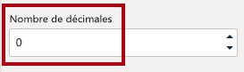

## **Exercise 3 : Passer en revue l’interface du modèle**

Dans cet exercice, vous allez passer à la vue Rapport et examiner l’interface du modèle.

### **Tâche 1 : Examiner l’interface du modèle**

Dans cette tâche, vous allez passer à la vue Rapport et examiner l’interface du modèle.

1. Passez à la vue Rapport.

2. Dans le volet **Champs**, notez les points suivants :

    - Les colonnes, les hiérarchies et leurs niveaux sont des champs qui peuvent être utilisés pour configurer des visuels de rapport

    - Seuls les champs applicables à la création de rapports sont visibles.

    - La table **SalespersonRegion** n’est pas visible, car tous ses champs sont masqués

    - Les champs spatiaux dans les tables **Region** et **Reseller** sont ornés d’une icône spatiale.

    - Les champs ornés du symbole sigma (Ʃ) sont totalisés par défaut.

    - Une info-bulle apparaît quand vous placez le curseur sur le champ **Sales \| Cost**

3. Développez le champ **Sales \| OrderDate**, puis notez qu’il révèle une hiérarchie de dates.

    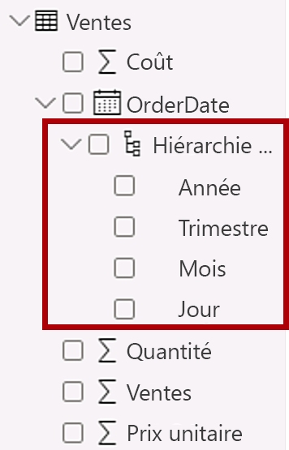

    *Le champ **Targets \| TargetMonth** présente une hiérarchie similaire. Ces hiérarchies n’ont pas été créées par vous. Elles sont créées automatiquement. Il y a toutefois un problème. L’exercice comptable d’Adventure Works commence le 1er juillet de chaque année. En revanche, l’année de la hiérarchie de dates qui est créée automatiquement commence le 1er janvier de l’année.*

    *Vous allez maintenant désactiver ce comportement automatique. Dans le labo **Créer des calculs DAX dans Power BI Desktop (partie 1)** , vous utiliserez DAX pour créer une table de dates et vous la configurerez pour définir le calendrier Adventure Works.*

4. Pour désactiver Date/heure automatique, cliquez sur l’onglet de ruban **Fichier** pour ouvrir le mode Backstage.

5. Sur la gauche, sélectionnez **Options et paramètres**, puis sélectionnez **Options**.

    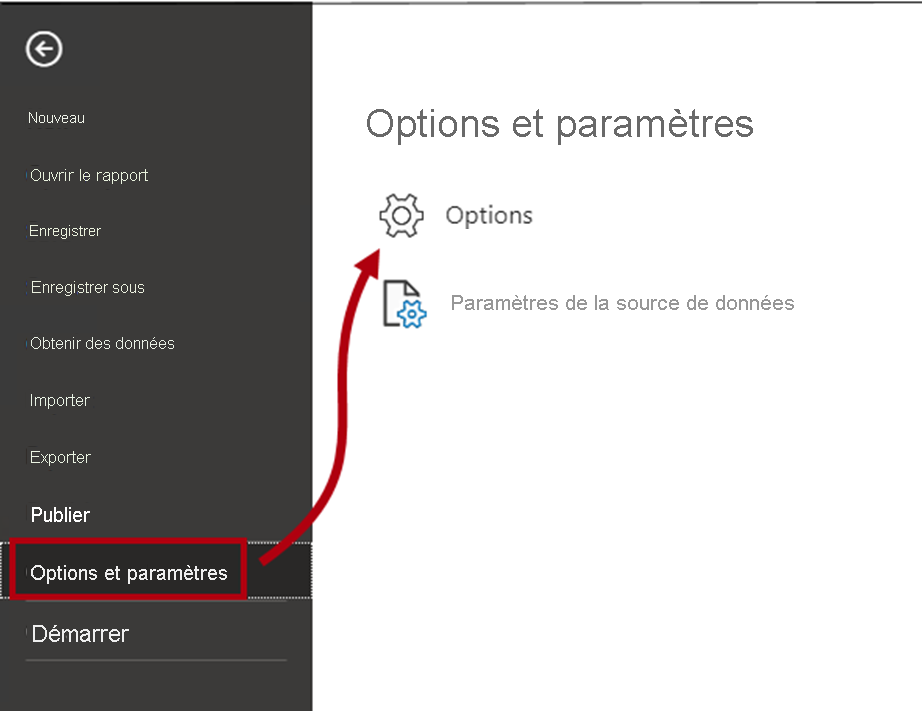

6. Dans la fenêtre **Options**, à gauche, dans le groupe **Fichier actif**, sélectionnez **Chargement des données**.

    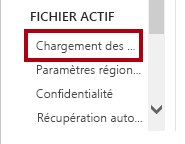

7. Dans la section **Time Intelligence**, décochez **Date/heure automatique**.

    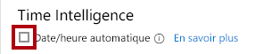

8. Cliquez sur **OK**.

    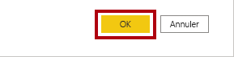

9. Dans le volet **Champs**, vous pouvez noter que les hiérarchies de dates ne sont plus disponibles.

    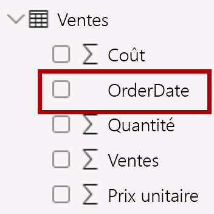

### **Tâche 2 : Terminer**

Dans cette tâche, vous terminez le labo.

1. Enregistrez le fichier Power BI Desktop.

2. Si vous êtes invité à appliquer des requêtes, cliquez sur **Appliquer plus tard**.

3. Si vous avez l’intention de démarrer le labo suivant, laissez Power BI Desktop ouvert.

    *Vous allez améliorer le modèle de données en configurant une relation plusieurs-à-plusieurs et une sécurité au niveau des lignes dans le labo **Modéliser les données dans Power BI Desktop (partie 2)** .*
