---
lab:
  title: Concevoir un rapport dans Power BI Desktop, partie 1
  module: Module 7 - Create Reports
ms.openlocfilehash: 952409822e622f744edcaef603bea5058670c3e8
ms.sourcegitcommit: 40a8c8608a0adde23300c2b6833db02193f36dfe
ms.translationtype: HT
ms.contentlocale: fr-FR
ms.lasthandoff: 06/04/2022
ms.locfileid: "146072493"
---
# **Concevoir un rapport dans Power BI Desktop (partie 1)**

**La durée estimée pour effectuer ce tutoriel est de 45 minutes.**

Dans ce labo, vous allez créer un rapport de trois pages. Vous publierez ensuite ce rapport dans Power BI, puis vous l'ouvrirez et interagirez avec lui.

Dans ce labo, vous allez découvrir comment :

- Créer un rapport

- Configurer les champs visuels et les propriétés de mise en forme

### **Histoire du labo**

Ce labo est l’un des nombreux labos d’une série qui a été conçue comme une histoire complète allant de la préparation des données jusqu’à leur publication sous forme de rapports et de tableaux de bord. Vous pouvez effectuer ces labos dans l’ordre de votre choix. Toutefois, si vous comptez faire plusieurs labos, pour les dix premiers d’entre eux, nous vous suggérons de suivre cet ordre :

1. Préparer des données dans Power BI Desktop

2. Charger des données dans Power BI Desktop

3. Modéliser les données dans Power BI Desktop

5. Créer des calculs DAX dans Power BI Desktop (partie 1)

6. Créer des calculs DAX dans Power BI Desktop (partie 2)

7. **Concevoir un rapport dans Power BI Desktop (partie 1)**

8. Concevoir un rapport dans Power BI Desktop, partie 2

9. Créer un tableau de bord Power BI

10. Analyser les données dans Power BI Desktop

11. Appliquer la sécurité au niveau des lignes

## **Exercice 1 : Créer un rapport**

Dans cet exercice, vous allez créer un rapport de trois pages intitulé **État des ventes**.

### **Tâche 1 : Démarrer – Se connecter**

Dans cette tâche, vous configurez l’environnement nécessaire pour le labo en vous connectant à Power BI.

*Important : Si vous vous êtes déjà connecté à Power BI précédemment, passez directement à la tâche suivante.*

1. Pour ouvrir Microsoft Edge, dans la barre des tâches, cliquez sur le raccourci du programme Microsoft Edge.

    

1. Dans la fenêtre du navigateur Microsoft Edge, accédez à **https://powerbi.microsoft.com**.

    *Conseil : Vous pouvez également utiliser le favori Service Power BI dans la barre des favoris Microsoft Edge.*

1. Cliquez sur **Se connecter** (en haut à droite).

    

1. Entrez les détails du compte que l’on vous a fournis (consultez les **ressources**).

1. Si vous êtes invité à mettre à jour le mot de passe, entrez à nouveau le mot de passe fourni, puis entrez et confirmez un nouveau mot de passe.

    *Important : N’oubliez pas de noter votre nouveau mot de passe quelque part.*

1. Terminez le processus de connexion.

1. Si Microsoft Edge vous invite à rester connecté, sélectionnez **Oui**.

1. Laissez la fenêtre du navigateur Microsoft Edge ouverte.

### **Tâche 2 : Démarrage : Activer le mappage et les visuels de carte choroplèthe**

Dans cette tâche, vous allez activer le mappage et les visuels de carte choroplèthe dans l’environnement du labo en mettant à jour les paramètres d’intégration dans le portail administration Power BI. 

1. Pour ouvrir le portail administration Power BI, en haut à droite du navigateur, cliquez sur l’icône **Paramètres**.

    

1. Sélectionnez **Portail d’administration**.

    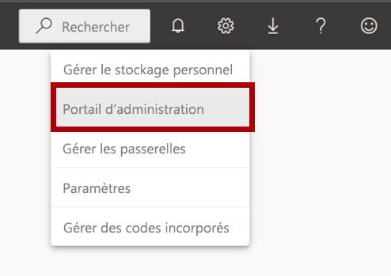

1. Faites défiler la page vers le bas vers les paramètres d’intégration. Cliquez sur la flèche pour développer l’option mappage et visuels de carte choroplèthe.

    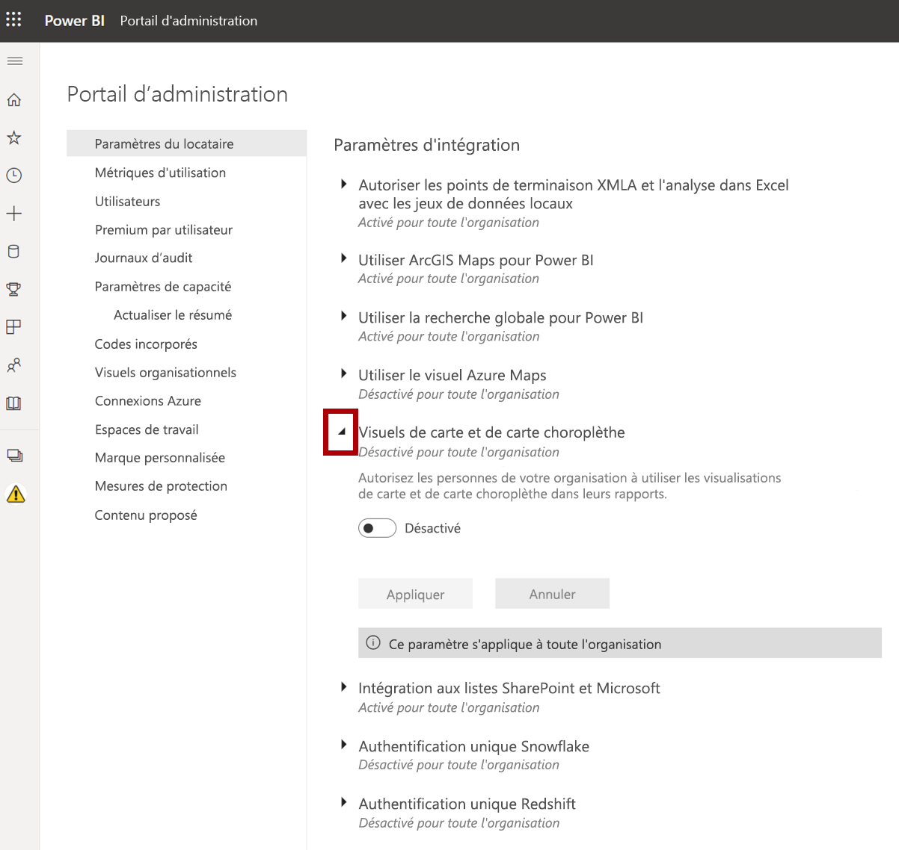

1. Définissez l’option mappage et les visuels de carte choroplèthe sur **Activé**.

1. Cliquez sur **Appliquer** pour appliquer les modifications. 

    

1. Un message s’affiche en haut à droite du navigateur indiquant que les modifications apportées aux paramètres du locataire seront appliquées au cours des 15 prochaines minutes. 

    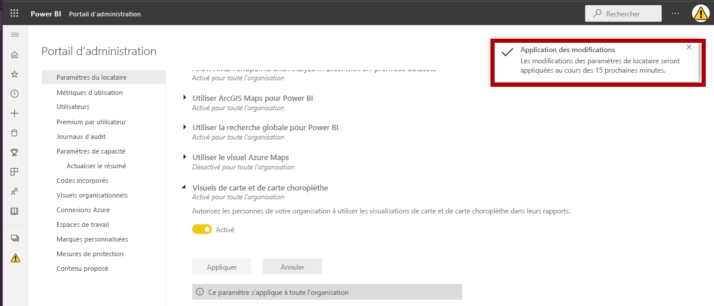

1. Laissez la fenêtre du navigateur Microsoft Edge ouverte.

### **Tâche 3 : Démarrer : Ouvrir un rapport**

Dans cette tâche, vous configurez l’environnement pour le labo en ouvrant le rapport de démarrage.

*Important : Si vous venez d’effectuer le labo précédent (et que vous l’avez entièrement terminé), ignorez cette tâche et passez directement à la tâche suivante.*

1. Pour ouvrir Power BI Desktop, accédez à la barre des tâches et cliquez sur le raccourci Microsoft Power BI Desktop.

    

2. Pour fermer la fenêtre de démarrage, en haut à gauche de cette fenêtre, sélectionnez **X**.

    

3. Pour vous connecter au service Power BI, cliquez sur **Se connecter** en haut à droite.

    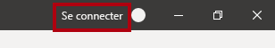

4. Terminez le processus de connexion en utilisant le même compte que celui utilisé pour vous connecter au service Power BI.

5. Pour ouvrir le fichier Power BI Desktop de démarrage, sélectionnez l’onglet de ruban **Fichier** afin de passer en mode Backstage.

6. Sélectionnez **Ouvrir un rapport**.

    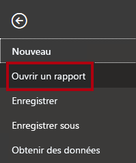

7. Cliquez sur **Parcourir les rapports**.

    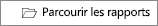

8. Dans la fenêtre **Ouvrir**, accédez au dossier **D:\PL300\Labs\06-design-report-in-power-bi-desktop\Starter**.

9. Sélectionnez le fichier **Sales Analysis** (Analyse des ventes).

10. Cliquez sur **Ouvrir**.

    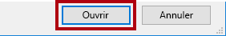

11. Fermez toutes les fenêtres d’information qui se sont éventuellement ouvertes.

12. Pour créer une copie du fichier, sélectionnez l’onglet de ruban **Fichier** afin de passer en mode Backstage.

13. Sélectionnez **Enregistrer sous**.

    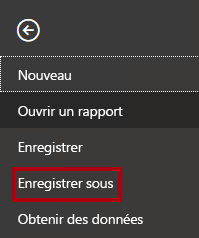

14. Si vous êtes invité à appliquer les modifications, cliquez sur **Appliquer**.

    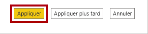

15. Dans la fenêtre **Enregistrer sous**, accédez au dossier **D:\PL300\MySolution**.

16. Cliquez sur **Enregistrer**.

    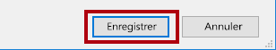

### **Tâche 4 : Conception de page 1**

Au cours de cette tâche, vous allez créer la première page du rapport. Une fois créée, la page se présentera comme suit :

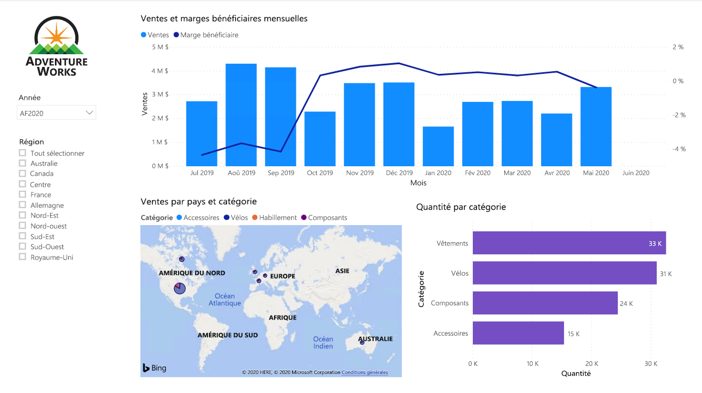

1. Dans Power BI Desktop, pour renommer la page, en bas à gauche, cliquez avec le bouton droit sur **Page 1**, puis sélectionnez **Renommer**.

    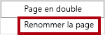

    *Conseil : Vous pouvez également double-cliquer sur le nom de la page pour la renommer.*

2. Remplacez le nom de la page par **Présentation**, puis appuyez sur **Entrée**.

    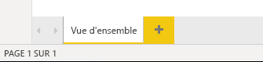

3. Pour ajouter une image, sous l'onglet **Insérer** du ruban, accédez au groupe **Éléments**, puis cliquez sur **Image**.

    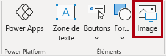

4. Dans la fenêtre **Ouvrir**, accédez au dossier **D:\PL300\Resources**.

5. Sélectionnez le fichier **AdventureWorksLogo.jpg**, puis cliquez sur **Ouvrir**.

    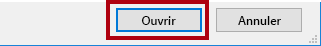

6. Faites glisser l'image pour la positionner dans le coin supérieur gauche, et faites glisser les marqueurs du guide pour la redimensionner.

    

7. Pour ajouter un segment, commencez par désélectionner l'image en cliquant sur une zone vide de la page du rapport.
8. Dans le volet **Champs**, sélectionnez le champs **Date \| Year** (et non le niveau **Année** de la hiérarchie).
    
    *Les labos utilisent une notation abrégée pour référencer un champ. Voici le résultat : **Date \| Year**. Dans cet exemple, **Date** est le nom de la table et **Year** correspond au nom du champ.*

9. Notez qu’une table des valeurs de l’année a été ajoutée à la page du rapport.

10. Pour convertir le visuel d’une table en segment, dans le volet **Visualisations**, sélectionnez le **Segment**.

    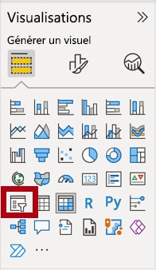

11. Pour convertir le segment d’une liste en liste déroulante, en haut à droite du segment, cliquez sur la flèche vers le bas, puis sélectionnez **Liste déroulante**.

    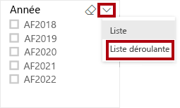

12. Redimensionnez et positionnez le segment de façon à ce qu’il se trouve sous l’image et soit de la même largeur que l’image.

    

13. Dans le segment **Année**, ouvrez la liste déroulante, sélectionnez **FY2020**, puis réduisez la liste déroulante.

    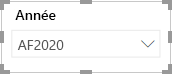

    *La page de rapport est maintenant filtrée sur l’année **FY2020**.*

14. Désélectionnez le segment en cliquant sur une zone vide de la page de rapport.

15. Créez un deuxième segment, en fonction du champ **Region \| Region** (et non du niveau **Région** de la hiérarchie).

16. Laissez le segment sous forme de liste, puis redimensionnez et positionnez le segment sous le segment **Année**.

    

21. Désélectionnez le segment en cliquant sur une zone vide de la page de rapport.

22. Pour ajouter un graphique à la page, dans le volet **Visualisations**, cliquez sur le type de visuel **Ligne et histogramme empilé**.

    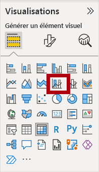

23. Redimensionnez et positionnez le visuel de façon à ce qu’il se trouve à droite du logo et qu’il remplisse la largeur de la page de rapport.

    

24. Faites glisser les champs suivants dans le visuel :

    - Date \| Month

    - Sales \| Sales

25. Dans le volet des champs du visuel (et non dans le volet **Champs**, le volet des champs du visuel se trouve sous le volet **Visualisations**), notez que les champs sont affectés aux barres d’outils/zones **Axe X** et **Colonne axe Y**.

    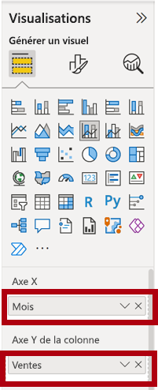

    *Si vous faites glisser des champs dans un visuel, ils sont ajoutés aux barres d’outils/zones par défaut. Pour préciser, vous pouvez faire glisser des champs directement dans les barres d’outils/zones, comme vous allez le faire maintenant.*

26. Dans le volet **Champs**, faites glisser le champ **Ventes \| Marge bénéficiaire** dans la barre d’outils/zone **Ligne axe Y**.

    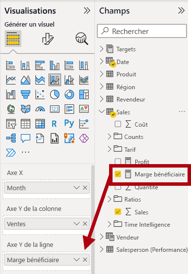

27. Notez que le visuel ne contient que 11 mois.

    *Le dernier mois de l’année, juin 2020, ne dispose (encore) d’aucune vente. Par défaut, le visuel a éliminé les mois avec des ventes VIERGES. Vous allez maintenant configurer le visuel pour afficher tous les mois.*

28. Dans le volet des champs du visuel, dans la barre d’outils/zone **Axe X**, pour le champ **Mois**, cliquez sur la flèche vers le bas, puis sélectionnez **Afficher les éléments sans données**.

    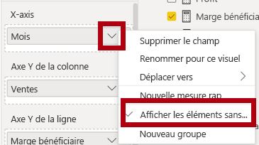

29. Notez que le mois **Juin 2020** s’affiche.

30. Désélectionnez le graphique en cliquant sur une zone vide de la page de rapport.

31. Pour ajouter un graphique à la page, dans le volet **Visualisations**, cliquez sur le type de visuel **Carte**.

    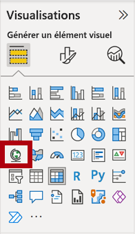

32. Redimensionnez et positionnez le visuel de façon à ce qu’il se trouve sous le graphique en colonnes/courbes et qu’il remplisse la moitié de la largeur de la page de rapport.

    

33. Ajoutez les champs suivants aux barres d’outils/zones des visuels :

    - Emplacement : **Region \| Country**

    - Légende : **Product \| Category**

    - Taille : **Sales \| Sales**

34. Désélectionnez le graphique en cliquant sur une zone vide de la page de rapport.

35. Pour ajouter un graphique à la page, dans le volet **Visualisations**, cliquez sur le type de visuel **Graphique à barres empilées**.

    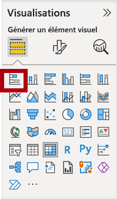

36. Redimensionnez et positionnez le visuel pour qu’il remplisse l’espace de page de rapport restant.

    

37. Ajoutez les champs suivants aux barres d’outils/zones des visuels :

    - Axe : **Product \| Category**

    - Valeur : **Sales \| Quantity**

38. Pour mettre en forme le visuel, ouvrez le volet **Format**.

    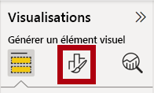

39. Développez le groupe **Barres** puis **Couleurs**, puis affectez à la propriété **Couleur par défaut** une couleur appropriée (par opposition au graphique en courbes/histogrammes).

40. Définissez la propriété **Étiquettes de données** sur **Activé**.

    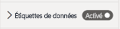

41. Enregistrez le fichier Power BI Desktop.

    *La conception de la première page est maintenant terminée.*

### **Tâche 5 : Conception de page 2**

Dans cette tâche, vous allez créer la deuxième page du rapport. Une fois créée, la page se présentera comme suit :

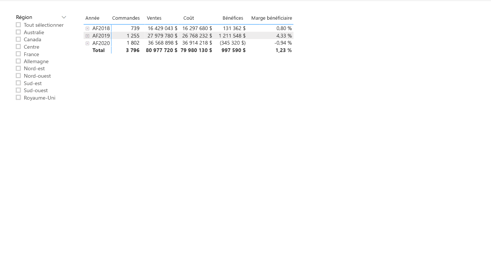

*Important : Des instructions détaillées ayant déjà été fournies dans les labos, les étapes du labo vont faire l’objet d’instructions plus concises. Si vous avez besoin d’instructions détaillées, vous pouvez vous reporter aux tâches antérieures dans ce labo.*

1. Pour créer une page, cliquez sur l’icône en bas à gauche.

    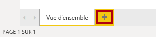

2. Renommez la page en **Bénéfices**.

    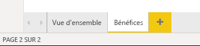

  

3. Ajoutez un segment en fonction du champ **Region \| Region**.

4. Utilisez le volet **Format** pour activer l’option « Sélectionner tout » (dans le groupe **Sélection**).

5. Redimensionnez et positionnez le segment de manière à ce qu’il se trouve à gauche de la page de rapport et qu’il soit de la moitié de la hauteur de la page.

    

6. Ajoutez un visuel de matrice, puis redimensionnez-le et positionnez-le de sorte qu’il remplisse l’espace restant de la page de rapport

    

7. Ajoutez la hiérarchie **Date \| Fiscal** à la barre d’outils/zone **Lignes** de la matrice.

    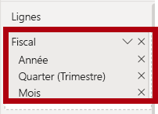

8. Ajoutez les cinq champs de table **Ventes** suivants à la barre d’outils/zone **Valeurs** :

    - Commandes (du dossier **Comptes**)

    - Ventes

    - Coût

    - Bénéfices

    - Marge de bénéfice

    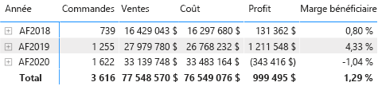

9. Dans le volet **Filtres** (situé à gauche du volet **Visualisations**), remarquez la barre d’outils/zone **Filtre sur cette page** (vous devrez peut-être faire défiler vers le bas).

    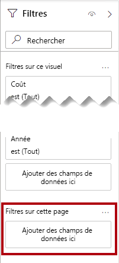

10. Depuis le volet **Champs**, faites glisser le champ **Produit \| Catégorie** dans la barre d’outils/zone **Filtre sur cette page**.

11. À l’intérieur de la carte de filtre, en haut à droite, cliquez sur la flèche pour réduire la carte.

    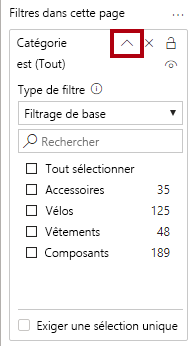

    *Les champs ajoutés au volet **Filtres** peuvent obtenir le même résultat qu’un segment. L’une des différences est qu’ils n’occupent pas de place sur la page de rapport. Une autre différence est qu’ils peuvent être configurés pour remplir des exigences de filtrage plus sophistiquées.*

12. Ajoutez chacun des champs de table **Produit** suivants à la barre d’outils/zone **Filtre sur cette page**, en les réduisant, directement sous la carte **Catégorie** :

    - Sous-catégorie

    - Produit

    - Couleur

    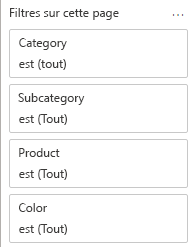

13. Enregistrez le fichier Power BI Desktop.

    *La conception de la deuxième page est maintenant terminée.*

### **Tâche 6 : Conception de page 3**

Dans cette tâche, vous allez concevoir la troisième page du rapport, qui est aussi la dernière. Une fois créée, la page se présentera comme suit :

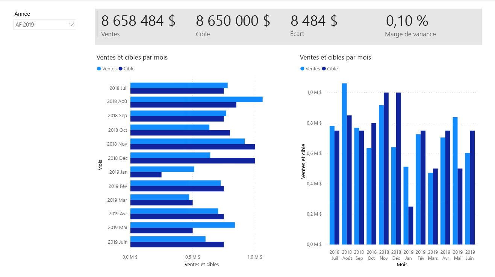

1. Créez une page, puis renommez-la **Mes performances**.

1. Pour simuler les performances des filtres de sécurité au niveau des lignes, faites glisser le champ **Salesperson (Performance) \| Salesperson** vers les filtres au niveau de la page dans le volet de filtre.
    
    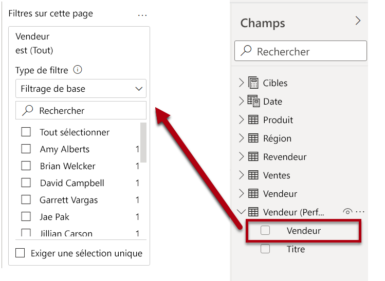 

1. Sélectionnez **Michael Blythe**. Les données de la page de rapport **Mes performances** seront désormais filtrées pour afficher les données pour Michael Blythe uniquement.

1. Ajoutez un segment de liste déroulante au champ **Date \| Year**, puis redimensionnez-le et positionnez-le afin qu’il se trouve dans l’angle supérieur gauche de la page.

    

1. Dans le segment, définissez le filtre de la page sur **FY2019** (Exercice 2019).

    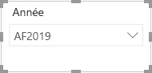

1. Ajoutez un visuel **Carte à plusieurs lignes**, puis redimensionnez-le et repositionnez-le pour qu’il se trouve à droite du segment et remplisse la largeur restante de la page.

    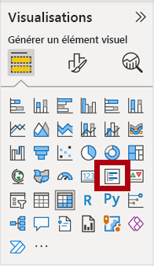

    

1. Ajoutez les quatre champs suivants au visuel :

    - Sales \| Sales

    - Targets \| Target

    - Targets \| Variance

    - Targets \| Variance Margin

1. Mettez le visuel en forme :

    - Dans le groupe **Valeurs de légende**, augmentez la propriété **Taille du texte** à **28pt**

    - Dans le groupe **Arrière-plan**, définissez la **Couleur** sur une couleur gris clair

    

1. Ajoutez un visuel **Graphique à barres en cluster**, puis redimensionnez-le et positionnez-le afin qu’il se trouve sous le visuel de la carte à plusieurs lignes, et qu’il remplisse la hauteur restante de la page et la moitié de la largeur du visuel de la carte à plusieurs lignes.

    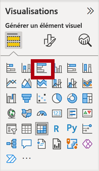

    

1. Ajoutez les champs suivants aux barres d’outils/zones des visuels :

    - Axe : **Date \| Mois**

    - Valeur : **Ventes \| Ventes** et **Cibles \| Cible**

    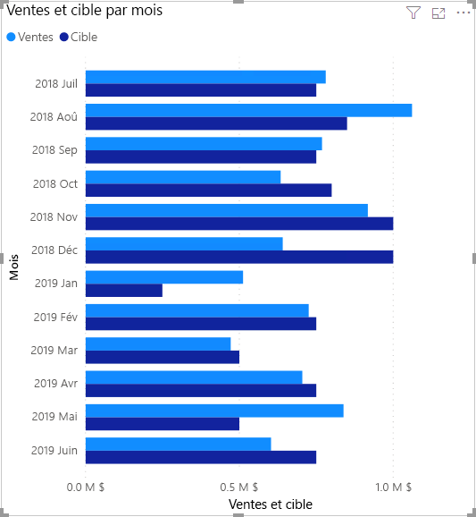

1. Pour créer une copie du visuel, appuyez sur **Ctrl + C**, puis sur **Ctrl + V**.

1. Placez le nouveau visuel à droite du visuel d’origine.

    

1. Pour modifier le type de visualisation, dans le volet **Visualisations**, sélectionnez **Graphique en colonnes en cluster**.

    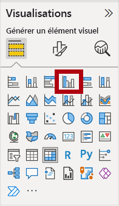

    *Il est désormais possible de voir les mêmes données exprimées par deux types de visualisations différents. Ce n’est pas une bonne utilisation de la mise en page, mais vous pourrez l’améliorer dans le labo **Concevoir un rapport dans Power BI Desktop (partie 2)** , en superposant les éléments visuels. En ajoutant des boutons à la page, vous permettrez à l’utilisateur du rapport de choisir lequel des deux visuels il préfère voir.*

    *La conception de la troisième et dernière page est maintenant terminée.*

### **Tâche 7 : Publier le rapport**

Dans cette tâche, vous allez publier le rapport.

1. Sélectionnez la page **Vue d’ensemble**.

2. Enregistrez le fichier Power BI Desktop.

3. Sous l’onglet de ruban **Accueil**, dans le groupe **Partager**, cliquez sur **Publier**.

    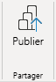

4. Dans la fenêtre **Publier sur Power BI**, notez que **Mon espace de travail** est sélectionné.

5. Pour publier le rapport, cliquez sur **Sélectionner**.

    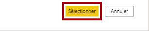

6. Une fois la publication réussie, cliquez sur **OK**.

    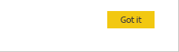

7. Laissez Power BI Desktop ouvert.

    *Dans l’exercice suivant, vous allez explorer le rapport dans le service Power BI.*

## **Exercice 2 : Explorer le rapport**

Dans cet exercice, vous allez explorer le rapport qui a été publié sur Power BI.

### **Tâche 1 : Explorer le rapport**

Dans cet tâche, vous allez explorer le rapport qui a été publié sur Power BI.

1. Dans la fenêtre du navigateur Microsoft Edge, dans le service Power BI, dans le volet **Navigation** (situé à gauche et éventuellement réduit), développez **Mon espace de travail**.

    

2. Examinez le contenu de l’espace de travail, et plus particulièrement le rapport et le jeu de données **Sales Analysis** (Analyse des ventes).

    *Lorsque vous avez précédemment publié le fichier Power BI Desktop, le modèle de données a été publié en tant que jeu de données.*

    *Si vous ne le voyez pas, appuyez sur **F5** pour actualiser le navigateur, puis redéveloppez l’espace de travail.*

    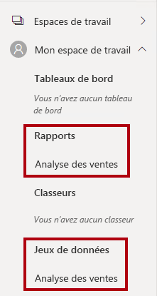

3. Pour ouvrir le rapport, sélectionnez le rapport **Sales Analysis** (Analyse des ventes).

4. À gauche, dans le volet **Pages**, sélectionnez la page **Vue d’ensemble**. 

5. Dans le segment **Régions**, tout en appuyant sur la touche **Ctrl**, sélectionnez plusieurs régions.

6. Dans le graphique en colonnes ou à lignes, sélectionnez une colonne de mois pour appliquer un filtre croisé sur la page.

7. Tout en appuyant sur la touche **Ctrl**, sélectionnez un mois supplémentaire.

    *Par défaut, le filtre croisé filtre tous les autres visuels de la page.*

8. Notez que le graphique à barres est filtré et mis en surbrillance et la partie gras des barres représente les mois filtrés.

9. Placez le curseur sur le visuel du graphique à barres, puis en haut à droite, placez-le sur l’icône de filtre.

    

    *L’icône de filtre vous permet de comprendre tous les filtres qui sont appliqués au visuel, y compris les segments et les filtres croisés d’un autre visuel.*

10. Placez le curseur sur une barre, puis notez les informations de l’info-bulle.

11. Pour annuler le filtre croisé, dans le graphique en colonnes ou à lignes, cliquez sur une zone vide du visuel.

12. Placez le curseur sur le visuel de carte, puis en haut à droite, cliquez sur l’icône **Mode Focus**.

    

    *Le mode Focus effectue un zoom sur le visuel pour l’ajuster à la taille de la page entière.*

13. Placez le curseur sur différents segments des graphiques à barres pour afficher des info-bulles.

14. Pour revenir à la page du rapport, en haut à gauche, cliquez sur **Retour au rapport**.

    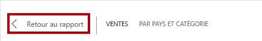

15. Replacez le curseur sur le visuel de carte, puis cliquez sur l’ellipse (...) en haut à droite et examinez les options de menu.

    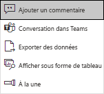

16. Essayez chacune des options, à l’exception de **Converser dans Teams**.

17. À gauche, dans le volet **Pages**, sélectionnez la page **Bénéfices**.

    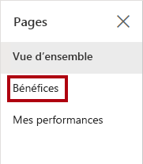

18. Notez que le segment **Région** a une sélection différente du segment **Région** de la page **Vue d’ensemble**.

    *Les segments ne sont pas synchronisés. Dans le labo **Concevoir un rapport dans Power BI Desktop (partie 2)** , vous modifierez la conception du rapport pour garantir la synchronisation des segments entre les pages.*

19. Dans le volet **Filtres** (situé à droite), développez une carte de filtre et appliquez des filtres.

    *Le volet **Filtres** vous permet de définir plus de filtres que ne peut en contenir une page en tant que segments.*

20. Dans le visuel matrice, utilisez le bouton plus (+) pour explorer en détail la hiérarchie **Fiscal**.

21. Sélectionnez la page **Mes performances**.

    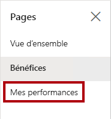

22. En haut à droite de la barre de menus, cliquez sur **Afficher**, puis sélectionnez **Plein écran**.

    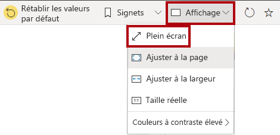

23. Interagissez avec la page en modifiant le segment et en appliquant un filtrage croisé à la page.

24. En bas à gauche de la fenêtre, remarquez les commandes permettant de changer de page, de revenir à la page précédente ou d’accéder à la page suivante, ou encore de quitter le mode plein écran.

25. Cliquez sur l’icône de gauche pour quitter le mode plein écran.

    

### **Tâche 2 : Terminer**

Dans cette tâche, vous terminez le labo.

1. Pour revenir à votre espace de travail, dans la bannière dans la page web de la fenêtre, cliquez sur **Mon espace de travail**.

    

2. Laissez la fenêtre du navigateur Microsoft Edge ouverte.

    *Vous améliorerez la conception du rapport avec des fonctionnalités avancées dans le labo **Concevoir un rapport dans Power BI Desktop (partie 2)** .*
