---
lab:
  title: Concevoir un rapport dans Power BI Desktop, partie 2
  module: Module 7 - Create Reports
ms.openlocfilehash: 113abb71cee132e348d3513f171efe6cec317046
ms.sourcegitcommit: f09183b2093a7f8de629f89b54d70bcad85598b6
ms.translationtype: HT
ms.contentlocale: fr-FR
ms.lasthandoff: 06/07/2022
ms.locfileid: "146109731"
---
# **Concevoir un rapport dans Power BI Desktop (partie 2)**

**La durée estimée pour effectuer ce tutoriel est de 45 minutes.**

Dans ce labo, vous allez améliorer le rapport **Sales Analysis** (Analyse des ventes) avec des fonctionnalités de conception avancées.

Dans ce labo, vous allez découvrir comment :

- Synchroniser les segments

- Créer une page d'extraction

- Appliquer une mise en forme conditionnelle

- Créer et utiliser des signets

### **Histoire du labo**

Ce labo est l’un des nombreux labos d’une série qui a été conçue comme une histoire complète allant de la préparation des données jusqu’à leur publication sous forme de rapports et de tableaux de bord. Vous pouvez effectuer ces labos dans l’ordre de votre choix. Toutefois, si vous comptez faire plusieurs labos, pour les dix premiers d’entre eux, nous vous suggérons de suivre cet ordre :

1. Préparer des données dans Power BI Desktop

2. Charger des données dans Power BI Desktop

3. Modéliser les données dans Power BI Desktop

5. Créer des calculs DAX dans Power BI Desktop (partie 1)

6. Créer des calculs DAX dans Power BI Desktop (partie 2)

7. Concevoir un rapport dans Power BI Desktop, partie 1

8. **Concevoir un rapport dans Power BI Desktop (partie 2)**

9. Créer un tableau de bord Power BI

10. Analyser les données dans Power BI Desktop

11. Appliquer la sécurité au niveau des lignes

## **Exercice 1 : Configurer des segments de synchronisation**

Dans cet exercice, vous allez synchroniser les segments de page de rapport.

### Tâche 1 : Démarrer – Se connecter

Dans cette tâche, vous configurez l’environnement nécessaire pour le labo en vous connectant à Power BI.

*Important : Si vous vous êtes déjà connecté à Power BI précédemment, passez directement à la tâche suivante.*

1. Pour ouvrir Microsoft Edge, dans la barre des tâches, cliquez sur le raccourci du programme Microsoft Edge.

    

1. Dans la fenêtre du navigateur Microsoft Edge, accédez à **https://powerbi.microsoft.com**.

    *Conseil : Vous pouvez également utiliser le favori Service Power BI dans la barre des favoris Microsoft Edge.*

1. Cliquez sur **Se connecter** (en haut à droite).

    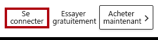

1. Entrez les détails du compte qui vous ont été fournis.

1. Si vous êtes invité à mettre à jour le mot de passe, entrez à nouveau le mot de passe fourni, puis entrez et confirmez un nouveau mot de passe.

    *Important : N’oubliez pas de noter votre nouveau mot de passe.*

1. Terminez le processus de connexion.

1. Si Microsoft Edge vous invite à rester connecté, sélectionnez **Oui**.

1. Dans la fenêtre du navigateur Microsoft Edge, dans le service Power BI, dans le volet **Navigation**, développez **Mon espace de travail**.

    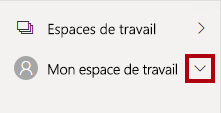

1. Laissez la fenêtre du navigateur Microsoft Edge ouverte.

### Tâche 2 : Démarrer – Ouvrir un rapport

Dans cette tâche, vous configurez l’environnement pour le labo en ouvrant le rapport de démarrage.

*Important : Si vous venez d’effectuer le labo précédent (et que vous l’avez entièrement terminé), ignorez cette tâche et passez directement à la tâche suivante.*

1. Pour ouvrir Power BI Desktop, accédez à la barre des tâches et cliquez sur le raccourci Microsoft Power BI Desktop.

    

2. Pour fermer la fenêtre de démarrage, en haut à gauche de cette fenêtre, sélectionnez **X**.

    

3. Pour vous connecter au service Power BI, cliquez sur **Se connecter** en haut à droite.

    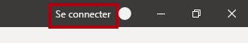

4. Terminez le processus de connexion en utilisant le même compte que celui utilisé pour vous connecter au service Power BI.

5. Pour ouvrir le fichier Power BI Desktop de démarrage, sélectionnez l’onglet de ruban **Fichier** afin de passer en mode Backstage.

6. Sélectionnez **Ouvrir un rapport**.

    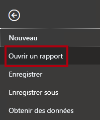

7. Cliquez sur **Parcourir les rapports**.

    

8. Dans la fenêtre **Ouvrir**, accédez au dossier **D:\PL300\Labs\07-design-report-in-power-bi-desktop-enhanced\Starter**.

9. Sélectionnez le fichier **Sales Analysis** (Analyse des ventes).

10. Cliquez sur **Ouvrir**.

    

11. Fermez toutes les fenêtres d’information qui se sont éventuellement ouvertes.

12. Pour créer une copie du fichier, sélectionnez l’onglet de ruban **Fichier** afin de passer en mode Backstage.

13. Sélectionnez **Enregistrer sous**.

    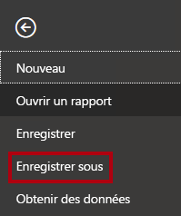

14. Si vous êtes invité à appliquer les modifications, cliquez sur **Appliquer**.

    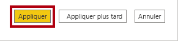

15. Dans la fenêtre **Enregistrer sous**, accédez au dossier **D:\PL300\MySolution**.

16. Cliquez sur **Enregistrer**.

    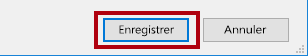

### **Tâche 3 : Synchroniser les segments**

Dans cette tâche, vous allez synchroniser les segments **Année** et **Région**.

*Vous poursuivrez le développement du nouveau rapport dans le labo **Concevoir un rapport dans Power BI Desktop (partie 1)** .*

1. Dans Power BI Desktop, dans la page **Vue d’ensemble**, définissez le segment **Year** (Année) sur **FY2018** (Exercice 2018).

2. Accédez à la page **Mes performances**, puis notez que le segment **Année** est une valeur différente.

    *Lorsque les segments ne sont pas synchronisés, cela peut contribuer à une représentation incorrecte des données et à la frustration pour les utilisateurs des rapports. Vous allez maintenant synchroniser les segments du rapport.*

3. Revenez à la page **Vue d’ensemble**, puis sélectionnez le segment **Year**.

4. Sous l’onglet de ruban **Affichage**, dans le groupe **Afficher les volets**, cliquez sur **Synchroniser les segments**.

    

5. Dans le volet **Synchroniser les segments** (à gauche du volet **Visualisations**), dans la deuxième colonne (qui représente la synchronisation), activez les cases à cocher **Vue d’ensemble** et **My Performance**.

    

6. Sur la page **Vue d’ensemble**, sélectionnez le segment **Région**.

7. Synchronisez le segment avec les pages **Vue d’ensemble** et **Profit**.

    

8. Testez la synchronisation des segments en sélectionnant d’autres options de filtre, puis en vérifiant que les segments synchronisés filtrent selon les mêmes options sélectionnées.

9. Pour fermer la page **Synchroniser les segments**, cliquez sur le **X** situé en haut à droite du volet.

    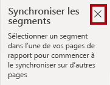

## **Exercice 2 : Configurer l’extraction**

Dans cet exercice, vous allez créer une page et la configurer en tant que page d’extraction. Une fois créée, la page se présentera comme suit :

### **Tâche 1 : Créer une page d’extraction**

Dans cette tâche, vous allez créer une page et la configurer comme page d’extraction.

1. Ajoutez une nouvelle page de rapport nommée **Détails du produit**.

    

2. Cliquez avec le bouton droit sur l’onglet de la page **Détails du produit**, puis sélectionnez **Masquer la page**.

    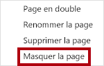

    *Les utilisateurs des rapports ne seront pas en mesure d’accéder directement à la page d’extraction. Ils doivent y accéder à partir de visuels sur d’autres pages. Vous allez apprendre à accéder à la page dans l’exercice final de ce labo.*

3. Sous le volet **Visualisations**, dans la section **Extraire**, ajoutez le champ **Product \| Category** à la zone **Ajouter des champs d'extraction ici**.

    *Les labos utilisent une notation abrégée pour référencer un champ. Voici le résultat : **Product \| Category**. Dans cet exemple, **Product** est le nom de la table et **Category** correspond au nom du champ.*

    

4. Pour tester la page d’extraction, dans la carte de filtre d’extraction, sélectionnez **Bikes**.

    

5. En haut à gauche de la page du rapport, notez le bouton fléché.

    

    *Un bouton est ajouté automatiquement quand un champ est ajouté à la barre d’outils/zone d’extraction. Il permet aux utilisateurs de rapport de revenir à la page à partir de laquelle ils ont lancé l’extraction.*

6. Ajoutez un objet visuel **Carte** à la page, puis redimensionnez-le et positionnez-le pour qu’il se trouve à droite du bouton et remplisse la largeur restante de la page.

    

    

7. Faites glisser le champ **Product \| Category** dans l’objet visuel Carte.

8. Configurez les options de mise en forme pour l’objet visuel, puis activez la propriété **Étiquette de catégorie** sur **Désactiver**.

    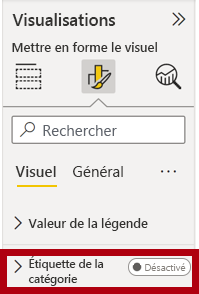

9. Définissez la propriété **Couleur d’arrière-plan** sur une nuance claire de gris.

10. Ajoutez un objet visuel **Tableau** à la page, puis redimensionnez-le et positionnez-le pour qu’il se trouve sous l’objet visuel Carte et remplisse l’espace restant de la page.

    

    

11. Ajoutez les champs suivants au tableau :

    - Product \| Subcategory

    - Product \| Color

    - Sales \| Quantity

    - Sales \| Sales

    - Sales \| Profit Margin

12. Configurez les options de mise en forme pour l’objet visuel, puis dans la section **Valeurs**, définissez la propriété **Taille du texte** sur **20pt**.

    *La conception de la page d’extraction est presque terminée. Dans l’exercice suivant, vous allez améliorer la page avec une mise en forme conditionnelle.*

## **Exercice 3 : Ajouter une mise en forme conditionnelle**

Dans cet exercice, vous allez améliorer la page d’extraction avec une mise en forme conditionnelle. Une fois créée, la page se présentera comme suit :

### **Tâche 1 : Ajouter une mise en forme conditionnelle**

Dans cette tâche, vous allez améliorer la page d’extraction avec une mise en forme conditionnelle.

1. Désélectionnez l’objet visuel Tableau.

2. Dans le volet de visualisation, cliquez sur la flèche vers le bas de la valeur **Marge bénéficiaire**, puis sélectionnez **Mise en forme conditionnelle \| Icônes**.

    

3. Dans la fenêtre **Icônes**  Marge bénéficiaire **, dans la liste déroulante** Disposition des icônes, sélectionnez **À droite des données**.

    

4. Pour supprimer la règle du milieu, à gauche du triangle jaune, cliquez sur **X**.

    

5. Configurez la première règle (losange rouge) comme suit :

    - Dans le deuxième contrôle, supprimez la valeur

    - Dans le troisième contrôle, sélectionnez **Nombre**

    - Dans le cinquième contrôle, entrez **0**

    - Dans le sixième contrôle, sélectionnez **Nombre**

6. Configurez la deuxième règle (cercle vert) comme suit :

    - Dans le deuxième contrôle, entrez **0**

    - Dans le troisième contrôle, sélectionnez **Nombre**

    - Dans le cinquième contrôle, supprimez la valeur

    - Dans le sixième contrôle, sélectionnez **Nombre**

    

    *Les règles peuvent être interprétées comme suit : afficher un losange rouge si la valeur de la marge bénéficiaire est inférieure à 0 ; sinon, si la valeur est supérieure ou égale à zéro, afficher un cercle vert.*

7. Cliquez sur **OK**.

    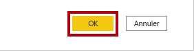

8. Dans l’objet visuel Tableau, vérifiez que les bonnes icônes sont affichées.

    

9. Configurez la mise en forme conditionnelle de couleur d’arrière-plan pour le champ **Couleur**.

10. Dans la fenêtre **Couleur d’arrière-plan -- Couleur**, dans la liste déroulante **Mettre en forme le style**, sélectionnez **Valeur du champ**.

    

11. Dans la liste déroulante **Dans quel champ devons-nous baser cette option ?** , sélectionnez **Produit \| Mise en forme \| Format de couleur d’arrière-plan**.

    

12. Cliquez sur **OK**.

    

13. Répétez les étapes précédentes pour configurer la mise en forme conditionnelle de la couleur de police pour le champ **Couleur** à l’aide du champ **Produit \| Mise en forme \| Format de couleur de police**

    *Vous vous souvenez peut-être que les couleurs de police et d’arrière-plan ont été récupérées du fichier **ColorFormats.csv** dans le labo **Préparer des données dans Power BI Desktop**, puis intégrées à la requête **Produit** dans le labo **Charger des données dans Power BI Desktop**.*

## **Exercice 4 : Ajouter des signets et des boutons**

Dans cet exercice, vous allez améliorer la page **My Performance** avec des boutons, ce qui permet à l’utilisateur du rapport de sélectionner le type d’objet visuel à afficher. Une fois créée, la page se présentera comme suit :

### **Tâche 1 : Ajouter des signets**

Au cours de cette tâche, vous allez ajouter deux signets, un pour afficher chacun des objets visuels de ventes mensuelles/objectifs.

1. Accédez à la page **My Performance**.

2. Sous l’onglet de ruban **Affichage**, dans le groupe **Afficher les volets**, cliquez sur **Signets**.

    

3. Sous l’onglet de ruban **Affichage**, dans le groupe **Afficher les volets**, cliquez sur **Sélection**.

    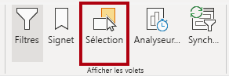

4. Dans le volet **Sélection**, en regard de l’un des éléments **Sales and Target by Month**, pour masquer l’objet visuel, cliquez sur l’icône représentant un œil.

    

5. Dans le volet **Signets**, cliquez sur **Ajouter**.

    

6. Pour renommer le signet, double-cliquez sur le signet.

7. Si le graphique visible est le graphique à barres, renommez le signet en **Graphique à barres activé**, sinon renommez le signet en **Histogramme activé**.

8. Pour modifier le signet, dans le volet **Signets**, placez le curseur sur le signet, cliquez sur les points de suspension, puis sélectionnez **Données**.

    

    *La désactivation de l’option **Données** signifie que le signet n’utilisera pas l’état de filtre actuel. C’est important, car sinon, le signet verrouillerait de façon permanente le filtre actuellement appliqué par le segment **Année**.*

9. Pour mettre à jour le signet, recliquez sur les points de suspension, puis sélectionnez **Mettre à jour**.

    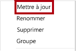

    *Dans les étapes suivantes, vous allez créer et configurer un second signet pour afficher le deuxième visuel.*

10. Dans le volet **Sélection**, basculez la visibilité des deux éléments **Sales and Target by Month**.

    *En d’autres termes, masquez l’objet visuel visible et rendez visible l’objet visuel masqué.*

    

11. Créez un deuxième signet et nommez-le de manière appropriée (**Histogramme activé** ou **Graphique à barres activé).**

    

12. Configurez le deuxième signet pour ignorer les filtres (option **Données** désactivée) et mettez à jour le signet.

13. Dans le volet **Sélection**, pour rendre les deux objets visuels visibles, il suffit d’afficher l’objet visuel masqué.

14. Redimensionnez et repositionnez les deux visuels afin qu’ils remplissent la page sous l’objet visuel à plusieurs cartes et se chevauchent entièrement.

    *Conseil : Pour sélectionner l’objet visuel qui est couvert, sélectionnez-le dans le volet **Sélection**.*

    

15. Dans le volet **Signets**, sélectionnez chacun des signets et notez qu’un seul des objets visuels est visible.

    *L’étape suivante de la conception consiste à ajouter deux boutons à la page, ce qui permettra à l’utilisateur du rapport de sélectionner les signets.*

### **Tâche 2 : Ajouter des boutons**

Dans cette tâche, vous allez ajouter deux boutons et affecter des actions de signet à chacun d’eux.

1. Sur le ruban **Insérer**, dans le groupe **Éléments**, cliquez sur **Bouton**, puis sélectionnez **Vide**.

    

2. Positionnez le bouton juste en dessous du segment **Année**.

3. Sélectionnez le bouton, puis, dans le volet **Bouton de format**, cliquez sur **Général** et passez la propriété **Mosaïque** sur **Activé**.

    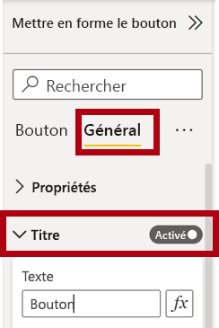

4. Développez la section **Titre**, puis dans la zone **Texte**, entrez **Graphique à barres**.

5. Développez la section **Arrière-plan**, puis définissez une couleur d’arrière-plan en utilisant une couleur complémentaire.

6. Cliquez sur **Bouton** et passez la propriété **Action** sur **Activé**.

    

7. Développez la section **Action**, puis réglez la liste déroulante **Type** sur **Signet**.

8. Dans la liste déroulante **Signet**, sélectionnez **Graphique à barres activé**.

    

9. Créez une copie du bouton par copier-coller, puis configurez le nouveau bouton comme suit :

    *Conseil : Pour copier et coller, utilisez les commandes de raccourci **Ctrl+C** et **Ctrl+V** à la suite.*

    - Définissez la propriété **Texte du bouton** sur **Histogramme**

    - Dans la section **Action**, définissez la liste déroulante **Signet** sur **Histogramme activé**

    *La conception du rapport Sales Analysis (Analyse des ventes) est maintenant terminée.*

### **Tâche 3 : Publier le rapport**

Dans cette tâche, vous allez publier le rapport.

1. Sélectionnez la page **Vue d’ensemble**.

2. Dans le segment **Year**, sélectionnez **FY2020**.

3. Dans le segment **Région**, sélectionnez **Sélectionner tout**.

4. Enregistrez le fichier Power BI Desktop.

    *Prenez soin de toujours enregistrer le fichier avant de le publier sur le service Power BI.*

5. Sous l’onglet de ruban **Accueil**, dans le groupe **Partager**, cliquez sur **Publier**.

    

6. Dans la fenêtre **Publier sur Power BI**, notez que **Mon espace de travail** est sélectionné.

7. Pour publier le rapport, cliquez sur **Sélectionner**.

    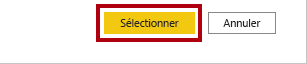

8. Lorsque vous êtes invité à remplacer le jeu de données, cliquez sur **Remplacer**.

9. Une fois la publication réussie, cliquez sur **OK**.

    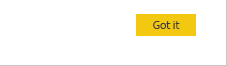

10. Fermez Power BI Desktop.

    *Dans l’exercice suivant, vous allez explorer le rapport dans le service Power BI.*

## **Exercise 5 : Explorer le rapport**

Dans cet exercice, vous allez explorer le rapport dans le service Power BI.

### **Tâche 1 : Explorer le rapport**

Dans cette tâche, vous explorez le rapport dans le service Power BI.

1. Dans la fenêtre du navigateur Microsoft Edge, dans le service Power BI, dans le volet **Navigation**, sélectionnez **Mon espace de travail**, puis cliquez sur le rapport **Sales Analysis** (Analyse des ventes).

2. Pour tester le rapport d’extraction, dans la page **Vue d’ensemble**, dans le visuel **Quantity by Category**, cliquez avec le bouton droit sur la barre **Clothing**, puis sélectionnez **Extraire \| Product Details**.

    

3. Notez que la page **Product Details** porte sur la catégorie **Clothing**.

4. Pour revenir à la page source, dans le coin supérieur gauche, cliquez sur le bouton fléché.

5. Sélectionnez la page **Mes performances**.

6. Cliquez sur chacun des boutons, puis remarquez qu’un autre objet visuel s’affiche.

### **Tâche 2 : Terminer**

Dans cette tâche, vous terminez le labo.

1. Pour revenir à votre espace de travail, dans la bannière dans la page web de la fenêtre, cliquez sur **Mon espace de travail**.

    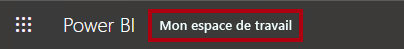

2. Laissez la fenêtre du navigateur Microsoft Edge ouverte.
