---
lab:
  title: "Améliorer un rapport dans Power\_BI Desktop"
  module: 7 - Create Reports
---

# Améliorer un rapport dans Power BI Desktop

**La durée estimée pour effectuer ce tutoriel est de 45 minutes.**

Dans ce labo, vous allez améliorer le rapport **Sales Analysis** avec des fonctionnalités de conception avancées.

Dans ce labo, vous allez découvrir comment :

- Synchroniser les segments
- Créer une page d'extraction
- Appliquer une mise en forme conditionnelle
- Créer et utiliser des signets

### **Histoire du labo**

Ce labo est l’un des nombreux labos d’une série qui a été conçue comme une histoire complète allant de la préparation des données jusqu’à leur publication sous forme de rapports et de tableaux de bord. Vous pouvez effectuer ces labos dans l’ordre de votre choix. Toutefois, si vous comptez suivre plusieurs labos, pour les dix premiersd’entre eux, nous vous suggérons de suivre cet ordre :

1. Préparer des données dans Power BI Desktop
1. Charger des données dans Power BI Desktop
1. Concevoir un modèle de données dans Power BI
1. Créer des calculs DAX dans Power BI Desktop
1. Créer des calculs DAX avancés dans Power BI Desktop
1. Concevoir un rapport dans Power BI Desktop
1. **Améliorer un rapport dans Power BI Desktop**
1. Faire une analyse des données dans Power BI
1. Créer un tableau de bord Power BI
1. Appliquer la sécurité au niveau des lignes

## **Exercice 1 : Configurer des segments de synchronisation**

Dans cet exercice, vous allez synchroniser les segments de page de rapport.

### Tâche 1 : Démarrer - Se connecter

Au cours de cette tâche, vous allez configurer l’environnement nécessaire pour le labo en vous connectant à Power BI.

*Remarque : Si vous êtes déjà connecté à Power BI, passez à la tâche suivante.*

1. Pour ouvrir Microsoft Edge, dans la barre des tâches, sélectionnez le raccourci du programme Microsoft Edge.

     

1. Dans la fenêtre du navigateur Microsoft Edge, accédez à **https://app.powerbi.com**.

    *Conseil : Vous pouvez également utiliser le favori Service Power BI dans la barre des favoris Microsoft Edge.*

1. Effectuez le processus de connexion avec vos informations d’identification organisationnelles (ou celles qui vous sont fournies). Si Microsoft Edge vous invite à rester connecté, sélectionnez **Oui**.

1. Dans la fenêtre du navigateur Microsoft Edge, dans le service Power BI, dans le volet **Navigation**, développez **Mon espace de travail**. Laissez la fenêtre du navigateur Microsoft Edge ouverte.

     

### Tâche 2 : Démarrer – Ouvrir un rapport

Au cours de cette tâche, vous allez configurer l’environnement pour le labo en ouvrant le rapport de démarrage.

*Important : Si vous venez d’effectuer le labo précédent (et que vous l’avez entièrement terminé), ignorez cette tâche et passez directement à la suivante.*

1. Ouvrez Power BI Desktop.

    

    *Conseil : Par défaut, la boîte de dialogue Prise en main s’ouvre par-dessus Power BI Desktop. Vous pouvez choisir de vous connecter, puis de fermer la fenêtre contextuelle.*

1. Pour ouvrir le fichier Power BI Desktop de démarrage, sélectionnez **Fichier > Ouvrir le rapport > Parcourir les rapports**.

1. Dans la fenêtre **Ouvrir**, accédez au dossier **D:\PL300\Labs\07-design-report-in-power-bi-desktop-enhanced\Starter** et ouvrez le fichier **Sales Analysis**.

1. Fermez toutes les fenêtres d’information qui se sont éventuellement ouvertes.

1. Notez qu’un message d’avertissement jaune est affiché sous le ruban. 

    *Ce message vous avertit que les requêtes n’ont pas été appliquées pour se charger en tant que tables de modèle. Vous appliquerez les requêtes plus tard dans ce labo.*

    *Pour fermer le message d’avertissement, à droite du message d’avertissement jaune, sélectionnez **X**.*

1. Pour créer une copie du fichier, accédez à **Fichier > Enregistrer sous** et enregistrez-le dans le dossier **D:\PL300\MySolution**.

1. Si vous êtes invité à appliquer les modifications, sélectionnez **Appliquer plus tard**.

### **Tâche 3 : Synchroniser les segments**

Au cours de cette tâche, vous allez synchroniser les segments **Année** et **Région**, en continuant le développement du rapport créé dans le labo **Concevoir un rapport dans Power BI Desktop**.

1. Dans Power BI Desktop, dans la page **Vue d’ensemble**, définissez le segment **Year** (Année) sur **FY2018** (Exercice 2018).

1. Accédez à la page **Mes performances**, puis notez que le segment **Année** est une valeur différente.
    
    *Lorsque les segments ne sont pas synchronisés, cela peut contribuer à une représentation incorrecte des données et à la frustration pour les utilisateurs des rapports. Vous allez maintenant synchroniser les segments du rapport.*

1. Revenez à la page **Vue d’ensemble**, puis sélectionnez le segment **Year**.

1. Sous l’onglet de ruban **Affichage**, dans le groupe **Afficher les volets**, sélectionnez **Synchroniser les segments**.

     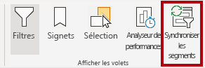

1. Dans le volet **Synchroniser les segments** (à gauche du volet **Visualisations**), dans la deuxième colonne (qui représente la synchronisation), activez les cases à cocher **Vue d’ensemble** et **My Performance**.

     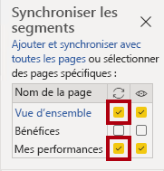

1. Sur la page **Vue d’ensemble**, sélectionnez le segment **Région**.

1. Synchronisez le segment avec les pages **Vue d’ensemble** et **Profit**.

     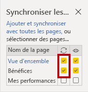

1. Testez la synchronisation des segments en sélectionnant d’autres options de filtre, puis en vérifiant que les segments synchronisés filtrent selon les mêmes options sélectionnées.

1. Pour fermer la page **Synchroniser les segments**, sélectionnez le **X** situé en haut à droite du volet.

## **Exercice 2 : Configurer l’extraction**

Dans cet exercice, vous allez créer une page et la configurer en tant que page d’extraction. Une fois créée, la page se présentera comme suit :

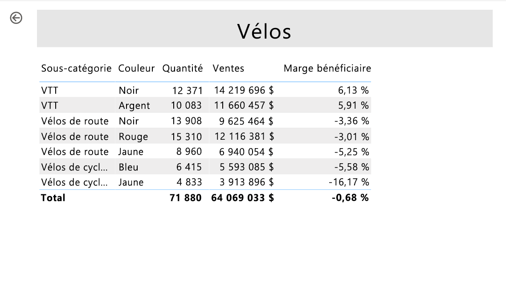

### **Tâche 1 : Créer une page d’extraction**

Au cours de cette tâche, vous allez créer une page et la configurer comme page d’extraction.

1. Ajoutez une nouvelle page de rapport nommée **Détails du produit**.

1. Cliquez avec le bouton droit sur l’onglet de la page **Détails du produit**, puis sélectionnez **Masquer la page**.
    
    *Les utilisateurs des rapports ne seront pas en mesure d’accéder directement à la page d’extraction. Ils doivent y accéder à partir de visuels sur d’autres pages. Vous allez apprendre à accéder à la page dans l’exercice final de ce labo.*

1. Sous le volet **Visualisations**, dans la section **Extraire**, ajoutez le champ **Product \| Category** à la zone **Ajouter des champs d'extraction ici**.
    
    *Les labos utilisent une notation abrégée pour référencer un champ. Voici le résultat : **Product \| Category**. Dans cet exemple, **Product** est le nom de la table et **Category** correspond au nom du champ.*

     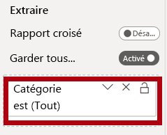

1. Pour tester la page d’extraction, dans la carte de filtre d’extraction, sélectionnez **Bikes**.

     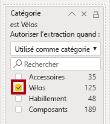

1. En haut à gauche de la page du rapport, notez le bouton fléché.
    
    *Un bouton fléché est ajouté automatiquement quand un champ est ajouté à la barre d’outils/zone d’extraction. Il permet aux utilisateurs de rapport de revenir à la page à partir de laquelle ils ont lancé l’extraction.*

1. Ajoutez un objet visuel **Carte** à la page, puis redimensionnez-le et positionnez-le pour qu’il se trouve à droite du bouton et remplisse la largeur restante de la page.

    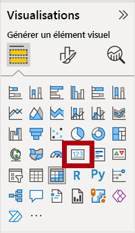

    

1. Faites glisser le champ **Product \| Category** dans l’objet visuel Carte.

1. Configurez les options de mise en forme pour l’objet visuel, puis désactivez la propriété **Étiquette de la catégorie**.

     

1. Définissez la propriété de couleur **Effets > Arrière-plan** sur une nuance claire de gris, par exemple *Blanc, 20 % plus sombre*.

     

1. Ajoutez un objet visuel **Tableau** à la page, puis redimensionnez-le et positionnez-le pour qu’il se trouve sous l’objet visuel Carte et remplisse l’espace restant de la page.

     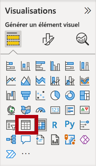

     

1. Ajoutez les champs suivants au tableau :

     - Product \| Subcategory
     - Product \| Color
     - Sales \| Quantity
     - Sales \| Sales
     - Sales \| Profit Margin

1. Configurez les options de mise en forme pour l’objet visuel, puis dans la section **Valeurs**, définissez la propriété **Taille du texte** sur **20pt**.

*La conception de la page d’extraction est presque terminée. Dans l’exercice suivant, vous allez améliorer la page avec une mise en forme conditionnelle.*

## **Exercice 3 : Ajouter une mise en forme conditionnelle**

Dans cet exercice, vous allez améliorer la page d’extraction avec une mise en forme conditionnelle. Une fois créée, la page se présentera comme suit :

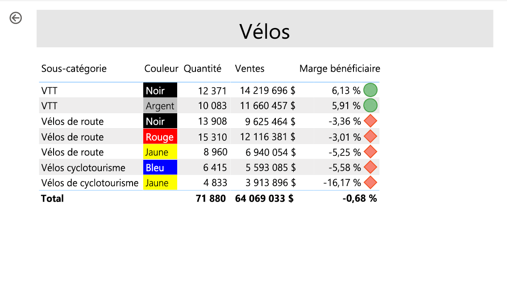

### **Tâche 1 : Ajouter une mise en forme conditionnelle**

Au cours de cette tâche, vous allez améliorer la page d’extraction avec une mise en forme conditionnelle.

1. Désélectionnez l’objet visuel Tableau. Dans le volet de visualisation, sélectionnez la flèche vers le bas de la valeur **Profit Margin**, puis sélectionnez **Mise en forme conditionnelle \| Icônes**.

    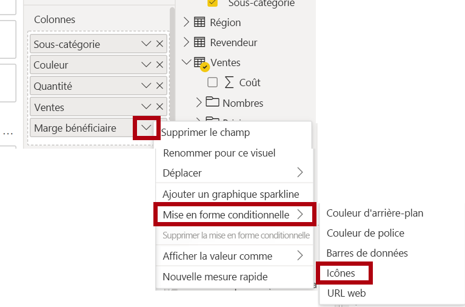

1. Dans la fenêtre **Icônes**Marge bénéficiaire,** dans la liste déroulante**Disposition des icônes, sélectionnez**À droite des données**.

     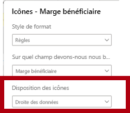

1. Pour supprimer la règle du milieu, à droite du triangle jaune, sélectionnez la lettre **X**.

     

1. Configurez la première règle (losange rouge) comme suit :

    - Dans le deuxième contrôle, supprimez la valeur
    - Dans le troisième contrôle, sélectionnez **Nombre**
    - Dans le cinquième contrôle, entrez **0**
    - Dans le sixième contrôle, sélectionnez **Nombre**

1. Configurez la deuxième règle (cercle vert) comme suit, puis sélectionnez **OK** :
    
    *Les règles peuvent être interprétées comme suit : afficher un losange rouge si la valeur de la marge bénéficiaire est inférieure à 0 ; sinon, si la valeur est supérieure ou égale à zéro, afficher un cercle vert.*

     - Dans le deuxième contrôle, entrez **0**
     - Dans le troisième contrôle, sélectionnez **Nombre**
     - Dans le cinquième contrôle, supprimez la valeur
     - Dans le sixième contrôle, sélectionnez **Nombre**

     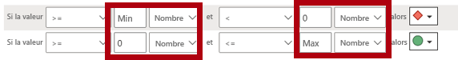

1. Dans le visuel de tableau, vérifiez que les bonnes icônes sont affichées.

     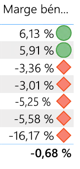

1. Configurez la mise en forme conditionnelle de couleur d’arrière-plan pour le champ **Couleur**.

1. Dans la fenêtre **Couleur d’arrière-plan -- Couleur**, dans la liste déroulante **Mettre en forme le style**, sélectionnez **Valeur du champ**.

1. Dans la liste déroulante **Sur quel champ devons-nous nous baser ?** , sélectionnez **Produit \| Mise en forme \| Format de couleur d’arrière-plan**, puis **OK**.

     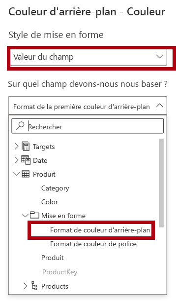

1. Répétez les étapes précédentes pour configurer la mise en forme conditionnelle de la couleur de police pour le champ **Couleur** à l’aide du champ **Produit \| Mise en forme \| Format de couleur de police**

*Vous vous souvenez peut-être que les couleurs de police et d’arrière-plan ont été récupérées du fichier **ColorFormats.csv** dans le labo **Préparer des données dans Power BI Desktop**, puis intégrées à la requête **Produit** dans le labo **Charger des données dans Power BI Desktop**.*

## **Exercice 4 : Ajouter des signets et des boutons**

Dans cet exercice, vous allez améliorer la page **My Performance** avec des boutons, ce qui permet à l’utilisateur du rapport de sélectionner le type de visuel à afficher. Une fois créée, la page se présentera comme suit :

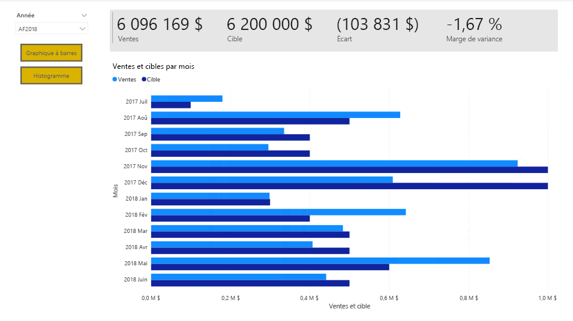

### **Tâche 1 : Ajouter des signets**

Au cours de cette tâche, vous allez ajouter deux signets, un pour afficher chacun des visuels de ventes mensuelles/objectifs.

1. Accédez à la page **My Performance**. Sous l’onglet de ruban **Affichage**, dans le groupe **Afficher les volets**, sélectionnez **Signets**.

     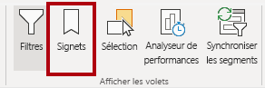

1. Sous l’onglet de ruban **Affichage**, dans le groupe **Afficher les volets**, sélectionnez **Sélection**.

1. Dans le volet **Sélection**, à côté de l’un des éléments **Sales and Target by Month**, sélectionnez l’icône d’œil pour masquer le visuel.

     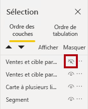

1. Dans le volet **Signets**, sélectionnez **Ajouter**.
    
    *Pour renommer le signet, double-cliquez sur le signet.*

     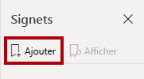

1. Si le graphique visible est le graphique à barres, renommez le signet en **Graphique à barres activé**, sinon renommez le signet en **Histogramme activé**.

1. Pour modifier le signet, dans le volet **Signets**, placez le curseur sur le signet, sélectionnez les points de suspension, puis **Données**.
     
     *La désactivation de l’option **Données** signifie que le signet n’utilisera pas l’état de filtre actuel. C’est important, car sinon, le signet verrouillerait de façon permanente le filtre actuellement appliqué par le segment **Année**.*

     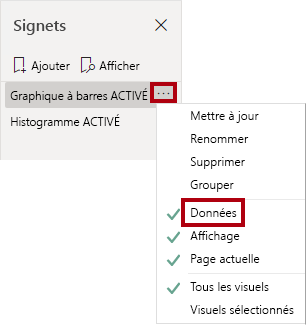

1. Pour mettre à jour le signet, resélectionnez les points de suspension, puis sélectionnez **Mettre à jour**.
     
     *Dans les étapes suivantes, vous allez créer et configurer un second signet pour afficher le deuxième visuel.*

1. Dans le volet **Sélection**, basculez la visibilité des deux éléments **Sales and Target by Month**.
     
     *En d’autres termes, masquez l’objet visuel visible et rendez visible l’objet visuel masqué.*

     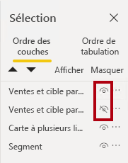

1. Créez un deuxième signet et nommez-le de manière appropriée (**Histogramme activé** ou **Graphique à barres activé).**

     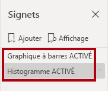

1. Configurez le deuxième signet pour ignorer les filtres (option **Données** désactivée) et mettez à jour le signet.

1. Dans le volet **Sélection**, pour rendre les deux objets visuels visibles, il suffit d’afficher l’objet visuel masqué.

1. Redimensionnez et repositionnez les deux visuels afin qu’ils remplissent la page sous l’objet visuel à plusieurs cartes et se chevauchent entièrement.
    
    *Pour sélectionner le visuel qui est couvert, sélectionnez-le dans le volet **Sélection**.*

    

1. Dans le volet **Signets**, sélectionnez chacun des signets et notez qu’un seul des objets visuels est visible.

*L’étape suivante de la conception consiste à ajouter deux boutons à la page, ce qui permettra à l’utilisateur du rapport de sélectionner les signets.*

### **Tâche 2 : Ajouter des boutons**

Au cours de cette tâche, vous allez ajouter deux boutons et affecter des actions de signet à chacun d’eux.

1. Sur le ruban **Insérer**, dans le groupe **Éléments**, sélectionnez **Bouton**, puis sélectionnez **Vide**.

     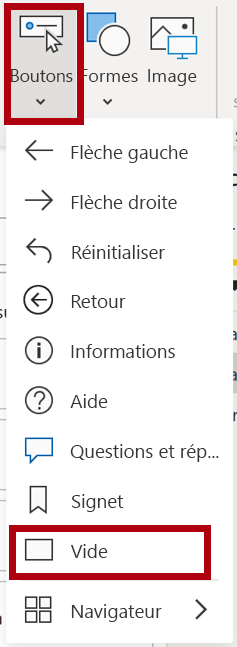

1. Positionnez le bouton juste en dessous du segment **Année**.

1. Sélectionnez le bouton puis, dans le volet **Bouton Mettre en forme**, sélectionnez **Bouton**, développez **Style**, puis affectez la valeur **Activé** à la propriété **Texte**.

     

1. Développez la section **Texte** puis, dans la zone **Texte**, entrez **Graphique à barres**.

1. Développez la section **Remplissage** puis, définissez une couleur de remplissage en utilisant une couleur complémentaire.

1. Sélectionnez **Bouton** et basculez la propriété **Action** sur **Activé**.

    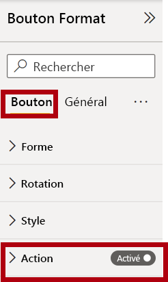

1. Développez la section **Action**, puis réglez la liste déroulante **Type** sur **Signet**.

1. Dans la liste déroulante **Signet**, sélectionnez **Graphique à barres activé**.

    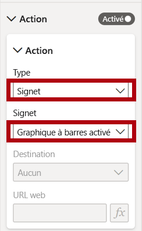

1. Créez une copie du bouton par copier-coller, puis configurez le nouveau bouton comme suit :

    *Conseil : Pour copier et coller, utilisez les commandes de raccourci **Ctrl+C** et **Ctrl+V** à la suite.*

    - Définissez la propriété **Texte du bouton** sur **Histogramme**
    - Dans la section **Action**, définissez la liste déroulante **Signet** sur **Histogramme activé**

*La conception du rapport Sales Analysis (Analyse des ventes) est maintenant terminée.*

### **Tâche 3 : Publier le rapport**

Au cours de cette tâche, vous allez publier le rapport.

1. Sélectionnez la page **Vue d’ensemble**.

1. Dans le segment **Year**, sélectionnez **FY2020**.

1. Dans le segment **Région**, sélectionnez **Sélectionner tout**.

1. Enregistrez le fichier Power BI Desktop.
    
    *Prenez soin de toujours enregistrer le fichier avant de le publier sur le service Power BI.*

1. Sous l’onglet de ruban **Accueil**, dans le groupe **Partager**, sélectionnez **Publier**.

     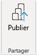

1. Dans la fenêtre **Publier sur Power BI**, notez que **Mon espace de travail** est sélectionné.

1. Pour publier le rapport, choisissez **Sélectionner**.
    1. Si vous êtes invité à remplacer le jeu de données, sélectionnez **Remplacer**.
    1. Une fois la publication réussie, sélectionnez **OK**.

1. Fermez Power BI Desktop.

*Dans l’exercice suivant, vous allez explorer le rapport dans le service Power BI.*

## **Exercise 5 : Explorer le rapport**

Dans cet exercice, vous allez explorer le rapport dans le service Power BI.

### **Tâche 1 : Explorer le rapport**

Au cours de cette tâche, vous allez explorer le rapport dans le service Power BI.

1. Dans une fenêtre de navigateur Microsoft Edge, accédez au service Power BI > **Mon espace de travail**, puis sélectionnez le rapport **Sales Analysis**.

1. Pour tester la fonctionnalité d’extraction, accédez à la page **Vue d’ensemble** > visuel **Quantité par catégorie**. Cliquez ensuite avec le bouton droit sur la barre **Clothing** et sélectionnez **Extraire \| Détails du produit**.

     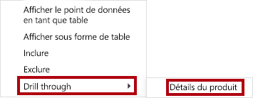

1. Notez que la page **Product Details** porte sur la catégorie **Clothing**.

1. Pour revenir à la page source, dans le coin supérieur gauche, sélectionnez le bouton fléché.

1. Sélectionnez la page **Mes performances**.
    
    *Sélectionnez chacun des boutons. Vous pouvez remarquer qu’un visuel différent s’affiche.*

### **Tâche 2 : Terminer**

Dans cette tâche, vous allez terminer le labo.

Pour revenir à votre espace de travail, dans la bannière dans la page web de la fenêtre, sélectionnez **Mon espace de travail**.

 
