---
lab:
  title: Créer un tableau de bord Power BI
  module: 11 - Create Dashboards
---

# **Créer un tableau de bord Power BI**

**La durée estimée pour effectuer ce tutoriel est de 45 minutes.**

Dans ce labo, vous allez créer le tableau de bord **Surveillance des ventes**.

Dans ce labo, vous allez découvrir comment :

- Épingler des visuels à un tableau de bord

- Utilisez Questions et réponses pour créer des vignettes de tableau de bord

### **Histoire du labo**

Ce labo est l’un des nombreux labos d’une série qui a été conçue comme une histoire complète allant de la préparation des données jusqu’à leur publication sous forme de rapports et de tableaux de bord. Vous pouvez effectuer ces labos dans l’ordre de votre choix. Toutefois, si vous comptez suivre plusieurs labos, pour les dix premiersd’entre eux, nous vous suggérons de suivre cet ordre :

1. Préparer des données dans Power BI Desktop

2. Charger des données dans Power BI Desktop

3. Modéliser les données dans Power BI Desktop

4. Créer des calculs DAX dans Power BI Desktop (partie 1)

5. Créer des calculs DAX dans Power BI Desktop (partie 2)

6. Concevoir un rapport dans Power BI Desktop, partie 1

7. Concevoir un rapport dans Power BI Desktop, partie 2

8. Analyser les données avec des visuels IA

9. **Créer un tableau de bord Power BI**

10. Appliquer la sécurité au niveau des lignes

## **Exercice 1 : Créer un tableau de bord**

Dans cet exercice, vous allez créer le tableau de bord **Surveillance des ventes**. Le tableau de bord terminé se présente comme suit :

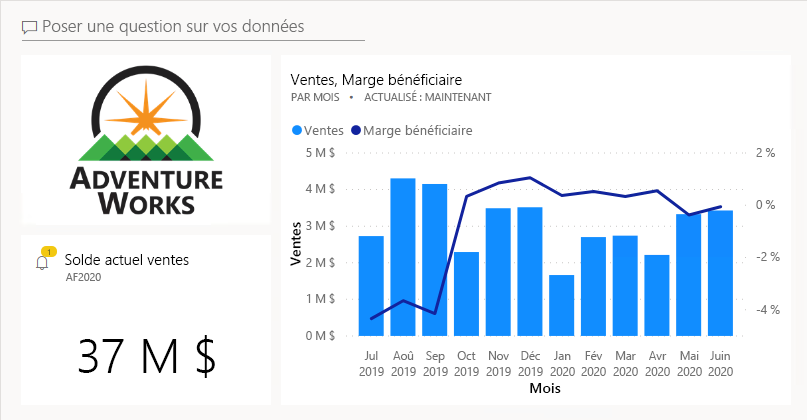

### **Tâche 1 : Démarrer – Se connecter**

Dans cette tâche, vous configurez l’environnement nécessaire pour le labo en vous connectant à Power BI.

*Important : Si vous vous êtes déjà connecté à Power BI dans le cadre d’un labo précédent, passez à la tâche suivante.*

1. Pour ouvrir Microsoft Edge, dans la barre des tâches, cliquez sur le raccourci du programme Microsoft Edge.

    

2. Dans la fenêtre du navigateur Microsoft Edge, accédez à **https://powerbi.microsoft.com**.

    *Conseil : Vous pouvez également utiliser le favori Service Power BI dans la barre des favoris Microsoft Edge.*

3. Cliquez sur **Se connecter** (en haut à droite).

    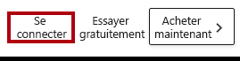

4. Entrez les détails du compte qui vous ont été fournis.

5. Si vous êtes invité à mettre à jour le mot de passe, entrez à nouveau le mot de passe fourni, puis entrez et confirmez un nouveau mot de passe.

    *Important : N’oubliez pas de noter votre nouveau mot de passe.*

6. Terminez le processus de connexion.

7. Si Microsoft Edge vous invite à rester connecté, sélectionnez **Oui**.

8. Dans la fenêtre du navigateur Microsoft Edge, dans le service Power BI, dans le volet **Navigation**, développez **Mon espace de travail**.

    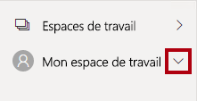

9. Laissez la fenêtre du navigateur Microsoft Edge ouverte.

### **Tâche 2 : Démarrer – Ouvrir un rapport**

Dans cette tâche, vous configurez l’environnement pour le labo en ouvrant le rapport de démarrage.

*Important : Si vous venez d’effectuer le labo précédent (et que vous l’avez entièrement terminé), ignorez cette tâche et passez directement à la tâche suivante.*

1. Pour ouvrir Power BI Desktop, accédez à la barre des tâches et cliquez sur le raccourci Microsoft Power BI Desktop.

    

2. Pour fermer la fenêtre de démarrage, en haut à gauche de cette fenêtre, sélectionnez **X**.

    

3. Si Power BI Desktop n’est pas connecté au service Power BI, sélectionnez **Se connecter** en haut à droite.

    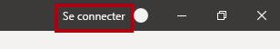

4. Terminez le processus de connexion en utilisant le même compte que celui utilisé pour vous connecter au service Power BI.

5. Pour ouvrir le fichier Power BI Desktop de démarrage, sélectionnez l’onglet de ruban **Fichier** afin de passer en mode Backstage.

6. Sélectionnez **Ouvrir un rapport**.

    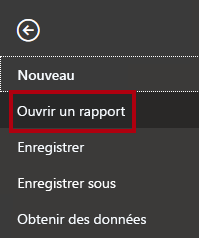

7. Cliquez sur **Parcourir les rapports**.

    

8. Dans la fenêtre **Ouvrir**, accédez au dossier **D:\PL300\Labs\08-create-power-bi-dashboard\Starter**.

9. Sélectionnez le fichier **Sales Analysis** (Analyse des ventes).

10. Cliquez sur **Ouvrir**.

    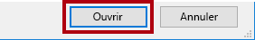

11. Fermez toutes les fenêtres d’information qui se sont éventuellement ouvertes.

12. Pour créer une copie du fichier, sélectionnez l’onglet de ruban **Fichier** afin de passer en mode Backstage.

13. Sélectionnez **Enregistrer sous**.

    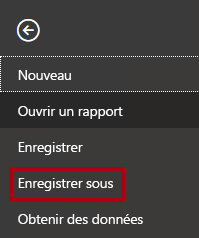

14. Si vous êtes invité à appliquer les modifications, cliquez sur **Appliquer**.

    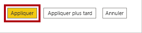

15. Dans la fenêtre **Enregistrer sous**, accédez au dossier **D:\PL300\MySolution**.

16. Cliquez sur **Enregistrer**.

    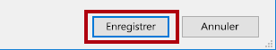

### **Tâche 3 : Démarrer – Publier le rapport**

Dans cette tâche, vous configurez l’environnement pour le labo en créant un jeu de données.

*Important : Si vous avez déjà publié le rapport dans le cadre du labo **Concevoir un rapport dans Power BI Desktop (partie 2)** , passez directement à la tâche suivante.*

1. Dans la fenêtre du navigateur Microsoft Edge, dans le service Power BI, en bas dans le volet **Navigation**, cliquez sur **Obtenir les données**.

    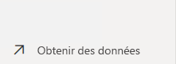

2. Dans la vignette **Fichiers**, sélectionnez **Obtenir**.

    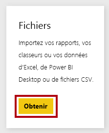

3. Sélectionnez la vignette **Fichier local**.

    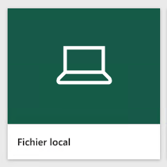

4. Dans la fenêtre **Ouvrir**, accédez au dossier **D:\PL300\Labs\08-create-power-bi-dashboard\Solution**.

5. Sélectionnez le fichier **Sales Analysis.pbix**, puis clqiuez sur **Ouvrir**.

6. Lorsque vous êtes invité à remplacer le jeu de données, cliquez sur **Remplacer**.

### **Tâche 4 : Créer un tableau de bord**

Lors de cette tâche, vous allez créer le tableau de bord **Surveillance des ventes**. Vous épinglez un visuel à partir du rapport, vous ajoutez une vignette basée sur un URI de données image, puis vous utilisez Questions et réponses pour créer une vignette.

1. Dans la fenêtre du navigateur Microsoft Edge, dans le service Power BI, ouvrez le rapport **Analyse des ventes**.

2. Dans la page **Vue d’ensemble**, définissez le segment **Année** sur **FY2020** (Année fiscale 2020).

    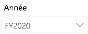

3. Définissez le segment **Région**, sur **Sélectionner tout**.

    *Lorsque vous épinglez des visuels à un tableau de bord, ils utilisent le contexte de filtre actuel. Une fois le visuel épinglé, le contexte de filtre ne peut pas être modifié. Pour les filtres temporels, il est préférable d’utiliser un segment de date relative (ou Questions et réponses en posant une question sur le temps relatif).*

4. Pour créer un tableau de bord et y épingler un visuel, pointez le curseur sur le visuel **Sales, Profit Margin By Month** (graphique en colonnes/courbes).

5. Dans l’angle supérieur droit, cliquez sur la punaise.

    

6. Dans la fenêtre **Épingler au tableau de bord**, dans la zone **Nom du tableau de bord**, entrez **Surveillance des ventes**.

    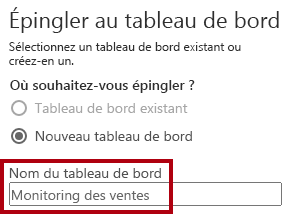

7. Cliquez sur **Épingler**.

    

8. Ouvrez le volet **Navigation**, sélectionnez **Mon espace de travail** puis ouvrez le tableau de bord **Surveillance des ventes**.

    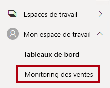

9. Notez que le tableau de bord comporte une seule vignette.

    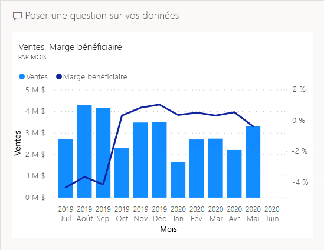

10. Pour ajouter une vignette basée sur une question, en haut à gauche du tableau de bord, cliquez sur **Poser une question sur vos données**.

    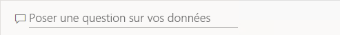

    *Vous pouvez utiliser la fonctionnalité Questions et réponses, et Power BI répondra avec un visuel.*

11. Cliquez sur l’une des questions suggérées sous la zone Questions et réponses, dans les zones bleues.

12. Passer en revue la réponse.

13. Supprimez tout le texte de la boîte Questions et réponses.

14. Dans la zone Questions et réponses, entrez le texte suivant : **Ventes actuelles**

    

15. Notez la réponse **(vide)**.

    

    *Vous vous souvenez peut-être que vous aviez ajouté la mesure **Ventes actuelles** dans le labo **Créer des calculs DAX dans Power BI Desktop (partie 2)** . Cette mesure est une expression Time Intelligence et requiert un filtre sur la table **Date** pour produire un résultat.*

16. Étendez la question avec : **durant l’année fiscale 2020**.

    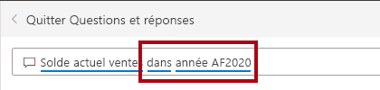

17. Notez que maintenant la réponse est **(33M$)**.

    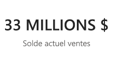

18. Pour épingler la réponse au tableau de bord, dans le coin supérieur droit, cliquez sur **Épingler un visuel**.

    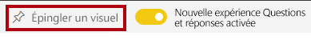

19. Lorsque vous êtes invité à épingler la vignette au tableau de bord, cliquez sur **Épingler**.

    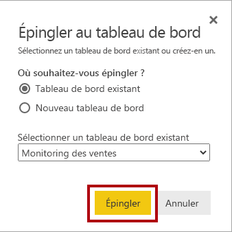

20. Pour revenir au tableau de bord, dans l’angle supérieur gauche, cliquez sur **Quitter Q**R&amp;.

    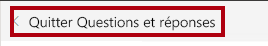

21. Pour ajouter le logo de la société, dans la barre de menus, cliquez sur **Modifier**, puis sélectionnez **Ajouter une vignette**.

    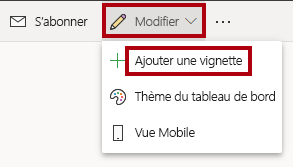

    *Avec cette technique d’ajout d’une vignette de tableau de bord, vous pouvez embellir votre tableau de bord en y incorporant des médias, y compris du contenu web, des images, des zones de texte enrichi et des vidéos (au moyen de liens YouTube ou Vimeo).*

22. Dans le volet **Ajouter une vignette** (à droite), sélectionnez la vignette **Image**.

    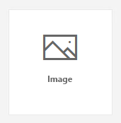

23. Cliquez sur **Suivant**.

    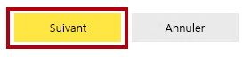

24. Dans le volet **Ajouter une vignette d’image**, dans la zone **URL**, entrez l’URL complète fournie dans le fichier **D:\PL300\Resources\AdventureWorksLogo_DataURL.txt**.

    *Vous pouvez incorporer une image avec son URL, ou utiliser une URL de données qui incorpore le contenu inline.*

25. Au bas du volet, cliquez sur **Appliquer**.

    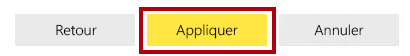

26. Pour redimensionner la vignette du logo, faites glisser l’angle inférieur droit et redimensionnez la vignette pour qu’elle ait une unité de largeur et deux unités de hauteur.

    *Les vignettes doivent obligatoirement être rectangulaires. Seul un redimensionnement en multiples de la forme rectangulaire est possible.*

27. Organisez les vignettes de sorte que le logo apparaisse en haut à gauche, avec la vignette **Ventes actuelles** en dessous et la vignette **Ventes, marge bénéficiaire** à droite.

    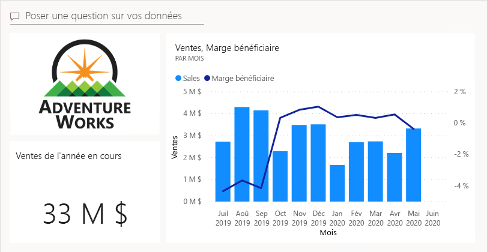

### **Tâche 5 : Modifier les détails des vignettes**

Dans cette tâche, vous allez modifier les détails de deux vignettes.

1. Pointez le curseur sur la vignette **Ventes actuelles**, puis, en haut à droite de la vignette, cliquez sur les points de suspension et sélectionnez **Modifier les détails**.

    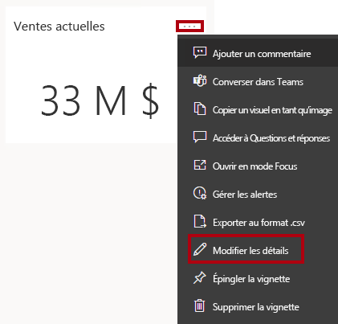

2. Dans le volet **Détails de la vignette** (situé à droite), dans la zone **Sous-titre**, entrez **Année fiscale 2020**.

    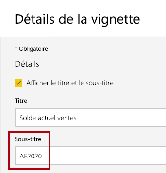

3. Cliquez sur **Appliquer**.

    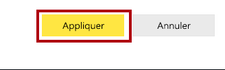

4. Notez que la vignette **Ventes actuelles** affiche un sous-titre.

    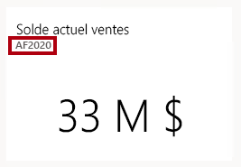

5. Modifiez les détails de la vignette **Ventes, marge bénéficiaire**.

6. Dans le volet **Détails de la vignette**, section **Fonctionnalité**, cochez **Afficher l’heure de la dernière actualisation**.

    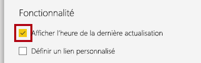

7. Cliquez sur **Appliquer**.

    

8. Notez que la vignette décrit l’heure de la dernière actualisation (que vous avez effectuée lors du chargement du modèle de données dans Power BI Desktop).

    *Dans l’exercice suivant, vous allez actualiser le jeu de données. En règle générale, cette opération s’effectue dans le cadre d’une actualisation planifiée, auquel cas Power BI utilise une passerelle pour se connecter à la base de données SQL Server. Toutefois, en raison des contraintes liées à la configuration de la classe, il n’y a pas de passerelle. Vous allez donc ouvrir Power BI Desktop, effectuer une actualisation manuelle des données, puis charger le fichier dans votre espace de travail.*

## **Exercice 2 : Actualiser le jeu de données**

Dans cet exercice, vous allez commencer par charger les données de commande client pour juin 2020 dans la base de données **AdventureWorksDW2020**. Ensuite, vous ouvrirez votre fichier Power BI Desktop, vous actualiserez les données, puis vous chargerez le fichier dans votre espace de travail.

### **Tâche 1 : Mettre à jour la base de données du labo**

Dans cette tâche, vous allez exécuter un script PowerShell pour mettre à jour les données dans la base de données **AdventureWorksDW2020**.

1. Dans l’Explorateur de fichiers, à l’intérieur du dossier **D:\PL300\Setup**, cliquez avec le bouton droit sur le fichier **UpdateDatabase-2-AddSales.ps1**, puis sélectionnez **Exécuter avec PowerShell**.

    

2. Si vous êtes invité à changer la stratégie d’exécution, appuyez sur **A**.

3. Lorsque vous êtes invité à appuyer sur une touche quelconque pour continuer, appuyez de nouveau sur **Entrée**.

    *La base de données **AdventureWorksDW2020** inclut maintenant les commandes client pour juin 2020.*

### **Tâche 2 : Actualiser le fichier Power BI Desktop**

Dans cette tâche, vous allez ouvrir le fichier **Analyse des ventes** Power BI Desktop, effectuer une actualisation des données, puis charger le fichier dans votre espace de travail **Analyse des ventes**.

1. Dans le fichier Power BI Desktop, dans le volet **Champs**, cliquez avec le bouton droit sur la table **Ventes**, puis sélectionnez **Actualiser les données**.

    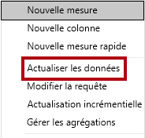

2. Une fois l’actualisation terminée, enregistrez le fichier Power BI Desktop.

3. Pour publier le fichier dans votre espace de travail, cliquez sur l’onglet **Accueil** dans le ruban puis, dans le groupe **Partager**, cliquez sur **Publier**, puis sur **Sélectionner** pour publier.

    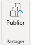

4. Lorsque vous êtes invité à remplacer le jeu de données, cliquez sur **Remplacer**.

    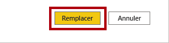

    *Le jeu de données dans le service Power BI contient maintenant des données de ventes pour juin 2020.*

5. Fermez Power BI Desktop.

## **Exercice 3 : Examiner le tableau de bord**

Dans cet exercice, vous allez examiner le tableau de bord pour voir les ventes mises à jour.

### **Tâche 1 : Examiner le tableau de bord**

Dans cette tâche, vous allez examiner le tableau de bord pour voir les ventes mises à jour.

1. Dans la fenêtre du navigateur Microsoft Edge, dans le service Power BI, affichez le tableau de bord **Surveillance des ventes**.

2. Dans le titre **Marge bénéficiaire de la vignette Ventes**, notez que dans le sous-titre, les données ont été actualisées **MAINTENANT**.

3. Notez également qu’il y a désormais une colonne pour **juin 2020**.

    *Si vous ne voyez pas de données pour le mois de juin 2020, essayez d’actualiser le navigateur en appuyant sur **F5**.*

    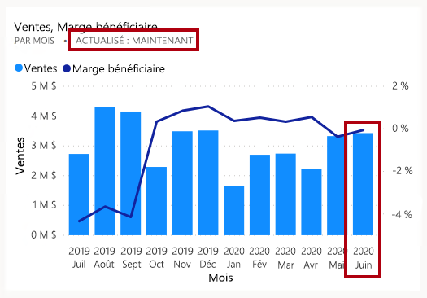

    

4. Pour fermer le volet, cliquez sur **Fermer**.
