---
lab:
  title: "Analyser les données dans Power\_BI Desktop"
  module: Module 10 - Perform Advanced Analytics
---

# **Analyser les données dans Power BI Desktop**

**La durée estimée pour effectuer ce tutoriel est de 45 minutes.**

Dans ce labo, vous allez créer le rapport **Exploration des ventes**.

Dans ce labo, vous allez découvrir comment :

- Créer des graphiques à nuages de points animés

- Utiliser un visuel pour établir des prévisions sur les valeurs

### **Histoire du labo**

This lab is one of many in a series of labs that was designed as a complete story from data preparation to publication as reports and dashboards. You can complete the labs in any order. However, if you intend to work through multiple labs, for the first 10 labs, we suggest you do them in the following order:

1. Préparer des données dans Power BI Desktop

2. Charger des données dans Power BI Desktop

3. Modéliser les données dans Power BI Desktop

5. Créer des calculs DAX dans Power BI Desktop (partie 1)

6. Créer des calculs DAX dans Power BI Desktop (partie 2)

7. Concevoir un rapport dans Power BI Desktop, partie 1

8. Concevoir un rapport dans Power BI Desktop, partie 2

9. Créer un tableau de bord Power BI

10. **Analyser les données dans Power BI Desktop**

11. Appliquer la sécurité au niveau des lignes

## **Exercice 1 : Créer le rapport**

Dans cet exercice, vous allez créer le rapport **Sales Exploration** (Exploration des ventes).

### **Tâche 1 : Démarrer – Se connecter**

Dans cette tâche, vous configurez l’environnement nécessaire pour le labo en vous connectant à Power BI.

*Important : Si vous vous êtes déjà connecté à Power BI dans le cadre d’un labo précédent, passez à la tâche suivante.*

1. Pour ouvrir Microsoft Edge, dans la barre des tâches, cliquez sur le raccourci du programme Microsoft Edge.

    

1. Dans la fenêtre du navigateur Microsoft Edge, accédez à **https://powerbi.com**.

    *Conseil : Vous pouvez également utiliser le favori Service Power BI dans la barre des favoris Microsoft Edge.*

1. Cliquez sur **Se connecter** (en haut à droite).

    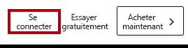

1. Entrez les détails du compte qui vous ont été fournis.

1. Si vous êtes invité à mettre à jour le mot de passe, entrez à nouveau le mot de passe fourni, puis entrez et confirmez un nouveau mot de passe.

    *Important : N’oubliez pas de noter votre nouveau mot de passe.*

1. Terminez le processus de connexion.

1. Si Microsoft Edge vous invite à rester connecté, sélectionnez **Oui**.

1. Dans la fenêtre du navigateur Microsoft Edge, dans le service Power BI, dans le volet **Navigation**, développez **Mon espace de travail**.

    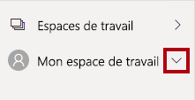

1. Laissez la fenêtre du navigateur Microsoft Edge ouverte.

### **Tâche 2 : Démarrer – Créer un jeu de données**

Dans cette tâche, vous configurez l’environnement pour le labo en créant un jeu de données.

*Important : Si vous avez déjà publié le jeu de données dans le cadre du labo **Créer un tableau de bord Power BI**, passez directement à la tâche suivante.*

1. Dans la fenêtre du navigateur Microsoft Edge, dans le service Power BI, en bas dans le volet **Navigation**, cliquez sur **Obtenir les données**.

    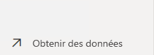

2. Dans la vignette **Fichiers**, sélectionnez **Obtenir**.

    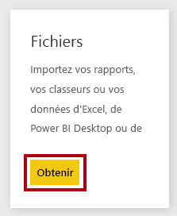

3. Sélectionnez la vignette **Fichier local**.

    

4. Dans la fenêtre **Ouvrir**, accédez au dossier **D:\PL300\Labs\09-create-power-bi-dashboard\Solution**.

5. Sélectionnez le fichier **Sales Analysis.pbix**, puis clqiuez sur **Ouvrir**.

6. Lorsque vous êtes invité à remplacer le jeu de données, cliquez sur **Remplacer**.

### **Tâche 3 : Créer le rapport**

Dans cette tâche, vous créez le rapport **Sales Exploration** (Exploration des ventes).

1. Pour ouvrir Power BI Desktop, accédez à la barre des tâches et cliquez sur le raccourci Microsoft Power BI Desktop.

    *Important : Si vous avez déjà ouvert Power BI Desktop (dans le cadre d’un labo précédent), fermez cette instance.*

    

2. Pour fermer la fenêtre de démarrage, en haut à gauche de cette fenêtre, sélectionnez **X**.

    

3. Si Power BI Desktop n’est pas connecté au service Power BI, sélectionnez **Se connecter** en haut à droite.

    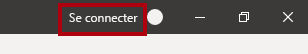

4. Terminez le processus de connexion en utilisant le même compte que celui utilisé pour vous connecter au service Power BI.

5. Pour enregistrer le fichier, sélectionnez l’onglet de ruban **Fichier** pour ouvrir le mode Backstage.

6. Sélectionnez **Enregistrer**.

    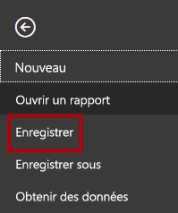

7. Dans la fenêtre **Enregistrer sous**, accédez au dossier **D:\PL300\MySolution**.

8. Dans la zone **Nom du fichier**, entrez **Sales Exploration** (Exploration des ventes).

    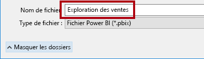

9. Pour créer une connexion active au jeu de données **Sales Analysis**, sous l’onglet de ruban **Accueil**, dans le groupe **Données**, cliquez sur **Jeux de données Power BI**.

    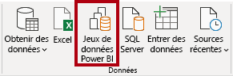

10. Dans la fenêtre **Sélectionner un jeu de données pour créer un rapport**, sélectionnez le jeu de données **Analyse des ventes**.

11. Cliquez sur **Créer**.

    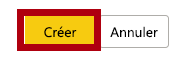

12. Enregistrez le fichier Power BI Desktop.

    *Vous allez maintenant créer quatre pages de rapport et, sur chaque page, vous allez utiliser un visuel différent pour analyser et explorer les données.*

## **Exercise 2 : Créer un graphique à nuages de points**

Dans cet exercice, vous allez créer un graphique à nuages de points qui peut être animé.

### **Tâche 1 : Créer un graphique à nuages de points animé**

Dans cette tâche, vous allez créer un graphique à nuages de points qui peut être animé.

1. Renommez la **Page 1** en **Graphique à nuages de points**.

    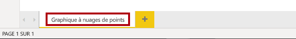

2. Ajoutez un visuel de **Graphique à nuages de points** à la page de rapport, puis positionnez-le et redimensionnez-le afin qu’il remplisse toute la page.

    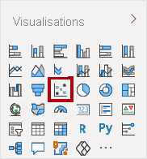

    

3. Ajoutez les champs suivants aux barres d’outils/zones des visuels :

    The labs use a shorthand notation to reference a field. It will look like this: <bpt id="p1">**</bpt>Reseller<ept id="p1">**</ept> <bpt id="p2">**</bpt><ph id="ph1">\|</ph><ept id="p2">**</ept> <bpt id="p3">**</bpt>Business Type<ept id="p3">**</ept>. In this example, <bpt id="p1">**</bpt>Reseller<ept id="p1">**</ept> is the table name and <bpt id="p2">**</bpt>Business Type<ept id="p2">**</ept> is the field name.

    - Légende : **Reseller \| Business Type**

    - Axe des X : **Sales \| Sales** 

    - Axe des Y : **Sales \| Profit Margin**

    - Taille : **Sales \| Quantity**

    - Axe de lecture : **Date \| Quarter**

    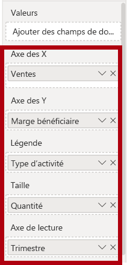

    *Le graphique peut être animé quand un champ est ajouté à la barre d’outils/zone **Axe de lecture**.*

4. Dans le volet **Filtres**, ajoutez le champ **Product \| Category** à la barre d’outils/zone **Filtres dans cette page**.

5. Dans la carte de filtre, filtrez sur **Vélos**.

    

6. Pour animer le graphique, en bas à gauche, cliquez sur **Lire**.

    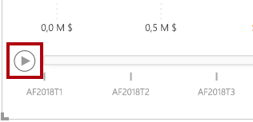

7. Regardez la totalité du cycle d’animation de **FY2018 T1** à **FY2020 T4**.

    *Le graphique à nuages de points permet de comprendre les valeurs de mesure simultanément ; dans le cas présent, la quantité de commandes, le chiffre d’affaires et la marge bénéficiaire.*

    *Chaque bulle représente un type d’activité de revendeur. Les changements apportés à la taille des bulles reflètent l’augmentation ou la diminution des quantités de commandes. Tandis que les mouvements horizontaux représentent les augmentations/diminutions du chiffre d’affaires, les mouvements verticaux représentent les augmentations/diminutions de la rentabilité.*

8. Quand l’animation s’arrête, cliquez sur l’une des bulles pour afficher son suivi au fil du temps.

9. Placez le curseur sur une bulle pour afficher une info-bulle décrivant les valeurs de mesure du type de revendeur à ce moment précis.

10. Dans le volet **Filtres**, filtrez sur **Habillement** uniquement, puis notez que cela produit un résultat très différent.

11. Enregistrez le fichier Power BI Desktop.

## **Exercise 3 : Créer une prévision**

Dans cet exercice, vous allez créer une prévision pour déterminer le chiffre d’affaires futur potentiel.

### **Tâche 1 : Créer une prévision**

Dans cette tâche, vous allez créer une prévision pour déterminer le chiffre d’affaires futur potentiel.

1. Ajoutez une nouvelle page, puis renommez-la **Prévision**.

    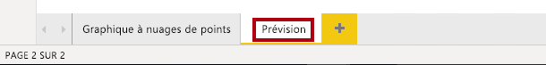

2. Ajoutez un visuel de **Graphique en courbes** à la page de rapport, puis positionnez-le et redimensionnez-le afin qu’il remplisse toute la page.

    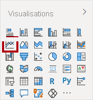

    

  

3. Ajoutez les champs suivants aux barres d’outils/zones des visuels :

    - Axe : **Date \| Date**

    - Valeurs : **Sales \| Sales** 

    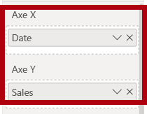

4. Dans le volet **Filtres**, ajoutez le champ **Date \| Year** à la barre d’outils/zone **Filtres dans cette page**.

5. Dans la carte de filtre, filtrez sur deux années : **FY2019** et **FY2020**.

    

    *Lors d’une prévision dans le temps, vous avez besoin d’au moins deux cycles (années) de données pour produire une prévision précise et stable.*

  

6. Ajoutez également le champ **Product \| Category** à la barre d’outils/zone **Filtres dans cette page**, puis filtrez sur **Vélos**.

    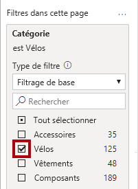

7. Pour ajouter une prévision, sous le volet **Visualisations**, sélectionnez le volet **Analytique**.

    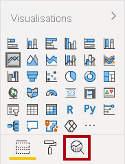

8. Développez la section **Prévision**.

    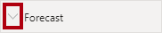

    *Si la section **Prévision** n’est pas disponible, cela est probablement dû au fait que le visuel n’a pas été correctement configuré. La prévision est disponible uniquement quand deux conditions sont remplies : l’axe a un seul champ de type date et il n’y a qu’un seul champ de valeur.*

9. Cliquez sur **Add**.

    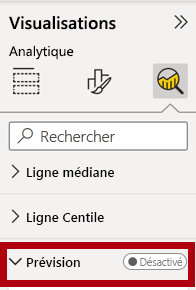

10. Configurez les propriétés de prévision suivantes :

    - Longueur de la prévision : 1 mois

    - Intervalle de confiance : 80 %

    - Caractère saisonnier : 365

11. Cliquez sur **Appliquer**.

    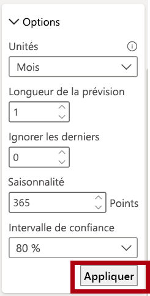

12. Dans le visuel de graphique en courbes, notez que la prévision s’est étendue d’un mois au-delà des données d’historique.

    *La zone grise représente la confiance. Plus la confiance est importante, moins la prévision est susceptible d’être stable et précise.*

    *Quand vous connaissez la durée du cycle (« annuel » dans le cas présent), vous devez entrer les points relatifs au caractère saisonnier. Le cycle peut aussi être hebdomadaire (7) ou mensuel (30).*

13. Dans le volet **Filtres**, filtrez sur **Habillement** uniquement, puis notez que cela produit un résultat différent.

14. Enregistrez le fichier Power BI Desktop.

### **Tâche 2 : Terminer**

Dans cette tâche, vous terminez le labo.

1. Sélectionnez la page **Graphique à nuages de points**.

2. Enregistrez le fichier Power BI Desktop.

3. Pour publier le fichier dans votre espace de travail, sous l’onglet de ruban **Accueil**, dans le groupe **Partager**, cliquez sur **Publier**.

    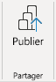

4.  Fermez Power BI Desktop.
