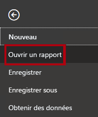
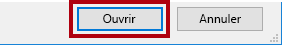
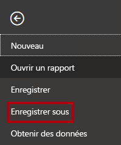
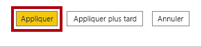
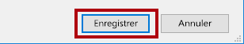

---
lab:
  title: Appliquer la sécurité au niveau des lignes
  module: Module 13 - Row-Level Security
---

# **Appliquer la sécurité au niveau des lignes**

**La durée estimée pour effectuer ce tutoriel est de 45 minutes.**

In this lab you will create a many-to-many relationship between the <bpt id="p1">**</bpt>Salesperson<ept id="p1">**</ept> table and the <bpt id="p2">**</bpt>Sales<ept id="p2">**</ept> table. You will also enforce row-level security to ensure that a salesperson can only analyze sales data for their assigned region(s).

Dans ce labo, vous allez découvrir comment :

- Configurer des relations plusieurs-à-plusieurs

- Appliquer la sécurité au niveau des lignes

### **Histoire du labo**

This lab is one of many in a series of labs that was designed as a complete story from data preparation to publication as reports and dashboards. You can complete the labs in any order. However, if you intend to work through multiple labs, for the first 10 labs, we suggest you do them in the following order:

1. Préparer des données dans Power BI Desktop

2. Charger des données dans Power BI Desktop

3. Modéliser les données dans Power BI Desktop

5. Créer des calculs DAX dans Power BI Desktop (partie 1)

6. Créer des calculs DAX dans Power BI Desktop (partie 2)

7. Concevoir un rapport dans Power BI Desktop, partie 1

8. Concevoir un rapport dans Power BI Desktop, partie 2

9. Créer un tableau de bord Power BI

10. Analyser les données dans Power BI Desktop

11. **Appliquer la sécurité au niveau des lignes**

## **Exercise 1 : Appliquer la sécurité au niveau des lignes**

Dans cet exercice, vous allez appliquer la sécurité au niveau des lignes pour vous assurer qu’un vendeur ne peut voir que les ventes réalisées dans la ou les régions qui lui sont affectées.

### **Tâche 1 : Démarrer**

Dans cette tâche, vous configurez l’environnement pour le labo.

*Important : Si vous venez d’effectuer le labo précédent (et que vous l’avez entièrement terminé), ignorez cette tâche et passez directement à la tâche suivante.*

1. Pour ouvrir Power BI Desktop, accédez à la barre des tâches et cliquez sur le raccourci Microsoft Power BI Desktop.

    

1. Pour fermer la fenêtre de démarrage, en haut à gauche de cette fenêtre, sélectionnez **X**.

    

1. Pour ouvrir le fichier Power BI Desktop de démarrage, sélectionnez l’onglet de ruban **Fichier** afin de passer en mode Backstage.

1. Sélectionnez **Ouvrir un rapport**.

    

1. Cliquez sur **Parcourir les rapports**.

    

1. Dans la fenêtre **Ouvrir**, accédez au dossier **D:\PL300\Labs\12-row-level-security\Starter**.

1. Sélectionnez le fichier **Sales Analysis** (Analyse des ventes).

1. Cliquez sur **Ouvrir**.

    

1. Fermez toutes les fenêtres d’information qui se sont éventuellement ouvertes.

1. Pour créer une copie du fichier, sélectionnez l'onglet **Fichier** dans le ruban afin de passer en mode Backstage.

1. Sélectionnez **Enregistrer sous**.

    

1. Si vous êtes invité à appliquer les modifications, cliquez sur **Appliquer**.

    

1. Dans la fenêtre **Enregistrer sous**, accédez au dossier **D:\PL300\MySolution**.

1. Cliquez sur **Enregistrer**.

    

### **Tâche 2 : Appliquer la sécurité au niveau des lignes**

Dans cet tâche, vous appliquez la sécurité au niveau des lignes pour vous assurer qu’un vendeur ne peut voir que les ventes réalisées dans la ou les régions qui lui sont affectées.

1. Basculez vers l’affichage Données.

    

2. Dans le volet **Champs**, sélectionnez la table **Salesperson (Performance)**.

3. Examinez les données. Notez que Michael Blythe (EmployeeKey 281) a cette valeur UPN : **michael-blythe@adventureworks.com**

    *Rappelez-vous : Michael Blythe est affecté à trois régions de vente : USA Nord-Est, USA Centre et USA Sud-Est.*

4. Basculez vers l’affichage Rapport.

5. Sous l’onglet de ruban **Modélisation**, dans le groupe **Sécurité**, sélectionnez **Gérer les rôles**.

    

6. Dans la fenêtre **Gérer les rôles**, sélectionnez **Créer**.

    

7. Dans la zone, remplacez le texte sélectionné par le nom du rôle : **Salespeople**, puis appuyez sur **Entrée**.

    

8. Pour appliquer un filtre à la table **Salesperson (Performance)** , sélectionnez la caractère points de suspension (...), puis sélectionnez **Ajouter un filtre \| [UPN]** .

    

9. Dans la zone **Expression DAX de filtre de table**, modifiez l’expression en remplaçant **« Value »** par **USERPRINCIPALNAME()** .

    

    *USERPRINCIPALNAME() est une fonction DAX (Data Analysis Expressions) qui retourne le nom de l’utilisateur authentifié. Cela signifie que la table **Salesperson (Performance)** filtrera par le nom d’utilisateur principal (UPN) de l’utilisateur qui interroge le modèle.*

10. Cliquez sur **Enregistrer**.

    

11. Pour tester le rôle de sécurité, sous l’onglet de ruban **Modélisation**, dans le groupe **Sécurité**, sélectionnez **Afficher comme**.

    

12. Dans la fenêtre **Afficher comme rôles**, activez la case à cocher  **Autre utilisateur**, puis dans la zone correspondante, entrez : **michael-blythe@adventureworks.com**

13. Sélectionnez le rôle **Salespeople**.

    

    *Cette configuration se traduit par l’utilisation du rôle **Salespeople** et l’emprunt de l’identité de l’utilisateur avec le nom de Michael Blythe.*

14. Cliquez sur **OK**.

    

15. Notez la bannière jaune au-dessus de la page du rapport, qui indique le contexte de sécurité du test.

    

16. Notez, dans le visuel de table, que seul le vendeur **Michael Blythe** est listé.

    

17. Pour arrêter le test, sur le côté droit de la bannière jaune, sélectionnez **Arrêter l’affichage**.

    

    *Une fois que le fichier Power BI Desktop aura été publié sur le service Power BI, vous devrez effectuer une tâche de post-publication pour mapper les principaux de sécurité au rôle **Salespeople**. Vous n’effectuerez pas cette tâche durant ce labo.*

18. Pour supprimer le rôle, cliquez sur l'onglet **Modélisation** dans le ruban et sélectionnez **Gérer les rôles** dans le groupe **Sécurité**.

    

19. Dans la fenêtre **Gérer les rôles**, cliquez sur **Supprimer**.

    

20. Lorsqu’il vous est demandé de confirmer la suppression, cliquez sur **Oui, supprimer**.

21. Cliquez sur **Enregistrer**.

    

### **Tâche 2 : Terminer**

Dans cette tâche, vous terminez le labo.

1. Enregistrez le fichier Power BI Desktop.
