---
lab:
  title: Appliquer la sécurité au niveau des lignes
  module: Enforce Row-Level Security
---

# **Appliquer la sécurité au niveau des lignes**

## **Histoire du labo**

Dans ce labo, vous allez appliquer la sécurité au niveau des lignes pour vous assurer qu’un vendeur ne peut analyser les données de ventes que pour la ou les régions qui lui sont affectées.

Dans ce labo, vous allez découvrir comment :

- Appliquer la sécurité au niveau des lignes
- Choisir entre des méthodes dynamiques et statiques

**Ce labo devrait prendre environ 45 minutes.**

## **Prise en main**

Au cours de cette tâche, vous allez configurer l’environnement pour le labo.

*Important : Si vous venez d’effectuer le labo précédent (et que vous l’avez entièrement terminé), ignorez cette tâche et passez directement à la suivante.*

1. Ouvrez Power BI Desktop.

    

    *Conseil : Par défaut, la boîte de dialogue Prise en main s’ouvre par-dessus Power BI Desktop. **Connectez-vous**, puis fermez la fenêtre contextuelle.*

1. Pour ouvrir le fichier Power BI Desktop de démarrage, sélectionnez **Fichier > Ouvrir le rapport > Parcourir les rapports**.

1. Dans la fenêtre **Ouvrir**, accédez au dossier **D:\PL300\Labs\10-row-level-security\Starter**, puis ouvrez le fichier **Sales Analysis**.

1. Fermez toutes les fenêtres d’information qui se sont éventuellement ouvertes.

1. Notez qu’un message d’avertissement jaune est affiché sous le ruban. *Ce message vous avertit que les requêtes n’ont pas été appliquées pour se charger en tant que tables de modèle. Vous appliquerez les requêtes plus tard dans ce labo.*
    
    *Pour fermer le message d’avertissement, à droite du message d’avertissement jaune, sélectionnez **X**.*

1. Pour créer une copie du fichier, accédez à **Fichier > Enregistrer sous** et enregistrez-le dans le dossier **D:\PL300\MySolution**.

1. Si vous êtes invité à appliquer les modifications, sélectionnez **Appliquer plus tard**.

## **Appliquer la sécurité au niveau des lignes**

Au cours de cette tâche, vous allez appliquer la sécurité au niveau des lignes pour vous assurer qu’un vendeur ne peut voir que les ventes réalisées dans la ou les régions qui lui sont affectées.

1. Basculez vers l’affichage Données.

   

1. Dans le volet **Données**, sélectionnez la table **Salesperson (Performance)** (Vendeur - Performances).

1. Examinez les données. Notez que Michael Blythe (EmployeeKey 281) a cette valeur UPN : **michael-blythe@adventureworks.com**
    
    *Rappelez-vous que Michael Blythe est affecté à trois régions de vente : USA Nord-Est, USA Centre et USA Sud-Est.*

1. Sous l’onglet de ruban **Modélisation**, dans le groupe **Sécurité**, sélectionnez **Gérer les rôles**.

    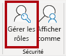

1. Dans la fenêtre **Gérer les rôles**, sélectionnez **Créer**.

1. Dans la zone, remplacez le texte sélectionné par le nom du rôle : **Salespeople**, puis appuyez sur **Entrée**.

   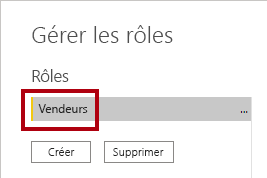

1. Pour appliquer un filtre à la table **Salesperson (Performance)** , sélectionnez la caractère points de suspension (...), puis **Ajouter un filtre \| [UPN]** .

   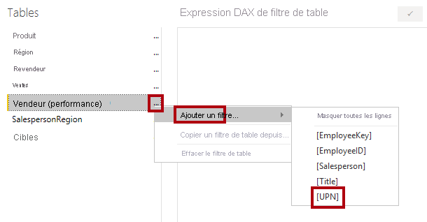

1. Dans la zone **Expression DAX de filtre de table**, modifiez l’expression en remplaçant **“Value”** par **USERPRINCIPALNAME()** , puis sélectionnez **Enregistrer**.
    
    *USERPRINCIPALNAME() est une fonction DAX (Data Analysis Expressions) qui retourne le nom de l’utilisateur authentifié. Cela signifie que la table **Salesperson (Performance)** filtrera par le nom d’utilisateur principal (UPN) de l’utilisateur qui interroge le modèle.*

   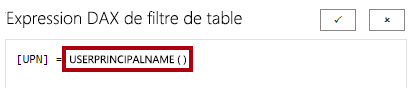

1. Pour tester le rôle de sécurité, sous l’onglet de ruban **Modélisation**, dans le groupe **Sécurité**, sélectionnez **Afficher comme**.

   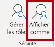

1. Dans la fenêtre **Afficher comme rôles**, activez la case à cocher  **Autre utilisateur**, puis dans la zone correspondante, entrez : **michael-blythe@adventureworks.com**

1. Vérifiez le rôle **Salespeople**, puis sélectionnez **OK**.
    
    *Cette configuration se traduit par l’utilisation du rôle **Salespeople** et l’emprunt de l’identité de l’utilisateur avec le nom de Michael Blythe.*

   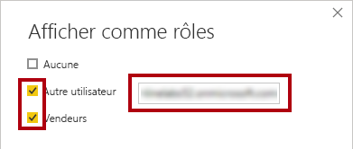

1. Notez la bannière jaune au-dessus de la page du rapport, qui indique le contexte de sécurité du test.

   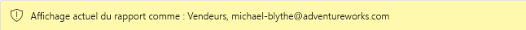

1. Notez, dans le visuel de table, que seul le vendeur **Michael Blythe** est listé.

   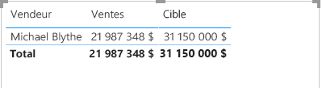

1. Pour arrêter le test, sur le côté droit de la bannière jaune, sélectionnez **Arrêter l’affichage**.

   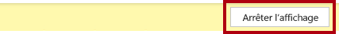

1. Pour supprimer le rôle **Salespeople**, sous l’onglet de ruban **Modélisation**, dans le groupe **Sécurité**, sélectionnez **Gérer les rôles**.

   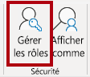

1. Dans la fenêtre **Gérer les rôles**, sélectionnez **Supprimer**. Lorsque vous êtes invité à confirmer la suppression, sélectionnez **Oui, Supprimer**.

   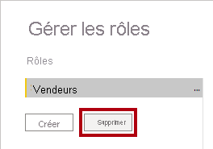

### **Terminer**

Dans cette tâche, vous allez terminer le labo.

1. Sélectionnez **Enregistrer**, puis enregistrez le fichier Power BI Desktop pour mettre fin au labo.

*Remarque : Une fois que le fichier Power BI Desktop aura été publié sur le service Power BI, vous devrez effectuer une tâche de post-publication pour mapper les principaux de sécurité au rôle **Salespeople**. Vous n’effectuerez pas cette tâche durant ce labo.*
