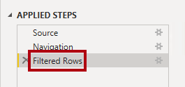
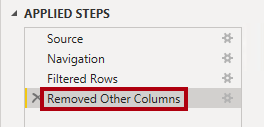
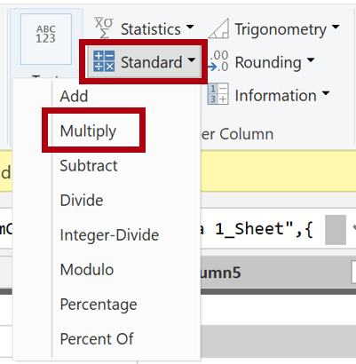
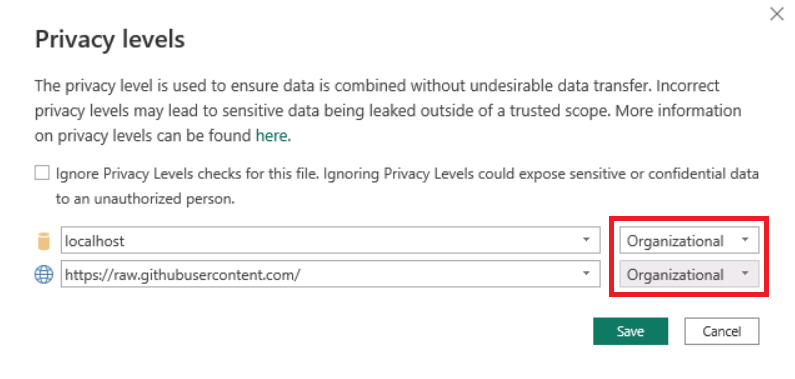

---
lab:
  title: 'Nettoyer, transformer et charger des données dans Power BI'
  module: 'Clean, transform, and load data in Power BI'
---

# Nettoyer, transformer et charger des données dans Power BI

## Histoire du labo

Dans ce labo, vous allez utiliser des techniques de nettoyage et de transformation des données pour commencer à mettre en forme votre modèle de données. Vous allez ensuite appliquer les requêtes pour charger chacune d’elles sous forme de table dans le modèle sémantique.

Dans ce labo, vous découvrez comment :

- Appliquez différentes transformations de données.
- Chargez des requêtes dans le modèle sémantique.

**Ce labo devrait prendre environ 45 minutes.**

## Démarrage

Pour effectuer cet exercice, ouvrez d’abord un navigateur web et entrez l’URL suivante pour télécharger le dossier zip :

`https://github.com/MicrosoftLearning/PL-300-Microsoft-Power-BI-Data-Analyst/raw/Main/Allfiles/Labs/02-transform-data-power-bi/02-transform-data.zip`

Extrayez le dossier dans celui de **C:\Users\Student\Downloads\02-load-data**.

Ouvrez le fichier **02-Starter-Sales Analysis.pbix**.

> ***Remarque** : vous pouvez ignorer la connexion en sélectionnant **Annuler**. Fermez toutes les autres fenêtres d’information ouvertes. Si vous êtes invité à appliquer les modifications, sélectionnez **Appliquer plus tard**.

## Configurer la requête Salesperson

Durant cette tâche, vous allez utiliser l’Éditeur Power Query pour configurer la requête **Salesperson**.

> ***Important** : quand il vous est demandé de renommer des colonnes, il est important de les renommer exactement comme c’est décrit.*

1. Pour ouvrir la fenêtre **Éditeur Power Query**, sous l’onglet de ruban **Accueil**, dans le groupe **Requêtes**, sélectionnez l’icône **Transformer les données**.

    

1. Dans la fenêtre **Éditeur Power Query**, dans le volet **Requêtes**, sélectionnez la requête **DimEmployee**.

    

    > **Remarque :** si vous recevez un message d’avertissement demandant de spécifier comment se connecter, sélectionnez **Modifier les informations d’identification**, connectez-vous à l’aide des informations d’identification actuelles, puis sélectionnez **OK** pour utiliser une connexion non chiffrée.
 
1. Pour renommer la requête, dans le volet **Paramètres de la requête** (situé à droite), dans la zone **Nom**, remplacez le texte par **Salesperson**, puis appuyez sur **Entrée**. Vérifiez ensuite que le nom a été mis à jour dans le volet **Requêtes**.

    > *Le nom de la requête détermine le nom de la table du modèle. Il est recommandé de définir des noms concis et conviviaux.*

1. Pour trouver une colonne spécifique, sous l’onglet de ruban **Accueil**, dans le groupe **Gérer les colonnes**, sélectionnez la flèche vers le bas **Choisir des colonnes**, puis sélectionnez **Accéder à la colonne**.

    > *Accéder à la colonne est une fonctionnalité utile avec de nombreuses colonnes. Sinon, vous pouvez faire défiler horizontalement pour recherches des colonnes.*

    

1. Dans la fenêtre **Accéder à la colonne**, pour trier la liste par nom de colonne, sélectionnez le bouton de tri **AZ**, sélectionnez **Nom**, puis **SalesPersonFlag**. Cliquez sur **OK**.

    

1. Recherchez la colonne **SalesPersonFlag**, puis filtrez la colonne pour sélectionner seulement Salespeople (c’est-à-dire **TRUE**), puis cliquez sur **OK**.

1. Dans le volet **Paramètres de la requête**, dans la liste **Étapes appliquées**, notez l’ajout de l’étape **Lignes filtrées**.

    > *Chaque transformation que vous créez produit une autre logique d’étape. Il est possible de modifier ou de supprimer des étapes. Il est également possible de sélectionner une étape pour afficher un aperçu des résultats de la requête à cette phase de la transformation.*

    

1. Pour supprimer des colonnes, sous l’onglet de ruban **Accueil**, dans le groupe **Gérer les colonnes**, sélectionnez l’icône **Choisir des colonnes**.

1. Dans la fenêtre **Choisir des colonnes**, pour décocher toutes les colonnes, décochez l’élément **(Sélectionner toutes les colonnes)**.

1. Pour inclure des colonnes, cochez les six colonnes suivantes :

    - EmployeeKey
    - EmployeeNationalIDAlternateKey
    - FirstName
    - LastName
    - Title
    - EmailAddress

1. Dans la liste **Étapes appliquées**, notez l’ajout d’une autre étape de requête.

    

1. Pour créer une seule colonne avec le nom, sélectionnez d’abord l’en-tête de colonne **FirstName**. Tout en appuyant sur la touche **Ctrl**, sélectionnez la colonne **LastName**.

    

1. Cliquez avec le bouton droit sur un des en-têtes de colonne puis, dans le menu contextuel, sélectionnez **Fusionner les colonnes**.

    > *De nombreuses transformations courantes peuvent être appliquées en cliquant avec le bouton droit sur l’en-tête de colonne, puis en les sélectionnant dans le menu contextuel. Cependant, d’autres transformations sont disponibles dans le ruban.*

1. Dans la fenêtre **Fusionner les colonnes**, dans la liste déroulante **Séparateur**, sélectionnez **Espace**.

1. Dans la zone **Nom de la nouvelle colonne**, remplacez le texte par **Salesperson**.

1. Pour renommer la colonne **EmployeeNationalIDAlternateKey**, double-cliquez sur l’en-tête de colonne **EmployeeNationalIDAlternateKey**, remplacez le texte par **EmployeeID**, puis appuyez sur **Entrée**.

1. Utilisez les étapes précédentes pour renommer la colonne **EmailAddress** en **UPN**.

    > *UPN est l'acronyme de « User Principal Name » (Nom d’utilisateur principal).*

**En bas à gauche, dans la barre d’état, vérifiez que la requête a bien 5 colonnes et 18 lignes.**

## **Configurer la requête SalespersonRegion**

Dans cette tâche, vous allez configurer la requête **SalespersonRegion**.

1. Dans le volet **Requêtes**, sélectionnez la requête **DimEmployeeSalesTerritory**.

1. Dans le volet **Paramètres de la requête**, renommez la requête en **SalespersonRegion**.

1. Pour supprimer les deux dernières colonnes, sélectionnez d’abord l’en-tête de colonne **DimEmployee**.

1. Tout en appuyant sur la touche **Ctrl**, sélectionnez l’en-tête de colonne **DimSalesTerritory**.

1. Cliquez avec le bouton droit sur un des en-têtes de colonne puis, dans le menu contextuel, sélectionnez **Supprimer les colonnes**.

**Dans la barre d’état, vérifiez que la requête a bien 2 colonnes et 39 lignes.**

## Configurer la requête Product

Dans cette tâche, vous allez configurer la requête **Product**.

> ***Important** : des instructions détaillées ayant déjà été fournies, les étapes du labo vont désormais faire l’objet d’instructions plus concises. Si vous avez besoin d’instructions détaillées, vous pouvez vous reporter aux étapes des tâches antérieures.*

1. Sélectionnez la requête **DimProduct** et renommez-la **Product**.

1. Recherchez la colonne **FinishedGoodsFlag**, puis filtrez la colonne pour récupérer les produits finis (c’est-à-dire dont la valeur est TRUE).

1. Supprimez toutes les colonnes, **à l’exception** des suivantes :

    - ProductKey
    - EnglishProductName
    - StandardCost
    - Color
    - DimProductSubcategory

1. Notez que la colonne **DimProductSubcategory** représente une table associée (elle contient des liens **Value**).

1. Dans l’en-tête de colonne **DimProductSubcategory**, à droite du nom de la colonne, sélectionnez le bouton Développer.

    

1. Consultez la liste complète des colonnes, puis cliquez sur la case **Sélectionner toutes les colonnes** pour désélectionner toutes les colonnes.

1. Sélectionnez **EnglishProductSubcategoryName** et **DimProductCategory**, puis décochez la case **Utiliser le nom de la colonne d’origine comme préfixe** avant de sélectionner **OK**.

    

    > *Ces deux colonnes étant sélectionnées, une transformation sera appliquée de façon à établir une jointure avec la table **DimProductSubcategory**, puis ces colonnes seront incluses. La colonne **DimProductCategory** est en fait une autre table associée dans la source de données.*

    > *Les noms des colonnes d’une requête doivent toujours être uniques. Si elle est cochée, cette case à cocher va préfixer chaque colonne du nom de colonne développé (dans ce cas **DimProductSubcategory**). Comme les colonnes sélectionnées n’entrent pas en conflit avec des colonnes dans la requête **Product**, l’option est désélectionnée.*

1. Notez que la transformation a entraîné l’ajout de deux colonnes et que la colonne **DimProductSubcategory** a été supprimée.

1. Développez la colonne **DimProductCategory**, puis introduisez seulement la colonne **EnglishProductCategoryName**.

1. Renommez les quatre colonnes suivantes :

    - **EnglishProductName** en **Product**
    - **StandardCost** en **Standard Cost** (incluez un espace)
    - **EnglishProductSubcategoryName** en **Subcategory**
    - **EnglishProductCategoryName** en **Category**

**Dans la barre d’état, vérifiez que la requête a bien 6 colonnes et 397 lignes.**

## Configurer la requête Reseller

Lors de cette tâche, vous allez configurer la requête **Reseller**.

1. Sélectionnez la requête **DimReseller** et renommez-la **Reseller**.

1. Supprimez toutes les colonnes, **à l’exception** des suivantes :

    - ResellerKey
    - BusinessType
    - ResellerName
    - DimGeography

1. Développez la colonne **DimGeography** pour inclure **seulement** les trois colonnes suivantes :

    - City
    - StateProvinceName
    - EnglishCountryRegionName

1. Dans l’en-tête de colonne **Business Type**, sélectionnez la flèche vers le bas, puis examinez les valeurs de colonne distinctes : vous constatez la présence des deux valeurs **Warehouse** et **Ware House**.

1. Cliquez avec le bouton droit sur l’en-tête de colonne **Business Type**, puis sélectionnez **Remplacer les valeurs**.

1. Dans la fenêtre **Remplacer les valeurs**, configurez les valeurs suivantes :

    - Dans la zone **Valeur à rechercher**, entrez **Ware House**
    - Dans la zone **Remplacer par**, entrez **Warehouse**

    

1. Renommez les quatre colonnes suivantes :

    - **BusinessType** en **Business Type** (incluez un espace)
    - **ResellerName** en **Reseller**
    - **StateProvinceName** en **State-Province**
    - **EnglishCountryRegionName** en **Country-Region**

**Dans la barre d’état, vérifiez que la requête a bien 6 colonnes et 701 lignes.**

## Configurer la requête Region

Dans cette tâche, vous configurez la requête **Region**.

1. Sélectionnez la requête **DimSalesTerritory** et renommez-la **Region**.

1. Appliquez un filtre à la colonne **SalesTerritoryAlternateKey** pour supprimer la valeur 0 (zéro).

    > *Cela supprime une ligne.*

1. Supprimez toutes les colonnes, **à l’exception** des suivantes :

    - SalesTerritoryKey
    - SalesTerritoryRegion
    - SalesTerritoryCountry
    - SalesTerritoryGroup

1. Renommez les trois colonnes suivantes :

    - **SalesTerritoryRegion** en **Region**
    - **SalesTerritoryCountry** en **Country**
    - **SalesTerritoryGroup** en **Group**

**Dans la barre d’état, vérifiez que la requête a bien 4 colonnes et 10 lignes.**

## Configurer la requête Sales

Lors de cette tâche, vous allez configurer la requête **Sales**.

1. Sélectionnez la requête **FactResellerSales** et renommez-la **Sales**.

1. Supprimez toutes les colonnes, **à l’exception** des suivantes :

    - SalesOrderNumber
    - OrderDate
    - ProductKey
    - ResellerKey
    - EmployeeKey
    - SalesTerritoryKey
    - OrderQuantity
    - UnitPrice
    - TotalProductCost
    - SalesAmount
    - DimProduct

    > ***Remarque** : rappelez-vous, dans le labo **Prepare Data in Power BI Desktop**, un petit pourcentage des lignes **FactResellerSales** ne contenait pas de valeurs pour **TotalProductCost**. La colonne **DimProduct** a été ajoutée de façon à récupérer la colonne de coût standard du produit et faciliter la correction du problème des valeurs manquantes.*

1. Développez la colonne **DimProduct**, décochez les colonnes, puis incluez la colonne **StandardCost**.

1. Pour créer une colonne personnalisée, sous l’onglet de ruban **Ajouter une colonne**, dans le groupe **Général**, sélectionnez **Colonne personnalisée**.

    

1. Dans la fenêtre **Colonne personnalisée**, dans la zone **Nom de la nouvelle colonne**, remplacez le texte par **Cost**.

1. Dans la zone **Formule de colonne personnalisée** ,saisissez l’expression suivante (après le symbole égal), puis enregistrez la nouvelle colonne :

   ` if [TotalProductCost] = null then [OrderQuantity] * [StandardCost] else [TotalProductCost] `

    > ***Remarque** : Vous pouvez copier l’expression à partir du fichier **Snippets.txt** dans le dossier 02-transform-data.*

    > *Cette expression teste si la valeur de **TotalProductCost** est manquante. Si c’est le cas, elle génère une valeur en multipliant la valeur de **OrderQuantity** par la valeur de **StandardCost** ; sinon, elle utilise la valeur existante de **TotalProductCost**.*

1. Supprimez les deux colonnes suivantes :

    - TotalProductCost
    - StandardCost

1. Renommez les trois colonnes suivantes :

    - **OrderQuantity** en **Quantity**
    - **UnitPrice** en **Unit Price** (incluez un espace)
    - **SalesAmount** en **Sales**

1. Pour modifier le type de données de la colonne, dans l’en-tête de la colonne **Quantity**, à gauche du nom de la colonne, sélectionnez l’icône **1.2**, puis **Nombre entier**.

    > *Il est important de configurer le type de données correct. Quand la colonne contient une valeur numérique, il est également important de choisir le type correct si vous prévoyez d’effectuer des calculs mathématiques.*

    

1. Modifiez les types de données des trois colonnes suivantes en **Nombre décimal fixe**.

    > *Le type de données Nombre décimal fixe autorise 19 chiffres et permet d’obtenir une meilleure précision pour éviter les erreurs d’arrondi. Il est important d’utiliser le type Nombre décimal fixe pour les valeurs financières ou les taux (comme les taux de change).*

    - Unit Price
    - Ventes
    - Coût

**Dans la barre d’état, vérifiez que la requête a bien 10 colonnes et 999+ lignes.** *Un maximum de 1 000 lignes seront chargées comme aperçu des données pour chaque requête.*

## Configurer la requête Targets

Dans cette tâche, vous allez configurer la requête **Targets**.

1. Sélectionnez la requête **ResellerSalesTargets** et renommez-la **Targets**.

    > **Remarque :** si vous recevez un message d’avertissement demandant de spécifier comment se connecter, sélectionnez **Modifier les informations d’identification** et utilisez l’accès anonyme.

1. Pour dépivoter les colonnes correspondant aux 12 mois (**M01**-**M12**), sélectionnez d’abord les en-têtes des colonnes **Year** et **EmployeeID**.

1. Cliquez avec le bouton droit sur un des en-têtes de colonne puis, dans le menu contextuel, sélectionnez **Dépivoter les autres colonnes**.

1. Notez que les noms de colonne apparaissent maintenant dans la colonne **Attribut** et que les valeurs apparaissent dans la colonne **Valeur**.

1. Appliquez un filtre à la colonne **Valeur** pour supprimer les valeurs « - » (trait d’union).

    > *Vous vous souvenez peut-être que le caractère de trait d’union a été utilisé dans le fichier CSV source pour représenter le zéro (0).*

1. Renommez les deux colonnes suivantes :

    - **Attribut** sur **MonthNumber** (il n’y a pas d’espace)
    - **Valeur** en **Target**

1. Pour préparer les valeurs de la colonne **MonthNumber**, cliquez avec le bouton droit sur l’en-tête de colonne **MonthNumber**, puis sélectionnez **Remplacer les valeurs**.

    > *Vous allez maintenant appliquer des transformations pour produire une colonne de date. La date sera dérivée des colonnes **Year** et **MonthNumber**. Vous allez créer la colonne en utilisant la fonctionnalité **Colonne à partir d’exemples**.*

1. Dans la fenêtre **Remplacer les valeurs**, dans la zone **Valeur à rechercher**, entrez **M** et laissez **Remplacer par** vide.

1. Changez le type de données de la colonne **MonthNumber** en **Nombre entier**.

1. Sous l’onglet de ruban **Ajouter une colonne**, dans le groupe **Général**, sélectionnez l’icône **Colonne à partir d’exemples**.

    

1. Notez que la première ligne est pour l’année **2017** et que le numéro du mois est **7**.

1. Dans la colonne **Colonne1**, dans la première cellule de la grille, entrez **7/1/2017**, puis appuyez sur **Entrée**.

    > ***Remarque** : la machine virtuelle utilise les paramètres régionaux États-Unis, donc cette date est en fait le 1er juillet 2017. D’autres paramètres régionaux peuvent nécessiter un **0** avant la date.*

1. Notez que les cellules de la grille sont mises à jour avec des valeurs prédites.

    > *La fonctionnalité a prédit exactement que vous combinez des valeurs provenant des colonnes **Year** et **MonthNumber**.*

1. Notez également la formule présentée au-dessus de la grille de la requête.

    

1. Pour renommer la nouvelle colonne, double-cliquez sur l’en-tête de colonne **Fusionné** et renommez la colonne **TargetMonth**.

1. Supprimez les colonnes suivantes :

    - Year
    - MonthNumber

1. Modifiez les types de données des colonnes suivantes :

    - **Target** en Nombre décimal fixe
    - **TargetMonth** en Date

1. Pour multiplier les valeurs de **Targets** par 1000, sélectionnez l’en-tête de colonne **Target** puis, sous l’onglet de ruban **Transformer**, dans le groupe **Colonne Nombre**, sélectionnez **Standard**, puis **Multiplier**.

    > *Rappelez-vous : les valeurs cibles ont été stockées sous forme de milliers.*

    

1. Dans la fenêtre **Multiplier**, dans la zone **Valeur**, entrez **1000** et sélectionnez **OK**.

**Dans la barre d’état, vérifiez que la requête a bien 3 colonnes et 809 lignes.**

## Configurer la requête ColorFormats

Dans cette tâche, vous allez configurer la requête **ColorFormats**.

1. Sélectionnez la requête **ColorFormats** et notez que la première ligne contient les noms de colonnes.

1. Sous l’onglet du ruban **Accueil**, dans le groupe **Transformer**, sélectionnez **Utiliser la première ligne pour les en-têtes**.

    

**Dans la barre d’état, vérifiez que la requête a bien 3 colonnes et 10 lignes.**

## Mettre à jour la requête Product

Dans cette tâche, vous allez mettre à jour la requête **Product** en fusionnant la requête **ColorFormats**.

1. Sélectionnez la requête **Product**.

1. Pour fusionner la requête **ColorFormats**, sous l’onglet de ruban **Accueil**, dans le groupe **Combiner**, sélectionnez **Fusionner des requêtes**.

    > *La fusion de requêtes permet d’intégrer des données, provenant dans le cas présent de différentes sources de données (SQL Server et un fichier CSV).*

    

1. Dans la fenêtre **Fusionner**, dans la grille de la requête **Product**, sélectionnez l’en-tête de colonne **Color**.

    

1. Sous la grille de la requête **Product**, dans la liste déroulante, sélectionnez la requête **ColorFormats**.

    

1. Dans la grille de la requête **ColorFormats**, sélectionnez l’en-tête de colonne **Color**.

1. Quand la fenêtre **Niveaux de confidentialité** s’ouvre, pour chacune des deux sources de données, dans la liste déroulante correspondante, sélectionnez **Organisationnel**, puis **Enregistrer**.

    > *Des niveaux de confidentialité peuvent être configurés pour la source de données afin de déterminer si les données peuvent être partagées entre les sources. La définition de chaque source de données sur **Organisationnel** leur permet de partager des données si nécessaire. Les sources de données privées ne peuvent jamais être partagées avec d’autres sources de données. Cela ne signifie pas que les données privées ne peuvent pas être partagées, mais que le moteur de Power Query ne peut pas partager des données entre les sources.*

    

1. Dans la fenêtre **Fusion**, utilisez le **Type de jointure** par défaut : conservez la sélection Externe gauche, puis sélectionnez **OK**.

1. Développez la colonne **ColorFormats** pour inclure les deux colonnes suivantes :

    - Background Color Format (Format de couleur d’arrière-plan)
    - Font Color Format (Format de couleur de police)

**Dans la barre d’état, vérifiez que la requête a maintenant 8 colonnes et 397 lignes.**

## Mettre à jour la requête ColorFormats

Dans cette tâche, vous allez mettre à jour **ColorFormats** de façon à désactiver son chargement.

1. Sélectionnez la requête **ColorFormats**.

1. Dans le volet **Paramètres de la requête**, sélectionnez le lien **Toutes les propriétés**.

    

1. Dans la fenêtre **Propriétés de la requête**, décochez la case **Activer le chargement vers le rapport**.

    > *La désactivation de la charge signifie qu’elle ne sera pas chargée en tant que table dans le modèle de données. Cela est dû au fait que la requête a été fusionnée avec la requête **Product**, qui est activée pour être chargée dans le modèle de données.*

    

### Passer en revue le produit final

1. Dans l’Éditeur Power Query, vérifiez que vous avez **8 requêtes**, correctement nommées comme suit :

    - Salesperson
    - SalespersonRegion
    - Product
    - Reseller
    - Region
    - Sales
    - Targets
    - ColorFormats (qui ne sera pas chargée dans le modèle de données)

1. Sélectionnez **Fermer &amp; Appliquer** pour charger les données dans le modèle, puis fermez la fenêtre Éditeur Power Query.

    

1. Vous pouvez maintenant voir le canevas dans Power BI Desktop, avec les volets Filtres, Visualisations et Données à droite. Dans le volet Données, notez les **7 tables** chargées dans le modèle de données.

    

## Labo terminé
