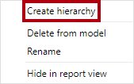
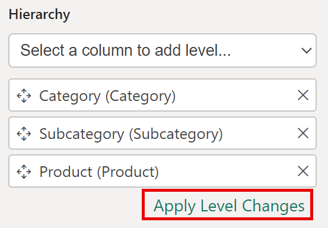
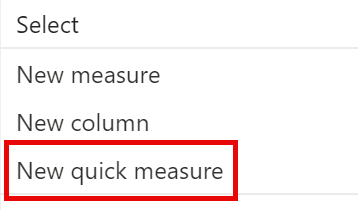
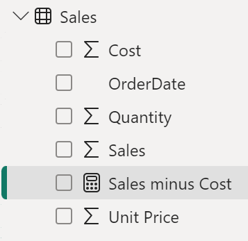

---
lab:
  course: 'PL-300, DP-605'
  title: "Concevoir un modèle de données dans Power\_BI"
  module: Design a Data Model in Power BI
---

# Concevoir un modèle de données dans Power BI

## **Histoire du labo**

Dans ce labo, vous allez commencer à développer le modèle de données. Pour cela, vous créerez des relations entre les tables, puis configurerez des propriétés de table et de colonne pour améliorer la convivialité du modèle de données. Vous créerez également des hiérarchies et des mesures rapides.

Dans ce labo, vous allez découvrir comment :

- Créer des relations de modèle
- Configurer des propriétés de table et de colonne
- Créer des hiérarchies

**Ce labo devrait prendre environ 45 minutes.**

## **Prise en main**

Lors de cette tâche, vous allez configurer l’environnement pour le labo.

1. Ouvrez Power BI Desktop.

    

1. Pour ouvrir le fichier Power BI Desktop de démarrage, sélectionnez **Ouvrir > Parcourir cet appareil**.

1. Accédez au dossier **D:\Allfiles\Labs\03-configure-data-model-in-power-bi-desktop\Starter** et sélectionnez le fichier **Sales Analysis**.

   *Remarque : à ce stade, Power BI vous demande de vous connecter si ce n’est déjà fait. Vous pouvez vous connecter ou sélectionner **Annuler** et continuer le labo.*

1. Fermez toutes les fenêtres d’information qui se sont éventuellement ouvertes.

1. Accédez à **Fichier > Enregistrer sous** et enregistrez le fichier dans le dossier **D:\Allfiles\MySolution**.

## **Créer des relations de modèle**

Dans cette tâche, vous créez des relations de modèle. Le fichier a été configuré de façon à ne pas identifier les relations entre les tables dans les labos précédents. Il ne s’agit pas du paramètre par défaut, mais il est recommandé afin d’éviter le travail supplémentaire de création des relations correctes pour votre modèle.

*Important : Les labos utilisent une notation abrégée pour référencer un champ, à savoir : **Product \| Category**. Dans cet exemple, **Product** est le nom de la table et **Category** correspond au nom du champ.*

1. Dans Power BI Desktop, à gauche, sélectionnez l’icône de la vue **Modèle**.

     

1. Si vous ne voyez pas les sept tables, faites défiler horizontalement vers la droite, puis rapprochez les tables en les faisant glisser pour qu’elles soient toutes visibles en même temps.

     *Conseil : Vous pouvez également vous servir du contrôle de zoom situé en bas de la fenêtre.*

1. Pour revenir à la vue Rapport, à gauche, sélectionnez l’icône de la vue **Rapport**.

     

1. Pour voir tous les champs de la table, dans le volet **Données**, cliquez avec le bouton droit sur une zone vide, puis sélectionnez **Développer tout**.

1. Pour créer un visuel table, dans le volet **Données**, à partir de la table **Product** (Produit), cochez le champ **Category** (Catégorie).

1. Pour ajouter une autre colonne à la table, dans le volet **Données**, cochez le champ **Sales \| Sales** (Ventes).

1. Notez que le visuel de table liste quatre catégories de produits et que la valeur des ventes est la même pour chaque catégorie et pour le total.

    *Le problème est que la table est basée sur des champs de tables différentes. Chaque catégorie de produit est censée afficher les ventes de cette catégorie. Toutefois, étant donné qu’il n’existe pas de relation de modèle entre ces tables, la table **Sales** n’est pas filtrée. Vous allez maintenant ajouter une relation pour propager les filtres entre les tables.*

     

1. Sous l’onglet de ruban **Modélisation**, à partir du groupe **Relations**, sélectionnez **Gérer les relations**.

     

1. Dans la fenêtre **Gérer les relations**, notez qu’aucune relation n’est encore définie.

1. Pour créer une relation, sélectionnez **Nouveau**.

1. Dans la fenêtre **Nouvelle relation**, dans la première liste déroulante, sélectionnez la table **Product**.

     

1. Dans la deuxième liste déroulante (sous la grille de la table **Product**), sélectionnez la table **Sales**.

     

1. Notez que les colonnes **ProductKey** de chaque table sont sélectionnées automatiquement.

    *Les colonnes ont été sélectionnées car elles partagent le même nom et le même type de données. Vous devrez peut-être trouver des colonnes correspondantes avec des noms différents dans des données réelles.*

1. Dans la liste déroulante **Cardinalité**, notez que l’option **Un à plusieurs (1:*)** est sélectionnée.

    *La cardinalité est détectée automatiquement, car Power BI comprend que la colonne **ProductKey** de la table **Product** contient des valeurs uniques. La relation un-à-plusieurs est la cardinalité la plus courante, et toutes les relations que vous créez dans ce labo sont de ce type.*

1. Dans la liste déroulante **Direction du filtre croisé**, notez que l’option **À sens unique** est sélectionnée.

    *Cette direction signifie que les filtres sont propagés du côté « un » au côté « plusieurs ». Dans ce cas, les filtres appliqués à la table **Product** sont propagés à la table **Sales**, mais pas dans la direction opposée.*

1. Notez que l’option **Rendre cette relation active** est cochée.

    *Les relations actives propagent les filtres. Il est possible de marquer une relation comme inactive pour ne pas propager les filtres. Vous pouvez avoir des relations inactives si plusieurs chemins de relation existent entre les tables. Dans ce cas, les calculs de modèle peuvent utiliser des fonctions spéciales pour les activer.*

1. Sélectionnez **OK**. Remarquez, dans la fenêtre **Gérer les relations**, que la nouvelle relation est listée, puis sélectionnez **Fermer**.

1. Notez qu’il existe maintenant un connecteur entre les deux tables (peu importe si les tables sont positionnées l’une en regard de l’autre).
    1. Vous pouvez interpréter la cardinalité représentée par les indicateurs **1** et **(*)** .
    1. La direction du filtre est représentée par la tête de flèche.
    1. Une ligne pleine représente une relation active, tandis qu’une ligne en pointillés représente une relation inactive.
    1. Placez le curseur sur la relation pour mettre en surbrillance les colonnes associées.

     

     Il existe un moyen plus simple de créer une relation. Dans le diagramme du modèle, vous pouvez faire glisser-déposer des colonnes pour créer une relation entre elles.

1. Pour créer une relation en utilisant une technique différente, à partir de la table **Reseller**, faites glisser la colonne **ResellerKey** sur la colonne **ResellerKey** de la table **Sales**.

    *Conseil : Parfois, il est impossible de faire glisser une colonne. Dans ce cas, sélectionnez une autre colonne, puis resélectionnez la colonne que vous souhaitez faire glisser et réessayez. Assurez-vous que vous voyez la nouvelle relation ajoutée au diagramme.*

     

1. Créez la nouvelle technique pour créer les deux relations modèle suivantes :

     - **Region \| SalesTerritoryKey** vers **Sales \| SalesTerritoryKey**
     - **Salesperson \| EmployeeKey** vers **Sales \| EmployeeKey**

1. Dans le diagramme, organisez les tables de manière à ce que la table **Sales** soit placée au centre du diagramme et que les tables associées soient disposées autour d'elle. Placez les tables déconnectées sur le côté.

     

1. Dans la vue de rapport, notez que le visuel de table a été mis à jour de façon à afficher des valeurs différentes pour chaque catégorie de produit.

    *Les filtres appliqués à la table **Product** sont désormais propagés à la table **Sales**.*

     

1. Enregistrez le fichier Power BI Desktop.

## **Configurer les tables**

Dans cet exercice, vous allez configurer toutes les tables. Pour cela, vous allez créer des hiérarchies et masquer, mettre en forme et catégoriser les colonnes.

## **Configurer la table Product**

Lors de cette tâche, vous allez configurer la requête **Product**.

1. Dans la vue Modèle, dans le volet **Données**, développez si nécessaire la table **Product**.

1. Pour créer une hiérarchie, dans le volet **Données**, cliquez avec le bouton droit sur la colonne **Category**, puis sélectionnez **Créer une hiérarchie**.

     

1. Dans le volet **Propriétés** (à gauche du volet **Données**), dans la zone **Nom**, remplacez le texte par **Products**.

1. Pour ajouter le deuxième niveau à la hiérarchie, dans le volet **Propriétés**, dans la liste déroulante **Hiérarchie**, faites défiler vers le bas et sélectionnez **Subcategory**.

1. Pour ajouter le troisième niveau à la hiérarchie, dans la liste déroulante **Hiérarchie**, sélectionnez **Product**.

1. Pour terminer la conception de la hiérarchie, sélectionnez **Appliquer les changements de niveau**.

     

    *Conseil : N’oubliez pas sélectionner **Appliquer les modifications de niveau**. Il est courant d’oublier cette étape.*

1. Dans le volet **Données**, notez la hiérarchie **Products**.

     

1. Pour faire apparaître les niveaux de hiérarchie, développez la hiérarchie **Products**.

     

1. Pour organiser les colonnes dans un dossier d’affichage, dans le volet **Données**, sélectionnez d’abord la colonne **Format de couleur d’arrière-plan**.

1. Tout en appuyant sur la touche **Ctrl**, sélectionnez la colonne **Font Color Format**.

1. Dans la zone **Dossier d’affichage** du volet **Propriétés**, entrez **Mise en forme**.

     

1. Dans le volet **Données**, notez que les deux colonnes sont maintenant dans un dossier.
    
   *Les dossiers d’affichage sont un excellent moyen de désencombrer les tables, en particulier celles qui contiennent un grand nombre de champs. Il s’agit uniquement d’une représentation logique.*

     

## **Configurer la table Region**

Lors de cette tâche, vous allez configurer la table **Region**.

1. Dans la table **Region**, créez une hiérarchie nommée **Region** avec les trois niveaux suivants :

     - Group
     - Country
     - Région

     

1. Sélectionnez la colonne **Country** (pas le niveau de hiérarchie **Country**).

1. Dans le volet **Propriétés**, développez la section **Avancé** (en bas du volet), puis dans la liste déroulante **Catégorie de données**, sélectionnez **Country/Region**.

    *La catégorisation des données peut fournir des indications au concepteur de rapports. Dans ce cas, le fait de placer la colonne dans la catégorie Country/Region permet de fournir des informations plus précises à Power BI pour le rendu d’une visualisation de carte.*

     

## **Configurer la table Reseller**

Lors de cette tâche, vous allez configurer la table **Reseller**.

1. Dans la table **Reseller**, créez une hiérarchie nommée **Resellers** avec les deux niveaux suivants :

     - Business Type
     - Reseller

1. Créez une deuxième hiérarchie nommée **Geography** avec les quatre niveaux suivants :

     - Country-Region
     - État-Province
     - City
     - Reseller

1. Définissez la **catégorie de données** pour les colonnes **Pays-Region**, **État-Province**, et **Ville** (non le niveau hiérarchique) sur **Pays/Region**, **État ou Province**, et **Ville**, respectivement.

## **Configurer la table Sales**

Lors de cette tâche, vous allez configurer la table **Sales**.

1. Dans la table **Sales**, sélectionnez la colonne **Cost**.

1. Dans la zone **Description** du volet **Propriétés**, entrez *Based on standard cost*.

    *Les descriptions peuvent être appliquées aux tables, aux colonnes, aux hiérarchies ou aux mesures. Dans le volet **Données**, le texte de la description apparaît dans une info-bulle quand un créateur de rapport place son curseur sur le champ.*

1. Sélectionnez la colonne **Quantity**.

1. Dans la section **Mise en forme** du volet **Propriétés**, faites passer la propriété **Séparateur de milliers** en position **Oui**.

1. Sélectionnez la colonne **Unit Price**.

1. Dans la section **Mise en forme** du volet **Propriétés**, définissez la propriété **Nombre de décimales** avec la valeur **2**.

1. Dans la liste déroulante **Totaliser par** du groupe **Avancé** (vous devrez peut-être faire défiler la page pour y accéder), sélectionnez **Moyenne**.

    *Par défaut, les colonnes numériques sont totalisées en additionnant les valeurs. Ce comportement par défaut ne convient pas à une colonne comme **Unit Price** qui représente un taux. Le fait de choisir une moyenne comme méthode de totalisation par défaut produit un résultat significatif.*

## **Mettre à jour en bloc les propriétés**

Lors de cette tâche, vous allez mettre à jour plusieurs colonnes à l’aide une seule mise à jour en bloc. Vous adopterez cette approche pour masquer les colonnes et mettre en forme les valeurs des colonnes.

1. Dans le volet **Vue de modèle** > **Données**, sélectionnez la colonne **Product \| ProductKey**.

1. Tout en appuyant sur la touche **Ctrl**, sélectionnez les 13 colonnes suivantes (couvrant plusieurs tables) :

     - Region \| SalesTerritoryKey
     - Reseller \| ResellerKey
     - Sales \| EmployeeKey
     - Sales \| ProductKey
     - Sales \| ResellerKey
     - Sales \| SalesOrderNumber
     - Sales \| SalesTerritoryKey
     - Salesperson \| EmployeeID
     - Salesperson \| EmployeeKey
     - Salesperson \| UPN
     - SalespersonRegion \| EmployeeKey
     - SalespersonRegion \| SalesTerritoryKey
     - Targets \| EmployeeID

1. Dans le volet **Propriétés**, faites passer la propriété **Est masqué** sur **Oui**.

    *Les colonnes ont été masquées, car elles sont utilisées par des relations ou sont utilisées dans la configuration de sécurité au niveau des lignes ou dans la logique de calcul.*

    *Vous utiliserez la colonne **SalesOrderNumber** dans un calcul dans le labo **Créer des calculs DAX dans Power BI Desktop**.*

1. Sélectionnez les trois colonnes suivantes (sélection multiple) :

     - Product \| Standard Cost
     - Sales \| Cost
     - Sales \| Sales

1. Dans la section **Mise en forme** du volet **Propriétés**, définissez la propriété **Nombre de décimales** avec la valeur **0** (zéro).

## **Passer en revue l’interface du modèle**

Dans cet exercice, vous allez passer à la vue Rapport et examiner l’interface du modèle.

## **Passer en revue l’interface du modèle**

Lors de cette tâche, vous allez passer à la vue Rapport et examiner l’interface du modèle.

1. Passez à la vue Rapport.

1. Dans le volet **Données**, notez les points suivants :

     - Les colonnes, les hiérarchies et leurs niveaux sont des champs qui peuvent être utilisés pour configurer des visuels de rapport
     - Seuls les champs applicables à la création de rapports sont visibles.
     - La table **SalespersonRegion** n’est pas visible, car tous ses champs sont masqués.
     - Les champs spatiaux dans les tables **Region** et **Reseller** sont ornés d’une icône spatiale.
     - Les champs ornés du symbole sigma (Ʃ) sont totalisés par défaut.
     - Une info-bulle apparaît quand vous placez le curseur sur le champ **Sales \| Cost**

1. Développez le champ **Sales \| OrderDate**, puis notez qu’il révèle une hiérarchie de dates.

    *Le champ **Targets \| TargetMonth** présente une hiérarchie similaire. Ces hiérarchies n’ont pas été créées par vous. Elles sont créées automatiquement. Il y a toutefois un problème. L’exercice comptable d’Adventure Works commence le 1er juillet de chaque année. En revanche, l’année de la hiérarchie de dates qui est créée automatiquement commence le 1er janvier de l’année.*

     

 Vous allez maintenant désactiver ce comportement automatique. Dans le labo **Créer des calculs DAX dans Power BI Desktop)** , vous utiliserez DAX pour créer une table de dates et vous la configurerez pour définir le calendrier Adventure Works.

1. Pour désactiver l’heure/date automatique, accédez au groupe **Fichier > Options et paramètres > Options > Fichier actuel**, puis sélectionnez **Chargement des données**.
    1. Dans la section **Time Intelligence**, décochez **Date/heure automatique**.

     

1. Dans le volet **Données**, notez que les hiérarchies de dates ne sont plus disponibles.

     

## **Créer des mesures rapides**

Dans cet exercice, vous allez créer deux mesures rapides.

## **Créer des mesures rapides**

Lors de cette tâche, vous allez créer deux mesures rapides pour calculer le profit et la marge bénéficiaire.

*Une mesure rapide crée la formule de calcul pour vous. Ce type de mesure est facile et rapide à créer pour les calculs simples et courants. Vous créerez des mesures sans utiliser cet outil dans le labo **Créer des calculs DAX dans Power BI Desktop**.*

1. Dans le volet **Données**, cliquez avec le bouton droit sur la table **Sales**, puis sélectionnez **Nouvelle mesure rapide**.

     

1. Dans la liste déroulante **Calcul** de la fenêtre **Mesures rapides**, dans le groupe **Opérations mathématiques**, sélectionnez **Soustraction**.

     

1. Dans le volet **Données** de la fenêtre **Mesures rapides**, développez la table **Sales**.

1. Faites glisser le champ **Sales** dans la zone **Valeur de base**.

1. Faites glisser le champ **Cost** dans la zone **Valeur à soustraire**, puis sélectionnez **Ajouter**.  

     

1. Dans le volet **Données**, dans la table **Sales**, notez cette nouvelle mesure.
    1. *Les mesures utilisent l’icône de calculatrice.*

     

1. Pour renommer la mesure, cliquez dessus avec le bouton droit, sélectionnez **Renommer**, puis renommez-la **Profit**.

    *Conseil : Pour renommer un champ, vous pouvez également double-cliquer dessus ou le sélectionner et appuyer sur **F2**.*

1. Dans la table **Sales**, ajoutez une deuxième mesure rapide basée sur les exigences suivantes :

     - Utiliser l’opération mathématique **Division**
     - Définir le **Numérateur** avec le champ **Sales \| Profit**
     - Définir le **Dénominateur** avec le champ **Sales \| Sales**
     - Renommer la mesure **Profit Margin**

1. Vérifiez que la mesure **Profit Margin** est sélectionnée, puis, dans le ruban contextuel **Outils de mesure**, choisissez le format **Pourcentage** avec deux décimales.

     

1. Pour tester les deux mesures, commencez par sélectionner le visuel de **table** dans la page du rapport.

1. Dans le volet **Données**, cochez les deux mesures.

     

1. Sélectionnez le repère droit et faites-le glisser pour élargir le visuel de table.

     

1. Vérifiez que les mesures produisent un résultat raisonnable qui est correctement mis en forme.

     

## **Créer une relation plusieurs-à-plusieurs**

Lors de cette tâche, vous allez créer une relation plusieurs-à-plusieurs entre la table **Salesperson** et la table **Sales**.

1. Dans Power BI Desktop, dans le volet **Données** de la vue Rapport, cochez les deux champs suivants pour créer un visuel **table**.

     - Salesperson \| Salesperson
     - Sales \| Sales

     

     *La table présente les ventes réalisées par chaque vendeur. Toutefois, il existe une autre relation entre les vendeurs et les ventes. Certains vendeurs appartiennent à une ou deux régions de vente voire plus. Par ailleurs, plusieurs vendeurs peuvent être affectés à une même région de vente.*

     *Du point de vue de la gestion des performances, les ventes d’un vendeur (sur la base des territoires qui lui sont affectés) doivent être analysées et comparées aux objectifs de vente. Dans le prochain exercice, vous allez créer les relations nécessaires à cette analyse.*

1. Notez que les ventes de **Michael Blythe** atteignent presque neuf millions de dollars.

1. Basculez vers la vue Modèle, puis faites glisser la table **SalespersonRegion** pour la placer entre les tables **Region** et **Salesperson**.

1. Créez les deux relations de modèle suivantes par glisser-déposer :

     - **Salesperson \| EmployeeKey** à **SalespersonRegion \| EmployeeKey**
     - **Region \| SalesTerritoryKey** à **SalespersonRegion \| SalesTerritoryKey**

    *La table **SalespersonRegion** peut être considérée comme une table de pontage.*

1. Si vous passez à la vue Rapport, vous pouvez noter que le visuel n’a pas été mis à jour. Le résultat des ventes de Michael Blythe est le même.

1. Revenez à la vue Modèle, puis suivez les directions du filtre de relation (pointe de flèche) à partir de la table **Salesperson**.

    *Notez que la table **Salesperson** filtre la table **Sales**. Elle filtre également la table **SalespersonRegion**, mais ne continue pas à propager des filtres à la table **Region** (la pointe de flèche va dans la mauvaise direction).*

     

1. Pour modifier la relation entre les tables **Region** et **SalespersonRegion**, double-cliquez sur la relation.

1. Dans la liste déroulante **Direction du filtre croisé** de la fenêtre **Modifier la relation**, sélectionnez **Les deux**.

1. Cochez la case **Appliquer le filtre de sécurité dans les deux directions**, puis sélectionnez OK.

     

1. Notez que la relation a désormais une flèche à deux pointes.

     

1. Si vous passez à la vue Rapport, vous pouvez noter que les valeurs des ventes sont toujours les mêmes.

    *Le problème est maintenant lié au fait qu’il existe deux chemins de propagation de filtre possibles entre les tables **Salesperson** et **Sales**. Cette ambiguïté est résolue en interne selon une évaluation de type « plus petit nombre de tables ». Pour être clair, vous ne devez pas concevoir des modèles avec ce type d’ambiguïté. Nous traiterons ce problème en partie plus tard dans ce labo, puis durant le labo **Créer des calculs DAX dans Power BI Desktop**.*

1. Basculez vers la vue Modèle pour forcer la propagation de filtre via la table de pontage. Modifiez (double-cliquez sur) la relation entre les tables **Salesperson** et **Sales**.

1. Dans la fenêtre **Modifier la relation**, décochez la case **Rendre cette relation active**, puis sélectionnez **OK**.

    *La propagation du filtre suivra désormais le seul chemin actif.*

1. Dans le diagramme, notez que la relation inactive est représentée par une ligne en pointillés.

     

1. Si vous passez à la vue Rapport, vous pouvez noter que les ventes de Michael Blythe atteignent presque 22 millions de dollars.

     

1. Notez également que la somme des ventes de chaque vendeur dépasse le total de la table.

     *Cela s’observe souvent en présence d’une relation plusieurs-à-plusieurs qui compte plusieurs fois les résultats des ventes régionales. Prenons Brian Welcker, le deuxième vendeur listé. Le montant de ses ventes est égal au montant total des ventes. Comme il est le directeur des ventes, ce résultat est correct : ses ventes correspondent aux ventes de toutes les régions.*

     *Bien que la relation plusieurs-à-plusieurs fonctionne, il est pour l’instant impossible d’analyser les ventes réalisées par un vendeur (car la relation est inactive). Dans le labo **Créer des calculs DAX dans Power BI Desktop**, vous pourrez réactiver la relation quand vous introduirez une table calculée permettant d’analyser les performances des vendeurs dans leurs régions.*

1. Passez à la vue Modélisation, puis dans le diagramme, sélectionnez la table **Salesperson**.

1. Dans la zone **Nom** du volet **Propriétés**, remplacez le texte par **Salesperson (Performance)**.

*La table renommée reflète désormais son objectif, à savoir signaler et analyser les performances des vendeurs en fonction des ventes réalisées dans les régions qui leur sont affectées.*

## **Créer une relation à la table Targets**

Lors de cette tâche, vous allez créer une relation à la table **Targets**.

1. Créez une relation à partir de la colonne **Salesperson (Performance) \| EmployeeID** et la colonne **Targets \| EmployeeID**.

1. Dans la vue Rapport, ajoutez le champ **Targets \| Target** au visuel de table.

1. Redimensionnez le visuel de table afin que toutes les colonnes soient visibles.

     

 *Vous pouvez désormais visualiser les ventes et les objectifs. Mais faites attention, et ce pour deux raisons. Premièrement, comme il n’y a pas de filtre sur une période de temps, les objectifs incluent également les quantités des objectifs futurs. Deuxièmement, les objectifs ne sont pas additifs et le total ne doit donc pas être affiché. Vous pouvez les désactiver à l’aide d’une mise en forme du visuel ou les supprimer à l’aide d’une logique de calcul. Vous suivrez la deuxième approche dans le labo **Créer des calculs DAX avancés dans Power BI Desktop**, où vous créerez une mesure d’objectif qui retourne une valeur vide (BLANK) quand plusieurs vendeurs sont filtrés.*

### **Terminer**

Dans cette tâche, vous allez terminer le labo.

Enregistrez le fichier Power BI Desktop, puis sélectionnez **Appliquer ultérieurement** si vous êtes invité à appliquer des requêtes.
