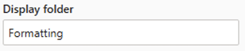
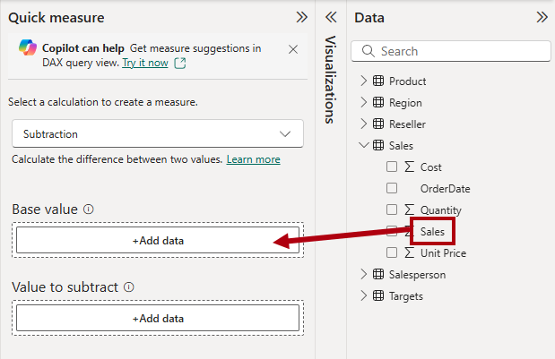

---
lab:
  title: "Configurer un modèle sémantique dans Power\_BI"
  module: Configure a semantic model in Power BI
---

# Configurer un modèle sémantique dans Power BI

## Histoire du labo

Dans ce labo, vous allez commencer à développer le modèle de données. Pour cela, vous créerez des relations entre les tables, puis configurerez des propriétés de table et de colonne pour améliorer la convivialité du modèle de données. Vous créerez également des hiérarchies et des mesures rapides.

Dans ce labo, vous découvrez comment :

- Créer des relations de modèle.
- Configurer les propriétés de table et de colonne
- Créer des hiérarchies.
- Créer des mesures rapides.
- Configurez une relation plusieurs à plusieurs.

**Ce labo devrait prendre environ 45 minutes.**

## Démarrage

Pour effectuer cet exercice, ouvrez d’abord un navigateur web et entrez l’URL suivante pour télécharger le fichier zip :

`https://github.com/MicrosoftLearning/PL-300-Microsoft-Power-BI-Data-Analyst/raw/Main/Allfiles/Labs/03-configure-semantic-model/03-model-data.zip`

Extrayez le dossier dans celui de **C:\Users\Student\Downloads\03-model-data**.

Ouvrez le fichier **03-Starter-Sales Analysis.pbix**.

> _**Remarque** : Une boîte de dialogue de connexion peut s’afficher au fur et à mesure que le fichier se charge. Sélectionnez **Annuler** pour ignorer la boîte de dialogue de connexion. Fermez toutes les autres fenêtres d’information ouvertes. Si vous êtes invité à appliquer les modifications, sélectionnez **Appliquer plus tard**_.

## Créer des relations de modèle

Dans cette tâche, vous créez des relations de modèle. Le fichier a été configuré pour ne pas identifier les relations entre les tables. Il ne s’agit pas du paramètre par défaut, mais il est recommandé afin d’éviter le travail supplémentaire de création des relations correctes pour votre modèle.

> Les labos utilisent une notation abrégée pour référencer un champ. Elle se présente comme suit : `Product | Category`. Dans cet exemple, `Product` est le nom de la table et `Category` le nom de champ.

1. Dans Power BI Desktop, pour voir tous les champs de la table, dans le volet **Données**, faites un clic droit sur une zone vide, puis sélectionnez **Développer tout**.

1. Pour créer un visuel de table, dans le volet **Données**, à partir de l’intérieur de la table `Product`, cochez le champ `Category`.

1. Pour ajouter une autre colonne à la table, dans le volet **Données**, cochez le champ `Sales | Sales`.

1. Notez que le visuel de table liste quatre catégories de produits et que la valeur des ventes est la même pour chaque catégorie et pour le total.

    

    > _Le problème est dû au fait que la table est basée sur des champs de tables différentes. Chaque catégorie de produit est censée afficher les ventes de cette catégorie. Toutefois, étant donné qu’il n’existe pas de relation de modèle entre ces tables, la table `Sales` n’est pas filtrée. Vous allez maintenant ajouter une relation pour propager les filtres entre les tables._

1. Pour basculer vers le concepteur de modèles, à gauche, sélectionnez l’icône de la **vue Modèle**.

    

1. Dans le ruban **Accueil**, sélectionnez **Gérer les relations**.

    

1. Dans la fenêtre **Gérer les relations**, notez qu’aucune relation n’est encore définie.

1. Pour créer une relation, sélectionnez **+ Nouvelle relation**.

1. Pour configurer une relation entre une table `Product` et une table `Sales`, dans la liste déroulante **De la table**, sélectionnez la table `Product` et, dans la liste déroulante **À la table**, sélectionnez la table `Sales`.

    

1. Notez que les propriétés suivantes ont été automatiquement configurées :

    - **Les colonnes ProductKey de chaque table sont sélectionnées**. _Les colonnes ont été sélectionnées car elles partagent le même nom et le même type de données. Vous devrez peut-être trouver des colonnes correspondantes avec des noms différents dans des données réelles._
    - **La cardinalité est de type un-à-plusieurs (1 :\*)**. _La cardinalité est détectée automatiquement, car Power BI comprend que la colonne `ProductKey` de la table `Product` contient des valeurs uniques. La relation un-à-plusieurs est la cardinalité la plus courante, et toutes les relations que vous créez dans ce labo sont de ce type._
    - **La direction de filtre croisé est de type simple**. _Cette direction signifie que les filtres sont propagés du côté « un » au côté « plusieurs ». Dans ce cas, les filtres appliqués à la table `Product` sont propagés à la table `Sales`, mais pas dans la direction opposée._
    - **Notez que l’option Rendre cette relation active est cochée**. _Les relations actives propagent les filtres. Il est possible de marquer une relation comme inactive pour ne pas propager les filtres. Vous pouvez avoir des relations inactives si plusieurs chemins de relation existent entre les tables. Dans ce cas, les calculs de modèle peuvent utiliser des fonctions spéciales pour les activer._

    

1. Sélectionnez **Enregistrer**. Remarquez, dans la fenêtre **Gérer les relations**, que la nouvelle relation est listée, puis sélectionnez **Fermer**.

1. Dans le diagramme de modèle, notez qu’il existe maintenant un connecteur entre les deux tables (vous pouvez choisir de repositionner les tables pour voir la relation plus clairement).

    

    > _Vous pouvez interpréter la plupart des propriétés de relation en examinant la ligne de relation dans le diagramme :_
    >
    > - _La cardinalité est représentée par les indicateurs **1** et **(\*)**._
    > - _La direction du filtre est représentée par la tête de flèche._
    > - _Une ligne pleine représente une relation active, tandis qu’un trait en pointillé représente une relation inactive._
    >
    > Conseil : Si vous placez le curseur sur la relation pour mettre en surbrillance les colonnes associées._

1. Basculez dans la **vue Rapport**, puis notez que le visuel de table a été mis à jour de façon à afficher des valeurs différentes pour chaque catégorie de produit.

    > _Les filtres appliqués à la table `Product` se propagent désormais à la table `Sales`._

    

## Créer des relations supplémentaires

Il existe un moyen plus simple de créer une relation. Dans le diagramme du modèle, vous pouvez faire glisser-déposer des colonnes pour créer une relation entre elles.

1. Pour créer une relation à l’aide d’une autre technique, basculez vers la **vue Modèle**.

1. Dans la table `Reseller`, faites glisser la colonne `ResellerKey` sur la colonne `ResellerKey` de la table `Sales`.

    > _**Important** : Parfois, il est impossible de faire glisser une colonne. Dans ce cas, sélectionnez une autre colonne, puis resélectionnez la colonne que vous souhaitez faire glisser et réessayez. Assurez-vous que vous voyez la nouvelle relation ajoutée au diagramme._

    

1. Dans la fenêtre **Nouvelle relation**, passez en revue la configuration, puis sélectionnez **Enregistrer**.

1. Créez la nouvelle technique pour créer les deux relations modèle suivantes :

     - Il lance `Region | SalesTerritoryKey` sur `Sales | SalesTerritoryKey`.
     - Il lance `Salesperson | EmployeeKey` sur `Sales | EmployeeKey`.

1. Dans le diagramme, organisez les tables afin que la table `Sales` soit positionnée au centre du diagramme et que les tables associées soient organisées à ce sujet. Placez les tables déconnectées sur le côté.

    

1. Enregistrez le fichier Power BI Desktop.

## Configurer la table Product

Dans cette tâche, vous allez configurer la table `Product` avec une hiérarchie et un dossier d’affichage.

1. Basculez vers la vue **Modèle**.

1. Dans le volet **Données**, développez si nécessaire la table `Product` pour afficher tous les champs.

1. Dans le tableau `Product`,faites un clic droit sur la colonne `Category`, puis sélectionnez **Créer une hiérarchie**.

    

1. Dans le volet **Propriétés**, dans la zone **Nom**, remplacez la valeur par _Products_.

    

1. Deux niveaux d’ajout à la hiérarchie, dans la liste déroulante **Hiérarchie**, sélectionnez **Sous-catégorie**, puis Sélectionnez **Produit**, puis **Appliquer les modifications de niveau**.

    

1. Dans le volet **Données**, notez la hiérarchie `Products` : Pour afficher les niveaux de hiérarchie, développez-la.

    

1. Pour organiser les colonnes dans un dossier d’affichage, dans le volet **Données**, sélectionnez d’abord la colonne `Background Color Format`.

1. Tout en appuyant sur la touche **Ctrl**, sélectionnez la colonne `Font Color Format`.

1. Dans la zone **Dossier d’affichage** du volet **Propriétés**, entrez _Mise en forme_.

    

1. Dans le volet **Données**, notez que les deux colonnes sont maintenant dans un dossier.

    

    > _Les dossiers d’affichage sont un excellent moyen d’organiser les tables, en particulier celles qui contiennent un grand nombre de champs. Il s’agit uniquement d’une représentation logique._

## Configurer la table Region

Dans cette tâche, vous allez configurer la table `Region` avec une hiérarchie et des catégories mises à jour.

1. Dans la table `Region`, créez une hiérarchie nommée _Région_ avec les trois niveaux suivants :

     - `Group`
     - `Country`
     - `Region`

1. Sélectionnez la colonne `Country` (pas le niveau de hiérarchie `Country`).

1. Dans le volet **Propriétés**, développez la section **Avancé** (située en bas du volet), puis dans la liste déroulante **Catégorie de données**, sélectionnez **Country/Region**.

    

    > _La catégorisation des données peut fournir des indications au concepteur de rapports. Dans ce cas, le fait de placer la colonne dans la catégorie Country/Region permet de fournir des informations plus précises à Power BI pour le rendu d’une visualisation de carte._

## Configurer la table Reseller

Dans cette tâche, vous allez configurer la table `Reseller` pour ajouter une hiérarchie et mettre à jour les catégories de données.

1. Dans la table `Reseller`, créez une hiérarchie nommée _Revendeurs_ avec les deux niveaux suivants :

     - `Business Type`
     - `Reseller`

1. Créez une deuxième hiérarchie nommée _Geography_ avec les quatre niveaux suivants :

     - `Country-Region`
     - `State-Province`
     - `City`
     - `Reseller`

1. Définissez la catégorie de données pour les colonnes suivantes (hors de la hiérarchie) :

    - `Country-Region` au **pays/région**
    - `State-Province`à** l’État ou la province**
    - `City` à la **Ville**

## Configurer la table Sales

Dans cette tâche, vous configurerez la table `Sales` en mettant à jour les descriptions, la mise en forme et la synthèse.

1. Dans la table `Sales`, sélectionnez la colonne `Cost`.

1. Dans la zone **Description** du volet **Propriétés**, entrez : _Based on standard cost_

    > _Les descriptions peuvent être appliquées aux tables, aux colonnes, aux hiérarchies ou aux mesures. Dans le volet **Données**, le texte de la description apparaît dans une info-bulle quand un créateur de rapport place son curseur sur le champ._

1. Sélectionnez la colonne `Quantity`.

1. Dans la section **Mise en forme** du volet **Propriétés**, définissez la propriété **Séparateur de milliers** sur _Oui_.

1. Sélectionnez la colonne `Unit Price`.

1. Dans la section **Mise en forme** du volet **Propriétés**, définissez la propriété **Nombre de décimales** avec la valeur _2_.

1. Dans la liste déroulante **Totaliser par** du groupe **Avancé** (vous devrez peut-être faire défiler la page pour y accéder), sélectionnez **Moyenne**.

    > _Par défaut, les colonnes numériques sont totalisées en additionnant les valeurs. Ce comportement par défaut n’est pas adapté à une colonne comme `Unit Price`, ce qui représente un taux. Le fait de choisir une moyenne comme méthode de totalisation par défaut produit un résultat significatif._

## Mettre à jour en bloc les propriétés

Lors de cette tâche, vous allez mettre à jour plusieurs colonnes à l’aide une seule mise à jour en bloc. Vous adopterez cette approche pour masquer les colonnes et mettre en forme les valeurs des colonnes.

1. Dans le volet **Données** (ou diagramme de modèle), sélectionnez la colonne `Product | ProductKey`.

1. Tout en appuyant sur la touche **Ctrl**, sélectionnez les 13 colonnes suivantes (couvrant plusieurs tables) :

     - `Region | SalesTerritoryKey`
     - `Reseller | ResellerKey`
     - `Sales | EmployeeKey`
     - `Sales | ProductKey`
     - `Sales | ResellerKey`
     - `Sales | SalesOrderNumber`
     - `Sales | SalesTerritoryKey`
     - `Salesperson | EmployeeID`
     - `Salesperson | EmployeeKey`
     - `Salesperson | UPN`
     - `SalespersonRegion | EmployeeKey`
     - `SalespersonRegion | SalesTerritoryKey`
     - `Targets | EmployeeID`

1. Dans le volet **Propriétés**, définissez la propriété **Est masquée** sur _Oui_.

    > _Les colonnes ont été masquées, car elles sont utilisées par des relations ou sont utilisées dans la configuration de sécurité au niveau des lignes ou dans la logique de calcul._
    >
    > _Vous utiliserez la colonne `SalesOrderNumber` dans un calcul dans le laboratoire **Créer des calculs DAX dans Power BI Desktop**._

1. Sélectionnez les trois colonnes suivantes (sélection multiple) :

     - `Product | Standard Cost`
     - `Sales | Cost`
     - `Sales | Sales`

1. Dans la section **Mise en forme** du volet **Propriétés**, définissez la propriété **Nombre de décimales** avec la valeur _0_ (zéro).

## Explorer l’interface du modèle

Dans cette tâche, vous allez passer à la **vue Rapport**, examiner l’interface du modèle de données et configurer le paramètre Date/heure automatique.

1. Passez à l’affichage **Report**.

1. Dans le volet **Données**, notez les points suivants :

     - Les colonnes, les hiérarchies et leurs niveaux sont des champs qui peuvent être utilisés pour configurer des visuels de rapport.
     - Seuls les champs applicables à la création de rapports sont visibles.
     - La table `SalespersonRegion` n’est pas visible, car tous ses champs sont masqués.
     - Les champs spatiaux de la table `Region` et de la table `Reseller` sont ornés d’une icône spatiale.
     - Les champs ornés du symbole sigma (Ʃ) sont totalisés par défaut.
     - Une info-bulle apparaît quand vous placez le curseur sur le champ `Sales | Cost`.

1. Développez le champ`Sales | OrderDate`, puis notez qu’il révèle un `Date Hierarchy`. Le champ `Targets | TargetMonth` fournit une hiérarchie similaire.

    

    > _**Important** : Ces hiérarchies n’ont pas été créées par vous. Elles ont été créées automatiquement en tant que paramètre par défaut. Il y a tout de même un problème. L’exercice comptable d’Adventure Works commence le 1er juillet de chaque année. En revanche, l’année de la hiérarchie de dates qui est créée automatiquement commence le 1er janvier de l’année._

1. Pour désactiver le paramètre Date/heure automatique, accédez à **Fichier > Options et paramètres > Options**.

1. Dans la fenêtre **Options**, dans la section **Fichier à jour**, accédez à **Charger des données > Assistant Time Intelligence**, et décochez **Date/Heure automatique**.

    

1. Dans le volet **Données**, notez que les hiérarchies de dates ne sont plus disponibles.

## Créer des mesures rapides

Lors de cette tâche, vous allez créer deux mesures rapides pour calculer le profit et la marge bénéficiaire. Une mesure rapide crée la formule de calcul pour vous. Ce type de mesure est facile et rapide à créer pour les calculs simples et courants.

1. Dans le volet **Données**, faites un clic droit sur la table `Sales`, puis sélectionnez **Nouvelle mesure rapide**.

    

1. Dans le volet **Mesures rapides**, dans la liste déroulante, **sélectionnez un Calcul**, à l'intérieur du groupe **Opérations mathématiques**, sélectionnez **Soustraction**.

    

1. Dans le volet **Données**, faites glisser le champ `Sales | Sales` dans le compartiment **Valeur de base**.

    

1. Faites glisser le champ `Sales | Cost` dans la zone **Valeur à soustraire**.  

    

1. Sélectionnez **Ajouter**.

1. Dans le volet **Données**, dans la table `Sales`, notez cette nouvelle mesure.

    > _Les mesures sont indiquées par l’icône de calculatrice._

    

1. Pour renommer la mesure, cliquez dessus avec le bouton droit, sélectionnez **Renommer**, puis renommez-la en _Profit_.

    > _Conseil : Pour renommer un champ, vous pouvez également double-cliquer dessus ou le sélectionner et appuyer sur **F2**._

1. Dans la table `Sales`, ajoutez une deuxième mesure rapide basée sur les exigences suivantes :

    > _**Important** : Si l’option de création d’une mesure rapide n’apparaît pas dans le menu contextuel, utilisez la commande située dans le ruban **Accueil**, à partir du groupe **Calculs**.

    - Utilisez l’opération mathématique **Division**.
    - Définissez le **Numérateur** sur le champ `Sales | Profit`.
    - Définissez le **Dénominateur** sur le champ `Sales | Sales`.
    - Renommez la mesure _Marge bénéficiaire_.

1. Vérifiez que la mesure `Profit Margin` est sélectionnée, puis, dans le ruban contextuel **Outils de mesure**, choisissez le format **Pourcentage** avec deux décimales.

    

1. Pour tester les deux mesures, commencez par sélectionner le visuel de table existant dans la page du rapport.

1. Dans le volet **Données**, vérifiez les mesures `Profit` et `Profit Margin` à ajouter à la table.

    

1. Sélectionnez le repère droit et faites-le glisser pour élargir le visuel de table.

    

1. Vérifiez que les mesures produisent un résultat raisonnable qui est correctement mis en forme.

    

## Créer une relation plusieurs à plusieurs

Dans cette tâche, vous allez créer une relation plusieurs à plusieurs entre la table `Salesperson` et la table `Sales`.

1. Dans la **vue Rapport**, sélectionnez une zone vierge de la page du rapport.

1. Pour créer un visuel de table, dans le volet **Données**, vérifiez les deux champs suivants :

     - `Salesperson | Salesperson`
     - `Sales | Sales`

    

    > _Le visuel de table présente les ventes réalisées par chaque vendeur. Toutefois, il existe une autre relation entre les vendeurs et les ventes. Certains vendeurs appartiennent à une ou deux régions de vente voire plus. Par ailleurs, plusieurs vendeurs peuvent être affectés à une même région de vente._
    >
    > _Du point de vue de la gestion des performances, les ventes d’un vendeur (sur la base des territoires qui lui sont affectés) doivent être analysées et comparées aux objectifs de vente. Dans le prochain exercice, vous allez créer les relations nécessaires à cette analyse._

1. Notez que _Michael Blythe_ a généré près de 9 millions de dollars de ventes.

1. Basculez vers la **vue Modèle**, puis faites glisser la table `SalespersonRegion` pour la positionner entre les tables `Region` et `Salesperson`.

1. Créez les deux relations de modèle suivantes par glisser-déposer :

    - Il lance `Salesperson | EmployeeKey` sur `SalespersonRegion | EmployeeKey`.
    - Il lance `Region | SalesTerritoryKey` sur `SalespersonRegion | SalesTerritoryKey`.

    > _La table `SalespersonRegion` peut être considérée comme une table de pontage._

1. Si vous passez à la **vue Rapport**, vous pouvez noter que le visuel n’a pas été mis à jour. Le résultat des ventes de Michael Blythe est le même.

1. Revenez à la **vue Modèle**, puis suivez les directions du filtre de relation (pointe de flèche) à partir de la table `Salesperson`.

    > _Considérez que la table `Salesperson` filtre la table `Sales`. Il filtre également la table `SalespersonRegion`, mais elle ne continue pas en propageant des filtres à la table `Region` (la pointe de flèche est orientée dans la mauvaise direction)._

    

1. Pour modifier la relation entre les tables `Region`et `SalespersonRegion`, double-cliquez sur la relation.

1. Dans la liste déroulante **Direction du filtre croisé** de la fenêtre **Modifier la relation**, sélectionnez _Les deux_.

1. Cochez la case **Appliquer le filtre de sécurité dans les deux directions**.

    

1. Cliquez sur **Enregistrer**.

1. Notez que la relation a désormais une flèche à deux pointes.

    

1. Si vous passez à la **vue Rapport**, vous pouvez noter que les valeurs des ventes sont toujours les mêmes.

    > _Le problème vient maintenant du fait qu’il existe deux chemins de propagation de filtre possibles entre les tables `Salesperson` et `Sales`. Cette ambiguïté est résolue en interne selon une évaluation de type « plus petit nombre de tables ». Pour être clair, vous ne devez pas concevoir des modèles avec ce type d'ambiguïté. Nous traiterons ce problème en partie plus tard dans ce labo, puis durant le labo **Créer des calculs DAX dans Power BI Desktop**._

1. Basculez vers la vue **Modèle**.

1. Pour forcer la propagation du filtre par le biais de la table de pontage, modifiez (double-cliquez) la relation entre les tables `Salesperson` et `Sales`.

1. Dans la fenêtre **Modifier la relation**, décochez la case **Rendre cette relation active**.

    

1. Cliquez sur **Enregistrer**.

    > _La propagation du filtre suivra désormais le seul chemin actif._

1. Dans le diagramme du modèle, notez que la relation inactive est représentée par un trait en pointillé.

    

1. Si vous passez à la **vue Rapport**, vous pouvez noter que les ventes de Michael Blythe atteignent presque 22 millions de dollars.

1. Notez également que la somme des ventes de chaque vendeur dépasse le total de la table.

     > _Cela s’observe souvent en présence d’une relation plusieurs-à-plusieurs qui compte plusieurs fois les résultats des ventes régionales. Prenons Brian Welcker, le deuxième vendeur listé. Le montant de ses ventes est égal au montant total des ventes. C'est un bon résultat, car il est le Directeur des ventes ; ses ventes sont mesurées par les ventes de toutes les régions._
     >
     > _Bien que la relation plusieurs-à-plusieurs fonctionne, il est pour l’instant impossible d’analyser les ventes réalisées par un vendeur (car la relation est inactive). Dans le laboratoire **Créer des calculs DAX dans Power BI Desktop**, vous pourrez réactiver la relation quand vous introduirez une table calculée permettant d’analyser les performances des vendeurs dans leurs régions._

1. Basculez vers la **vue Modèle**, puis, dans le diagramme de modèle, sélectionnez la table `Salesperson`.

1. Dans la zone **Nom** du volet **Propriétés**, remplacez le texte par _Salesperson (Performance)_.

    > _La table renommée reflète désormais son objectif, à savoir signaler et analyser les performances des vendeurs en fonction des ventes réalisées dans les régions qui leur sont affectées._

## Créer une relation à la table Targets

Lors de cette tâche, vous allez créer une relation à la table `Targets`.

1. Créez une relation à partir de la colonne `Salesperson (Performance) | EmployeeID` et de la colonne `Targets | EmployeeID`.

1. Dans la **vue Rapport**, ajoutez le champ `Targets | Target` au visuel de table.

1. Redimensionnez le visuel de table afin que toutes les colonnes soient visibles.

    

 > _Vous pouvez désormais visualiser les ventes et les objectifs, mais pour l'instant, soyez prudent, et ce pour deux raisons. Premièrement, comme il n’y a pas de filtre sur une période de temps, les objectifs incluent également les quantités des objectifs futurs. Deuxièmement, les objectifs ne sont pas additifs et le total ne doit donc pas être affiché. Vous pouvez les désactiver à l’aide d’une mise en forme du visuel ou les supprimer à l’aide d’une logique de calcul._

1. Enregistrez le fichier Power BI Desktop.

## Labo terminé

Vous pouvez choisir d’enregistrer votre rapport Power BI, même s’il n’est pas nécessaire pour ce labo. Dans l’exercice suivant, vous allez utiliser un fichier de démarrage prédéfini.

1. Accédez au menu **« Fichier »** dans le coin supérieur gauche, puis sélectionnez **« Enregistrer sous ».** 
1. Sélectionnez **Parcourir cet appareil**.
1. Sélectionnez le dossier dans lequel vous souhaitez enregistrer le fichier et donnez-lui un nom descriptif. 
1. Sélectionnez le bouton **Enregistrer** pour enregistrer votre rapport en tant que fichier .pbix. 
1. Si une boîte de dialogue s’affiche pour vous inviter à appliquer des modifications de requête en attente, sélectionnez **Appliquer**.
1. Fermez Power BI Desktop.