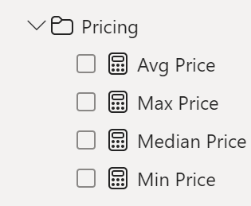
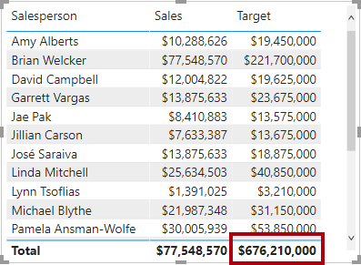

---
lab:
  title: "Créer des calculs DAX dans Power\_BI Desktop"
  module: Create Model Calculations using DAX in Power BI
---


# Créer des calculs DAX dans Power BI Desktop

## **Histoire du labo**

Dans ce labo, vous allez créer des tables calculées, des colonnes calculées et des mesures simples à l’aide de DAX (Data Analysis Expressions).

Dans ce labo, vous allez découvrir comment :

- Créer des tables calculées
- Créer des colonnes calculées
- Créer des mesures

**Ce labo devrait prendre environ 45 minutes.**

## Démarrage

Pour effectuer cet exercice, ouvrez d’abord un navigateur web et entrez l’URL suivante pour télécharger le dossier zip :

`https://github.com/MicrosoftLearning/PL-300-Microsoft-Power-BI-Data-Analyst/raw/Main/Allfiles/Labs/04-create-dax-calculations-in-power-bi-desktop\04-intro-dax.zip`

Extrayez le dossier dans le dossier **C:\Users\Student\Downloads\04-intro-dax**.

Ouvrez le fichier **04-Starter-Sales Analysis.pbix**.

> ***Remarque** : vous pouvez ignorer la connexion en sélectionnant **Annuler**. Fermez toutes les autres fenêtres d’information ouvertes. Si vous êtes invité à appliquer les modifications, sélectionnez **Appliquer plus tard**.

## Créer la table calculée Salesperson (Vendeur)

Au cours de cette tâche, vous allez créer la table calculée **Salesperson**, qui a une relation directe avec la table **Sales**.

Pour créer une table calculée, commencez par entrer son nom, suivi du symbole égal (=), puis d’une formule DAX qui retourne une table. Le nom de la table ne doit pas être déjà présent dans le modèle de données.

La barre de formule accepte la saisie d’une formule DAX valide. Elle comprend des fonctionnalités telles que la saisie semi-automatique, IntelliSense et le code de couleurs, qui permettent d’entrer rapidement et correctement la formule.

1. Dans Power BI Desktop, dans la vue Rapport, dans le ruban **Modélisation**, dans le groupe **Calculs**, sélectionnez **Nouvelle table**.

     

2. Dans la barre de formule (qui s’ouvre directement sous le ruban lors de la création ou de la modification de calculs), tapez **Salesperson =**, appuyez sur **Maj+Entrée**, tapez **'Salesperson (Performance)'**, puis appuyez sur **Entrée**.

    > **Remarque** : *pour des raisons pratiques, toutes les définitions DAX de ce labo peuvent être copiées à partir du fichier d’extrait de code, situé dans **4-intro-dax\Snippets.txt**.*

     

    > *Cette définition de table crée une copie de la table **Salesperson (Performance)** . Elle copie uniquement les données, et non les propriétés (visibilité, mise en forme, etc.).*

1. Comme vous pouvez le constater dans le volet **Données**, l’icône de table est précédée d’une calculatrice supplémentaire (indiquant une table calculée).

    

    > ***Remarque** : les tables calculées sont définies à l’aide d’une formule DAX qui retourne une table. Il est important de comprendre que les tables calculées augmentent la taille du modèle de données, car elles matérialisent et stockent des valeurs. Elles sont recalculées chaque fois que les dépendances de la formule sont actualisées, comme ce sera le cas dans ce modèle de données lorsque de nouvelles valeurs de date (ultérieures) seront chargées dans les tables.*
    >
    > *Contrairement aux tables provenant de Power Query, les tables calculées ne permettent pas de charger des données à partir de sources externes. Elles ne peuvent transformer les données que sur la base de ce qui a déjà été chargé dans le modèle de données.*

1. Basculez vers la vue Modèle et notez que la table **Salesperson** est disponible (vous devrez peut-être réinitialiser la vue pour trouver la table).

1. Créez une relation entre les colonnes **Salesperson \| EmployeeKey** et **Sales \| EmployeeKey**.

1. Cliquez avec le bouton droit sur la relation inactive entre les tables **Salesperson (Performance)** (Vendeur (Performance)) et **Sales** (Ventes), puis sélectionnez **Supprimer**. Lorsque vous êtes invité à confirmer la suppression, sélectionnez **Oui**.

1. Dans la table **Salesperson**, sélectionnez les colonnes suivantes, puis masquez-les (définissez la propriété **Is Hidden** sur **Oui**) :

    - EmployeeID (IDEmployé)
    - EmployeeKey (CléEmployé)
    - UPN

1. Dans le diagramme du modèle, sélectionnez la table **Salesperson** (Vendeur).

1. Dans la zone **Description** du volet **Propriétés**, entrez : **Salesperson related to Sales** (Vendeur lié à Ventes)
    
    > *Pour rappel, les descriptions apparaissent sous forme d’info-bulles dans le volet **Données** quand l’utilisateur place le curseur sur une table ou un champ.*

1. Pour la table **Salesperson (Performance)**, définissez la description **Salesperson related to region(s)**

*Le modèle de données offre désormais deux possibilités pour l’analyse des vendeurs. La table **Salesperson** permet d’analyser les ventes effectuées par un vendeur, tandis que le tableau **Salesperson (Performance)** permet d’analyser les ventes effectuées dans la ou les régions de vente affectées au vendeur.*

## Créer la table Date

Dans cette tâche, vous allez créer la table **Date**.

1. Revenez à la vue Table. Dans le groupe **Calculs** de l’onglet de ruban **Accueil**, sélectionnez **Nouvelle table**.

    

1. Dans la barre de formule, entrez les fonctions DAX suivantes :

    ```DAX
    Date =  
    CALENDARAUTO(6)
    ```

    

    > *La fonction CALENDARAUTO() retourne une table à une colonne composée de valeurs de date. Le comportement « automatique » consiste à analyser toutes les colonnes de date du modèle de données pour trouver les valeurs de date les plus anciennes et les plus récentes stockées dans le modèle de données. Une ligne est ensuite créée pour chaque date de cette plage, en étendant la plage dans les deux sens pour que les années de données stockées soient complètes.*
    >
    > *Cette fonction accepte un seul argument facultatif, à savoir le dernier numéro de mois d’une année. Quand elle n’est pas précisée, la valeur est 12, c’est-à-dire que décembre est considéré comme le dernier mois de l’année. Dans le cas présent, on entre 6 pour indiquer que juin est le dernier mois de l’année.*

1. Notez la colonne de valeurs de dates qui sont mises en forme selon les paramètres régionaux des États-Unis (c.-à-d., mm/jj/aaaa).

    

1. Dans la barre d’état en bas à gauche, les statistiques de la table confirment que 1 826 lignes de données ont été générées, ce qui représente les données de cinq années complètes.

    

## Créer des colonnes calculées

Au cours de cette tâche, vous allez ajouter des colonnes supplémentaires pour permettre le filtrage et le regroupement selon différentes périodes. Vous allez également créer une colonne calculée qui contrôlera l’ordre de tri des autres colonnes.

> **Remarque** : *pour des raisons pratiques, toutes les définitions DAX de ce labo peuvent être copiées à partir du fichier **Snippets.txt**.*

1. Dans le groupe **Calculs** du ruban contextuel **Outils de table**, sélectionnez **Nouvelle colonne**.

    > *Pour créer une colonne calculée, commencez par entrer son nom, suivi du symbole égal (=), puis d’une formule DAX qui retourne comme résultat une valeur unique. Le nom de la colonne ne doit pas être déjà présent dans la table.*

    

1. Dans la barre de formule, tapez les éléments suivants (ou copiez à partir du fichier d’extraits de code), puis appuyez sur **Entrée** :
    > *La formule utilise la valeur d’année de la date, en y ajoutant un si le mois est postérieur au mois de juin. C’est ainsi que sont calculés les exercices chez Adventure Works.*

   ```DAX
   Year =
   "FY" & YEAR('Date'[Date]) + IF(MONTH('Date'[Date]) > 6, 1)
   ```


1. Utilisez la définition des fichiers d’extraits de code afin de créer les deux colonnes calculées suivantes pour la table **Date** :

    - Quarter (Trimestre)
    - Mois

1. Vérifiez que les nouvelles colonnes ont été ajoutées.

    

1. Pour valider les calculs, basculez vers l’affichage Rapport.

1. Pour créer une page de rapport, sélectionnez l’icône plus en regard de Page 1.

    

1. Pour ajouter un visuel matrice à la nouvelle page de rapport, sélectionnez le type de visuel matrice dans le volet **Visualisations**.

    > *Conseil : Vous pouvez pointer le curseur sur chaque icône pour voir une info-bulle décrivant le type de visuel.*

    

1. Dans la table **Date** du volet **Données**, faites glisser le champ **Year** (Années) dans la barre d’outils/zone **Lignes**.

    

1. Faites glisser le champ **Month** (Mois) dans la zone **Lignes**, directement sous le champ **Year** (Année).

1. En haut à droite du visuel de matrice (ou en bas, en fonction de l’emplacement du visuel), sélectionnez l’icône de flèche double fourchée (qui développera toutes les années vers le bas d’un niveau).

    

1. Comme vous pouvez le constater, les années se développent en mois, qui sont triés par ordre alphabétique plutôt que par ordre chronologique.

    

    > *Par défaut, les valeurs de texte sont triées par ordre alphabétique, les nombres du plus petit au plus grand et les dates de la plus ancienne à la plus récente.*

1. Pour personnaliser l’ordre de tri du champ **Mois**, basculez vers la vue Table.

1. Ajoutez la colonne **MonthKey** (CléMois) à la table **Date**.

    ```DAX
    MonthKey =
    (YEAR('Date'[Date]) * 100) + MONTH('Date'[Date])
    ```

    > *Cette formule calcule une valeur numérique pour chaque combinaison année/mois.*

1. Dans la vue Table, vérifiez que la nouvelle colonne contient des valeurs numériques (par exemple, 201707 pour juillet 2017, etc.).

    

1. Revenez dans la vue Rapport. Dans le volet **Données**, sélectionnez **Mois**.

1. Dans le groupe **Trier** du ruban contextuel **Outils de colonne**, sélectionnez **Trier par colonne**, puis sélectionnez **MonthKey** (CléMois).

    

1. Comme vous pouvez le constater dans le visuel matrice, les mois sont maintenant triés par ordre chronologique.

    

## Terminer la table Date

Dans cette tâche, vous allez procéder à la conception de la table **Date** en masquant une colonne et en créant une hiérarchie. Vous allez ensuite créer des relations avec les tables **Sales** (Ventes) et **Targets** (Objectifs).

1. Basculez vers l’affichage Modèle. Dans la table **Date**, masquez la colonne **MonthKey** (définissez **Is Hidden** sur **Yes**).

1. Dans le volet **Données** à droite, sélectionnez la table **Date**, cliquez avec le bouton droit sur la colonne **Year**, puis sélectionnez **Créer une hiérarchie**.

1. Renommez la hiérarchie nouvellement créée **Fiscal** en cliquant avec le bouton droit sur **Renommer**.

1. Ajoutez les deux champs restants suivants à la hiérarchie Fiscal en les sélectionnant dans le volet **Données**, en cliquant avec le bouton droit et en sélectionnant **Ajouter à la hiérarchie** -> **Fiscal**.

    - Quarter (Trimestre)
    - Month (Mois)

    

1. Créez les deux relations de modèle suivantes :

    - **Date \| Date** à **Sales \| OrderDate**
    - **Date \| Date** à **Targets \| TargetMonth**


    > *Les labos utilisent une notation abrégée pour référencer un champ. Voici le résultat : **Sales \| Unit Price**. Dans cet exemple, **Sales** est le nom de la table et **Unit Price** correspond au nom du champ.*

1. Masquez les deux colonnes suivantes :

    - Sales \| OrderDate
    - Targets \| TargetMonth

## Marquer la table Date

Au cours de cette tâche, vous allez marquer la table **Date** comme table de dates.

1. Basculez vers l’affichage Rapport. Dans le volet **Données**, sélectionnez la table **Date** (et non pas le champ **Date**).

1. Dans le groupe **Calendriers** du ruban contextuel **Outils de table**, sélectionnez **Marquer en tant que table de dates**.

1. Dans la fenêtre **Marquer en tant que table de dates**, faites glisser la propriété **Marquer en tant que table  de date** sur **Oui** et, dans la liste déroulante **Choisir une colonne de date**, sélectionnez **Date**. Cliquez sur **Enregistrer**.

    

1. Enregistrez le fichier Power BI Desktop.

> *Power BI Desktop comprend maintenant que cette table définit la date (temps). Cette approche de la conception d’une table de dates est pertinente si votre source de données n’en comporte pas. Si vous avez un entrepôt de données, il est préférable de charger les données de date à partir de sa table de dimension de dates plutôt que de redéfinir la logique de date dans votre modèle de données.*

## Créer des mesures simples

Dans cette tâche, vous allez créer des mesures simples. Les mesures simples agrègent des valeurs dans une seule colonne ou comptent des lignes d’une table.

1. Dans la vue Rapport, dans le volet **Données** de la **Page 2**, faites glisser le champ **Sales \| Unit Price** (Ventes | Prix unitaire) dans le visuel matrice.

    

1. Dans le volet des champs du visuel (qui se trouve sous le volet **Visualisations**), dans la zone du champ **Valeurs**, notez que **Unit Price** est indiqué en tant que **Average of Unit Price**. Sélectionnez la flèche vers le bas pour **Unit Price** (Prix unitaire), puis examinez les options de menu disponibles.

    

    > *Les colonnes numériques visibles permettent aux auteurs de déterminer au moment de la conception le mode de synthèse des valeurs de colonne (le cas échéant). Cela peut se révéler non pertinent. Toutefois, certains modélisateurs de données n’aiment pas s’en remettre au hasard et choisissent de masquer ces colonnes pour exposer à la place la logique d’agrégation définie par les mesures. C’est l’approche que vous allez maintenant appliquer dans ce labo.*

1. Pour créer une mesure, cliquez avec le bouton droit sur la table **Sales** dans le volet **Données**, puis sélectionnez **Nouvelle mesure**.

1. Dans la barre de formule, ajoutez la définition de mesure suivante :

    ```DAX
    Avg Price =  
    AVERAGE(Sales[Unit Price])
    ```

1. Ajoutez la mesure **Avg Price** au visuel matrice et notez qu’elle produit le même résultat que la colonne **Unit Price** (avec une mise en forme différente toutefois).

1. Dans la zone **Valeurs**, ouvrez le menu contextuel du champ **Avg Price**. Comme vous pouvez le constater, il n’est pas possible de modifier la technique d’agrégation.

    

    > *Il n’est pas possible de modifier le comportement d’agrégation d’une mesure.*

1. Utilisez la définition des fichiers d’extraits de code afin de créer les cinq mesures suivantes pour la table **Sales** (Ventes) :

    - Median Price (Prix médian)
    - Min Price (Prix minimal)
    - Max Price (Prix maximal)
    - Orders (Commandes)
    - Order Lines (Lignes de commande)

    > *La fonction DISTINCTCOUNT() utilisée dans la mesure **Orders** (Commandes) ne compte les commandes qu’une seule fois (en ignorant les doublons). La fonction COUNTROWS() utilisée dans la mesure **Order Lines** (Lignes de commande) s’applique à une table.*
    >
    > *Dans le cas présent, le nombre de commandes est calculé en comptant les valeurs distinctes de la colonne **SalesOrderNumber**, tandis que le nombre de lignes de commande correspond simplement au nombre de lignes de la table (chaque ligne représentant une ligne de commande).*

1. Basculez vers l’affichage Modèle, puis sélectionnez les quatre mesures de prix : **Avg Price** (Prix moyen), **Max Price** (Prix maximal), **Median Price** (Prix médian) et **Min Price** (Prix minimal).

11. Pour la sélection multiple de mesures, configurez les critères suivants :

    - Format à deux décimales

    - Dossier d’affichage nommé **Pricing** (Tarifs)

    

12. Masquez la colonne **Unit Pricing** (Prix unitaire).

    > *La colonne **Unit Price** (Prix unitaire) n’est plus accessible aux auteurs de rapports. Ils doivent utiliser la mesure de tarification que vous avez ajoutée au modèle. Cette approche de conception permet d’éviter que les auteurs de rapports n’agrègent à tort les prix, par exemple en les additionnant.*

13. Sélectionnez les mesures **Order Lines** (Lignes de commandes) et **Orders** (Commandes) et configurez les critères suivants :

    - Format avec séparateur de milliers

    - Dossier d’affichage nommé **Counts** (Volumes)

    

14. Dans la vue Rapport, dans la zone **Valeurs** du visuel matrice, sélectionnez **X** pour supprimer le champ **Unit Price**.

15. Augmentez la taille du visuel matrice de façon à ce qu’il remplisse la largeur et la hauteur de la page.

16. Ajoutez les cinq mesures suivantes au visuel matrice :

    - Median Price (Prix médian)
    - Min Price (Prix minimal)
    - Max Price (Prix maximal)
    - Orders (Commandes)
    - Order Lines (Lignes de commande)

17. Vérifiez que les résultats semblent cohérents et qu’ils sont correctement mis en forme.

    

## Créer des mesures supplémentaires

Au cours de cette tâche, vous allez créer des mesures supplémentaires qui utilisent des formules plus complexes.

1. Dans la vue Rapport, sélectionnez **Page 1** et examinez le visuel de table, en notant le total de la colonne **Cible**.

    

1. Sélectionnez le visuel table et, dans le volet **Visualisations**, supprimez le champ **Target**.

1. Renommez la colonne **Targets \| Target** en **Targets \| TargetAmount**.

    > *Conseil : Il existe plusieurs façons de renommer la colonne dans la vue Rapport : dans le volet **Données**, vous pouvez cliquer avec le bouton droit sur la colonne et sélectionner **Renommer**, ou double-cliquer sur la colonne, ou encore appuyer sur **F2**.*

1. Créez la mesure suivante sur la table **Targets** (Objectifs) :

    ```DAX
    Target =
    IF(
    HASONEVALUE('Salesperson (Performance)'[Salesperson]),
    SUM(Targets[TargetAmount])
    )
    ```

    > *La fonction HASONEVALUE() teste si une valeur unique est filtrée dans la colonne **Salesperson**. Si c’est le cas, l’expression retourne la somme des objectifs chiffrés (pour ce vendeur en particulier). Sinon, elle retourne la valeur vide (BLANK).*

1. Mettez en forme la mesure **Target** (Objectif) sans décimale.

    > *Conseil : Vous pouvez utiliser le ruban contextuel **Outils de mesure**.*

1. Masquez la colonne **TargetAmount** (ObjectifChiffré).

    > *Conseil : Vous pouvez cliquer avec le bouton droit sur la colonne dans le volet **Données**, puis sélectionner **Masquer**.*

1. Ajoutez la mesure **Target** (Objectif) au visuel table.

1. Comme vous pouvez le constater, le total de la colonne **Target** (Objectif) est maintenant vide.

    

1. Utilisez la définition des fichiers d’extraits de code afin de créer les deux mesures suivantes pour la table **Targets** (Objectifs) :

    - Variance
    - Variance Margin (Marge de variance)

1. Mettez en forme la mesure **Variance** sans décimale.

1. Paramétrez la mesure **Variance Margin** (Marge de variance) sous forme de pourcentage à deux décimales.

1. Ajoutez les mesures **Variance** et **Variance Margin** (Marge de variance) au visuel table.

1. Redimensionnez le visuel table pour afficher la totalité des colonnes et des lignes.

    

    > *S’il apparaît que tous les vendeurs n’atteignent pas les objectifs, n’oubliez pas que le visuel de la table n’est pas filtré sur une période de temps spécifique. Vous générerez des rapports des performances des ventes, filtrés selon une période choisie par l’utilisateur dans le labo **Concevoir un rapport dans Power BI Desktop**.*

1. Dans le coin supérieur droit du volet **Données**, réduisez, puis développez et rouvrez le volet.

    > *Le fait de réduire puis de rouvrir le volet permet de réinitialiser le contenu.*

1. Comme vous pouvez le constater, la table **Targets** (Objectifs) apparaît maintenant en haut de la liste.

    

    *Les tables qui comportent uniquement des mesures visibles figurent automatiquement en haut de la liste.*

## Labo terminé
