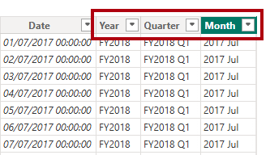
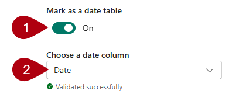

---
lab:
  title: Créer des calculs DAX dans des modèles sémantiques
  module: Create DAX calculations in semantic models
---

# Créer des calculs DAX dans des modèles sémantiques

## Histoire du labo

Dans ce laboratoire, vous créez des tables calculées, des colonnes calculées et des mesures simples à l’aide de Data Analysis Expressions (DAX).

Dans ce labo, vous découvrez comment :

- Créer des tables calculées.
- Créer des colonnes calculées.
- Créer des mesures.

**Ce labo devrait prendre environ 45 minutes.**

## Démarrage

Pour effectuer cet exercice, ouvrez d’abord un navigateur web et entrez l’URL suivante pour télécharger le fichier zip :

`https://github.com/MicrosoftLearning/PL-300-Microsoft-Power-BI-Data-Analyst/raw/Main/Allfiles/Labs/04-create-dax-calculations\04-dax-calculations.zip`

Extrayez le fichier dans le dossier **C :\Users\Student\Downloads\04-dax-calculations**.

Ouvrez le fichier **04-Starter-Sales Analysis.pbix**.

> _**Remarque** : Vous pouvez ignorer la connexion en sélectionnant **Annuler**. Fermez toutes les autres fenêtres d’information ouvertes. Si vous êtes invité à appliquer les modifications, sélectionnez **Appliquer plus tard**_.

## Créer la table calculée Salesperson (Vendeur)

Dans cette tâche, vous allez créer la table calculée `Salesperson` (qui aura une relation directe avec la table `Sales`).

Pour créer une table calculée, commencez par entrer son nom, suivi du symbole égal (=), puis d’une formule DAX qui retourne une table. Le nom de la table ne doit pas être déjà présent dans le modèle de données.

Vous entrez une formule DAX valide dans la _barre de formule_. La barre de formule comprend des fonctionnalités telles que la saisie semi-automatique, l'Intellisense et le code de couleurs, qui vous permettent de saisir la formule rapidement et avec précision.

1. Dans Power BI Desktop, dans la vue Rapport, dans le ruban **Modélisation**, dans le groupe **Calculs**, sélectionnez **Nouvelle table**.

    

1. Dans la barre de formule (qui s’ouvre directement sous le ruban lorsque vous créez ou modifiez des calculs), tapez `Salesperson =`, appuyez sur **Maj+Entrée**, tapez `'Salesperson (Performance)'`, puis appuyez sur **Entrée**.

    > _**Remarque** : Pour des raisons pratiques, toutes les définitions DAX de ce laboratoire peuvent être copiées à partir du fichier snippets, situé dans le fichier **04-dax-calculs\Snippets.txt**._

    

    > _Cette définition de table crée une copie de la table `Salesperson (Performance)`. Elle ne copie que les données, mais les propriétés du modèle telles que la visibilité, la mise en forme et autres ne sont pas copiées._

1. Dans le volet **Données**, vous remarquerez que l'icône du nouveau tableau est précédée d'une calculatrice (indiquant qu'il s'agit d'un tableau calculé).

    

    > _**Remarque** : Les tables calculées sont définies à l’aide d’une formule DAX qui retourne une table. Il est important de comprendre que les tables calculées augmentent la taille du modèle de données, car elles matérialisent et stockent des valeurs. Elles sont aussi recalculées chaque fois que les dépendances de la formule sont actualisées, comme ce sera le cas dans ce modèle de données lorsque de nouvelles valeurs de date (ultérieures) seront chargées dans les tables._
    >
    > _Contrairement aux tables provenant de Power Query, les tables calculées ne permettent pas de charger des données à partir de sources externes. Elles ne peuvent transformer les données que sur la base de ce qui a déjà été chargé dans le modèle de données._

1. Basculez vers la vue Modèle et notez que la table `Salesperson` est disponible.

1. Créez une relation entre la colonne `Salesperson | EmployeeKey` et la colonne `Sales | EmployeeKey`.

    > _Les labos utilisent une notation abrégée pour référencer un champ. Voici le résultat :`Salesperson | EmployeeKey`. Dans cet exemple, `Salesperson` correspond au nom de la table et `EmployeeKey` au nom de la colonne._

1. Faites un clic droit sur la relation inactive (ligne en pointillé) entre les tables et les `Salesperson (Performance)` `Sales` tables, puis sélectionnez **Supprimer**. Lorsque vous êtes invité à confirmer la suppression, sélectionnez **Oui**.

1. Dans la table `Salesperson`, sélectionnez les colonnes suivantes, puis masquez-les (définissez la propriété **Est masquée** sur _Oui_) :

    - `EmployeeID`
    - `EmployeeKey`
    - `UPN`

1. Dans le diagramme de modèle, sélectionnez la table `Salesperson`.

1. Dans la zone **Description** du volet **Propriétés**, entrez : _Vendeur lié aux ventes_

    > _Pour rappel, les descriptions apparaissent sous forme d’info-bulles dans le volet **Données** chaque fois que l’utilisateur place le curseur sur une table ou un champ._

1. Pour la table `Salesperson (Performance)`, définissez la description sur : _Salesperson related to region(s)_ (Vendeur lié à Région(s))

> _Le modèle de données offre désormais deux possibilités pour l’analyse des vendeurs. La table `Salesperson` permet d’analyser les ventes effectuées par un vendeur, tandis que la table `Salesperson (Performance)` permet d’analyser les ventes effectuées dans la ou les régions de vente affectées au vendeur._

## Créer la table Date

Dans cette tâche, vous allez créer la table `Date`.

1. Revenez à la vue Table. Dans le groupe **Calculs** de l’onglet de ruban **Accueil**, sélectionnez **Nouvelle table**.

    

1. Dans la barre de formule, entrez les fonctions DAX suivantes :

    ```dax
    Date =  
    CALENDARAUTO(6)
    ```

    

    > _La fonction `CALENDARAUTO` renvoie une table à colonne unique contenant des valeurs de date. Le comportement « automatique » consiste à analyser toutes les colonnes de date du modèle de données pour trouver les valeurs de date les plus anciennes et les plus récentes stockées dans le modèle de données. Une ligne est ensuite créée pour chaque date de cette plage, en étendant la plage dans les deux sens pour que les années de données stockées soient complètes._
    >
    > _Cette fonction accepte un seul argument facultatif, à savoir le dernier numéro de mois d’une année. Quand elle n’est pas précisée, la valeur est 12, c’est-à-dire que décembre est considéré comme le dernier mois de l’année. Dans le cas présent, on entre 6 pour indiquer que juin est le dernier mois de l’année._

1. Notez la colonne de valeurs de dates qui peuvent être mises en forme selon les paramètres régionaux des États-Unis (c.-à-d., mm/jj/aaaa).

    

1. Dans la barre d’état en bas à gauche, les statistiques de la table confirment que 1826 lignes de données ont été générées, ce qui représente les données de cinq années complètes.

    

## Créer des colonnes calculées

Au cours de cette tâche, vous allez ajouter des colonnes supplémentaires pour permettre le filtrage et le regroupement selon différentes périodes. Vous allez également créer une colonne calculée qui contrôlera l’ordre de tri des autres colonnes.

> _**Remarque** : Pour des raisons pratiques, toutes les définitions DAX de ce labo peuvent être copiées à partir du fichier **Snippets.txt**._

1. Dans le groupe **Calculs** du ruban contextuel **Outils de table**, sélectionnez **Nouvelle colonne**.

    > _Pour créer une colonne calculée, commencez par entrer son nom, suivi du symbole égal (=), puis d’une formule DAX qui retourne comme résultat une valeur unique. Le nom de la colonne ne doit pas être déjà présent dans la table._

    

1. Dans la barre de formule, tapez les éléments suivants (ou copiez à partir du fichier d’extraits de code), puis appuyez sur **Entrée** :

    > _La formule utilise la valeur d’année de la date, en y ajoutant un si le mois est postérieur au mois de juin. C’est ainsi que sont calculés les exercices chez Adventure Works._

   ```dax
   Year =
   "FY" & YEAR('Date'[Date]) + IF(MONTH('Date'[Date]) > 6, 1)
   ```

1. Utilisez la définition des fichiers d’extraits de code afin de créer les deux colonnes calculées suivantes pour la table `Date` :

    - `Quarter`
    - `Month`

1. Vérifiez que les nouvelles colonnes ont été ajoutées.

    

1. Pour valider les calculs, basculez vers l’affichage Rapport.

1. Pour créer une page de rapport, sélectionnez l’icône plus en regard de **Page 1**.

    

1. Pour ajouter un visuel matrice à la nouvelle page de rapport, sélectionnez le type de visuel matrice dans le volet **Visualisations**.

    > _Conseil : Vous pouvez pointer le curseur sur chaque icône pour voir une info-bulle décrivant le type de visuel._

    

1. Dans le volet **Données**, à l’intérieur de la table `Date`, faites glisser le champ `Year` dans le compartiment **Lignes**.

    

1. Faites glisser le champ `Month` dans la zone **Lignes**, directement sous le champ `Year`.

1. En haut à droite du visuel de matrice (ou en bas, en fonction de l’emplacement du visuel), sélectionnez l’icône de flèche double fourchée (qui développera toutes les années vers le bas d’un niveau).

    

1. Comme vous pouvez le constater, les années se développent en mois, qui sont triés par ordre alphabétique plutôt que par ordre chronologique.

    

    > _Par défaut, les valeurs de texte sont triées par ordre alphabétique, les nombres du plus petit au plus grand et les dates de la plus ancienne à la plus récente._

1. Pour personnaliser l’ordre de tri du champ `Month`, basculez vers la vue Table.

1. Ajoutez la colonne `MonthKey` à la table `Date`.

    ```dax
    MonthKey =
    (YEAR('Date'[Date]) * 100) + MONTH('Date'[Date])
    ```

    > _Cette formule calcule une valeur numérique pour chaque combinaison année/mois._

1. Dans la vue Table, vérifiez que la nouvelle colonne contient des valeurs numériques (par exemple, 201707 pour juillet 2017, etc.).

    

1. Revenez dans la vue Rapport.

1. Dans le volet **Données**, puis sélectionnez le champ `Month`.

1. Dans le groupe **Trier** du ruban contextuel **Outils de colonne**, sélectionnez **Trier par colonne**, puis sélectionnez **MonthKey** (CléMois).

    

1. Comme vous pouvez le constater dans le visuel matrice, les mois sont maintenant triés par ordre chronologique.

    

## Terminer la table Date

Dans cette tâche, vous allez procéder à la conception de la table `Date` en masquant une colonne et en créant une hiérarchie. Vous allez ensuite créer des relations avec les tables `Sales` et `Targets`.

1. Basculez vers la vue Modèle.

1. Dans le tableau `Date`, masquez la colonne `MonthKey` (définie **Est masquée** sur _Oui_).

1. Dans le volet **Données**, sélectionnez la table `Date`, faites un clic droit sur la colonne `Year`, puis sélectionnez **Créer une hiérarchie**.

    

1. Dans le volet **Propriétés**, dans la zone **Nom**, remplacez la valeur par _Fiscal_.

    

1. Deux niveaux d’ajout à la hiérarchie, dans la liste déroulante **Hiérarchie**, sélectionnez **Trimestre**, puis Sélectionnez **Mois**, puis **Appliquez les modifications de niveau**.

    

1. Créez les deux relations de modèle suivantes :

    - Il lance `Date | Date` sur `Sales | OrderDate`.
    - Il lance `Date | Date` sur `Targets | TargetMonth`.

1. Masquez les deux colonnes suivantes :

    - `Sales | OrderDate`
    - `Targets | TargetMonth`

## Marquer la table Date

Au cours de cette tâche, vous allez marquer la table `Date` comme table de dates.

1. Passez à l’affichage Report.

1. Dans le volet **Données**, sélectionnez la table `Date` (et non le champ `Date`).

1. Dans le groupe **Calendriers** du ruban contextuel **Outils de table**, sélectionnez **Marquer en tant que table de dates**.

    

1. Dans la fenêtre **Marquer en tant que table de dates**, faites glisser la propriété **Marque en tant que table de dates** sur _Oui_.

1. Dans la liste déroulante **Choisir une colonne de date**, sélectionnez **Date**.

    

1. Cliquez sur **Enregistrer**.

1. Enregistrez le fichier Power BI Desktop.

> _Power BI Desktop comprend maintenant que cette table définit la date (temps)._
>
> _Cette approche de la conception d’une table de dates est pertinente si votre source de données n’en comporte pas. Si vous avez un entrepôt de données, il est préférable de charger les données de date à partir de sa table de dimension de dates plutôt que de « redéfinir » la logique de date dans votre modèle de données._

## Créer des mesures simples

Dans cette tâche, vous allez créer des mesures simples. Les mesures simples agrègent des valeurs dans une seule colonne ou comptent des lignes d’une table.

1. Dans la vue Rapport, à la **Page 2**, dans le volet **Données**, faites glisser le champ `Sales | Unit Price` dans le visualisation de matrice.

    

1. Dans le volet champs visuels (situé dans le volet **Visualisations**), dans les **Valeurs**, notez que le champ `Unit Price` est configuré comme **Moyenne du prix unitaire**.

    

1. Sélectionnez la flèche vers le bas pour **Moyenne du prix unitaire**, puis examinez les options de menu disponibles.

    > _Les colonnes numériques visibles permettent aux auteurs de déterminer au moment de la conception pour décider le mode de synthèse des valeurs de colonne (le cas échéant). Cependant, cela peut entraîner un reporting inapproprié._
    >
    > _Certains modélisateurs de données n’aiment pas s’en remettre au hasard. Ils choisissent de masquer ces colonnes pour exposer à la place la logique d’agrégation définie par les mesures. C’est l’approche que vous allez maintenant appliquer dans ce labo._

1. Pour créer une mesure, dans le volet **Données**, faites un clic droit sur la table `Sales`, puis sélectionnez **Nouvelle mesure**.

1. Dans la barre de formule, ajoutez la définition de mesure suivante :

    ```DAX
    Avg Price =  
    AVERAGE(Sales[Unit Price])
    ```

1. Ajoutez la mesure `Avg Price` au visuel matrice et notez qu’elle produit le même résultat que la colonne `Unit Price` (avec une mise en forme différente toutefois).

1. Dans la zone **Valeurs**, ouvrez le menu contextuel du champ `Avg Price`. Comme vous pouvez le constater, il n’est pas possible de modifier la technique d’agrégation.

    

    > _Il n’est pas possible de modifier le comportement d’agrégation d’une mesure._

1. Utilisez la définition des fichiers d’extraits de code afin de créer les cinq mesures suivantes pour la table `Sales` :

    - `Median Price`
    - `Min Price`
    - `Max Price`
    - `Orders`
    - `Order Lines`

    > _La fonction `DISTINCTCOUNT` utilisée dans la mesure `Orders` ne compte les commandes qu'une seule fois (en ignorant les doublons). La fonction `COUNTROWS` utilisée dans la mesure `Order Lines` fonctionne sur une table._
    >
    > _Dans le cas présent, le nombre de commandes est calculé en comptant les valeurs distinctes de la colonne `SalesOrderNumber` (Numéro de commande), tandis que le nombre de lignes de commande correspond simplement au nombre de lignes de la table (chaque ligne représentant une ligne de commande)._

1. Basculez vers l’affichage Modèle, puis sélectionnez les quatre mesures de prix : `Avg Price`, `Max Price`, `Median Price`, et `Min Price`.

1. Pour la sélection multiple de mesures, configurez les critères suivants :

    - Définissez le format sur deux décimales.
    - Attribuez à un dossier d’affichage nommé _Tarification_ (utilisez la propriété du **Dossier d’affichage** dans le volet **Propriétés**).

    

1. Masquer la colonne `Unit Price`.

    > _La colonne `Unit Price` n’est plus disponible pour les auteurs de rapports. Ils doivent utiliser la mesure de tarification que vous avez ajoutée au modèle. Cette approche de conception permet d’éviter que les auteurs de rapports n’agrègent à tort les prix, par exemple en les additionnant._

1. Sélectionnez plusieurs mesures `Order Lines` et `Orders` puis configurez les critères suivantes :

    - Définissez le format en utilisant le séparateur de milliers.
    - Affectez à un dossier d’affichage nommé _Counts_.

    

1. Dans la vue Rapport, dans la zone **Valeurs** du visuel matrice, sélectionnez **X** pour supprimer **Moyenne du prix unitaire**.

    

1. Augmentez la taille du visuel matrice de façon à ce qu’il remplisse la largeur et la hauteur de la page.

1. Ajoutez les cinq mesures suivantes au visuel matrice :

    - `Median Price`
    - `Min Price`
    - `Max Price`
    - `Orders`
    - `Order Lines`

1. Vérifiez que les résultats semblent cohérents et qu’ils sont correctement mis en forme.

    

## Créer des mesures supplémentaires

Au cours de cette tâche, vous allez créer des mesures supplémentaires qui utilisent des formules plus complexes.

1. Dans la vue Rapport, sélectionnez la **Page 1** et examinez le visuel de table des vendeurs (à droite), notant le total de la colonne **Somme de la cible**.

    

1. Sélectionnez le visuel table et, dans le volet **Visualisations**, supprimez **Somme de la cible**.

1. Renommez la colonne `Targets | Target` en _TargetAmount_.

    > _Conseil : Il existe plusieurs façons de renommer la colonne dans la vue Rapport : dans le volet **Données**, vous pouvez cliquer avec le bouton droit sur la colonne et sélectionner **Renommer**, ou double-cliquer sur la colonne, ou encore appuyer sur **F2**._

1. Créez la mesure suivante sur la table `Targets` :

    ```dax
    Target =
    IF(
        HASONEVALUE('Salesperson (Performance)'[Salesperson]),
        SUM(Targets[TargetAmount])
    )
    ```

    > _La fonction `HASONEVALUE` teste si une valeur unique dans la colonne `Salesperson` est filtrée. Si c’est le cas, l’expression retourne la somme des objectifs chiffrés (pour ce vendeur en particulier). Lorsque la valeur est fausse, `BLANK` est renvoyé._

1. Mettez en forme la mesure `Target` sans décimale.

    > _Conseil : Vous pouvez utiliser le ruban contextuel **Outils de mesure**._

1. Masquer la colonne `TargetAmount`.

    > _Conseil : Vous pouvez cliquer avec le bouton droit sur la colonne dans le volet **Données**, puis sélectionner **Masquer**._

1. Comme vous pouvez le constater, la table `Targets` apparaît maintenant en haut de la liste.

    

    > _Les tables qui comportent uniquement des mesures visibles figurent automatiquement en haut de la liste._

1. Ajoutez la mesure `Target` au visuel table.

1. Comme vous pouvez le constater, le total de la colonne **Objectif** est maintenant `BLANK`.

    

1. Utilisez la définition des fichiers d’extraits de code afin de créer les deux mesures suivantes pour la table `Targets` :

    - `Variance`
    - `Variance Margin`

1. Mettez en forme la mesure `Variance` sans décimale.

1. Mettez en forme la mesure `Variance Margin` sous forme de pourcentage à deux décimales.

1. Ajoutez les mesures `Variance` et `Variance Margin` au visuel table.

1. Redimensionnez le visuel table pour afficher la totalité des colonnes et des lignes.

    

    > _S’il apparaît que tous les vendeurs n’atteignent pas les objectifs, n’oubliez pas que le visuel de la table n’est pas filtré sur une période de temps spécifique. Vous générerez des rapports des performances des ventes, filtrés selon une période choisie par l’utilisateur dans le labo **Concevoir un rapport dans Power BI Desktop**._

1. Enregistrez le fichier Power BI Desktop.

## Labo terminé
