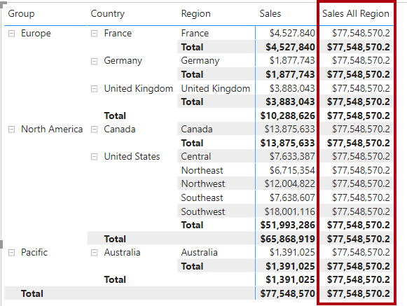
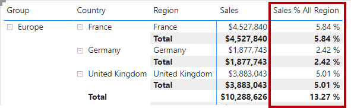

---
lab:
  title: "Créer des calculs DAX avancés dans Power\_BI Desktop"
  module: Create Model Calculations using DAX in Power BI
---


# Créer des calculs DAX avancés dans Power BI Desktop

## **Histoire du labo**

Dans ce labo, vous allez créer des mesures avec des expressions DAX impliquant une manipulation du contexte de filtre.

Dans ce labo, vous allez découvrir comment :

- Utiliser la fonction CALCULATE() pour manipuler le contexte de filtre
- Utiliser les fonctions Time Intelligence

**Ce labo devrait prendre environ 45 minutes.**

## **Utiliser le contexte de filtre**

*Important : Si vous venez d’effectuer le labo précédent (et que vous l’avez entièrement terminé), ignorez cette tâche et passez directement à la suivante.*

1. Ouvrez Power BI Desktop.

    

    *Conseil : Par défaut, la boîte de dialogue Prise en main s’ouvre par-dessus Power BI Desktop. Vous pouvez choisir de vous connecter, puis de fermer la fenêtre contextuelle.*

1. Pour ouvrir le fichier Power BI Desktop de démarrage, sélectionnez **Fichier > Ouvrir le rapport > Parcourir les rapports**.

1. Dans la fenêtre **Ouvrir**, accédez au dossier **D:\PL300\Labs\05-create-dax-calculations-in-power-bi-desktop-advanced\Starter**, puis ouvrez le fichier **Sales Analysis**.

1. Fermez toutes les fenêtres d’information qui se sont éventuellement ouvertes.

1. Notez qu’un message d’avertissement jaune est affiché sous le ruban. 

    *Ce message vous avertit que les requêtes n’ont pas été appliquées pour se charger en tant que tables de modèle. Vous appliquerez les requêtes plus tard dans ce labo.*
    
    *Pour fermer le message d’avertissement, à droite du message d’avertissement jaune, sélectionnez **X**.*

1. Pour créer une copie du fichier, accédez à **Fichier > Enregistrer sous** et enregistrez-le dans le dossier **D:\PL300\MySolution**.

## **Créer un visuel matrice**

Au cours de cette tâche, vous allez créer un visuel matrice pour prendre en charge les tests de vos nouvelles mesures.

1. Dans Power BI Desktop, créez une page de rapport dans l’affichage Rapport.

1. Sur la **Page 3**, ajoutez un visuel matrice.

    

1. Redimensionnez le visuel matrice de façon à ce qu’il remplisse toute la page.

1. Pour configurer les champs du visuel matrice, depuis le volet **Données**, faites glisser la hiérarchie **Region \| Regions** (Région | Régions) vers le visuel.
    
    *Les labos utilisent une notation abrégée pour référencer un champ ou une hiérarchie. Voici le résultat : **Region \| Regions**. Dans cet exemple, **Region** est le nom de la table et **Regions** correspond au nom de la hiérarchie.*

1. Ajoutez également le champ **Sales \| Sales** (Ventes | Ventes).

1. Pour développer toute la hiérarchie, sélectionnez deux fois l’icône de flèche à deux branches en haut à droite du visuel matrice.
    
    *Pour rappel, la hiérarchie **Regions** comporte les niveaux **Group**, **Country**, et **Region**.*

    

1. Pour mettre en forme le visuel, sélectionnez le volet **Mise en forme** dans le volet **Visualisations**.

    

1. Dans la zone **Recherche**, entrez **Échelonné**.

1. **Désactivez** la propriété **Disposition échelonnée**.

    

1. Vérifiez que le visuel matrice comporte maintenant quatre en-têtes de colonne.

    

    *Chez Adventure Works, les régions de vente sont organisées en groupes, pays et régions. Tous les pays, à l’exception des États-Unis, comportent une seule région, qui est nommée après le pays. Comme les États-Unis constituent un grand secteur de vente, ils sont divisés en cinq régions de vente.*

    *Vous allez créer plusieurs mesures dans cet exercice, puis les tester en les ajoutant au visuel matrice.*

## **Manipuler le contexte de filtre**

Au cours de cette tâche, vous allez créer plusieurs mesures avec des expressions DAX qui utilisent la fonction CALCULATE() pour manipuler le contexte de filtre.

1. Ajoutez une mesure à la table **Sales** (Ventes), à partir de l’expression suivante :
    
     *Par souci pratique, toutes les définitions DAX de ce labo peuvent être copiées à partir du fichier **D:\PL300\Labs\05-create-dax-calculations-in-power-bi-desktop-advanced\Assets\Snippets.txt**.*


    **DAX**


    ```
    Sales All Region =

    CALCULATE(SUM(Sales[Sales]), REMOVEFILTERS(Region))
    ```


    *La fonction CALCULATE() est une fonction puissante servant à manipuler le contexte de filtre. Le premier argument est une expression ou une mesure (à savoir une simple expression nommée). Les arguments suivants permettent la modification du contexte de filtre.*

    *La fonction REMOVEFILTERS() supprime les filtres actifs. Elle prend comme argument une table, une ou plusieurs colonnes, ou rien du tout.*

    *Dans cette formule, la mesure évalue la somme de la colonne **Sales** dans un contexte de filtre modifié, ce qui supprime tous les filtres appliqués à la table **Region**.*

1. Ajoutez la mesure **Sales All Région** (Ventes toutes régions) au visuel matrice.

    

1. Comme vous pouvez le constater, la mesure **Sales All Region** (Ventes Toutes régions) calcule le total des ventes pour toutes les régions, tous les pays (sous-total) et tous les groupes (sous-total).

    *La nouvelle mesure n’offre pas encore un résultat intéressant. Lorsque l’on divise les ventes d’un groupe, d’un pays ou d’une région par cette valeur, on obtient un ratio utile connu sous le nom de « pourcentage du total général ».*

1. Dans le volet **Données**, vérifiez que la mesure **Sales All Region** (Ventes toutes régions) est sélectionnée (elle a alors un arrière-plan gris foncé) puis, dans la barre de formule, remplacez le nom de la mesure et la formule par la formule suivante :

    *Conseil : Pour remplacer la formule existante, commencez par copier l’extrait de code. Ensuite, sélectionnez à l’intérieur de la barre de formule et appuyez sur **Ctrl+A** pour sélectionner tout le texte. Ensuite, appuyez sur **Ctrl+V** pour coller l’extrait de code et ainsi remplacer le texte sélectionné. Appuyez enfin sur **Entrée**.*


    **DAX**


    ```
    Sales % All Region =  
    DIVIDE(  
     SUM(Sales[Sales]),  
     CALCULATE(  
     SUM(Sales[Sales]),  
     REMOVEFILTERS(Region)  
     )  
    )
    ```

    *La mesure a été renommée pour refléter avec précision la formule mise à jour. La fonction DIVIDE() divise la mesure **Sales** non modifiée par le contexte de filtre par la mesure **Sales** dans un contexte modifié, ce qui supprime tous les filtres appliqués à la table **Region**.*

1. Comme vous pouvez le constater dans le visuel matrice, la mesure a été renommée et une autre valeur apparaît maintenant pour chaque groupe, pays et région.

1. Paramétrez la mesure **Sales % All Region** (Pourcentage Ventes Toutes régions) sous forme de pourcentage à deux décimales.

1. Dans le visuel matrice, passez en revue les valeurs de la mesure **Sales % All Region** (Pourcentage Ventes Toutes régions).

    

1. Ajoutez une autre mesure à la table **Sales** (Ventes), à partir de l’expression suivante, sous forme de pourcentage :


    **DAX**

    ```
    Sales % Country =  
    DIVIDE(  
     SUM(Sales[Sales]),  
     CALCULATE(  
     SUM(Sales[Sales]),  
     REMOVEFILTERS(Region[Region])  
     )  
    )
    ```

1. Comme vous pouvez le constater, la formule de la mesure **Sales % Country** (Pourcentage Ventes Pays) est légèrement différente de celle de la mesure **Sales % All Region** (Pourcentage Ventes Toutes régions).

    *En effet, le dénominateur modifie le contexte de filtre en supprimant les filtres sur la colonne **Region** de la table **Region**, et non sur toutes les colonnes de la table **Region**. Par conséquent, tous les filtres appliqués aux colonnes du groupe ou du pays sont conservés. Le résultat obtenu représente les ventes sous forme de pourcentage du pays.*

1. Ajoutez la mesure **Sales % Country** (Pourcentage Ventes Pays) au visuel matrice.

1. Comme vous pouvez le constater, seules les régions des États-Unis produisent une valeur différente de 100 %.
    
    *Pour rappel, seuls les États-Unis comportent plusieurs régions. Tous les autres pays sont composés d’une seule région, ce qui explique pourquoi ils indiquent tous 100 %.*

    

    

1. Pour améliorer la lisibilité du visuel, remplacez la mesure **Sales % Country** (Pourcentage Ventes Pays) par cette formule améliorée.


    **DAX**


    ```
    Sales % Country =  
    IF(  
     ISINSCOPE(Region[Region]),  
     DIVIDE(  
     SUM(Sales[Sales]),  
     CALCULATE(  
     SUM(Sales[Sales]),  
     REMOVEFILTERS(Region[Region])  
     )  
     )  
    )
    ```


    *La fonction IF() utilise la fonction ISINSCOPE() pour déterminer si la colonne Region est le niveau dans une hiérarchie de niveaux. Si la valeur est true, la fonction DIVIDE() est évaluée. Si la valeur est false, une valeur vide est retournée car la colonne de région n’est pas comprise dans la portée.*

1. Comme vous pouvez le constater, la mesure **Sales % Country** (Pourcentage Ventes Pays) ne retourne maintenant de valeur que si la région est comprise dans la portée.

    

1. Ajoutez une autre mesure à la table **Sales** (Ventes), à partir de l’expression suivante, sous forme de pourcentage :


    **DAX**


    ```
    Sales % Group =  
    DIVIDE(  
     SUM(Sales[Sales]),  
     CALCULATE(  
     SUM(Sales[Sales]),  
     REMOVEFILTERS(  
     Region[Region],  
     Region[Country]  
     )  
     )  
    )
    ```


    *Pour formuler les ventes sous forme de pourcentage d’un groupe, vous pouvez appliquer deux filtres qui suppriment les filtres sur deux colonnes.*

1. Ajoutez la mesure **Sales % Group** (Pourcentage Ventes Groupe) au visuel matrice.

1. Pour améliorer la lisibilité du visuel, remplacez la mesure **Sales % Group** (Pourcentage Ventes Groupe) par cette formule améliorée.


    **DAX**


    ```
    Sales % Group =  
    IF(  
     ISINSCOPE(Region[Region])  
     || ISINSCOPE(Region[Country]),  
     DIVIDE(  
     SUM(Sales[Sales]),  
     CALCULATE(  
     SUM(Sales[Sales]),  
     REMOVEFILTERS(  
     Region[Region],  
     Region[Country]  
     )  
     )  
     )  
    )
    ```


1. Comme vous pouvez le constater, la mesure **Sales % Group** (Pourcentage Ventes Groupe) ne retourne maintenant de valeur que si la région est comprise dans la portée.

1. Dans l’affichage Modèle, placez les trois nouvelles mesures dans un dossier d’affichage nommé **Ratios**.

    

1. Enregistrez le fichier Power BI Desktop.

*Les mesures ajoutées à la table **Sales** ont modifié le contexte de filtre pour produire une navigation hiérarchique. Comme vous pouvez le constater, le modèle permettant d’effectuer le calcul d’un sous-total implique de supprimercertaines colonnes du contexte de filtre. Pour obtenir le total général, vous devez supprimer toutes les colonnes.*

## **Utilisation de Time Intelligence**

Dans cet exercice, vous allez créer une mesure de ventes cumulées annuelles jusqu’à ce jour et une mesure de croissance des ventes en glissement annuel.

## **Créer une mesure de ventes cumulées annuelles jusqu’à ce jour (YTD)**

Au cours de cette tâche, vous allez créer une mesure de ventes cumulées annuelles jusqu’à ce jour.

1. Comme vous pouvez le constater sur la **Page 2** de l’affichage Rapport, le visuel matrice présente différentes mesures en regroupant les années et les mois sur les lignes.

2. Ajoutez une mesure à la table **Sales** (Ventes), à partir de l’expression suivante, sans décimale :


    **DAX**


    ```
    Sales YTD =  
    TOTALYTD(SUM(Sales[Sales]), 'Date'[Date], "6-30")
    ```


    *La fonction TOTALYTD() évalue une expression (en l’occurrence, la somme de la colonne **Sales**) sur une colonne de date donnée. La colonne de date doit appartenir à une table de dates marquée comme telle, comme cela a été fait dans le labo **Créer des calculs DAX dans Power BI Desktop**.*

    *La fonction peut également accepter un troisième argument facultatif représentant la dernière date d’une année. En l’absence de cette date, le 31 décembre est considéré comme la dernière date de l’année. Juin est le dernier mois de l’année d’Adventure Works ; d’où l’argument « 6-30 ».*

3. Ajoutez le champ **Sales** (Ventes) et la mesure **Sales YTD** (Ventes cumulées annuelles jusqu'à ce jour) au visuel matrice.

4. Comme vous pouvez le constater, les valeurs de ventes sont cumulées au cours de l’année.

    

    *La fonction TOTALYTD() effectue une manipulation de filtre, en l’occurrence de temps. Par exemple, dans le cadre du calcul des ventes cumulées annuelles jusqu'à ce jour pour septembre 2017 (le troisième mois de l’exercice), tous les filtres de la table **Date** sont supprimés et remplacés par un nouveau filtre de dates qui commence au début de l’année (1er juillet 2017) et s’étend jusqu’à la dernière date de la période du contexte (30 septembre 2017).*

    *De nombreuses fonctions Time Intelligence sont disponibles dans DAX pour gérer les manipulations de filtre de temps courantes.*

## **Créer une mesure de croissance en glissement annuel (YoY)**

Au cours de cette tâche, vous allez créer une mesure de croissance des ventes en glissement annuel.

1. Ajoutez une autre mesure à la table **Sales**, à partir de l’expression suivante :


    **DAX**


    ```
    Sales YoY Growth =  
    VAR SalesPriorYear =  
     CALCULATE(  
     SUM(Sales[Sales]),  
     PARALLELPERIOD(  
     'Date'[Date],  
     -12,  
     MONTH  
     )  
     )  
    RETURN  
     SalesPriorYear
    ```


    *La mesure **Sales YoY Growth** utilise une variable. Les variables vous aident à simplifier la formule, et sont plus efficaces si vous utilisez la logique plusieurs fois au sein d’une formule.*

    *Les variables sont déclarées avec un nom unique, et l’expression de mesure doit ensuite être générée après le mot clé **RETURN**. Contrairement à d’autres variables de langage de programmation, les variables DAX ne peuvent être utilisées qu’au sein de la formule unique.*

    *La variable **SalesPriorYear** est une expression calculant la somme de la colonne **Sales** dans un contexte modifié qui utilise la fonction PARALLELPERIOD() pour revenir en arrière de 12 mois à partir de chaque date dans le contexte de filtre.*

1. Ajoutez la mesure **Sales YoY Growth** (Croissance des ventes en glissement annuel) au visuel matrice.

1. Comme vous pouvez le constater, la nouvelle mesure retourne une valeur vide pour les 12 premiers mois (aucune vente n’ayant été enregistrée avant l’exercice 2017).

1. Comme vous pouvez le constater, la valeur de la mesure **Croissance des ventes en glissement annuel** de **Juil 2018** est la valeur **Ventes** de **Juil 2017**.

    

    *Maintenant que la « partie difficile » de la formule a été testée, vous pouvez remplacer la mesure par la formule finale qui calcule le résultat de la croissance.*

1. Pour terminer la mesure, remplacez la mesure **Sales YoY Growth** (Croissance des ventes en glissement annuel) par cette formule, sous forme de pourcentage à deux décimales :


    **DAX**


    ```
    Sales YoY Growth =  
    VAR SalesPriorYear =  
     CALCULATE(  
     SUM(Sales[Sales]),  
     PARALLELPERIOD(  
     'Date'[Date],  
     -12,  
     MONTH  
     )  
     )  
    RETURN  
     DIVIDE(  
     (SUM(Sales[Sales]) - SalesPriorYear),  
     SalesPriorYear  
     )
    ```


1. Comme vous pouvez le constater, la clause **RETURN** de la formule comporte deux références à la variable.

1. Vérifiez que la croissance en glissement annuel de **Juillet 2018** est bien de **392,83 %**.

    

    *La mesure de croissance en glissement annuel indique une augmentation de près de 400 % (ou une multiplication par quatre) des ventes au cours de la même période de l’année précédente.*

1. Dans l’affichage Modèle, placez les deux nouvelles mesures dans un dossier d’affichage nommé **Time Intelligence**.

    

### **Terminer**

Dans cette tâche, vous allez terminer le labo.

1. Pour nettoyer la solution prête pour le développement de rapport, en bas à gauche, cliquez avec le bouton droit sur l’onglet **Page 2**, puis sélectionnez **Supprimer la page**. Quand vous êtes invité à supprimer la page, sélmectionnez **Supprimer**.

1. Supprimez également la **page 3**.

1. Pour effacer la page restante, sélectionnez le visuel table dans cette page, puis appuyez sur la touche **Supprimer**.

1. Enregistrez le fichier Power BI Desktop.

1. Si vous avez l’intention de démarrer le labo suivant, laissez Power BI Desktop ouvert.

*Vous créerez un rapport basé sur le modèle de données dans le labo **Concevoir un rapport dans Power BI Desktop**.*
