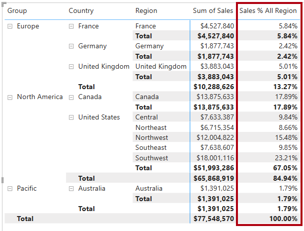

---
lab:
  title: Modifier le contexte de filtre DAX dans Power BI
  module: Modify DAX filter context in Power BI
---

# Modifier le contexte de filtre DAX dans Power BI

## Histoire du labo

Dans ce labo, vous créez des mesures avec des expressions DAX qui impliquent une manipulation du contexte de filtre.

Vous allez apprendre à effectuer les actions suivantes :

 - Utiliser la fonction `CALCULATE` pour manipuler le contexte de filtre.

**Ce labo devrait prendre environ 30 minutes.**

## Démarrage

Pour effectuer cet exercice, ouvrez d’abord un navigateur web et entrez l’URL suivante pour télécharger le fichier zip :

`https://github.com/MicrosoftLearning/PL-300-Microsoft-Power-BI-Data-Analyst/raw/Main/Allfiles/Labs/05-modify-dax-filter-context/05-modify-dax-filter-context.zip`

Extrayez le fichier dans le dossier **C :\Users\Student\Downloads\05-modify-dax-filter-context**.

Ouvrez le fichier **05-Starter-Sales Analysis.pbix**.

> _**Remarque** : Une boîte de dialogue de connexion peut s’afficher au fur et à mesure que le fichier se charge. Sélectionnez **Annuler** pour ignorer la boîte de dialogue de connexion. Fermez toutes les autres fenêtres d’information ouvertes. Si vous êtes invité à appliquer les modifications, sélectionnez **Appliquer plus tard**_.

## Créer un visuel matrice

Au cours de cette tâche, vous allez créer un visuel matrice pour prendre en charge les tests de vos nouvelles mesures.

1. Dans Power BI Desktop, créez une page de rapport.

1. Sur la **Page 3**, ajoutez un visuel matrice.

    

1. Redimensionnez le visuel matrice de façon à ce qu’il remplisse toute la page.

1. Pour configurer les champs du visuel matrice, depuis le volet **Données**, faites glisser la hiérarchie `Region | Regions` vers le visuel.

    > Les labos utilisent une notation abrégée pour référencer un champ ou une hiérarchie. Elle se présente comme suit : `Region | Regions`. Dans cet exemple, `Region` est le nom de la table et `Regions` le nom de la hiérarchie._

1. Ajoutez le champ `Sales | Sales` à le compartiment **Valeurs**.

1. Pour développer toute la hiérarchie, sélectionnez deux fois l’icône de flèche à deux branches en haut à droite du visuel matrice.

    

1. Pour mettre en forme le visuel, sélectionnez le volet **Mise en forme** dans le volet **Visualisations**.

    

1. Dans la zone **Recherche**, entrez _Disposition_.

1. Définissez la propriété **Disposition** sur _Tabulaire_.

    

1. Vérifiez que le visuel matrice comporte maintenant 4 en-têtes de colonne.

    

    > _Chez Adventure Works, les régions de vente sont organisées en groupes, pays et régions. Tous les pays, à l’exception des États-Unis, comportent une seule région, qui est nommée après le pays. Comme les États-Unis constituent un grand secteur de vente, ils sont divisés en cinq régions de vente._

Vous allez créer différentes mesures dans cet exercice, puis les tester en les ajoutant au visuel matrice.

## Manipuler le contexte de filtre

Au cours de cette tâche, vous allez créer plusieurs mesures avec des expressions DAX qui utilisent la fonction `CALCULATE` pour manipuler le contexte de filtre.

> _La fonction `CALCULATE` est une fonction puissante que vous pouvez utiliser pour manipuler le contexte de filtre. Le premier argument est une expression ou une mesure (à savoir une simple expression nommée). Les arguments suivants permettent la modification du contexte de filtre._

1. Ajoutez une mesure à la table `Sales`, à partir de l’expression suivante :

    > _**Remarque** : Pour des raisons pratiques, toutes les définitions DAX de ce labo peuvent être copiées à partir du fichier **C :\Users\Student\Downloads\05-modify-dax-filter-context\Snippets.txt**._

    ```dax
    Sales All Region =
    CALCULATE(
        SUM(Sales[Sales]),
        REMOVEFILTERS(Region)
    )
    ```

    > _La fonction `REMOVEFILTERS` supprime les filtres actifs. Elle prend comme argument une table, une ou plusieurs colonnes, ou rien du tout._
    >
    > _Dans cette formule, la mesure évalue la somme de la colonne `Sales` dans un contexte de filtre modifié, ce qui supprime tous les filtres appliqués à la table `Region`._

1. Ajoutez la mesure `Sales All Region` au visuel matrice.

    

1. Comme vous pouvez le constater, la mesure calcule le total des ventes pour toutes les régions, tous les pays (sous-total) et tous les groupes (sous-total).

    > _La nouvelle mesure n’offre pas encore un résultat intéressant. Lorsque l’on divise les ventes d’un groupe, d’un pays ou d’une région par cette valeur, on obtient un ratio utile connu sous le nom de « pourcentage du total général »._

1. Dans le volet **Données**, vérifiez que la mesure `Sales All Region` est sélectionnée (elle a alors un arrière-plan gris foncé) puis, dans la barre de formule, remplacez le nom de la mesure et la formule par la formule suivante :

    > _Conseil : Pour remplacer la formule existante, commencez par copier l’extrait de code. Ensuite, sélectionnez à l’intérieur de la barre de formule et appuyez sur **Ctrl+A** pour sélectionner tout le texte. Ensuite, appuyez sur **Ctrl+V** pour coller l’extrait de code et ainsi remplacer le texte sélectionné. Appuyez enfin sur **Entrée**._

    ```dax
    Sales % All Region =
    DIVIDE(
        SUM(Sales[Sales]),
        CALCULATE(
            SUM(Sales[Sales]),
            REMOVEFILTERS(Region)
        )
    )
    ```

    > _La mesure a été renommée pour refléter avec précision la formule mise à jour. La fonction `DIVIDE` divise la somme de la colonne `Sales` (non modifiée par le contexte de filtre) par la somme de la colonne `Sales` dans un contexte modifié, ce qui supprime tous les filtres appliqués à la table `Region`._

1. Comme vous pouvez le constater dans le visuel matrice, la mesure a été renommée et une autre valeur apparaît maintenant pour chaque groupe, pays et région.

1. Veillez à formater la mesure `Sales % All Region` sous forme de pourcentage à deux décimales.

1. Dans le visuel de matrice, passez en revue les valeurs de mesure `Sales % All Region`.

    

1. Ajoutez une autre mesure à la table `Sales`, à partir de l’expression suivante, sous forme de pourcentage :

    ```dax
    Sales % Country =
    DIVIDE(
        SUM(Sales[Sales]),
        CALCULATE(
            SUM(Sales[Sales]),
            REMOVEFILTERS(Region[Region])
        )
    )
    ```

1. Notez que la formule de mesure `Sales % Country` diffère légèrement de la formule de mesure `Sales % All Region`.

    > _En effet, le dénominateur modifie le contexte de filtre en supprimant les filtres sur la colonne `Region` de la table `Region`, et non sur toutes les colonnes de la table `Region`. Par conséquent, tous les filtres appliqués aux colonnes du groupe ou du pays sont conservés. Le résultat obtenu représente les ventes sous forme de pourcentage du pays._

1. Ajoutez la mesure `Sales % Country` au visuel matrice.

1. Notez que seules les régions des États-Unis produisent une valeur qui n’est pas de 100 %.

    

    > _Pour rappel, seuls les États-Unis comportent plusieurs régions. Tous les autres pays sont composés d’une seule région, ce qui explique pourquoi ils indiquent tous 100 %._

1. Pour améliorer la lisibilité du visuel, remplacez la mesure `Sales % Country` par la formule améliorée suivante.

    ```dax
    Sales % Country =
    IF(
        ISINSCOPE(Region[Region]),
        DIVIDE(
            SUM(Sales[Sales]),
            CALCULATE(
                SUM(Sales[Sales]),
                REMOVEFILTERS(Region[Region])
            )
        )
    )
    ```

    > _La fonction `IF` utilise la fonction `ISINSCOPE` pour tester si la colonne de région est le niveau d’une hiérarchie de niveaux. Si la valeur est « vrai », la fonction `DIVIDE` est évaluée. Lorsque la valeur est « faux », `BLANK` est renvoyée, car la colonne de région n’est pas dans l’étendue._

1. Comme vous pouvez le constater, la mesure `Sales % Country` ne retourne maintenant de valeur que si la région est comprise dans la portée.

    

1. Ajoutez une autre mesure à la table `Sales`, à partir de l’expression suivante, sous forme de pourcentage :

    ```dax
    Sales % Group =
    DIVIDE(
        SUM(Sales[Sales]),
        CALCULATE(
            SUM(Sales[Sales]),
            REMOVEFILTERS(
                Region[Region],
                Region[Country]
            )
        )
    )
    ```

    > _Pour formuler les ventes sous forme de pourcentage d’un groupe, vous pouvez appliquer deux filtres qui suppriment les filtres sur deux colonnes._

1. Ajoutez la mesure `Sales % Group` au visuel matrice.

1. Pour améliorer la lisibilité de cette mesure en visuel, remplacez la mesure `Sales % Group` par la formule suivante.

    ```dax
    Sales % Group =
    IF(
        ISINSCOPE(Region[Region])
            || ISINSCOPE(Region[Country]),
        DIVIDE(
            SUM(Sales[Sales]),
            CALCULATE(
                SUM(Sales[Sales]),
                REMOVEFILTERS(
                    Region[Region],
                    Region[Country]
                )
            )
        )
    )
    ```

1. Comme vous pouvez le constater, la mesure `Sales % Group` ne retourne maintenant de valeur que si la région est comprise dans la portée.

1. Dans la **vue Modèle**, placez les trois nouvelles mesures dans un dossier d’affichage nommé _Ratios_.

    

1. Enregistrez le fichier Power BI Desktop.

> _Les mesures ajoutées à la table `Sales` ont modifié le contexte de filtre pour produire une navigation hiérarchique. Comme vous pouvez le constater, le modèle permettant d’effectuer le calcul d’un sous-total implique de supprimer certaines colonnes du contexte de filtre ; pour obtenir le total général, vous devez supprimer toutes les colonnes._

## Labo terminé

Vous pouvez choisir d’enregistrer votre rapport Power BI, même s’il n’est pas nécessaire pour ce labo. Dans l’exercice suivant, vous allez utiliser un fichier de démarrage prédéfini.

1. Accédez au menu **« Fichier »** dans le coin supérieur gauche, puis sélectionnez **« Enregistrer sous ».** 
1. Sélectionnez **Parcourir cet appareil**.
1. Sélectionnez le dossier dans lequel vous souhaitez enregistrer le fichier et donnez-lui un nom descriptif. 
1. Sélectionnez le bouton **Enregistrer** pour enregistrer votre rapport en tant que fichier .pbix. 
1. Si une boîte de dialogue s’affiche pour vous inviter à appliquer des modifications de requête en attente, sélectionnez **Appliquer**.
1. Fermez Power BI Desktop.