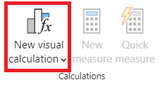

---
lab:
  title: "Créer des calculs visuels dans Power\_BI Desktop"
  module: Create Visual Calculations in Power BI Desktop
---

# Créer des calculs visuels dans Power BI Desktop

## **Histoire du labo**

Dans ce labo, vous allez créer des calculs visuels avec des expressions DAX (Data Analysis Expressions). 

Dans ce labo, vous allez découvrir comment :

- Créer et modifier des calculs visuels
- Utiliser les fonctions PREVIOUS(), RUNNINGSUM() et MOVINGAVERAGE() pour créer des métriques de comparaison entre chaque exercice financier
- Utilisez le paramètre Axe facultatif lors de la création de métriques de comparaison.
- Utilisez le paramètre Réinitialiser facultatif pour personnaliser les calculs cumulatifs dans un axe à plusieurs niveaux.

**Ce labo devrait prendre environ 45 minutes.**

## Démarrage

Pour effectuer cet exercice, ouvrez d’abord un navigateur web et entrez l’URL suivante pour télécharger le dossier zip :

`https://github.com/MicrosoftLearning/PL-300-Microsoft-Power-BI-Data-Analyst/raw/Main/Allfiles/Labs/05b-create-visual-calculations-in-power-bi-desktop/05b-visual-calculations.zip`

Extrayez le dossier dans le dossier **C:\Users\Student\Downloads\05b-visual-calculations**.

Ouvrez le fichier **05-Starter-Sales Analysis.pbix**.

> ***Remarque** : vous pouvez ignorer la connexion en sélectionnant **Annuler**. Fermez toutes les autres fenêtres d’information ouvertes. Si vous êtes invité à appliquer les modifications, sélectionnez **Appliquer plus tard**.

Dans Power BI Desktop, accédez à **Fichier > Options et paramètres > Options > Fonctionnalités en version préliminaire**. Sélectionnez  **Calculs visuels**  et sélectionnez  **OK**. Les calculs visuels sont activés après le redémarrage de Power BI Desktop.

## Créer un visuel de graphique à barres

Dans cette tâche, vous allez créer un graphique à barres affichant le montant des ventes, le coût total du produit et le profit par exercice financier, avec des métriques de comparaison sous forme d’info-bulles.

1. Dans le volet **Visualisations**, sélectionnez le type de visuel Graphique à barres groupées.

   

1. Dans la table **Date** du volet **Données**, faites glisser le champ **Year** (Années) dans la barre d’outils/zone **Axe Y**.

1. Faites glisser les champs **Ventes** et **Coût** de la table **Ventes** dans la barre d’outils/zone **Axe X**.

> Notez que lorsque vous avez ajouté Ventes et Coût au visuel, la somme de chaque champ a été automatiquement calculée.

1. Triez le graphique à barres obtenu par **Année** croissante en utilisant le menu à trois points et en sélectionnant **Année** suivi de **Tri croissant** :

   

> Vous disposez maintenant d’un graphique à barres montrant la somme des ventes et la somme des coûts par année, classées par ordre chronologique.

### Ajouter des calculs

1. Une fois le graphique à barres sélectionné, sélectionnez **Nouveau calcul visuel** dans le ruban :

   

1. La fenêtre d’édition des calculs visuels s’ouvre. Dans la barre de formule au-dessus de la matrice visuelle, entrez l’expression suivante, puis appuyez sur Entrée pour valider le calcul :

   ```DAX
   Profit = [Sum of Sales] – [Sum of Cost]
   ```

1. Vérifiez maintenant qu’une colonne Profit apparaît dans la matrice visuelle en bas de l’écran :

   

1. Développez le menu sous **Nouveau calcul visuel** et sélectionnez **Par rapport au précédent** dans les options de modèle :

> **Par rapport au précédent** compare une valeur à une valeur précédente. Nous voyons donc le Profit comparé à la valeur précédente de l’Année.

   

1. Dans la barre de formule, remplacez l’espace réservé `[Field]` par `[Profit]` deux fois et validez le calcul.

1. Sélectionnez **Somme en cours d’exécution** dans le menu des modèles et remplacez l’espace réservé `[Field]` par `[Profit]` et validez le calcul.

> La **Somme en cours d’exécution** calcule la somme des valeurs, en ajoutant la valeur actuelle aux valeurs précédentes. Nous voyons donc le total des années actuelles et précédentes.

1. Sélectionnez **Moyenne mobile** dans le menu des modèles et remplacez l’espace réservé `[Field]` par `[Profit]` et l’espace réservé `WindowSize` par 2. Vous devez avoir la configuration suivante :

> La **Moyenne mobile** calcule une moyenne d’un ensemble de valeurs dans une fenêtre donnée en divisant la somme des valeurs par la taille de la fenêtre. En définissant la taille de la fenêtre sur 2, nous calculons la moyenne de deux valeurs consécutives. Dans cet exemple, les valeurs sont des profits annuels. Nous voyons donc que la moyenne mobile pour FY2019 est la moyenne des profits pour FY2018 et FY2019.

   

1. Dans la barre d’outils/zone **Axe X**, sélectionnez l’icône de visibilité des champs suivants pour les masquer du visuel :

   - Somme des ventes
   - Somme des coûts
   - Bénéfices

   

> Notez que les champs et les calculs que vous masquez ne sont plus affichés sur le visuel.

1. Dans le volet **Visualisations**, faites glisser **Somme en cours d’exécution** et **Moyenne mobile** vers la barre d’outils/zone **Info-bulles**.  

1. Vérifiez que le visuel répond désormais aux objectifs. Quittez l’écran de modification des calculs visuels pour accéder à votre rapport :

   

> Vous disposez maintenant d’un graphique à barres avec les valeurs suivantes : Somme des ventes, Somme des coûts, Profit et Profit *Par rapport au précédent* avec des info-bulles pour Profit *Somme en cours d’exécution* et Profit *Moyenne mobile*.

## Créer un visuel de matrice

Dans cette tâche, vous allez créer un visuel de matrice qui compare le montant des ventes par catégorie au premier exercice financier pour chacune des années suivantes.

1. Dans la **vue Rapport**, créez une page de rapport.

1. Sur la **Page 2**, ajoutez un visuel matrice.

1. Ajoutez les champs suivants aux barres d’outils/zones des visuels :

     - Lignes : **Produit \| Catégorie**
     - Colonnes : **Date \| Année**
     - Valeurs : **Sales \| Sales**

 > *Les labos utilisent une notation abrégée pour référencer un champ. Voici le résultat : **Date \| Year**. Dans cet exemple, **Date** est le nom de la table et **Year** correspond au nom du champ.*

### Ajouter des calculs

1. Une fois la matrice sélectionnée, sélectionnez **Nouveau calcul visuel** dans le ruban.

1. Dans la fenêtre de modification des calculs visuels, tapez et enregistrez le calcul suivant :

   ```DAX
    Versus first = [Sales] - FIRST([Sales])
   ```

> Notez comment la matrice affiche la différence entre le montant des ventes de chaque catégorie et celui de la première catégorie.

1. Sélectionnez le champ **Par rapport au premier** dans barre d’outils/zone **Valeurs** et mettez à jour votre calcul en ajoutant la valeur ROWS du paramètre Axe à FIRST :

   ```DAX
    Versus first = [Sales] - FIRST([Sales], ROWS)
   ```

> Notez que rien ne change puisque ROWS est la valeur par défaut du paramètre Axe.

1. Remplacez ROWS par COLUMNS et observez que le calcul compare maintenant le montant des ventes par catégorie au premier exercice financier :

   

> Notez comment la colonne **Par rapport au premier** pour **Total des ventes** retourne zéro au lieu de la différence par rapport au premier exercice financier. Le **Total des ventes** est à un niveau hiérarchique différent de celui des sommes annuelles, et par conséquent, considéré comme la première colonne de ce niveau.

1. Quittez l’écran de modification des calculs visuels pour accéder votre rapport.

## Créer un visuel de graphique en courbes

Dans cette tâche, vous allez créer un graphique en courbes qui affiche la somme en cours d’exécution pour les ventes. Cette somme sera réinitialisée au début de chaque exercice financier.

1. Dans la **vue Rapport**, créez une page de rapport.

1. Sur la **Page 3**, ajoutez un visuel de graphique en courbes.

1. Ajoutez les champs suivants aux barres d’outils/zones des visuels :

     - Axe X : **Date \| Année** et **Date \| Trimestre**
     - Axe des Y : **Sales \| Sales**

### Ajouter une somme en cours d’exécution

1. Une fois le graphique en courbes sélectionné, développez le menu sous **Nouveau calcul visuel** et sélectionnez **Somme en cours d’exécution** dans les options de modèle.

1. Remplacez l’espace réservé `[Field]` par `[Sum of Sales]` et validez la modification. Le visuel doit resembler à ceci :

   

### Mettre à jour la somme en cours d’exécution pour redémarrer chaque nouvel exercice financier

1. Toujours dans la fenêtre de modification des calculs visuels, sélectionnez le champ **Somme en cours d’exécution** sous l’**Axe Y** et mettez à jour l’expression pour ce calcul en ajoutant le paramètre de réinitialisation HIGHESTPARENT, puis validez les modifications :

   ```DAX
    Running sum = RUNNINGSUM([Sum of Sales], HIGHESTPARENT)
   ```

Vérifiez que la somme en cours d’exécution redémarre effectivement pour chaque nouvel exercice financier :

   

## Labo terminé
