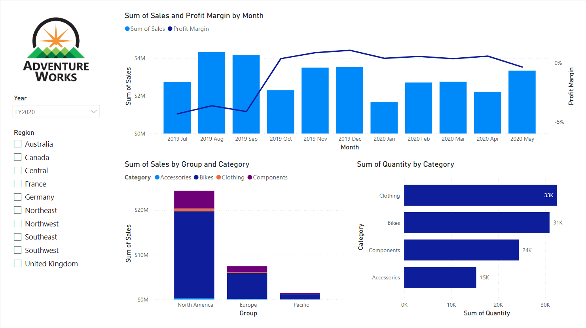

---
lab:
  course: 'PL-300, DP-605'
  title: "Concevoir un rapport dans Power\_BI Desktop"
  module: Create Reports in Power BI Desktop
---

# Concevoir un rapport dans Power BI Desktop

## **Histoire du labo**

Dans ce labo, vous allez créer un rapport de trois pages. Vous allez ensuite le publier sur Power BI, puis vous allez ouvrir et interagir avec le rapport.

Dans ce labo, vous allez découvrir comment :

- Créer un rapport
- Configurer les champs visuels et les propriétés de mise en forme

**Ce labo devrait prendre environ 45 minutes.**

## **Créer un rapport**

Au cours de cette tâche, vous allez configurer l’environnement pour le labo en ouvrant le rapport de démarrage.

1. À partir de Power BI Desktop, accédez à **Fichier** > **Ouvrir un rapport** > **Parcourir les rapports**.

1. Ouvrez le fichier **Sales Analysis** dans le dossier **D:\Allfiles\Labs\06-design-report-in-power-bi-desktop\Starter**.

1. Créez une copie du fichier en accédant à **Fichier** > **Enregistrer sous**, puis enregistrez-la dans le dossier **D:\Allfiles\MySolution**.

## **Créer la page 1**

Au cours de cette tâche, vous allez créer la première page du rapport. Une fois créée, la page se présentera comme suit :

1. Dans Power BI Desktop, pour renommer la page, en bas à gauche, cliquez avec le bouton droit sur **Page 1**, puis **renommez** la page **Vue d’ensemble**.

    *Conseil : Vous pouvez également double-cliquer sur le nom de la page pour la renommer.*

1. Pour ajouter une image, sous l’onglet de ruban **Insérer**, dans le groupe **Éléments**, sélectionnez **Image**.

    

1. Dans la fenêtre **Ouvrir**, accédez au dossier **D:\Allfiles\Resources**.

1. Sélectionnez le fichier **AdventureWorksLogo.jpg**, puis sélectionnez **Ouvrir**.

1. Faites glisser l'image pour la positionner dans le coin supérieur gauche, et faites glisser les marqueurs du guide pour la redimensionner.

     

1. Pour ajouter un segment, commencez par désélectionner l’image en cliquant sur une zone vide de la page de rapport, puis sélectionnez le **Segment** dans le volet **Visualisations**.

     

1. Dans le volet **Données**, faites glisser le champ **Date \| Year** (et pas non le niveau **Year** de la hiérarchie) vers le sélecteur **Champ** du volet Visualisations.
    
    *Les labos utilisent une notation abrégée pour référencer un champ. Voici le résultat : **Date \| Year**. Dans cet exemple, **Date** est le nom de la table et **Year** correspond au nom du champ.*

1. Pour convertir le segment d’une liste en liste déroulante, accédez à **Visualisations > Mettre en forme le visuel > Visuel > Paramètres du segment > Style**, puis sélectionnez **Liste déroulante** dans le menu déroulant.

    

1. Redimensionnez et positionnez le segment de façon à ce qu’il se trouve sous l’image et soit de la même largeur que l’image.

     

1. Dans le segment **Année**, ouvrez la liste déroulante, sélectionnez **FY2020**, puis réduisez la liste déroulante.
    1. *La page de rapport est maintenant filtrée sur l’année **FY2020**.*

     

1. Désélectionnez le segment en cliquant sur une zone vide de la page de rapport.

1. Créez un deuxième segment, en fonction du champ **Region \| Region** (et non du niveau **Région** de la hiérarchie).

1. Laissez le segment sous forme de liste, puis redimensionnez et positionnez le segment sous le segment **Année**.

     

1. Désélectionnez le segment en cliquant sur une zone vide de la page de rapport.

1. Pour ajouter un graphique à la page, dans le volet **Visualisations**, sélectionnez le type de visuel **Ligne et histogramme empilé**.

     

1. Redimensionnez et positionnez le visuel de façon à ce qu’il se trouve à droite du logo et qu’il remplisse la largeur de la page de rapport.

     

1. Faites glisser les champs suivants dans le visuel :

     - Date \| Month
     - Sales \| Sales

1. Dans le volet des champs du visuel (qui se trouve sous le volet **Visualisations**), notez que les champs sont affectés aux barres d’outils/zones **Axe X** et **Colonne axe Y**.
    
    *Si vous faites glisser des champs dans un visuel, ils sont ajoutés aux barres d’outils/zones par défaut. Pour plus de précision, vous pouvez faire glisser des champs directement dans les barres d’outils/zones, comme vous allez le faire maintenant.*

     

1. Dans le volet **Données**, faites glisser le champ **Sales \| Profit Margin** (Ventes | Marge bénéficiaire) dans la barre d’outils/zone **Ligne axe Y**.

     

1. Notez que le visuel ne contient que 11 mois.
    
    *Le dernier mois de l’année, juin 2020, ne dispose (encore) d’aucune vente. Par défaut, le visuel a éliminé les mois avec des ventes VIERGES. Vous allez maintenant configurer le visuel pour afficher tous les mois.*

1. Dans le volet des champs du visuel, dans la barre d’outils/zone **Axe X**, pour le champ **Mois**, sélectionnez la flèche vers le bas, puis **Afficher les éléments sans données**.
    
    *Notez que le mois **Juin 2020** s’affiche désormais.*

     

1. Désélectionnez le graphique en cliquant sur une zone vide de la page de rapport.

1. Pour ajouter un graphique à la page, dans le volet **Visualisations**, sélectionnez le type de visuel **Histogramme empilé**.

     

1. Redimensionnez et positionnez le visuel de façon à ce qu’il se trouve sous le graphique en colonnes/courbes et qu’il remplisse la moitié de la largeur de la page de rapport.

     

1. Ajoutez les champs suivants aux barres d’outils/zones des visuels :

     - Axe X : **Région \| Pays**
     - Axe des Y : **Sales \| Sales**
     - Légende : **Product \| Category**

1. Désélectionnez le graphique en cliquant sur une zone vide de la page de rapport.

1. Pour ajouter un graphique à la page, dans le volet **Visualisations**, cliquez sur le type de visuel **Graphique à barres empilées**.

     

1. Redimensionnez et positionnez le visuel pour qu’il remplisse l’espace de page de rapport restant.

     

1. Ajoutez les champs suivants aux barres d’outils/zones des visuels :

     - Axe Y : **Produit \| Catégorie**
     - Axe X : **Ventes \| Quantité**

1. Pour mettre en forme le visuel, ouvrez le volet **Format**.

     

1. Développez le groupe **Barres** puis **Couleurs**, puis affectez à la propriété **Couleur par défaut** une couleur appropriée (par opposition au graphique en courbes/histogrammes).

1. Définissez la propriété **Étiquettes de données** sur **Activé**.

     

1. Enregistrez le fichier Power BI Desktop.

*La conception de la première page est maintenant terminée.*

## **Conception de page 2**

Au cours de cette tâche, vous allez créer la deuxième page du rapport. Une fois créée, la page se présentera comme suit :

 

*Important : Des instructions détaillées ayant déjà été fournies dans les labos, les étapes du labo vont faire l’objet d’instructions plus concises. Si vous avez besoin d’instructions détaillées, vous pouvez vous reporter aux tâches antérieures dans ce labo.*

1. Pour créer une page, en bas à gauche, sélectionnez l’icône plus et renommez la nouvelle page **Profits**.

1. Ajoutez un segment en fonction du champ **Region \| Region**.

1. Utilisez le volet **Format** pour activer l’option « Sélectionner tout » (dans le groupe **Sélection**).

1. Redimensionnez et positionnez le segment de manière à ce qu’il se trouve à gauche de la page de rapport et qu’il soit de la moitié de la hauteur de la page.

     

1. Ajoutez un visuel de matrice, puis redimensionnez-le et positionnez-le de sorte qu’il remplisse l’espace restant de la page de rapport

     

1. Ajoutez la hiérarchie **Date \| Fiscal** à la barre d’outils/zone **Lignes** de la matrice.

     

1. Ajoutez les cinq champs de table **Ventes** suivants à la barre d’outils/zone **Valeurs** :

     - Commandes (du dossier **Comptes**)
     - Ventes
     - Coût
     - Bénéfices
     - Marge de bénéfice

     

1. Dans le volet **Filtres** (situé à gauche du volet **Visualisations**), remarquez la barre d’outils/zone **Filtre sur cette page** (vous devrez peut-être faire défiler vers le bas).

     

1. Depuis le volet **Données**, faites glisser le champ **Product \| Category** (Produit | Catégorie) dans la barre d’outils/zone **Filtre sur cette page**.
    
    *Les champs ajoutés au volet **Filtres** peuvent obtenir le même résultat qu’un segment. L’une des différences est qu’ils n’occupent pas de place sur la page de rapport. Une autre différence est qu’ils peuvent être configurés pour remplir des exigences de filtrage plus sophistiquées.*

1. Dans la carte de filtre, en haut à droite, sélectionnez la flèche pour réduire la carte.

1. Ajoutez chacun des champs de table **Produit** suivants à la barre d’outils/zone **Filtre sur cette page**, en les réduisant, directement sous la carte **Catégorie** :

     - Sous-catégorie
     - Produit
     - Couleur

     

1. Enregistrez le fichier Power BI Desktop.

 *La conception de la deuxième page est maintenant terminée.*

## **Conception de page 3**

Au cours de cette tâche, vous allez concevoir la troisième et dernière page du rapport. Une fois créée, la page se présentera comme suit :

 

1. Créez une page, puis renommez-la **Mes performances**.

1. Pour simuler les performances des filtres de sécurité au niveau des lignes, faites glisser le champ **Salesperson (Performance) \| Salesperson** vers les filtres au niveau de la page dans le volet de filtre.

     

1. Sélectionnez **Michael Blythe**. Les données de la page de rapport **Mes performances** seront désormais filtrées pour afficher les données pour Michael Blythe uniquement.

1. Ajoutez un segment de liste déroulante au champ **Date \| Year**, puis redimensionnez-le et positionnez-le afin qu’il se trouve dans l’angle supérieur gauche de la page.

     

1. Dans le segment, définissez le filtre de la page sur **FY2019** (Exercice 2019).

     

1. Ajoutez un visuel **Carte à plusieurs lignes**, puis redimensionnez-le et repositionnez-le pour qu’il se trouve à droite du segment et remplisse la largeur restante de la page.

     

     

1. Ajoutez les quatre champs suivants au visuel :

     - Sales \| Sales
     - Targets \| Target
     - Targets \| Variance
     - Targets \| Variance Margin

1. Mettez le visuel en forme :

     - Dans le groupe **Valeurs de légende**, augmentez la propriété **Taille du texte** à **28pt**

     - Dans le groupe **Général > Effets > Arrière-plan**, définissez la **Couleur** sur une couleur gris clair (par exemple, « Blanc, 20 % plus foncé ») pour donner du contraste.

         

1. Ajoutez un visuel **Graphique à barres en cluster**, puis redimensionnez-le et positionnez-le afin qu’il se trouve sous le visuel de la carte à plusieurs lignes, et qu’il remplisse la hauteur restante de la page et la moitié de la largeur du visuel de la carte à plusieurs lignes.

     

     

1. Ajoutez les champs suivants aux barres d’outils/zones des visuels :

     - Axe Y : **Date \| Mois**
     - Axe X : **Ventes \| Ventes** et **Cibles \| Cible**

         

1. Pour créer une copie du visuel, appuyez sur **Ctrl + C**, puis sur **Ctrl + V**.

1. Placez le nouveau visuel à droite du visuel d’origine.

     

1. Pour modifier le type de visualisation, dans le volet **Visualisations**, sélectionnez **Graphique en colonnes en cluster**.

     

 *Il est désormais possible de voir les mêmes données exprimées par deux types de visualisations différents. Ce n’est pas une bonne utilisation de la mise en page, mais vous pourrez l’améliorer dans le labo **Concevoir un rapport dans Power BI Desktop)** , en superposant les visuels. En ajoutant des boutons à la page, vous permettrez à l’utilisateur du rapport de choisir lequel des deux visuels il préfère voir.*

 *La conception de la troisième et dernière page est maintenant terminée.*

## **Publier le rapport**

Au cours de cette tâche, vous allez publier le rapport sur le service Power BI.

1. Sélectionnez la page **Vue d’ensemble**, puis enregistrez le fichier Power BI Desktop.

1. Sous l’onglet de ruban **Accueil**, dans le groupe **Partager**, sélectionnez **Publier**.
    
    *Si vous n’êtes pas encore connecté à Power BI Desktop, vous devez vous connecter pour publier.*

     

1. Dans la fenêtre **Publier sur Power BI**, notez que **Mon espace de travail** est sélectionné.
    
    *Nous n’entrerons pas dans les détails des différents éléments du service Power BI dans ce labo.*

1. Pour publier le rapport, choisissez **Sélectionner**. Cette opération peut prendre du temps. 
1. Une fois la publication réussie, sélectionnez **OK**.

## **Explorer le rapport**

Au cours de cette tâche, vous allez explorer le rapport qui a été publié sur Power BI.

1. Ouvrez un navigateur Microsoft Edge, puis connectez-vous à l’adresse **https://app.powerbi.com** .

1. Dans la fenêtre du navigateur Microsoft Edge, dans le service Power BI, dans le volet **Navigation** (situé à gauche et éventuellement réduit), développez **Mon espace de travail**.

    

1. Passez en revue le contenu de l’espace de travail. Notez les options de navigation Tous, Contenu et Modèles sémantiques + flux de données.
    1. *Il existe quatre types d’éléments possibles dans un espace de travail, et nous allons parler des **rapports** et des **modèles sémantiques**.*
    1. *Vous devrez peut-être actualiser votre navigateur Microsoft Edge si le modèle sémantique ne s’affiche pas.*
    1. *Lorsque vous avez publié le fichier Power BI Desktop, le modèle de données a été publié en tant que modèle sémantique.*

1. Pour explorer le rapport, sélectionnez le rapport **Sales Analysis**.

1. À gauche, dans le volet **Pages**, sélectionnez la page **Vue d’ensemble**.

1. Dans le segment **Régions**, tout en appuyant sur la touche **Ctrl**, sélectionnez plusieurs régions.

1. Dans le graphique en colonnes ou à lignes, sélectionnez une colonne de mois pour appliquer un filtre croisé sur la page.

1. Tout en appuyant sur la touche **Ctrl**, sélectionnez un autre mois.

     *Remarque Par défaut, le filtre croisé filtre tous les autres visuels de la page.*

1. Notez que le graphique à barres est filtré et mis en surbrillance et la partie gras des barres représente les mois filtrés.

1. Placez le curseur sur le visuel du graphique à barres, puis en haut à droite, placez-le sur l’icône de filtre. 
    
    *L’icône de filtre vous permet de comprendre tous les filtres qui sont appliqués au visuel, y compris les segments et les filtres croisés d’un autre visuel.*

1. Placez le curseur sur une barre, puis notez les informations de l’info-bulle.

1. Pour annuler le filtre croisé, dans l’histogramme ou le graphique en courbes, sélectionnez une zone vide du visuel.

1. Placez le curseur sur le visuel d’histogramme empilé puis, en haut à droite, sélectionnez l’icône **Mode Focus**.
    
    *Le mode Focus effectue un zoom sur le visuel pour l’ajuster à la taille de la page entière.*

     

1. Placez le curseur sur différents segments des graphiques à barres pour afficher des info-bulles.

1. Pour revenir à la page du rapport, en haut à gauche, sélectionnez **Retour au rapport**.

     

1. Replacez le curseur sur l’un des visuels puis, en haut à droite, sélectionnez l’ellipse (...) et examinez les options de menu. Essayez chacune des options, à l’exception de **Converser dans Teams**.

     

1. À gauche, dans le volet **Pages**, sélectionnez la page **Bénéfices**.

     

1. Notez que le segment **Région** a une sélection différente du segment **Région** de la page **Vue d’ensemble**.
    
    *Les segments ne sont pas synchronisés. Dans le labo **Améliorer un rapport dans Power BI Desktop**, vous modifierez la conception du rapport pour garantir la synchronisation des segments entre les pages.*

1. Dans le volet **Filtres** (situé à droite), développez une carte de filtre et appliquez des filtres.
    
    *Le volet **Filtres** vous permet de définir plus de filtres que ne peut en contenir une page en tant que segments.*

1. Dans le visuel matrice, utilisez le bouton plus (+) pour explorer en détail la hiérarchie **Fiscal**.

1. Sélectionnez la page **Mes performances**.

     

1. En haut à droite de la barre de menus, sélectionnez **Affichage**, puis sélectionnez **Plein écran**.

     

1. Interagissez avec la page en modifiant le segment et en appliquant un filtrage croisé à la page.

1. En bas à gauche de la fenêtre, remarquez les commandes permettant de changer de page, de revenir à la page précédente ou d’accéder à la page suivante, ou encore de quitter le mode plein écran.

1. Sélectionnez l’icône de droite pour quitter le mode plein écran.

     

### **Terminer**

Dans cette tâche, vous allez terminer le labo.

Pour revenir à « Mon espace de travail », sélectionnez **Mon espace de travail** dans la bannière dans la page web de la fenêtre.

 *Vous améliorerez la conception du rapport avec des fonctionnalités avancées dans le labo **Améliorer un rapport dans Power BI Desktop**.*
