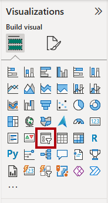
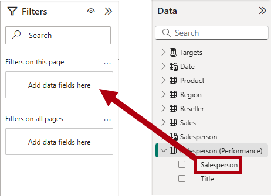
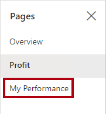

---
lab:
  title: "Concevoir des rapports Power\_BI"
  module: Design Power BI reports
---

# Concevoir des rapports Power BI

## Histoire du labo

Dans ce labo, vous allez créer un rapport de trois pages. Vous allez ensuite le publier dans le service Power BI, où vous pourrez ouvrir et interagir avec le rapport.

Dans ce labo, vous découvrez comment :

- Créez un rapport.
- Configurez les champs visuels et les propriétés de mise en forme.
- Synchronisez les segments.
- Publiez le rapport dans le service Power BI.
- Interagissez avec un rapport et ses visuels.

**Ce labo devrait prendre environ 45 minutes.**

## Démarrage

Pour cet exercice, ouvrez d’abord un navigateur Web et entrez l’URL suivante pour télécharger un fichier zip :

`https://github.com/MicrosoftLearning/PL-300-Microsoft-Power-BI-Data-Analyst/raw/Main/Allfiles/Labs/08-design-power-bi-reports/08-design-report.zip`

Extrayez le fichier vers le dossier **C:\Users\Student\Downloads\08-design-report**.

Ouvrez le fichier **08-Starter-Sales Analysis.pbix**.

> _**Remarque** : Vous pouvez ignorer la connexion en sélectionnant **Annuler**. Fermez toutes les autres fenêtres d’information ouvertes. Si vous êtes invité à appliquer les modifications, sélectionnez **Appliquer plus tard**_.

## Créer la page 1

Au cours de cet exercice, vous allez créer la première page du rapport. Une fois créée, la page se présentera comme suit :

1. Dans Power BI Desktop, pour renommer la page, en bas à gauche, faites un clic droit sur **Page 1**, puis sélectionnez **Renommer**. Renommez la page en tant que _Vue d’ensemble_.

    > _Conseil : Vous pouvez également double-cliquer sur le nom de la page pour la renommer._

1. Pour ajouter une image, sous l’onglet de ruban **Insérer**, dans le groupe **Éléments**, sélectionnez **Image**.

    

1. Dans la fenêtre **Ouvrir**, accédez au dossier **C:\Users\Student\Downloads\08-design-report**.

1. Sélectionnez le fichier **AdventureWorksLogo.jpg**, puis sélectionnez **Ouvrir**.

1. Faites glisser l'image pour la positionner dans le coin supérieur gauche, et faites glisser les marqueurs du guide pour la redimensionner.

    

1. Pour ajouter un segment, commencez par désélectionner l’image en sélectionnant une zone vide de la page de rapport, puis sélectionnez **Segment** dans le volet **Visualisations**.

    

1. Dans le volet **Données**, faites glisser le champ `Date | Year`(et non le niveau `Year` de la hiérarchie) dans le compartiment **Champ** du segment dans le volet **Visualisations**.

    > _Les labos utilisent une notation abrégée pour référencer un champ. Voici le résultat :`Date | Year`. Dans cet exemple, `Date` est le nom de la table et `Year` le nom du champ._

1. Pour convertir le segment d’une liste en liste déroulante, dans le volet **Visualisations**, sélectionnez **Mettre en forme votre visuel**. Développez **Paramètres du segment**, puis définissez la liste déroulante **Style** sur **Liste déroulante**.

    

1. Redimensionnez et positionnez le segment de façon à ce qu’il se trouve sous l’image et soit de la même largeur que l’image.

    

1. Dans le segment **Année**, ouvrez la liste déroulante, sélectionnez **FY2020**, puis réduisez la liste déroulante.

    > _La page de rapport est maintenant filtrée sur l’année **FY2020**._

    

1. Désélectionnez le segment en sélectionnant une zone vide dans la page du rapport.

1. Créez un deuxième segment, en fonction du champ `Region | Region` (et non du niveau `Region` de la hiérarchie).

1. Laissez le segment sous forme de liste, puis redimensionnez et positionnez le segment sous le segment **Année**.

    

1. Désélectionnez le segment en sélectionnant une zone vide dans la page du rapport.

1. Pour ajouter un graphique à la page, dans le volet **Visualisations**, sélectionnez le type de visuel **Ligne et histogramme empilé**.

    

1. Redimensionnez et positionnez le visuel de façon à ce qu’il se trouve à droite du logo et qu’il remplisse la largeur de la page de rapport.

    

1. Faites glisser les champs suivants dans le visuel :

     - `Date | Month`
     - `Sales | Sales`

1. Dans le volet des champs du visuel (qui se trouve sous le volet **Visualisations**), vous remarquerez que les champs sont attribués aux compartiments de **Axe X** et **Colonne axe Y**.

    > _Si vous faites glisser des champs dans un visuel, ils sont ajoutés aux compartiments par défaut. Pour préciser, vous pouvez faire glisser des champs directement dans les compartiments, comme vous allez le faire maintenant._

    

1. Dans le volet **Données**, faites glisser le champ `Sales | Profit Margin` dans le compartiment **Axe Y de ligne**.

    

1. Notez que le visuel ne contient que 11 mois.

    > _Le dernier mois de l’année, juin 2020, ne comporte (pas encore) aucune vente. Par défaut, le visuel a éliminé les mois avec des ventes`BLANK`. Vous allez maintenant configurer le visuel pour afficher tous les mois_.

1. Dans le volet des champs du visuel, dans le compartiment **Axe X**, pour le champ **Mois**, sélectionnez la flèche vers le bas, puis **Afficher les éléments sans données**.

    

    > _Notez que le mois **Juin 2020** s’affiche désormais._

1. Désélectionnez le graphique en sélectionnant une zone vide de la page du rapport.

1. Pour ajouter un graphique à la page, dans le volet **Visualisations**, sélectionnez le type de visuel **Histogramme empilé**.

    

1. Redimensionnez et positionnez le visuel de façon à ce qu’il se trouve sous le graphique en colonnes/courbes et qu’il remplisse la moitié de la largeur de la page de rapport.

    

1. Ajoutez les champs suivants aux barres d’outils des visuels :

     - Axe X : `Region | Group`
     - Axe Y : `Sales | Sales`
     - Légende : `Product | Category`

1. Désélectionnez le graphique en sélectionnant une zone vide de la page du rapport.

1. Pour ajouter un graphique à la page, dans le volet **Visualisations**, sélectionnez le type de visuel **Graphique à barres empilées**.

    

1. Redimensionnez et positionnez le visuel pour qu’il remplisse l’espace de page de rapport restant.

    

1. Ajoutez les champs suivants aux barres d’outils des visuels :

     - Axe Y : `Product | Category`
     - Axe X : `Sales | Quantity`

1. Pour mettre en forme le visuel, ouvrez le volet **Format**.

    

1. Développez la section **Barres**, puis dans le groupe **Couleur**, définissez la propriété **Couleur** sur une couleur appropriée (pour compléter le histogramme/graphique en courbes).

1. Définissez la section **Étiquettes de données** sur **Activé**.

    

1. Enregistrez le fichier Power BI Desktop.

    > _La conception de la première page est maintenant terminée._

## Conception de page 2

Au cours de cet exercice, vous allez créer la deuxième page du rapport. Une fois créée, la page se présentera comme suit :

> _**Important** : Des instructions détaillées ayant déjà été fournies dans les labos, les étapes du labo vont faire l’objet d’instructions plus concises. Si vous avez besoin d’instructions détaillées, vous pouvez vous reporter aux tâches antérieures dans ce labo._

1. Pour créer une page, sélectionnez l’icône plus en bas à gauche. Lorsque la page est ajoutée, renommez-la comme _Profit_.

1. Ajoutez un segment en fonction du champ `Region | Region`.

1. Utilisez le volet **Format** pour afficher l’option _Sélectionner tout_ (située dans la section **Paramètres du segment > Sélection**).

1. Redimensionnez et positionnez le segment de manière à ce qu'il se trouve sur à gauche de la page de rapport et qu’il soit de la moitié de la hauteur de la page.

    

1. Ajoutez un visuel de matrice, puis redimensionnez-le et positionnez-le de sorte qu’il remplisse l’espace restant de la page de rapport

    

1. Ajoutez la hiérarchie `Date | Fiscal` au compartiment de la matrice **Lignes**.

    

1. Ajoutez les cinq champs du tableau `Sales` suivants au compartiment **Valeurs** :

     - `Orders` (du dossier `Counts`)
     - `Sales`
     - `Cost`
     - `Profit` (du dossier `Pricing`)
     - `Profit Margin` (du dossier `Pricing`)

    

1. Dans le volet **Filtres** (situé à gauche du volet **Visualisations**), notez la section**Filtres de cette de page** (vous devrez peut-être développer le volet et faire défiler vers le bas).

    

1. Dans le volet **Données**, faites glisser le champ `Product | Category` dans le compartiment **Filtres de cette page**.

    > _Les champs ajoutés au volet **Filtres** peuvent obtenir le même résultat qu’un segment. L’une des différences est qu’ils n’occupent pas de place sur la page de rapport. Une autre différence est qu’ils peuvent être configurés pour remplir des exigences de filtrage plus sophistiquées._

1. Dans la carte de filtre, en haut à droite, sélectionnez la flèche pour réduire la carte.

1. Ajoutez chacun des champs de tableau `Product` suivants au compartiment **Filtres de cette page**, en réduisant chacun d'entre eux, directement sous le champ `Category` :

     - `Subcategory`
     - `Product`
     - `Color`

    

1. Enregistrez le fichier Power BI Desktop.

    > _La conception de la deuxième page est maintenant terminée._

## Conception de page 3

Au cours de cet exercice, vous allez concevoir la troisième et dernière page du rapport. Une fois créée, la page se présentera comme suit :

1. Créez une page, puis renommez-la _Mes performances_.

1. Pour simuler les performances des filtres de sécurité au niveau des lignes, faites glisser le champ `Salesperson (Performance) | Salesperson` vers les filtres au niveau de la page dans le volet filtre.

    

1. Dans la carte de filtre, sélectionnez **Michael Blythe**.

    > _Les données de la page de rapport seront désormais filtrées pour afficher les données pour Michael Blythe uniquement._

1. Ajoutez un segment de liste déroulante au champ `Date | Year`, puis redimensionnez-le et positionnez-le afin qu’il se trouve dans l’angle supérieur gauche de la page.

    

1. Dans le segment, définissez le filtre de la page sur **FY2019** (Exercice 2019).

    

1. Ajoutez un visuel **Carte à plusieurs lignes** à la page, puis redimensionnez-le et repositionnez-le pour qu’il se trouve à droite du segment et remplisse la largeur restante de la page.

    

    

1. Ajoutez les quatre champs suivants au visuel :

     - `Sales | Sales`
     - `Targets | Target`
     - `Targets | Variance`
     - `Targets | Variance Margin`

1. Mettez le visuel en forme :

     - Dans la section **Valeurs de légende**, augmentez la propriété de taille de police à **28pt**.
     - Sous l’onglet **Général**, dans la section **Effets**, définissez la propriété couleur d’arrière-plan sur une couleur gris clair (par exemple, _Blanc, 10 % Plus foncé_) pour fournir un contraste.

        

1. Ajoutez un visuel **Graphique à barres en cluster** à la page, puis redimensionnez-le et positionnez-le afin qu’il se trouve sous le visuel de la carte à plusieurs lignes, et qu’il remplisse la hauteur restante de la page et la moitié de la largeur du visuel de la carte à plusieurs lignes.

    

    

1. Ajoutez les champs suivants aux barres d’outils des visuels :

     - Axe Y : `Date | Month`
     - Axe X : `Sales | Sales` et `Targets | Target`

        

1. Pour créer une copie du visuel, appuyez sur **Ctrl + C**, puis sur **Ctrl + V**.

1. Placez le nouveau visuel à droite du visuel d’origine.

    

1. Pour modifier le type de visualisation, dans le volet **Visualisations**, sélectionnez **Graphique en colonnes en cluster**.

    

     > _Il est désormais possible de voir les mêmes données exprimées par deux types de visualisations différents. La conception de la dernière page est terminée._

## Synchroniser les segments

Dans cette tâche, vous allez synchroniser les segments _Année_ et _Région_.

1. Sur la page _Vue d’ensemble_, définissez le segment _Année_ sur **FY2018** (Année fiscale 2018).

1. Accédez à la page _Mes performances_, puis vous remarquerez que le segment _Année_ a une valeur différente.

    > _Lorsque les segments ne sont pas synchronisés, cela peut contribuer à une représentation incorrecte des données et à la frustration pour les utilisateurs des rapports. Vous allez maintenant synchroniser les segments du rapport._

1. Revenez à la page _Vue d’ensemble_, puis sélectionnez le segment _Year_.

1. Sous l’onglet de ruban **Affichage**, dans le groupe **Afficher les volets**, sélectionnez **Synchroniser les segments**.

    

1. Dans le volet **Synchroniser les segments** (à gauche du volet **Visualisations**), dans la deuxième colonne (qui représente la synchronisation), activez les cases à cocher _Vue d’ensemble_ et _My Performance_.

    

1. Sur la page _Vue d’ensemble_, sélectionnez le segment _Région_.

1. Synchronisez le segment avec les pages _Vue d’ensemble_ et _Profit_.

    

1. Testez la synchronisation des segments en sélectionnant d’autres options de filtre, puis en vérifiant que les segments synchronisés filtrent selon les mêmes options sélectionnées.

1. Pour fermer la page **Synchroniser les segments**, sélectionnez l’option **Synchroniser les segments** située sous l’onglet de ruban **Vue**.

## Publier et explorer le rapport

Au cours de cet exercice, vous allez publier le rapport sur le service Power BI. Vous allez ensuite explorer le comportement du rapport publié.

> _**Remarque** : Vous pouvez passer en revue le reste de l’exercice, même si vous n’avez pas accès au service Power BI pour effectuer les tâches directement._

1. Sélectionnez la page _Vue d’ensemble_, puis enregistrez le fichier Power BI Desktop.

1. Sous l’onglet de ruban **Accueil**, dans le groupe **Partager**, sélectionnez **Publier**.

    > _Si vous n’êtes pas encore connecté à Power BI Desktop, vous devez d’abord le faire avant de publier le rapport._

    

1. Dans la fenêtre **Publier sur Power BI**, vous remarquerez que _Mon espace de travail_ est sélectionné.

    > _Ce laboratoire n’entre pas dans les détails des différents éléments du service Power BI._

1. Pour publier le rapport, choisissez **Sélectionner**. Attendez la fin de la publication.

1. Une fois la publication réussie, sélectionnez **Ok**.

1. Ouvrez le navigateur Microsoft Edge, puis connectez-vous à l’adresse `https://app.powerbi.com`.

1. Dans la fenêtre du navigateur, dans le service Power BI, dans le volet **Navigation** (situé à gauche et éventuellement réduit), développez **Mon espace de travail**.

    

1. Passez en revue le contenu de l’espace de travail.

    - Il existe différents types d'éléments qui peuvent apparaître dans un espace de travail, mais les modèles sémantiques et les rapports sont les plus pertinents dans le cadre de ce laboratoire.
    - Vous devrez peut-être actualiser le navigateur si le modèle sémantique n’est pas visible.
    - Lorsque vous avez publié le rapport, le modèle de données est publié en tant que modèle sémantique.

1. Pour explorer le rapport, sélectionnez le rapport _Analyse des ventes 08-Starter_.

1. À gauche, dans le volet **Pages**, vous remarquerez que la page **Vue d’ensemble** est sélectionnée.

1. Dans le segment _Région_, tout en appuyant sur la touche **Ctrl**, sélectionnez plusieurs régions.

1. Dans le graphique en colonnes ou à lignes, sélectionnez une colonne de mois pour appliquer un filtre croisé sur la page.

1. Tout en appuyant sur la touche **Ctrl**, sélectionnez un autre mois.

     > _Par défaut, le filtre croisé filtre tous les autres visuels de la page._

1. Notez que le graphique à barres est filtré et mis en surbrillance et la partie gras des barres représente les mois filtrés.

1. Placez le curseur sur le visuel du graphique à barres, puis en haut à droite, placez-le sur l’icône **Filtre**.

    

    > _L’icône de filtre permet aux utilisateurs de comprendre tous les filtres qui sont appliqués au visuel, y compris les segments et les filtres croisés d’autres visuels._

1. Placez le curseur sur une barre, puis notez les informations de l’info-bulle.

1. Pour annuler le filtre croisé, dans l’histogramme ou le graphique en courbes, sélectionnez une zone vide du visuel.

1. Placez le curseur sur le visuel d’histogramme empilé puis, en haut à droite, sélectionnez l’icône **Mode Focus**.

    > _Le mode Focus effectue un zoom sur le visuel pour l’ajuster à la taille de la page entière._

    

1. Placez le curseur sur différents segments des graphiques à barres pour afficher des info-bulles.

1. Pour revenir à la page du rapport, en haut à gauche, sélectionnez **Retour au rapport**.

    

1. Replacez le curseur sur l’un des visuels puis, en haut à droite, sélectionnez l’ellipse (...) et examinez les options de menu. Essayez chacune des options, à l’exception des options de **partage**.

    

1. À gauche, dans le volet **Pages**, sélectionnez la page **Bénéfices**.

    

1. Vous remarquerez que le segment _Région_ a la même sélection que celle effectuée sur la page _Vue d’ensemble_, grâce aux segments synchronisés.

1. Dans le volet **Filtres** (situé à droite), développez une carte de filtre et appliquez des filtres.

    > _Le volet **Filtres** vous permet de définir plus de filtres que ne peut en contenir une page en tant que segments._

1. Dans le visuel matrice, utilisez le bouton plus (+) pour explorer en détail la hiérarchie `Fiscal`.

1. Sélectionnez la page **Mes performances**.

    

1. En haut à droite de la barre de menus, sélectionnez **Affichage**, puis sélectionnez **Plein écran**.

    

1. Interagissez avec la page en modifiant le segment et en appliquant un filtrage croisé à la page.

1. En bas à gauche de la fenêtre, remarquez les commandes permettant de changer de page, de revenir à la page précédente ou d’accéder à la page suivante, ou encore de quitter le mode plein écran.

1. Sélectionnez l’icône de droite pour quitter le mode plein écran.

    

## Labo terminé
