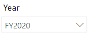

---
lab:
  title: Créer un tableau de bord Power BI
  module: Create Dashboards
---

# Créer un tableau de bord Power BI

## Histoire du labo

Dans ce labo, vous allez créer le tableau de bord **Sales Monitoring** (Supervision des ventes) dans le service Power BI en utilisant un rapport existant.

Dans ce labo, vous allez découvrir comment :

- Épingler des visuels à un tableau de bord
- Utilisez Questions et réponses pour créer des vignettes de tableau de bord

**Ce labo devrait prendre environ 30 minutes.**

## Bien démarrer

Pour effectuer cet exercice, ouvrez d’abord un navigateur web et entrez l’URL suivante pour télécharger le dossier zip :

`https://github.com/MicrosoftLearning/PL-300-Microsoft-Power-BI-Data-Analyst/raw/Main/Allfiles/Labs/09-create-power-bi-dashboard/09-create-dashboard.zip`

Extrayez le dossier dans le dossier **C:\Users\Student\Downloads\09-create-dashboard**.

## **Publier le rapport**

Au cours de cette tâche, vous allez configurer l’environnement pour le labo en créant un modèle sémantique.

1. Dans la fenêtre du navigateur Microsoft Edge, dans le service Power BI, accédez à **Mon espace de travail**.

1. Sélectionnez **Charger > Parcourir**.

1. Accédez au dossier **C:\Users\Student\Downloads\09-create-dashboard**.

1. Sélectionnez le fichier **09-Starter-Sales Analysis.pbix**, puis sélectionnez **Ouvrir**.

    > *S’il vous est demandé de remplacer le modèle sémantique, sélectionnez **Remplacer**.*

## **Création d’un tableau de bord**

Au cours de cette tâche, vous allez créer le tableau de bord **Surveillance des ventes**. Vous épinglez un visuel à partir du rapport, vous ajoutez une vignette basée sur un URI de données image, puis vous utilisez Questions et réponses pour créer une vignette.

1. Dans le service Power BI, ouvrez le rapport **Sales Analysis**.

1. Dans la page **Vue d’ensemble**, définissez le segment **Année** sur **FY2020** (Année fiscale 2020).

    

1. Définissez le segment **Région**, sur **Sélectionner tout**.

    > *Les visuels épinglés sont définis avec le contexte de filtre au moment de l’épinglage. Si le visuel sous-jacent change, vous devez également mettre à jour la vignette du tableau de bord. Pour les filtres basés sur le temps, il est préférable d’utiliser un segment de date relative (ou Q&R à l’aide d’une question basée sur le temps relatif).*

1. Pour créer un tableau de bord et y épingler un visuel, pointez le curseur sur le visuel **Sales and Profit Margin by Month** (graphique en colonnes/courbes), puis sélectionnez l’épingle.

    

1. Dans la fenêtre **Épingler au tableau de bord**, dans la zone **Nom du tableau de bord**, entrez **Surveillance des ventes**, puis sélectionnez **Épingler**.

    

1. Ouvrez **Mon espace de travail**, puis ouvrez le tableau de bord **Surveillance des ventes**.

1. Notez que le tableau de bord comporte une seule vignette.

    

1. Pour ajouter une vignette basée sur une question, en haut à gauche du tableau de bord, sélectionnez **Poser une question sur vos données**. 

    *Vous pouvez utiliser la fonctionnalité Questions et réponses, et Power BI répondra avec un visuel.*

    

1. Sélectionnez l’une des questions suggérées sous la zone Questions et réponses, et examinez la réponse.

1. Supprimez tout le texte de la zone Q&R, puis entrez les éléments suivants : **Ventes actuelles**

1. Notez la réponse **(vide)**.

    > *Vous vous souvenez peut-être que vous aviez ajouté la mesure **Ventes actuelles** dans le labo **Créer des calculs DAX avancés dans Power BI Desktop**. Cette mesure est une expression Time Intelligence et requiert un filtre sur la table **Date** pour produire un résultat.*

    

1. Étendez la question avec : **durant l’année fiscale 2020**.

1. Notez que maintenant la réponse est **(33M$)**.

    

1. Pour épingler la réponse au tableau de bord, dans le coin supérieur droit, sélectionnez **Épingler un visuel**.

    

1. Lorsque vous êtes invité à épingler la vignette au tableau de bord **Surveillance des ventes**, sélectionnez **Épingler**.

1. Pour revenir au tableau de bord, dans l’angle supérieur gauche, sélectionnez **Quitter Questions et réponses**.

1. Pour ajouter le logo de la société, dans la barre de menus, sélectionnez **Modifier**, puis **Ajouter une vignette**.
    
    > *Avec cette technique d’ajout d’une vignette de tableau de bord, vous pouvez améliorer votre tableau de bord en y incorporant des médias, y compris du contenu web, des images, des zones de texte enrichi et des vidéos (au moyen de liens YouTube ou Vimeo).*

1. Dans le volet **Ajouter une vignette** (à droite), sélectionnez la vignette **Image**, puis **Suivant**.

1. Dans le volet **Ajouter une vignette d’image**, dans la zone **URL**, entrez l’URL complète fournie dans le fichier **C:\Users\Student\Downloads\09-create-dashboard\AdventureWorksLogo_DataURL.txt**, puis sélectionnez **Appliquer**.
    
    > *Vous pouvez incorporer une image avec son URL, ou utiliser une URL de données qui incorpore le contenu inline.*

1. Pour redimensionner la vignette du logo, faites glisser l’angle inférieur droit et redimensionnez la vignette pour qu’elle ait une unité de largeur et une unité de hauteur.
    
    > *Les vignettes doivent obligatoirement être rectangulaires.*

1. Organisez les vignettes de sorte que le logo apparaisse en haut à gauche, avec la vignette **Ventes actuelles** en dessous et la vignette **Ventes, marge bénéficiaire** à droite.

    

## **Modifier des détails de la vignette**

Au cours de cette tâche, vous allez modifier les détails de deux vignettes.

1. Pointez le curseur sur la vignette **Ventes actuelles** et, en haut à droite de la vignette, sélectionnez les points de suspension, puis **Modifier les détails**.

    

1. Dans le volet **Détails de la vignette** (situé à droite), dans la zone **Sous-titre**, entrez **Année fiscale 2020**, puis sélectionnez **Appliquer**.

1. Notez que la vignette **Ventes actuelles** affiche un sous-titre.

    

1. Modifiez les détails de la vignette **Ventes, marge bénéficiaire**.

1. Dans le volet **Détails de la vignette**, dans la section **Fonctionnalité**, cochez **Afficher l’heure de la dernière actualisation**, puis sélectionnez **Appliquer**.

    

1. Notez que la vignette décrit l’heure de la dernière actualisation (que vous avez effectuée lors du chargement du modèle de données dans Power BI Desktop).

*Vous actualiserez le modèle sémantique dans l’exercice suivant. En fonction de vos données et de votre rapport, vous pouvez effectuer une actualisation des données ad hoc à tout moment ou définir une planification. Toutefois, les actualisations planifiées nécessitent des passerelles que nous ne sommes pas en mesure de configurer pour ce labo. À partir de Power BI Desktop, vous allez donc effectuer une actualisation manuelle des données, puis charger le fichier dans votre espace de travail.*

## **Actualiser le modèle sémantique**

Dans cet exercice, vous commencerez par charger les données des commandes client pour juin 2020 dans la base de données **AdventureWorksDW2020**. Ensuite, vous ouvrirez votre fichier Power BI Desktop, vous actualiserez les données, puis vous chargerez le fichier dans votre espace de travail.

> ***Remarque** : si vous ne parvenez pas à vous connecter à la base de données, vous pouvez utiliser le fichier **09-Solution-Sales-Analysis.pbix**. Au lieu de mettre à jour la base de données et d’actualiser le modèle sémantique, chargez le fichier solution dans **Mon espace de travail** et vérifiez les modifications référencées dans les tâches suivantes.*

## **Mettre à jour la base de données du labo**

Dans cette tâche, vous exécutez un script PowerShell pour mettre à jour les données contenues dans la base de données **AdventureWorksDW2020**.

1. Dans l’Explorateur de fichiers, à l’intérieur du dossier **C:\Users\Student\Downloads\09-create-dashboard**, cliquez avec le bouton droit sur le fichier **UpdateDatabase-2-AddSales.ps1**, puis sélectionnez **Exécuter avec PowerShell**.

    

1. Si vous êtes invité à changer la stratégie d’exécution, appuyez sur **A**.

1. Lorsque vous êtes invité à appuyer sur une touche quelconque pour continuer, appuyez de nouveau sur **Entrée**.

*La base de données **AdventureWorksDW2020** inclut maintenant les commandes client pour juin 2020.*

## **Actualiser le fichier Power BI Desktop**

Dans cette tâche, vous allez ouvrir le fichier **09-Starter-Sales Analysis** Power BI Desktop, effectuer une actualisation des données, puis charger le fichier dans votre espace de travail **Analyse des ventes**.

1. Dans le fichier Power BI Desktop, dans le volet **Données**, cliquez avec le bouton droit sur la table **Sales** (Ventes), puis sélectionnez **Actualiser les données**.

    

1. Une fois l’actualisation terminée, enregistrez le fichier Power BI Desktop.

1. Pour publier le fichier dans votre espace de travail, sous l’onglet de ruban **Accueil**, dans le groupe **Partager**, sélectionnez **Publier**, puis **Sélectionner** pour publier.

    

1. Lorsqu’il vous est demandé de remplacer le modèle sémantique, sélectionnez **Remplacer**.

1. Fermez Power BI Desktop.

*Le modèle sémantique dans le service Power BI contient maintenant les données des ventes de juin 2020.*

### **Examiner le tableau de bord**

Au cours de cette tâche, vous allez examiner le tableau de bord pour voir les ventes mises à jour.

1. Dans la fenêtre du navigateur Microsoft Edge, ouvrez Service Power BI, puis passez en revue le tableau de bord **Surveillance des ventes** dans **Mon espace de travail**.

2. Dans la vignette **Sales, Profit Margin**, en concordance avec le sous-titre, notez que les données ont été **Actualisées : MAINTENANT**.

3. Notez également qu’il y a désormais une colonne pour **juin 2020**.

    > *Si vous ne voyez pas de données pour le mois de juin 2020, essayez d’actualiser le navigateur en appuyant sur **F5**.*

    

## Labo terminé
