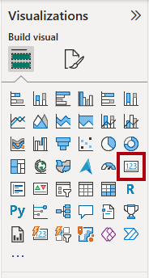
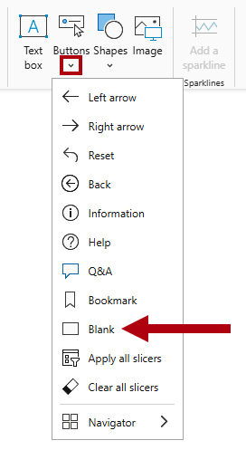

---
lab:
  title: "Améliorer les conceptions de rapports Power\_BI"
  module: Enhance Power BI report designs for the user experience
---

# Améliorer la conception des rapports Power BI

## Histoire du labo

Dans ce labo, vous allez améliorer le rapport_Analyse des ventes_ avec des fonctionnalités de conception avancées.

Dans ce labo, vous découvrez comment :

- Créez une page d’extraction.
- Appliquez une mise en forme conditionnelle.
- Créez et utilisez des signets et des boutons.

**Ce labo devrait prendre environ 45 minutes.**

## Démarrage

Pour effectuer cet exercice, ouvrez d’abord un navigateur web et entrez l’URL suivante pour télécharger le fichier zip :

`https://github.com/MicrosoftLearning/PL-300-Microsoft-Power-BI-Data-Analyst/raw/Main/Allfiles/Labs/09-enhance-power-bi-reports/09-enhanced-report.zip`

Extrayez le fichier dans celui de**C:\Users\Student\Downloads\09-enhanced-report**.

Ouvrez le fichier**09-Starter-Sales Analysis.pbix**.

> _**Remarque** : Une boîte de dialogue de connexion peut s’afficher au fur et à mesure que le fichier se charge. Sélectionnez**Annuler** pour ignorer la boîte de dialogue de connexion. Fermez toutes les autres fenêtres d’information ouvertes. Si vous êtes invité à appliquer les modifications, sélectionnez**Appliquer plus tard**_.

## Configurer une page d’extraction

Dans cet exercice, vous allez créer une page et la configurer en tant que page d’extraction. Une fois créée, la page se présentera comme suit :

1. Créez une page, puis renommez-la en tant que_Détails du produit_.

1. Cliquez avec le bouton droit sur l’onglet de la page**Détails du produit**, puis sélectionnez**Masquer la page**.

    > _Les utilisateurs des rapports ne seront pas en mesure d’accéder directement à la page d’extraction. Au contraire, ils y accèdent à partir de visuels sur d'autres pages. Vous allez apprendre à accéder à la page dans l’exercice final de ce labo._

1. Sous le volet**Visualisations**, dans la section**Extraire**, ajoutez le champ`Product | Category` dans la zone**Ajouter des champs d'extraction ici**.

    > _Les labos utilisent une notation abrégée pour référencer un champ. Voici le résultat :`Product | Category`. Dans cet exemple,`Product` est le nom de la table et`Category` le nom du champ._

    

1. Pour tester la page d’extraction, dans la carte de filtre d’extraction, sélectionnez_Bikes_.

    

1. En haut à gauche de la page du rapport, notez le bouton fléché.

    > _Le concepteur de rapports ajoute automatiquement un bouton de flèche lorsqu'un champ est ajouté au compartiment d'extraction. Il permet aux utilisateurs de rapport de revenir à la page à partir de laquelle ils ont lancé l’extraction._

1. Ajoutez un objet visuel**Carte** à la page, puis redimensionnez-le et positionnez-le pour qu’il se trouve à droite du bouton et remplisse la largeur restante de la page.

    

    

1. Faites glisser le champ`Product | Category` dans le visuel de carte.

1. Configurez les options de mise en forme pour l’objet visuel afin de désactiver la propriété**Étiquette de catégorie** sur**Désactiver**.

    

1. Sous l’onglet**Général**, dans la section**Effets**, définissez la propriété couleur d’arrière-plan sur une couleur gris clair (par exemple,_Blanc, 10 % Plus foncé_) pour fournir un contraste.

    

1. Ajoutez un objet visuel**Tableau** à la page, puis redimensionnez-le et positionnez-le pour qu’il se trouve sous l’objet visuel Carte et remplisse l’espace restant de la page.

    

    

1. Ajoutez les champs suivants au tableau :

    - `Product | Subcategory`
    - `Product | Color`
    - `Sales | Quantity`
    - `Sales | Sales`
    - `Sales | Profit Margin`

1. Pour configurer les options de mise en forme du visuel, dans la section**Grille**, définissez la propriété**Taille de police globale** sur**20pt**.

    > _La conception de la page d’extraction est presque terminée. Dans l’exercice suivant, vous allez améliorer la page avec une mise en forme conditionnelle._

## Ajouter une mise en forme conditionnelle

Dans cet exercice, vous allez améliorer la page d’extraction avec une mise en forme conditionnelle. Une fois créée, la page se présentera comme suit :

1. Désélectionnez l’objet visuel Tableau. Dans**Colonnes**, sélectionnez la flèche vers le bas dans le champ**Marge bénéficiaire**, puis sélectionnez**Mise en forme conditionnelle > Icônes**.

    

1. Dans la fenêtre**Icônes**Marge bénéficiaire,** dans la liste déroulante**Disposition des icônes, sélectionnez**À droite des données**.

    

1. Pour supprimer la règle du milieu, à droite du triangle jaune, sélectionnez la lettre **X**.

    

1. Configurez la première règle (losange rouge) comme suit :

    - Dans le deuxième contrôle, supprimez la valeur
    - Dans le troisième contrôle, sélectionnez**Nombre**
    - Dans le cinquième contrôle, entrez**0**
    - Dans le sixième contrôle, sélectionnez**Nombre**

1. Configurez la deuxième règle (cercle vert) comme suit :

    - Dans le deuxième contrôle, entrez**0**
    - Dans le troisième contrôle, sélectionnez**Nombre**
    - Dans le cinquième contrôle, supprimez la valeur
    - Dans le sixième contrôle, sélectionnez**Nombre**

    

    > _Les règles peuvent être interprétées comme suit : afficher un losange rouge si la valeur de la marge bénéficiaire est inférieure à 0 ; sinon, si la valeur est supérieure ou égale à zéro, afficher un cercle vert._

1. Dans la fenêtre**Icônes – Marge bénéficiaire**, dans la liste déroulante**Appliquer à** la liste déroulante, sélectionnez**Valeurs et totaux**.

    

1. Cliquez sur**OK**.

1. Dans le visuel de tableau, vérifiez que les bonnes icônes sont affichées.

    

1. Configurez la mise en forme conditionnelle de couleur d’arrière-plan pour le champ**Couleur**.

1. Dans la fenêtre**Couleur d’arrière-plan -- Couleur**, dans la liste déroulante**Mettre en forme le style**, sélectionnez**Valeur du champ**.

    

1. Dans la liste déroulante**Sur quel champ devons-nous nous baser ?**, dans le groupe_Toutes les données_, sélectionnez le champ`Product | Formatting | Background Color Format`.

    

1. Répétez les étapes précédentes pour configurer la mise en forme conditionnelle de couleur de police pour le champ**Couleur** à l’aide du champ`Product | Formatting | Font Color Format`.

 > _Vous vous rappelez peut-être que les couleurs de police et d’arrière-plan ont été récupérées du fichier**ColorFormats.csv** dans le labo**Préparer des données dans Power BI Desktop**, puis intégrées à la requête**Produit** dans le laboratoire**Charger des données dans Power BI Desktop**._

## Ajouter des signets et des boutons

Dans cet exercice, vous allez améliorer la page_My Performance_ avec des boutons, ce qui permet à l’utilisateur du rapport de sélectionner le type de visuel à afficher. Une fois créée, la page se présentera comme suit :

1. Accédez à la page_My Performance_.

1. Sous l’onglet de ruban**Affichage**, dans le groupe**Afficher les volets**, sélectionnez**Signets**.

    

1. Sous l’onglet de ruban**Affichage**, dans le groupe**Afficher les volets**, sélectionnez**Sélection**.

    

1. Dans le volet**Sélection**, à côté de l’un des éléments_Sales and Target by Month_, sélectionnez l’icône d’œil pour masquer le visuel.

    

1. Dans le volet**Signets**, sélectionnez**Ajouter**.

    

    > _Conseil : Pour renommer le signet, double-cliquez sur le signet._

1. Si le graphique visible est le graphique à barres, renommez le signet en_Graphique à barres activé_, sinon renommez le signet en_Histogramme activé_.

1. Pour modifier le signet, dans le volet**Signets**, placez le curseur sur le signet, sélectionnez les points de suspension, puis**Données**.

    > _La désactivation de l’option**Données** signifie que le signet n’utilisera pas l’état de filtre actuel. C’est important, car sinon, le signet verrouillerait de façon permanente le filtre actuellement appliqué par le segment Year._

    

1. Pour mettre à jour le signet, resélectionnez les points de suspension, puis sélectionnez**Mettre à jour**.

    > _Dans les étapes suivantes, vous allez créer et configurer un second signet pour afficher le deuxième visuel._

1. Dans le volet**Sélection**, basculez la visibilité des deux éléments_Sales and Target by Month_.

    > _En d’autres termes, masquez l’objet visuel visible et rendez visible l’objet visuel masqué._

    

1. Créez un deuxième signet et nommez-le de manière appropriée (_Histogramme activé_ ou_Graphique à barres activé_.

    

1. Configurez le deuxième signet pour ignorer les filtres (option**Données** désactivée) et mettez à jour le signet.

1. Dans le volet**Sélection**, pour rendre les deux objets visuels visibles, il suffit d’afficher l’objet visuel masqué.

1. Redimensionnez et repositionnez les deux visuels afin qu’ils remplissent la page sous l’objet visuel à plusieurs cartes et se chevauchent entièrement.

    > _Pour sélectionner le visuel qui est couvert, sélectionnez-le dans le volet**Sélection**._

    

1. Dans le volet**Signets**, sélectionnez chacun des signets et notez qu’un seul des objets visuels est visible.

    > _L’étape suivante de la conception consiste à ajouter deux boutons à la page. Ces boutons permettent à l’utilisateur du rapport de sélectionner les signets._

1. Sur le ruban**Insérer**, dans le groupe**Éléments**, sélectionnez**Bouton**, puis sélectionnez**Vide**.

    

1. Positionnez le bouton juste en dessous du segment_Année_.

1. Sélectionnez le bouton, puis, dans le volet**Mettre en forme le bouton**, développez la section**Style**, puis définissez la section**Texte** sur**Activé**.

    

1. Dans la section**Texte**, dans la zone de**Texte**, entrez_Graphique à barres_.

1. Définissez la section**Remplissage** sur**Activé**, puis définissez une couleur à l’aide d’une couleur complémentaire.

1. Définissez la section**Action** sur**Activé**, puis définissez la propriété**Type** sur**Signet**.

1. Sélectionnez**Bouton** et basculez la propriété**Action** sur**Activé**.

1. Développez la section**Action**, puis réglez la liste déroulante**Type** sur**Signet**.

1. Dans la liste déroulante**Signet**, sélectionnez**Graphique à barres activé**.

    

1. Créez une copie du bouton par copier-coller, puis configurez le nouveau bouton comme suit :

    > _Conseil : Pour copier et coller, utilisez les commandes de raccourci**Ctrl+C** et**Ctrl+V** à la suite._

    - Définissez le texte du bouton sur_Histogramme_.
    - Définissez le signet d’action sur**Histogramme activé**.

    > _La conception du rapport Sales Analysis (Analyse des ventes) est maintenant terminée._

## Publier et explorer le rapport

Dans cet exercice, vous allez publier le rapport sur le service Power BI et explorer le comportement du rapport publié.

> _**Remarque** : Vous aurez besoin d’au moins une licence gratuite**Power BI** pour publier le rapport. Ouvrez le navigateur Microsoft Edge et accédez à_`https://app.powerbi.com`_.  Connectez-vous avec les informations d’identification du locataire Microsoft 365 fournies par votre hôte de laboratoire autorisé (ALH). Lorsque vous êtes invité à résoudre une énigme ou à commencer un essai gratuit de Fabric, vous pouvez ignorer cette étape et fermer le navigateur._

> _**Remarque** : Vous pouvez passer en revue le reste de l’exercice, même si vous n’avez pas accès au service Power BI pour effectuer les tâches directement._

1. Sélectionnez la page_Vue d’ensemble_.

1. Dans le segment_Year_, sélectionnez**FY2020**.

1. Dans le segment_Région_, vérifiez qu’aucune région n’est sélectionnée.

1. Enregistrez le fichier Power BI Desktop.

1. Sous l’onglet de ruban**Accueil**, dans le groupe**Partager**, sélectionnez**Publier**.

    > _Si vous n’êtes pas encore connecté à Power BI Desktop, vous devez d’abord le faire avant de publier le rapport._

    

1. Dans la fenêtre**Publier sur Power BI**, vous remarquerez que_Mon espace de travail_ est sélectionné.

1. Pour publier le rapport, choisissez**Sélectionner**. Attendez la fin de la publication.

1. Une fois la publication réussie, sélectionnez**Ok**.

1. Fermez Power BI Desktop.

1. Ouvrez le navigateur Microsoft Edge, puis connectez-vous à`https://app.powerbi.com` (ou utilisez une session de navigateur existante).

1. Dans la fenêtre du navigateur Microsoft Edge, dans le service Power BI, dans le volet**Navigation** (situé à gauche et éventuellement réduit), sélectionnez**Mon espace de travail**.

1. Pour explorer le rapport, sélectionnez le rapport_Analyse des ventes 09-Starter_.

1. Pour tester la fonctionnalité d’extraction, dans la page_Vue d’ensemble_, dans le visuel_Somme des quantités par catégorie_, faites un clic droit sur la barre de_Vêtements_, puis sélectionnez**Extraction > Détails du produit**.

    

1. Vous remarquerez que la page_Détails du produit_ filtre les visuels des_Vêtements_.

1. Pour revenir à la page source, dans le coin supérieur gauche, sélectionnez le bouton fléché.

1. Accédez à la page_My Performance_.

1. Sélectionnez chacun des boutons. Vous pouvez remarquer qu’un visuel différent s’affiche.

## Labo terminé

1. Fermez le navigateur Microsoft Edge.
1. Fermez Power BI Desktop.