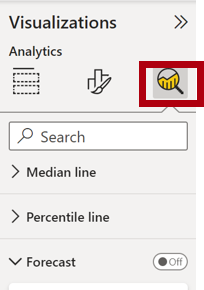

---
lab:
  title: "Utiliser les fonctionnalités analytiques de Power\_BI"
  module: Perform analytics in Power BI
---

# Utiliser les fonctionnalités analytiques de Power BI

## Histoire du labo

Dans ce labo, vous allez créer le rapport**Sales Exploration** (Exploration des ventes).

Dans ce labo, vous découvrez comment :

- Créer des graphiques à nuages de points animés.
- Utiliser un visuel pour établir des prévisions sur les valeurs.

**Ce labo devrait prendre environ 30 minutes.**

## Démarrage

Pour effectuer cet exercice, ouvrez d’abord un navigateur web et entrez l’URL suivante pour télécharger le dossier zip :

`https://github.com/MicrosoftLearning/PL-300-Microsoft-Power-BI-Data-Analyst/raw/Main/Allfiles/Labs/10-perform-analytics-power-bi/10-perform-analytics.zip`

Extrayez le dossier vers le dossier**C:\Users\Student\Downloads\10-perform-analysis**.

1. Ouvrez le fichier**10-Starter-Sales Analysis.pbix**.

> _**Remarque** : Une boîte de dialogue de connexion peut s’afficher au fur et à mesure que le fichier se charge. Sélectionnez**Annuler** pour ignorer la boîte de dialogue de connexion. Fermez toutes les autres fenêtres d’information ouvertes. Si vous êtes invité à appliquer les modifications, sélectionnez**Appliquer plus tard**_.

## Créer un graphique à nuages de points animé

Dans cette tâche, vous créez un graphique à nuages de points qui peut être animé.

1. Créez une page et nommez-la**Graphique à nuages de points**.

1. Ajoutez un visuel de**Graphique à nuages de points** à la page de rapport, puis positionnez-le et redimensionnez-le afin qu’il remplisse toute la page.

    > *Le graphique peut être animé quand un champ est ajouté à la barre d’outils/zone**Axe de lecture**.*

     

     

1. Ajoutez les champs suivants aux barres d’outils/zones des visuels :

    > *Les labos utilisent une notation abrégée pour référencer un champ, à savoir :**Reseller****\|****Business Type**. Dans cet exemple,**Reseller** est le nom de la table et**Business Type** est le nom du champ.*

     - Axe des X :**Sales\| Sales**
     - Axe des Y :**Sales\| Profit Margin**
     - Légende :**Reseller\| Business Type**
     - Taille :**Sales\| Quantity**
     - Axe de lecture :**Date\| Quarter**

1. Dans le volet**Filtres**, ajoutez le champ**Product\| Category** à la barre d’outils/zone**Filtres dans cette page**.

1. Dans la carte de filtre, filtrez sur**Vélos**.

1. Pour animer le graphique, dans le coin inférieur gauche, sélectionnez**Lire**.

    

1. Regardez la totalité du cycle d’animation de**FY2018 T1** à**FY2020 T4**.

    > *Le graphique à nuages de points permet de comprendre les valeurs de mesure simultanément ; dans le cas présent, la quantité de commandes, le chiffre d’affaires et la marge bénéficiaire.*
    > 
    > *Chaque bulle représente un type d’activité de revendeur. Les changements apportés à la taille des bulles reflètent l’augmentation ou la diminution des quantités de commandes. Tandis que les mouvements horizontaux représentent les augmentations/diminutions du chiffre d’affaires, les mouvements verticaux représentent les augmentations/diminutions de la rentabilité.*

1. Quand l’animation s’arrête, sélectionnez l’une des bulles pour afficher son suivi au fil du temps.

1. Placez le curseur sur une bulle pour afficher une info-bulle décrivant les valeurs de mesure du type de revendeur à ce moment précis.

1. Dans le volet**Filtres**, filtrez sur**Habillement** uniquement, puis notez que cela produit un résultat très différent.

1. Enregistrez le fichier Power BI Desktop.

## Créer une prévision

Au cours de cette tâche, vous allez créer une prévision pour déterminer le chiffre d’affaires futur potentiel.

1. Ajoutez une nouvelle page, puis renommez-la**Prévision**.

1. Ajoutez un visuel de**Graphique en courbes** à la page de rapport, puis positionnez-le et redimensionnez-le afin qu’il remplisse toute la page.

     

     

1. Ajoutez les champs suivants aux barres d’outils/zones des visuels :

     - Axe des X :**Date\| Date**
     - Axe des Y :**Sales\| Sales**

1. Dans le volet**Filtres**, ajoutez le champ**Date\| Year** à la barre d’outils/zone**Filtres dans cette page**.

1. Dans la carte de filtre, filtrez sur deux années :**FY2019** et**FY2020**.

    > *Lors d’une prévision dans le temps, vous avez besoin d’au moins deux cycles (années) de données pour produire une prévision précise et stable.*

1. Ajoutez également le champ**Product\| Category** à la barre d’outils/zone**Filtres dans cette page**, puis filtrez sur**Vélos**.

1. Pour ajouter une prévision, sous le volet**Visualisations**, sélectionnez le volet**Analytique**.

     

1. Développez la section**Prévision**.

    > *Si la section**Prévision** n’est pas disponible, cela est probablement dû au fait que le visuel n’a pas été correctement configuré. La prévision est disponible uniquement quand deux conditions sont remplies : l’axe a un seul champ de type date et il n’y a qu’un seul champ de valeur.*

1. Passez l’option**Prévision** sur**Activé**.

1. Configurez les propriétés de prévision suivantes, puis sélectionnez**Appliquer** :

    - Unités :**Mois**
    - Longueur de la prévision :**1 mois**
    - Caractère saisonnier :**365**
    - Intervalle de confiance :**80 %**

    

1. Dans le visuel de graphique en courbes, notez que la prévision s’est étendue d’un mois au-delà des données d’historique.

    > *La zone grise représente la confiance. Plus la confiance est importante, moins la prévision est susceptible d’être stable et précise.*
    >
    > *Quand vous connaissez la durée du cycle (« annuel » dans le cas présent), vous devez entrer les points relatifs au caractère saisonnier. Le cycle peut aussi être hebdomadaire (7) ou mensuel (30).*

1. Dans le volet**Filtres**, filtrez sur**Habillement** uniquement, puis notez que cela produit un résultat différent.

## Labo terminé

Vous pouvez choisir d’enregistrer votre rapport Power BI, même s’il n’est pas nécessaire pour ce labo. Dans l’exercice suivant, vous allez utiliser un fichier de démarrage prédéfini.

1. Accédez au menu **« Fichier »** dans le coin supérieur gauche, puis sélectionnez **« Enregistrer sous ».** 
1. Sélectionnez**Parcourir cet appareil**.
1. Sélectionnez le dossier dans lequel vous souhaitez enregistrer le fichier et donnez-lui un nom descriptif. 
1. Sélectionnez le bouton**Enregistrer** pour enregistrer votre rapport en tant que fichier .pbix. 
1. Si une boîte de dialogue s’affiche pour vous inviter à appliquer des modifications de requête en attente, sélectionnez**Appliquer**.
1. Fermez Power BI Desktop.