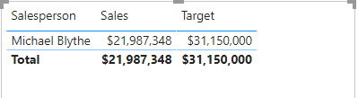
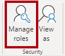

---
lab:
  title: Appliquer la sécurité au niveau des lignes
  module: Enforce Row-Level Security
---

# Appliquer la sécurité au niveau des lignes

## Histoire du labo

Dans ce labo, vous allez appliquer la sécurité au niveau des lignes pour vous assurer qu’un vendeur ne peut analyser les données de ventes que pour la ou les régions qui lui sont affectées.

Dans ce labo, vous allez découvrir comment :

- Appliquer la sécurité au niveau des lignes
- Choisir entre des méthodes dynamiques et statiques

**Ce labo devrait prendre environ 20 minutes.**

## Démarrage

Pour effectuer cet exercice, ouvrez d’abord un navigateur web et entrez l’URL suivante pour télécharger le dossier zip :

`https://github.com/MicrosoftLearning/PL-300-Microsoft-Power-BI-Data-Analyst/raw/Main/Allfiles/Labs/10-row-level-security/10-row-level-security.zip`

Extrayez le dossier dans le dossier **C:\Users\Student\Downloads\10-row-level-security**.

Ouvrez le fichier **10-Starter-Sales Analysis.pbix**.

> ***Remarque** : vous pouvez ignorer la connexion en sélectionnant **Annuler**. Fermez toutes les autres fenêtres d’information ouvertes. Si vous êtes invité à appliquer les modifications, sélectionnez **Appliquer plus tard**.

## Appliquer la sécurité au niveau des lignes

Au cours de cette tâche, vous allez appliquer la sécurité au niveau des lignes pour vous assurer qu’un vendeur ne peut voir que les ventes réalisées dans la ou les régions qui lui sont affectées.

1. Revenez à la vue Table.

   

1. Dans le volet **Données**, sélectionnez la table **Salesperson (Performance)** (Vendeur - Performances).

1. Examinez les données. Notez que Michael Blythe (EmployeeKey 281) a cette valeur UPN : **`michael-blythe@adventureworks.com`**
    
    > *Rappelez-vous que Michael Blythe est affecté à trois régions de vente : USA Nord-Est, USA Centre et USA Sud-Est.*

1. Dans l’onglet de ruban **Accueil**, à l’intérieur du groupe **Sécurité**, sélectionnez **Gérer les rôles**.

    

1. Dans la fenêtre **Gérer les rôles de sécurité**, dans la section **Rôles**, sélectionnez **Nouveau**.

1. Dans la zone, remplacez le texte sélectionné par le nom du rôle : **Salespeople**, puis appuyez sur **Entrée**.

   

1. Pour affecter un filtre, sélectionnez la table **Salesperson (Performance)**, puis sélectionnez **Basculer vers l’éditeur DAX** dans la section **Filtrer les données**.

   

1. Dans zone de l’éditeur DAX, entrez l’expression suivante :

    ```DAX
    [UPN] = USERPRINCIPALNAME()
    ```

   

    > *USERPRINCIPALNAME() est une fonction DAX (Data Analysis Expressions) qui retourne le nom de l’utilisateur authentifié. Cela signifie que la table **Salesperson (Performance)** filtrera par le nom d’utilisateur principal (UPN) de l’utilisateur qui interroge le modèle.*

1. Sélectionnez **Enregistrer** et **Fermer**.

1. Pour tester le rôle de sécurité, dans l’onglet de ruban **Accueil**, à l’intérieur du groupe **Sécurité**, sélectionnez **Afficher comme**.

   

1. Dans la fenêtre **Afficher comme rôles**, activez la case à cocher  **Autre utilisateur**, puis dans la zone correspondante, entrez : **`michael-blythe@adventureworks.com`**

1. Vérifiez le rôle **Salespeople**, puis sélectionnez **OK**.
    
    > *Cette configuration se traduit par l’utilisation du rôle **Salespeople** et l’emprunt de l’identité de l’utilisateur avec le nom de Michael Blythe.*

   

1. Notez la bannière jaune au-dessus de la page du rapport, qui indique le contexte de sécurité du test.

   

1. Notez, dans le visuel de table, que seul le vendeur **Michael Blythe** est listé.

   

1. Pour arrêter le test, sur le côté droit de la bannière jaune, sélectionnez **Arrêter l’affichage**.

   

1. Pour supprimer le rôle **Salespeople**, dans l’onglet de ruban **Accueil**, à l’intérieur du groupe **Sécurité**, sélectionnez **Gérer les rôles**.

   

1. Dans la fenêtre **Gérer les rôles de sécurité**, sélectionnez les points de suspension (…) dans le rôle **Salespeople** , puis sélectionnez **Supprimer**. Lorsque vous êtes invité à confirmer la suppression, sélectionnez **Oui, Supprimer**.

   

*Remarque : Une fois que le fichier Power BI Desktop aura été publié sur le service Power BI, vous devrez effectuer une tâche de post-publication pour mapper les principaux de sécurité au rôle **Salespeople**. Vous n’effectuerez pas cette tâche durant ce labo.*

## Labo terminé
